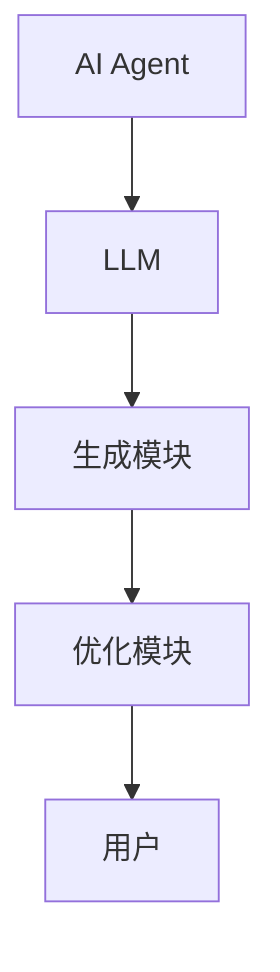

                 


# LLM驱动的AI Agent幽默感生成器

> 关键词：LLM，AI Agent，幽默生成，大语言模型，幽默感，AI驱动

> 摘要：本文详细探讨了如何利用大语言模型（LLM）驱动AI Agent生成幽默感。通过分析幽默生成的背景、核心概念、算法原理、系统架构以及实际项目实现，本文为读者提供了从理论到实践的全面指导。文章最后总结了最佳实践和未来研究方向。

---

## 第一部分：背景介绍

### 第1章：幽默感生成的背景与问题分析

#### 1.1 幽默感生成的基本概念
- 幽默感的定义与特点
  - 幽默是一种语言表达形式，通常通过双关语、讽刺、夸张等手段实现。
  - 幽默感的生成需要结合语言理解、情感计算和创造力。
- 幽默感生成的核心问题
  - 如何让AI理解幽默的本质？
  - 如何让AI生成符合语境的幽默内容？
- 幽默感生成的边界与外延
  - 幽默的主观性：不同人对幽默的理解不同。
  - 幽默的多样性：幽默可以是轻松的笑话，也可以是深刻的讽刺。

#### 1.2 LLM与AI Agent的结合
- LLM的基本概念
  - LLM（Large Language Model）是基于深度学习的自然语言处理模型，能够理解和生成人类语言。
  - LLM的核心优势在于其强大的语言理解和生成能力。
- AI Agent的核心功能
  - AI Agent是一种智能体，能够通过环境交互完成特定任务。
  - AI Agent需要具备感知、决策和执行能力。
- LLM驱动AI Agent的实现方式
  - LLM作为AI Agent的核心模块，负责处理语言相关任务。
  - AI Agent通过调用LLM API生成幽默内容。

### 第2章：幽默感生成的现状与挑战

#### 2.1 当前幽默生成技术的发展现状
- 基于规则的幽默生成
  - 通过预定义的规则和模板生成幽默内容。
  - 优点：简单易实现。
  - 缺点：生成内容缺乏创意和多样性。
- 基于机器学习的幽默生成
  - 使用传统机器学习模型（如SVM、随机森林）进行幽默分类。
  - 优点：生成内容更具个性化。
  - 缺点：模型的泛化能力有限。
- 基于大语言模型的幽默生成
  - 利用LLM的强大的语言理解和生成能力生成幽默内容。
  - 优点：生成内容更加自然和多样化。
  - 缺点：需要大量数据和计算资源。

#### 2.2 幽默感生成的主要挑战
- 幽默的主观性
  - 不同人对幽默的理解不同，难以统一量化。
- 幽默生成的多样性
  - 如何生成多样化的幽默内容，满足不同用户的需求。
- 幽默生成的可解释性
  - 用户需要了解生成的幽默内容的逻辑和依据。

---

## 第二部分：核心概念与联系

### 第3章：LLM驱动的AI Agent核心概念

#### 3.1 LLM与AI Agent的关系
- LLM作为AI Agent的核心模块
  - LLM负责处理语言相关任务，如理解用户输入、生成幽默内容。
  - AI Agent通过调用LLM API完成特定任务。
- AI Agent的交互流程
  - 用户输入需求，AI Agent通过LLM生成幽默内容并返回给用户。
  - AI Agent还可以根据用户反馈优化生成内容。
- LLM在幽默生成中的作用
  - LLM能够理解和生成幽默内容，帮助AI Agent实现幽默感生成功能。

#### 3.2 幽默生成的核心原理
- 幽默的生成模型
  - 基于LLM的生成模型，通过语言模型的生成能力实现幽默内容生成。
- 幽默的语义分析
  - 分析输入文本的语义，生成符合语境的幽默内容。
- 幽默的情感计算
  - 通过情感分析技术，判断生成内容是否符合预期情感。

### 第4章：核心概念对比与系统架构

#### 4.1 核心概念对比表
| 比较维度       | LLM与传统NLP模型 | AI Agent与传统对话系统 | 幽默生成与普通文本生成 |
|----------------|-----------------|------------------------|------------------------|
| 核心能力       | 强大的语言理解与生成能力 | 具备自主决策和执行能力 | 需要特定的幽默生成逻辑 |
| 应用场景       | 适用于多种自然语言处理任务 | 适用于复杂任务的自动化处理 | 适用于生成幽默内容 |
| 技术优势       | 高效、准确的自然语言处理 | 高度智能化、自动化 | 高度个性化、多样化 |

#### 4.2 系统架构设计
- 系统功能模块划分
  - 输入处理模块：接收用户输入，解析需求。
  - 生成模块：基于LLM生成幽默内容。
  - 优化模块：根据用户反馈优化生成内容。
- 系统实体关系图


---

## 第三部分：算法原理讲解

### 第5章：幽默感生成算法原理

#### 5.1 幽默生成算法概述
- 基于LLM的生成算法
  - 利用LLM的生成能力，通过微调或直接调用API生成幽默内容。
- 基于强化学习的生成算法
  - 使用强化学习优化生成内容，提升幽默效果。

#### 5.2 幽默生成的数学模型
- 基于LLM的生成模型
  - 使用交叉熵损失函数优化模型参数：
  $$ \mathcal{L} = -\sum_{i=1}^{n} \log p(y_i | y_{<i}) $$
  - 其中，$y_i$ 表示生成的幽默内容，$p(y_i | y_{<i})$ 是条件概率。

#### 5.3 幽默生成的优化方法
- 基于LLM的生成优化
  - 通过调整生成参数（如温度、重复率）优化生成效果。
  - 温度调整：
    $$ T = \text{调整参数} $$
  - 重复率控制：
    $$ r = \text{控制重复内容的比例} $$

---

## 第四部分：系统分析与架构设计方案

### 第6章：系统架构设计

#### 6.1 项目介绍
- 项目背景
  - 随着AI技术的发展，幽默生成逐渐成为人机交互的重要组成部分。
  - 通过LLM驱动的AI Agent实现幽默生成，能够为用户提供更加智能化的服务。

#### 6.2 系统功能设计
- 系统功能模块划分
  - 输入处理模块：接收用户输入，解析需求。
  - 生成模块：基于LLM生成幽默内容。
  - 优化模块：根据用户反馈优化生成内容。
- 系统架构设计
  - 使用微服务架构，各模块独立运行，便于扩展和维护。

#### 6.3 系统交互设计
- 系统交互流程
  - 用户输入需求，AI Agent调用LLM生成幽默内容。
  - 用户反馈生成内容，AI Agent根据反馈优化生成策略。

---

## 第五部分：项目实战

### 第7章：项目实战与代码实现

#### 7.1 环境安装
- 安装Python和相关库
  ```bash
  pip install transformers torch
  ```

#### 7.2 核心代码实现
- 调用LLM生成幽默内容的代码示例
  ```python
  from transformers import AutoModelForSeq2SeqLM, AutoTokenizer

  model_name = "facebook/blenderbot-small"
  tokenizer = AutoTokenizer.from_pretrained(model_name)
  model = AutoModelForSeq2SeqLM.from_pretrained(model_name)

  input_text = "生成一个笑话"
  inputs = tokenizer(input_text, return_tensors="pt")
  outputs = model.generate(inputs.input_ids, max_length=50)
  generated_text = tokenizer.decode(outputs[0], skip_special_tokens=True)
  print(generated_text)
  ```

#### 7.3 代码解读与分析
- 代码功能解读
  - 使用Facebook的BlenderBot模型生成幽默内容。
  - 调用API生成文本，限制生成长度，优化生成效果。
- 生成结果分析
  - 根据生成的幽默内容，分析其质量和多样性。

#### 7.4 实际案例分析
- 案例分析
  - 输入：“生成一个程序员的笑话”
  - 生成输出：“为什么程序员喜欢黑暗模式？因为他们可以在黑暗中看到光明。”

---

## 第六部分：最佳实践

### 第8章：总结与展望

#### 8.1 总结
- 幽默生成的实现需要结合语言理解、情感计算和创造性思维。
- LLM驱动的AI Agent能够有效提升幽默生成的效果和多样性。
- 通过优化生成算法和系统架构设计，可以进一步提升幽默生成的智能化水平。

#### 8.2 注意事项
- 注意数据隐私和模型伦理问题。
- 在实际应用中，需要根据具体需求调整生成参数。

#### 8.3 拓展阅读
- 《大语言模型的原理与应用》
- 《人机交互中的幽默生成技术》

---

通过以上步骤，我们详细探讨了LLM驱动的AI Agent幽默感生成器的设计与实现。希望本文能够为读者提供有价值的参考和启发，进一步推动幽默生成技术的发展与应用。

