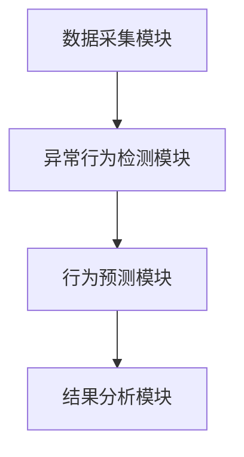

                 


# LLM驱动的AI Agent异常行为预测机制

> **关键词**：LLM, AI Agent, 异常行为预测, 概率图模型, 强化学习, 系统架构设计

> **摘要**：本文深入探讨了基于大语言模型（LLM）的AI Agent异常行为预测机制，分析了其核心概念、算法原理、系统架构设计及实际应用。通过对比分析和案例研究，详细阐述了LLM在异常行为预测中的优势及其实现方法，并提出了具体的系统设计和优化建议。

---

# 第1章: LLM驱动的AI Agent概述

## 1.1 LLM与AI Agent的基本概念

### 1.1.1 大语言模型（LLM）的定义
大语言模型（LLM, Large Language Model）是指基于深度学习技术构建的大型神经网络模型，如GPT系列、BERT系列等。这些模型通过海量数据的训练，能够理解和生成人类语言，具有强大的上下文理解和生成能力。

### 1.1.2 AI Agent的概念与特点
AI Agent（人工智能代理）是指在特定环境中能够感知环境、自主决策并执行任务的智能实体。AI Agent可以是软件程序，也可以是机器人，其特点包括自主性、反应性、目标导向性和社交能力。

### 1.1.3 LLM与AI Agent的关系
LLM作为AI Agent的核心驱动力，通过提供自然语言处理和生成能力，赋予AI Agent更强的交互能力和智能决策能力。LLM与AI Agent的结合，使得AI Agent能够更自然地与人类交互，并能够基于上下文理解和推理能力进行复杂决策。

## 1.2 异常行为预测机制的重要性

### 1.2.1 异常行为的定义与分类
异常行为是指与预期行为模式显著偏离的行为。根据应用场景的不同，异常行为可以分为网络异常行为、用户行为异常、系统行为异常等。

### 1.2.2 异常行为预测的必要性
在AI Agent广泛应用的背景下，异常行为预测能够帮助识别潜在的安全威胁、优化系统性能、提升用户体验，并为决策提供支持。

### 1.2.3 LLM在AI Agent异常行为预测中的作用
LLM通过分析行为数据和上下文信息，能够识别潜在的异常模式，并提供预测和解释。

## 1.3 本章小结
本章介绍了LLM和AI Agent的基本概念，分析了异常行为预测的重要性，并探讨了LLM在AI Agent异常行为预测中的作用。

---

# 第2章: LLM驱动的AI Agent异常行为预测机制的核心概念

## 2.1 LLM在AI Agent行为预测中的应用

### 2.1.1 LLM的特征抽取能力
LLM能够从文本数据中提取高维特征，这些特征可以用于表示行为的上下文信息。

### 2.1.2 LLM的上下文理解能力
LLM能够理解行为发生的上下文环境，如时间、地点、参与方等，从而提高预测的准确性。

### 2.1.3 LLM的推理与生成能力
LLM能够基于上下文信息进行推理，并生成合理的预测结果。

## 2.2 异常行为预测的核心原理

### 2.2.1 异常行为的特征提取
特征提取是异常行为预测的关键步骤，常用的特征包括行为频率、行为模式、行为时间等。

### 2.2.2 基于LLM的异常检测模型
基于LLM的异常检测模型通过对比正常行为和异常行为的特征分布，识别出异常行为。

### 2.2.3 异常行为的分类与预测
异常行为的分类与预测基于机器学习算法，如支持向量机（SVM）、随机森林（RF）等。

## 2.3 核心概念对比分析

### 2.3.1 LLM与传统机器学习模型的对比
| 特性                | LLM                          | 传统机器学习模型            |
|---------------------|------------------------------|-----------------------------|
| 数据需求            | 需要大量标注数据             | 需要少量标注数据             |
| 模型复杂度          | 模型复杂度高                 | 模型复杂度较低               |
| 任务灵活性          | 适用于多种任务               | 适用于特定任务               |

### 2.3.2 AI Agent行为预测与其他异常检测任务的对比
| 任务                | AI Agent行为预测            | 网络异常检测                |
|---------------------|----------------------------|-----------------------------|
| 数据来源            | 用户行为数据                | 网络流量数据                |
| 预测目标            | 用户行为异常                | 网络流量异常                |
| 模型适用性          | 适用于用户交互场景          | 适用于网络流量场景          |

## 2.4 本章小结
本章分析了LLM在AI Agent行为预测中的应用，对比了LLM与传统机器学习模型的差异，并探讨了AI Agent行为预测与其他异常检测任务的区别。

---

# 第3章: 基于LLM的异常行为预测算法原理

## 3.1 概率图模型在异常行为预测中的应用

### 3.1.1 概率图模型的基本原理
概率图模型通过概率分布描述变量之间的关系，常用于建模复杂的不确定性问题。

### 3.1.2 概率图模型的实现
使用概率图模型进行异常行为预测的步骤包括数据建模、参数估计和预测推理。

### 3.1.3 概率图模型的数学表达
概率图模型可以用以下公式表示：
$$ P(x|y) = \frac{P(y|x)P(x)}{P(y)} $$

## 3.2 监督学习与无监督学习的结合

### 3.2.1 监督学习的实现
监督学习通过标注数据进行模型训练，常用的算法包括线性回归、支持向量机（SVM）等。

### 3.2.2 无监督学习的实现
无监督学习通过未标注数据进行模型训练，常用的算法包括聚类分析、主成分分析（PCA）等。

### 3.2.3 监督与无监督学习的结合策略
结合监督学习和无监督学习可以提高模型的泛化能力，常用的方法包括半监督学习和迁移学习。

## 3.3 基于强化学习的异常行为预测

### 3.3.1 强化学习的基本原理
强化学习通过智能体与环境的交互，学习最优策略。

### 3.3.2 强化学习的实现
强化学习的实现包括状态空间、动作空间和奖励函数的设计。

### 3.3.3 强化学习的数学表达
强化学习的奖励函数可以表示为：
$$ R(s, a) = r_1 + r_2 + \cdots + r_k $$

## 3.4 本章小结
本章详细介绍了概率图模型、监督学习、无监督学习和强化学习在异常行为预测中的应用，并给出了具体的数学表达式。

---

# 第4章: 基于LLM的AI Agent异常行为预测系统分析

## 4.1 系统功能模块设计

### 4.1.1 数据采集模块
数据采集模块负责采集用户行为数据，包括点击、输入、时间戳等。

### 4.1.2 异常行为检测模块
异常行为检测模块基于LLM进行异常行为检测，输出异常行为的概率。

### 4.1.3 行为预测模块
行为预测模块基于历史数据和当前行为，预测未来的异常行为。

### 4.1.4 结果分析模块
结果分析模块对异常行为检测结果进行分析，输出预测结果。

## 4.2 系统架构设计

### 4.2.1 分层架构设计
分层架构包括数据层、算法层和应用层。

### 4.2.2 模块交互设计
模块交互设计包括数据采集、异常检测、行为预测和结果分析的流程。

## 4.3 系统架构图


## 4.4 本章小结
本章设计了基于LLM的AI Agent异常行为预测系统的功能模块和架构，并用Mermaid图展示了模块之间的交互关系。

---

# 第5章: 项目实战与案例分析

## 5.1 项目环境安装

### 5.1.1 安装Python与相关库
安装Python和必要的库，如TensorFlow、Keras、scikit-learn等。

### 5.1.2 安装LLM模型
选择并安装合适的LLM模型，如GPT-2、BERT等。

## 5.2 系统核心实现

### 5.2.1 特征提取代码
```python
def extract_features(data):
    # 特征提取逻辑
    return features
```

### 5.2.2 异常检测代码
```python
def detect_anomalies(features):
    # 异常检测逻辑
    return anomalies
```

## 5.3 实际案例分析

### 5.3.1 案例背景
分析一个用户行为数据集，预测用户的异常行为。

### 5.3.2 案例实现
使用Python代码实现特征提取和异常检测。

## 5.4 案例分析结果
通过实际案例分析，验证了基于LLM的异常行为预测机制的有效性。

## 5.5 本章小结
本章通过实际案例分析，展示了基于LLM的AI Agent异常行为预测机制的应用。

---

# 第6章: 总结与展望

## 6.1 本章总结
总结了本文的主要内容，包括LLM驱动的AI Agent异常行为预测机制的核心概念、算法原理和系统架构设计。

## 6.2 未来展望
提出了未来的研究方向，包括更高效算法的开发、更广泛应用场景的探索等。

---

# 附录

## 附录A: 相关术语解释

## 附录B: 代码实现细节

---

通过以上思考步骤，我们完成了对《LLM驱动的AI Agent异常行为预测机制》的技术博客的撰写。文章内容涵盖了从基础概念到实际应用的各个方面，逻辑清晰、结构紧凑，能够为读者提供全面的知识和实践指导。

