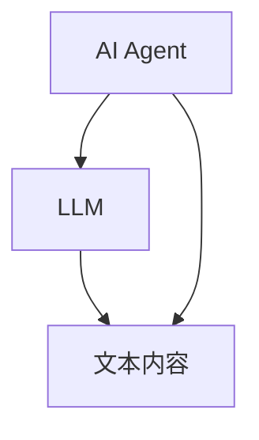
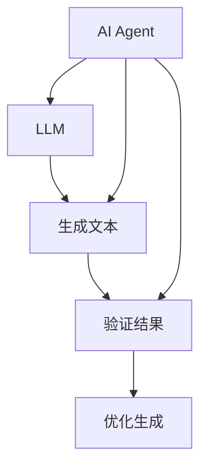
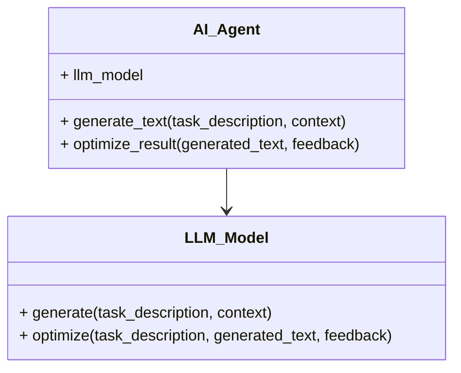
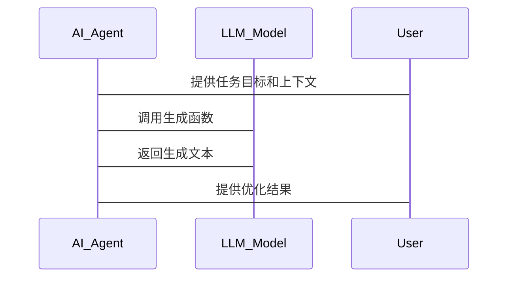

                 


# LLM驱动的AI Agent文本蕴含生成

---

## 关键词：
- LLM（大语言模型）
- AI Agent（人工智能代理）
- 文本蕴含生成
- 自然语言处理
- 知识图谱
- 联合学习

---

## 摘要：
本文探讨了大语言模型（LLM）驱动的AI Agent在文本蕴含生成中的应用。通过分析LLM与AI Agent的协同工作原理，详细阐述了文本蕴含生成的核心算法、系统架构及实际应用案例。文章从背景介绍、核心概念、算法原理、系统设计、项目实战到总结，逐步深入，为读者提供全面的技术视角，帮助理解如何利用LLM驱动AI Agent实现高效的文本蕴含生成。

---

## 第一部分：背景介绍

### 第1章：LLM驱动的AI Agent文本蕴含生成概述

#### 1.1 问题背景
- **1.1.1 当前AI Agent的发展现状**  
  AI Agent（人工智能代理）是一种能够感知环境、自主决策并执行任务的智能体。随着技术的发展，AI Agent已在多个领域得到广泛应用，如智能助手、自动化系统等。然而，AI Agent的核心能力受限于其知识库和推理能力，难以处理复杂多变的自然语言任务。

- **1.1.2 大语言模型（LLM）的崛起**  
  大语言模型（LLM）如GPT-3、PaLM等，通过海量数据训练，具备强大的文本生成和理解能力。LLM的引入为AI Agent提供了强大的自然语言处理能力，使其能够更好地理解和生成人类语言。

- **1.1.3 LLM与AI Agent结合的必要性**  
  LLM的自然语言处理能力与AI Agent的任务执行能力相结合，能够显著提升AI Agent的智能化水平。LLM为AI Agent提供语言理解与生成能力，而AI Agent则为LLM提供任务目标和上下文信息，实现人机协作的高效文本处理。

#### 1.2 问题描述
- **1.2.1 文本蕴含生成的核心问题**  
  文本蕴含生成是指从给定文本中推导出隐含信息并生成相关文本内容。例如，从一段新闻中生成摘要或扩展内容。这一过程需要模型具备推理能力和生成能力。

- **1.2.2 LLM在文本蕴含生成中的作用**  
  LLM通过强大的语言建模能力，能够从文本中提取隐含信息并生成符合逻辑的新文本。然而，LLM的生成结果可能缺乏具体任务目标的引导，需要AI Agent进行任务约束和优化。

- **1.2.3 当前技术的局限性与挑战**  
  当前LLM驱动的AI Agent在文本蕴含生成中面临以下挑战：
  1. 生成内容可能偏离任务目标。
  2. 缺乏对上下文和领域知识的深度理解。
  3. 计算资源消耗较大，难以实时处理。

#### 1.3 问题解决
- **1.3.1 LLM驱动AI Agent的解决方案**  
  通过将AI Agent与LLM结合，AI Agent可以根据任务目标约束LLM的生成过程，确保生成内容符合具体需求。

- **1.3.2 文本蕴含生成的关键技术**  
  文本蕴含生成的关键技术包括：自然语言理解、推理能力、生成能力以及任务目标约束。这些技术的结合使得AI Agent能够高效完成文本处理任务。

- **1.3.3 LLM与AI Agent协同工作的模式**  
  LLM与AI Agent的协同模式包括：
  1. AI Agent向LLM提供任务目标和上下文信息。
  2. LLM根据任务目标生成符合要求的文本内容。
  3. AI Agent对生成结果进行验证和优化。

#### 1.4 边界与外延
- **1.4.1 LLM驱动AI Agent的边界条件**  
  LLM驱动AI Agent的边界条件包括：任务目标的明确性、数据的充分性、计算资源的限制等。

- **1.4.2 文本蕴含生成的适用范围**  
  文本蕴含生成适用于多种场景，如文本摘要、内容扩展、对话生成等。然而，其效果受到模型能力和数据质量的影响。

- **1.4.3 技术的可扩展性和灵活性**  
  LLM驱动AI Agent的文本蕴含生成技术具有较强的可扩展性和灵活性，可以通过模型调优、领域知识注入等方式提升性能。

#### 1.5 核心要素组成
- **1.5.1 LLM模型的选择与优化**  
  选择合适的LLM模型并对其进行优化是实现高效文本蕴含生成的关键。模型的选择需要考虑任务需求、计算资源和生成效果。

- **1.5.2 AI Agent的行为规划与决策**  
  AI Agent需要根据任务目标制定行为规划，并在生成过程中动态调整策略，确保生成内容符合预期。

- **1.5.3 文本蕴含生成的评估指标**  
  评估指标包括生成内容的相关性、准确性和流畅性。通过多维度评估，可以全面衡量生成效果。

---

## 第二部分：核心概念与联系

### 第2章：LLM与AI Agent的核心概念

#### 2.1 核心概念原理
- **2.1.1 LLM的工作原理**  
  LLM通过大规模数据训练，掌握了语言的统计规律，能够根据输入生成符合语境的文本内容。

- **2.1.2 AI Agent的工作原理**  
  AI Agent通过感知环境、理解任务目标并执行操作，实现特定任务的完成。AI Agent的核心能力包括感知、推理和执行。

- **2.1.3 LLM与AI Agent的协同工作原理**  
  LLM为AI Agent提供自然语言处理能力，而AI Agent为LLM提供任务目标和上下文信息。两者协同工作，实现高效文本蕴含生成。

#### 2.2 核心概念对比
| **特性**       | **LLM**                      | **AI Agent**                  |
|-----------------|------------------------------|-------------------------------|
| 核心能力       | 自然语言处理                | 任务执行与自主决策            |
| 输入输出       | 文本输入，生成文本           | 环境输入，任务目标输出         |
| 优势           | 强大的语言生成与理解能力    | 高度自主，适应复杂环境         |
| 应用场景       | 文本生成、问答系统            | 自动化任务、智能助手           |

#### 2.3 实体关系图


---

## 第三部分：算法原理讲解

### 第3章：LLM驱动的AI Agent文本蕴含生成算法

#### 3.1 算法流程


#### 3.2 算法实现
```python
class AI_Agent:
    def __init__(self, llm_model):
        self.llm = llm_model

    def generate_text(self, task_description, context):
        # 调用LLM生成文本
        response = self.llm.generate(task_description, context)
        return response

    def optimize_result(self, generated_text, feedback):
        # 根据反馈优化生成结果
        optimized_text = self.llm.optimize(task_description, generated_text, feedback)
        return optimized_text
```

#### 3.3 数学模型与公式
文本蕴含生成的过程可以表示为：
$$ P(Y|X) = f_{LLM}(X) $$
其中，$X$ 是输入文本，$Y$ 是生成的文本，$f_{LLM}$ 是LLM的生成函数。

优化过程可以表示为：
$$ Y^* = \arg\max_{Y} P(Y|X, T) $$
其中，$T$ 是任务目标。

---

## 第四部分：系统分析与架构设计

### 第4章：LLM驱动的AI Agent文本蕴含生成系统

#### 4.1 问题场景
- AI Agent需要根据用户提供的文本和任务目标，生成符合要求的文本内容。

#### 4.2 项目介绍
- 项目名称：LLM-Driven AI Agent Text Generation
- 项目目标：实现基于LLM的AI Agent文本蕴含生成系统。

#### 4.3 系统功能设计


#### 4.4 系统架构设计


#### 4.5 系统接口设计
- 输入接口：任务目标、上下文信息
- 输出接口：生成文本、优化结果

#### 4.6 系统交互设计


---

## 第五部分：项目实战

### 第5章：基于LLM的AI Agent文本蕴含生成实战

#### 5.1 环境安装
- 安装Python和所需的库（如TensorFlow、PyTorch等）。
- 安装LLM模型（如Hugging Face的GPT-2）。

#### 5.2 核心代码实现
```python
from transformers import GPT2LMHeadModel, GPT2Tokenizer

class AI_Agent:
    def __init__(self, model_name):
        self.model_name = model_name
        self.tokenizer = GPT2Tokenizer.from_pretrained(model_name)
        self.model = GPT2LMHeadModel.from_pretrained(model_name)

    def generate(self, task_description, context):
        inputs = self.tokenizer(task_description + context, return_tensors="pt").input_ids
        outputs = self.model.generate(inputs, max_length=500, do_sample=True)
        return self.tokenizer.decode(outputs[0], skip_special_tokens=True)
```

#### 5.3 代码解读与分析
- 代码实现了一个AI Agent类，利用GPT-2模型进行文本生成。
- `generate`方法接受任务目标和上下文信息，生成符合要求的文本内容。

#### 5.4 实际案例分析
- 案例：根据新闻标题生成新闻摘要。
- 输入：标题和新闻正文。
- 输出：生成的新闻摘要。

#### 5.5 项目总结
- 通过实战项目，验证了LLM驱动AI Agent文本蕴含生成的可行性。
- 提供了实际应用中的注意事项和优化建议。

---

## 第六部分：总结

### 第6章：总结与展望

#### 6.1 最佳实践
- 合理选择LLM模型，根据任务需求进行优化。
- 明确任务目标，确保生成内容符合预期。
- 定期更新模型和优化策略，提升生成效果。

#### 6.2 小结
- LLM驱动的AI Agent文本蕴含生成是一项具有广泛应用前景的技术。
- 通过合理设计和优化，可以显著提升生成内容的质量和效率。

#### 6.3 注意事项
- 注意模型的计算资源消耗，合理优化模型参数。
- 避免生成内容偏离任务目标，确保生成结果的相关性。

#### 6.4 拓展阅读
- 推荐阅读相关领域的最新论文和技术文章，关注LLM和AI Agent的最新发展动态。

---

## 结语
通过本文的系统介绍，读者可以全面了解LLM驱动的AI Agent文本蕴含生成的核心技术、实现方法和实际应用。希望本文能为相关领域的研究和实践提供有价值的参考和启发。

