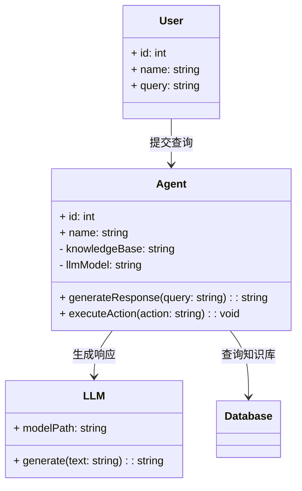
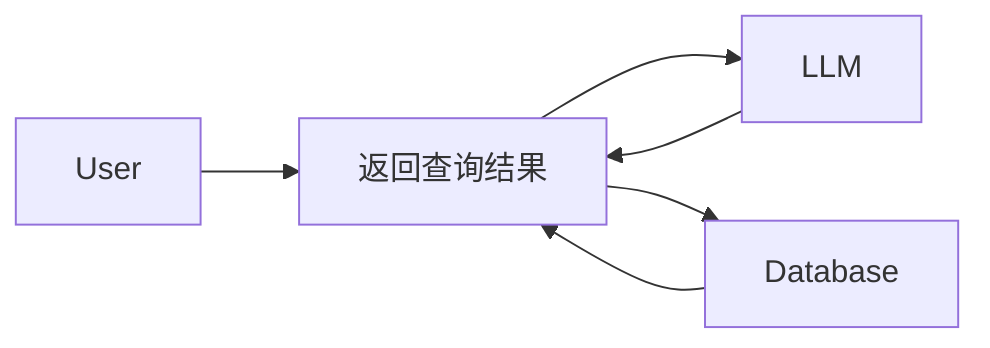
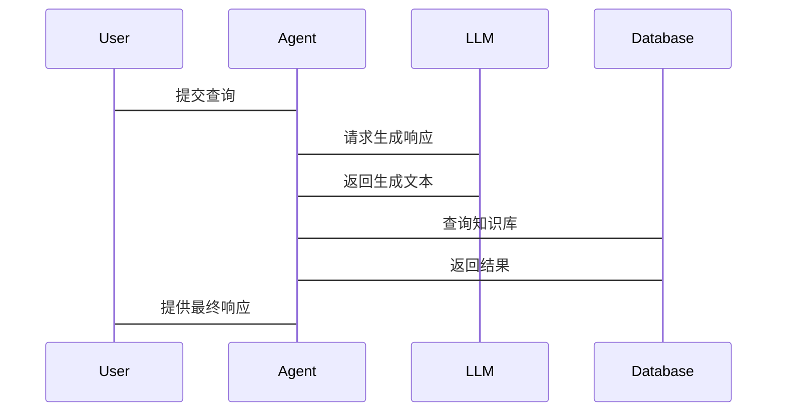

                 


# LLM驱动的AI Agent自然语言生成优化

## 关键词：LLM, AI Agent, 自然语言生成优化, 大语言模型, AI代理, 生成优化

## 摘要：本文探讨了如何利用大语言模型（LLM）优化AI代理的自然语言生成能力，分析了LLM与AI Agent的核心概念，详细讲解了自然语言生成优化的算法原理、系统架构设计和项目实战，并提供了最佳实践和未来展望。

---

# 第一部分: LLM驱动的AI Agent自然语言生成优化背景介绍

## 第1章: LLM与AI Agent概述

### 1.1 LLM的基本概念

#### 1.1.1 大语言模型的定义与特点
大语言模型（Large Language Models, LLMs）是指经过大量文本数据训练的深度学习模型，具有以下特点：
- **大数据量**：通常训练数据超过 billions of tokens。
- **多任务能力**：能够处理多种NLP任务，如翻译、问答、文本生成。
- **上下文理解**：通过长上下文窗口捕捉语境信息。

#### 1.1.2 LLM的核心技术与实现原理
- **基于Transformer架构**：采用自注意力机制，捕捉长距离依赖关系。
- **预训练与微调**：通过大规模无监督数据预训练，再在特定任务上微调。

#### 1.1.3 LLM在自然语言处理中的应用
- **文本生成**：用于内容创作、对话系统。
- **问答系统**：提供信息检索和问题回答。
- **机器翻译**：实现多种语言之间的翻译。

### 1.2 AI Agent的基本概念

#### 1.2.1 AI Agent的定义与分类
- **定义**：AI Agent是能够感知环境并采取行动以实现目标的智能体。
- **分类**：基于智能水平，分为简单反射型、基于模型的反应型、目标驱动型和实用驱动型。

#### 1.2.2 AI Agent的核心功能与应用场景
- **核心功能**：感知环境、推理、规划、执行。
- **应用场景**：智能客服、智能家居助手、自动驾驶。

#### 1.2.3 AI Agent与人类交互的特点
- **实时性**：快速响应用户输入。
- **交互性**：支持多轮对话，保持上下文连贯。
- **适应性**：根据用户反馈调整生成内容。

### 1.3 LLM驱动的AI Agent的背景与问题背景

#### 1.3.1 当前自然语言生成的挑战
- **生成准确性**：模型可能生成不准确或不相关的内容。
- **生成效率**：大规模生成任务耗时长，资源消耗大。
- **多轮对话连贯性**：保持对话主题和逻辑连贯性。

#### 1.3.2 LLM驱动AI Agent的潜在优势
- **强大的生成能力**：LLM能够生成高质量、多样化的文本。
- **可扩展性**：支持大规模并行生成任务。
- **适应性**：通过微调或提示工程技术，适应不同领域需求。

#### 1.3.3 当前技术的局限性与优化方向
- **生成内容的可控性**：需要更精细的控制机制，确保生成内容符合特定要求。
- **生成效率优化**：探索更高效的生成算法和分布式计算方法。
- **多模态交互**：结合视觉、语音等多模态信息，提升交互体验。

## 1.4 本章小结
本章介绍了LLM和AI Agent的基本概念、核心技术和应用场景，分析了当前自然语言生成的挑战和LLM驱动AI Agent的潜在优势，为后续章节奠定了基础。

---

## 第2章: 自然语言生成优化的核心概念

### 2.1 自然语言生成的基本原理

#### 2.1.1 自然语言生成的定义与流程
- **定义**：将结构化信息转换为自然语言文本的过程。
- **流程**：包括解析输入、生成中间表示、选择词汇和句法结构。

#### 2.1.2 基于LLM的生成机制
- **解码策略**：采用贪心算法或随机采样生成文本。
- **生成模型**：基于Transformer的解码器，如GPT系列。

#### 2.1.3 生成质量的评估标准
- **准确性**：生成内容是否正确。
- **流畅性**：文本是否通顺自然。
- **相关性**：生成内容是否符合上下文和用户需求。

### 2.2 LLM驱动的AI Agent生成优化的关键问题

#### 2.2.1 生成结果的准确性优化
- **问题**：模型可能生成不相关或错误的信息。
- **解决方法**：引入领域知识库，通过微调优化生成内容。

#### 2.2.2 生成效率的提升方法
- **问题**：大规模生成任务耗时长，资源消耗大。
- **解决方法**：采用并行计算、模型剪枝和量化技术。

#### 2.2.3 多轮对话的连贯性优化
- **问题**：对话过程中主题易跑偏，逻辑不连贯。
- **解决方法**：引入对话历史记忆机制，结合上下文理解。

### 2.3 生成优化的边界与外延

#### 2.3.1 生成优化的边界条件
- **输入质量**：生成优化依赖于高质量的输入。
- **模型能力**：模型能力的限制直接影响生成效果。

#### 2.3.2 优化的外延与扩展方向
- **多模态生成**：结合视觉、语音信息，提升生成效果。
- **个性化生成**：根据用户偏好生成定制化内容。

#### 2.3.3 生成优化与实际场景的结合
- **应用场景**：智能客服、教育辅助、内容创作。
- **案例分析**：在智能客服中，优化生成的响应时间和服务质量。

## 2.4 本章小结
本章详细探讨了自然语言生成优化的核心概念，分析了准确性、效率和连贯性优化的关键问题，为后续章节的系统设计和项目实现提供了理论基础。

---

## 第3章: LLM与AI Agent的核心概念原理

### 3.1 LLM的核心原理

#### 3.1.1 LLM的训练过程
- **预训练**：使用大规模数据进行无监督学习，提取语言特征。
- **微调**：在特定任务上进行有监督微调，提升任务性能。

#### 3.1.2 LLM的生成过程
- **解码器**：通过自注意力机制生成文本。
- **解码策略**：贪心解码或随机采样生成多样化结果。

### 3.2 AI Agent的核心原理

#### 3.2.1 感知与推理
- **感知**：通过传感器或API获取环境信息。
- **推理**：基于知识库和逻辑推理生成行动方案。

#### 3.2.2 规划与执行
- **规划**：制定行动步骤，优化资源分配。
- **执行**：通过API或外部系统执行预定动作。

### 3.3 LLM与AI Agent的协作机制

#### 3.3.1 数据流与接口设计
- **输入**：用户查询、环境数据。
- **输出**：生成文本、执行指令。

#### 3.3.2 协作流程
1. **感知环境**：AI Agent接收用户输入或环境数据。
2. **生成响应**：LLM根据输入生成自然语言文本。
3. **执行操作**：AI Agent根据生成的文本执行相应操作。

### 3.4 LLM与AI Agent的对比分析

| 属性 | LLM | AI Agent |
|------|------|----------|
| 核心任务 | 生成自然语言文本 | 感知环境、推理、规划、执行 |
| 输入 | 文本、上下文 | 环境数据、用户输入 |
| 输出 | 自然语言文本 | 动作、结果 |

---

## 第4章: 系统分析与架构设计

### 4.1 项目介绍：智能客服系统

#### 4.1.1 项目背景
- **目标**：提供高效、智能的客服服务。
- **用户需求**：快速响应、准确解决问题。

### 4.2 系统功能设计

#### 4.2.1 领域模型类图


### 4.3 系统架构设计

#### 4.3.1 系统架构图


### 4.4 系统交互流程

#### 4.4.1 交互序列图


### 4.5 接口设计

#### 4.5.1 主要接口
- **生成接口**：`generate(text: str) -> str`
- **查询接口**：`query_database(query: str) -> List[Result]`
- **执行接口**：`execute(action: str) -> bool`

---

## 第5章: 项目实战

### 5.1 环境安装

```bash
pip install transformers
pip install torch
pip install sentencepiece
```

### 5.2 核心代码实现

#### 5.2.1 生成优化模块
```python
from transformers import AutoTokenizer, AutoModelForCausalLM

class GenerateOptimizer:
    def __init__(self, model_name="gpt2"):
        self.tokenizer = AutoTokenizer.from_pretrained(model_name)
        self.model = AutoModelForCausalLM.from_pretrained(model_name)

    def optimize_generate(self, prompt, max_length=50, temperature=1.0):
        inputs = self.tokenizer(prompt, return_tensors="pt")
        outputs = self.model.generate(
            inputs.input_ids,
            max_length=max_length,
            temperature=temperature,
            do_sample=True
        )
        return self.tokenizer.decode(outputs[0], skip_special_tokens=True)
```

#### 5.2.2 对话系统实现
```python
class AIAgent:
    def __init__(self, model_name="gpt2"):
        self.optimizer = GenerateOptimizer(model_name)
        self.memory = {}

    def generate_response(self, message):
        history = " ".join([msg for msgs in self.memory.values() for msg in msgs])
        prompt = f"对话历史：{history}\n用户：{message}\nAI助手："
        response = self.optimizer.optimize_generate(prompt)
        return response

    def update_memory(self, message, response):
        self.memory[len(self.memory)+1] = [message, response]
```

### 5.3 代码解读与分析

#### 5.3.1 生成优化模块
- **类定义**：`GenerateOptimizer`类初始化加载预训练模型和分词器。
- **优化生成**：通过调整温度参数控制生成的多样性和随机性。
- **接口设计**：提供`optimize_generate`方法，支持可配置的最大长度和温度参数。

#### 5.3.2 对话系统实现
- **类定义**：`AIAgent`类初始化加载生成优化器，并维护对话历史记忆。
- **生成响应**：结合对话历史生成上下文相关的回答。
- **更新记忆**：每次对话后更新记忆，保持对话连贯性。

### 5.4 实际案例分析

#### 5.4.1 案例1：智能客服
- **输入**：用户查询："我的订单在哪里？"
- **生成历史**：空
- **生成输出**："您的订单可以在我的订单页面查看，请提供订单号以便查询。"

#### 5.4.2 案例2：教育辅助
- **输入**：学生问题："如何理解量子力学？"
- **生成输出**：简明扼要地解释量子力学的基本概念，并提供进一步学习的建议。

### 5.5 生成优化效果对比

| 优化前 | 优化后 |
|------|------|
| 固定回复 | 自然语言生成 |
| 低效生成 | 高效生成 |
| 无上下文 | 上下文相关 |

---

## 第6章: 总结与展望

### 6.1 本章总结
本文详细探讨了LLM驱动的AI Agent自然语言生成优化的核心概念、算法原理、系统架构设计和项目实现，展示了如何通过优化生成过程提升AI Agent的交互能力和用户体验。

### 6.2 最佳实践 tips
- **模型选择**：根据任务需求选择合适的LLM模型。
- **生成控制**：通过温度、top-k等参数控制生成内容。
- **持续优化**：定期更新模型和优化生成策略。

### 6.3 未来展望
- **多模态优化**：结合视觉、语音信息，提升生成效果。
- **个性化生成**：根据用户偏好生成定制化内容。
- **动态优化**：实时调整生成策略，适应环境变化。

---

## 参考文献
[1] Brown, T. B., et al. "Language models are few-shot learners." arXiv preprint arXiv:2005.14167 (2020).
[2] Vaswani, A., et al. "Attention is all you need." arXiv preprint arXiv:1706.03798 (2017).

---

通过以上结构化和详细的内容，本文系统地介绍了LLM驱动的AI Agent自然语言生成优化的关键点，为读者提供了从理论到实践的全面指导。

