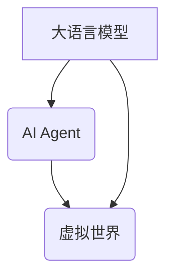
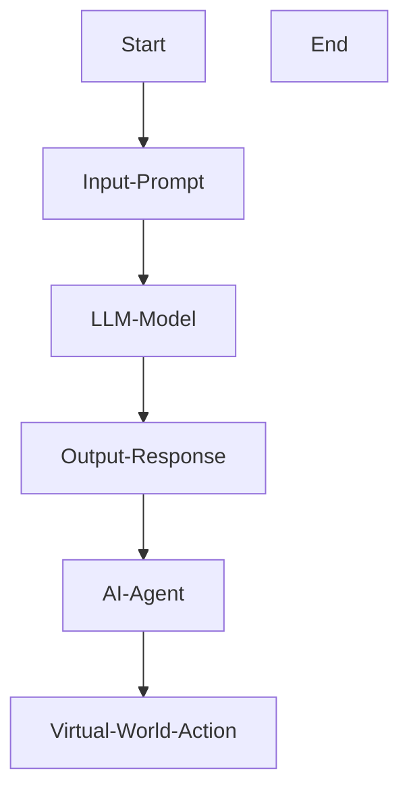
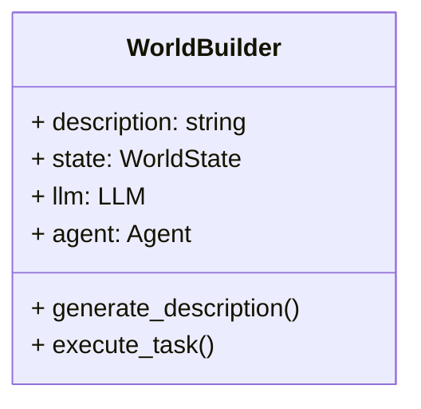
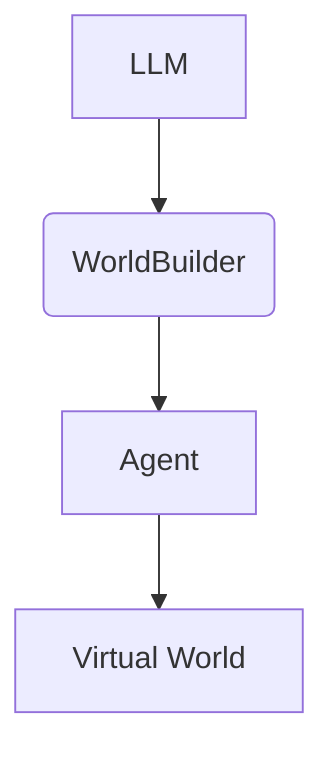
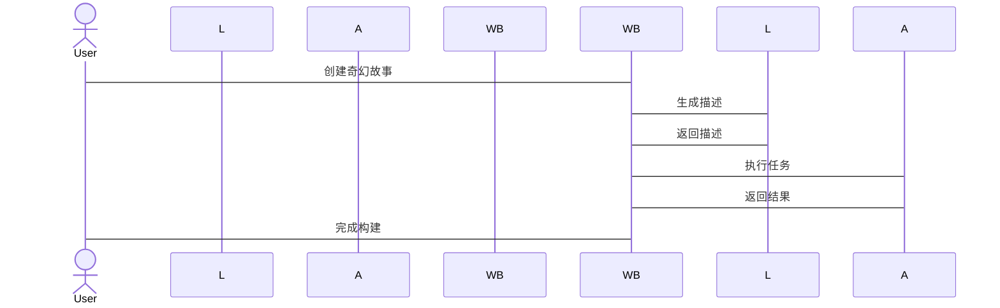

                 


# LLM驱动的AI Agent虚构世界构建器

## 关键词：LLM、AI Agent、虚构世界、构建器、语言模型、智能体

## 摘要：本文探讨了如何利用大语言模型（LLM）驱动的AI Agent构建虚构世界。文章从背景、核心概念、算法原理、系统架构、项目实战到最佳实践，全面分析了虚构世界构建的技术细节和实现路径，深入解读了LLM与AI Agent的结合及其在虚拟环境构建中的应用。

---

# 第1章 背景介绍

## 1.1 问题背景与描述

### 1.1.1 虚构世界构建的现状与挑战
虚构世界构建是人工智能领域的前沿研究方向，涉及自然语言处理、计算机视觉和强化学习等多个技术领域。传统方法依赖手动编写规则，难以应对复杂场景的动态变化。随着大语言模型（LLM）和AI Agent技术的快速发展，构建智能化、自适应的虚构世界成为可能。

### 1.1.2 LLM与AI Agent的结合
LLM具备强大的文本生成和理解能力，而AI Agent能够根据任务自主决策和执行操作。两者的结合使得虚构世界构建更加智能化，能够根据上下文生成合理的故事情节、人物行为和环境变化。

### 1.1.3 问题解决的核心思路
通过LLM生成世界描述，AI Agent根据描述执行构建任务，动态调整世界状态，形成一个闭环系统。

## 1.2 问题的边界与外延

### 1.2.1 虚构世界构建的边界
虚构世界构建不涉及真实世界的物理规律，仅关注逻辑自洽的虚拟环境。

### 1.2.2 LLM驱动的局限性
LLM可能生成不一致或不合理的内容，需要AI Agent进行校正和优化。

### 1.2.3 AI Agent在虚拟世界中的角色
AI Agent负责执行构建任务，管理世界状态，确保生成内容的逻辑一致性。

## 1.3 核心概念与组成

### 1.3.1 LLM的核心要素
- **模型**：基于Transformer的神经网络架构。
- **训练数据**：海量文本数据。
- **输入输出**：文本输入生成文本输出。

### 1.3.2 AI Agent的功能模块
- **感知模块**：接收输入指令。
- **决策模块**：基于LLM生成的描述做出决策。
- **执行模块**：执行构建任务。

### 1.3.3 虚构世界构建的系统架构
- **输入**：用户指令。
- **LLM**：生成世界描述。
- **AI Agent**：根据描述执行构建。
- **输出**：构建完成的世界。

---

# 第2章 核心概念与联系

## 2.1 LLM与AI Agent的原理对比

### 2.1.1 LLM的工作原理
LLM通过自注意力机制生成上下文相关的文本输出。

### 2.1.2 AI Agent的核心算法
基于RL的决策算法，通过与环境交互优化策略。

### 2.1.3 两者的异同点
| 比较维度 | LLM | AI Agent |
|----------|-----|-----------|
| 核心任务 | 生成文本 | 执行任务 |
| 输入输出 | 文本 | 多种类型 |

## 2.2 核心概念属性特征对比表

| 概念 | 属性 | 特征 |
|------|------|------|
| LLM  | 模型类型 | 大语言模型 |
| AI Agent | 功能 | 自主决策与执行 |

## 2.3 ER实体关系图



---

# 第3章 算法原理与实现

## 3.1 LLM驱动的AI Agent算法

### 3.1.1 算法流程



### 3.1.2 数学模型

$$ P(\text{output} | \text{input}, \theta) $$

### 3.1.3 示例
给定输入“创建一个奇幻故事”，LLM生成文本，AI Agent执行构建世界。

## 3.2 实现代码

```python
def llm_driver():
    prompt = "创建一个奇幻故事"
    response = llm.generate(prompt)
    return response
```

---

# 第4章 系统架构设计方案

## 4.1 问题场景介绍

### 4.1.1 虚拟世界构建的应用场景
构建一个动态变化的虚拟故事世界。

### 4.1.2 LLM与AI Agent的协作流程
- LLM生成世界描述。
- AI Agent执行构建任务。

## 4.2 系统功能设计

### 4.2.1 领域模型



### 4.2.2 系统架构



## 4.3 系统接口设计

### 4.3.1 API接口

```python
class WorldBuilder:
    def __init__(self, llm, agent):
        self.llm = llm
        self.agent = agent
        self.state = WorldState()

    def generate_description(self, prompt):
        return self.llm.generate(prompt)

    def execute_task(self, task):
        self.agent.execute(task)
```

## 4.4 系统交互流程

### 4.4.1 交互流程图



---

# 第5章 项目实战

## 5.1 环境安装

```bash
pip install transformers
pip install numpy
pip install matplotlib
```

## 5.2 核心实现

### 5.2.1 LLM实现

```python
from transformers import GPT2LMHeadModel, GPT2Tokenizer

tokenizer = GPT2Tokenizer.from_pretrained('gpt2')
model = GPT2LMHeadModel.from_pretrained('gpt2')
```

### 5.2.2 AI Agent实现

```python
class Agent:
    def execute(self, task):
        # 实现具体任务
        pass
```

## 5.3 应用案例分析

### 5.3.1 示例代码

```python
builder = WorldBuilder(model, agent)
builder.generate_description("创建一个奇幻故事")
builder.execute_task("构建世界")
```

## 5.4 项目小结
通过项目实战，验证了LLM驱动的AI Agent构建虚构世界的可行性。

---

# 第6章 最佳实践

## 6.1 总结
LLM和AI Agent的结合为虚构世界构建提供了新的思路。

## 6.2 注意事项
- 定期校验模型输出。
- 处理异常情况。

## 6.3 拓展阅读
推荐阅读相关领域的最新论文和技术博客。

---

# 结语

通过本文的系统分析和实践，读者可以深入理解LLM驱动的AI Agent虚构世界构建器的技术细节和实现方法，为未来的应用和研究提供参考。

