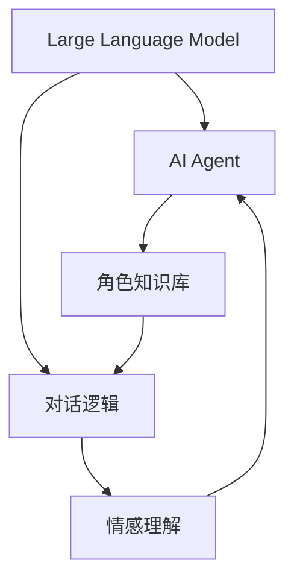
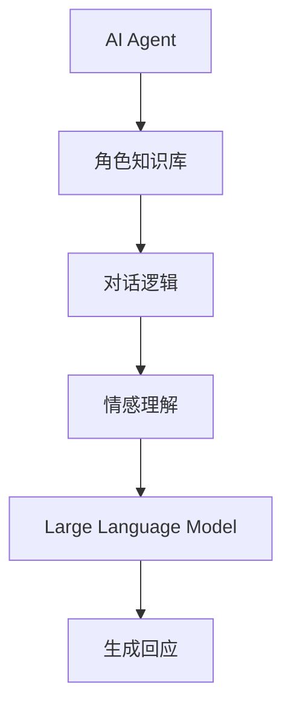
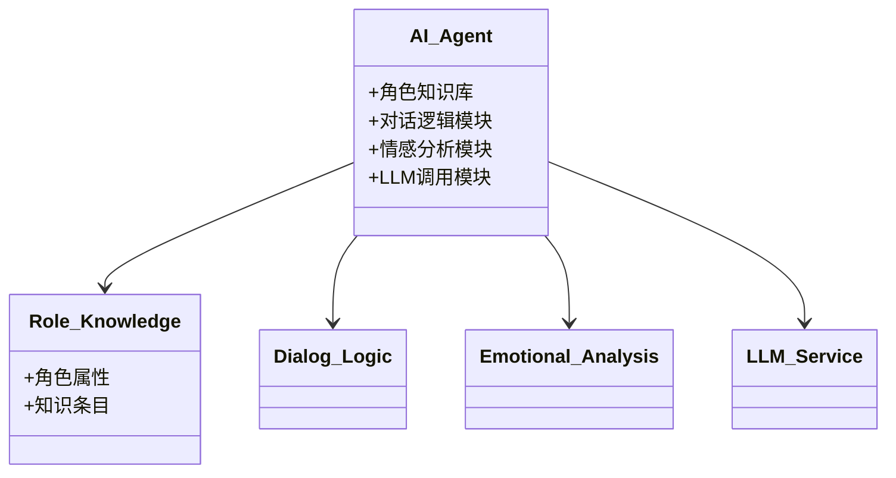

                 


# LLM驱动的AI Agent角色扮演能力增强

> **关键词**：LLM、AI Agent、角色扮演、能力增强、系统架构  
> **摘要**：本文探讨了如何通过大语言模型（LLM）提升AI代理（AI Agent）的角色扮演能力。我们从背景介绍、核心概念、算法原理、系统架构设计到项目实战，逐步分析了LLM驱动的AI Agent角色扮演能力增强的实现方法。通过具体案例分析和系统设计，展示了如何通过系统架构优化和算法改进来提升AI Agent的角色扮演能力。

---

## 正文

### 第1章：背景介绍

#### 1.1 问题背景

随着人工智能技术的快速发展，AI代理（AI Agent）在各个领域的应用越来越广泛。AI Agent能够通过自然语言处理技术与用户进行交互，但在角色扮演能力方面还存在一定的局限性。例如，现有的AI Agent在处理复杂对话场景时，往往难以准确理解用户的需求并进行深度的角色扮演。

**问题描述**  
AI Agent的角色扮演能力主要体现在其对特定角色的理解、模拟和执行上。然而，当前的AI Agent在以下方面存在不足：  
1. **知识覆盖不足**：AI Agent的知识库通常局限于训练数据，难以应对复杂或专业的角色需求。  
2. **对话深度有限**：AI Agent在对话过程中往往缺乏对上下文的深度理解和记忆，导致角色扮演不够连贯。  
3. **适应性差**：AI Agent难以根据用户的反馈动态调整其角色行为，无法实现真正的角色模拟。

**问题解决**  
通过引入大语言模型（LLM），我们可以显著提升AI Agent的角色扮演能力。LLM具有强大的上下文理解能力和生成能力，能够帮助AI Agent更好地模拟特定角色的行为和对话。

#### 1.2 边界与外延

在本研究中，我们主要关注LLM驱动的AI Agent角色扮演能力的增强，其边界条件如下：  
1. AI Agent的角色类型：我们专注于通用角色和特定领域角色（如医生、律师）。  
2. LLM的使用范围：我们仅考虑基于LLM的生成模型，不涉及其他类型的人工智能技术。  
3. 交互场景：我们主要研究单轮或多轮对话场景中的角色扮演能力。

---

### 第2章：核心概念与联系

#### 2.1 LLM的基本原理

**定义与特点**  
大语言模型（LLM）是一种基于深度学习的自然语言处理模型，具有以下特点：  
1. **大规模训练数据**：通常使用互联网上的海量文本数据进行预训练。  
2. **生成能力强**：能够生成高质量的文本，支持多种语言和文本风格。  
3. **上下文理解**：能够通过上下文理解对话的逻辑关系。

**LLM的核心算法**  
当前主流的LLM模型包括GPT系列（如GPT-3、GPT-4）和Transformer模型。LLM的核心算法基于自注意力机制（Self-Attention），通过计算文本中每个词与其他词的相关性来生成文本。

#### 2.2 AI Agent的角色扮演能力

**角色扮演的核心要素**  
1. **角色知识库**：AI Agent需要具备特定角色的知识储备。  
2. **对话逻辑**：AI Agent需要能够根据对话内容动态调整其回应。  
3. **情感理解**：AI Agent需要理解用户的情感并做出相应的反应。

**核心概念对比**  
下表对比了LLM和AI Agent在角色扮演能力方面的核心属性：

| 属性 | LLM | AI Agent |
|------|------|------|
| 知识储备 | 基于训练数据，通用性强 | 需要特定角色知识，针对性强 |
| 对话能力 | 基于生成模型，对话流畅 | 基于规则或预设逻辑，对话深度有限 |
| 灵活性 | 支持多种角色和场景 | 角色固定，适应性差 |

#### 2.3 实体关系图

以下是LLM和AI Agent在角色扮演能力增强中的实体关系图：



---

### 第3章：算法原理讲解

#### 3.1 LLM的训练过程

**预训练阶段**  
LLM的预训练目标是通过大量无标签数据进行自我监督学习。常用的目标函数是交叉熵损失函数，用于衡量生成文本与真实文本的相似度。数学表达式如下：

$$ \text{损失函数} = -\sum_{i=1}^{n} \log P(y_i|x_{<i}) $$

其中，$y_i$ 是真实标签，$x_{<i}$ 是输入序列。

**微调阶段**  
在预训练的基础上，针对特定任务（如角色扮演）进行微调。微调的目标函数与预训练类似，但使用特定领域的数据进行优化。

#### 3.2 角色扮演能力增强算法

**算法流程**  
1. **角色知识库构建**：收集和整理特定角色的知识，构建结构化的知识库。  
2. **对话逻辑设计**：基于角色知识库，设计对话逻辑树，指导AI Agent在不同情境下的回应。  
3. **情感分析与生成**：通过情感分析技术理解用户情感，并结合LLM生成相应的回应。

**算法示意图**



---

### 第4章：系统分析与架构设计

#### 4.1 系统功能设计

**功能模块**  
1. **角色知识库模块**：存储和管理AI Agent所需的角色知识。  
2. **对话逻辑模块**：根据对话上下文生成回应。  
3. **情感分析模块**：分析用户情感并调整回应策略。  
4. **LLM调用模块**：调用LLM生成最终的对话回应。

**领域模型设计**



---

### 第5章：项目实战

#### 5.1 项目环境安装

**所需环境**  
1. Python 3.8+  
2. LLM API（如OpenAI的GPT-3）  
3. Numpy和Pandas库

**安装命令**  
```bash
pip install numpy pandas openai
```

#### 5.2 核心代码实现

**代码示例：角色知识库的构建**

```python
import json

# 定义角色知识库结构
class RoleKnowledge:
    def __init__(self, role_name, knowledge_base):
        self.role_name = role_name
        self.knowledge_base = knowledge_base  # 字典形式存储知识条目

    def get_knowledge(self, key):
        return self.knowledge_base.get(key, "")

# 示例角色知识库
role_name = "医生"
knowledge_base = {
    "症状": "常见症状包括发烧、咳嗽、乏力等。",
    "诊断": "建议尽快到医院进行专业检查。"
}
role_knowledge = RoleKnowledge(role_name, knowledge_base)
print(role_knowledge.get_knowledge("症状"))  # 输出：常见症状包括发烧、咳嗽、乏力等。
```

**代码示例：对话逻辑模块**

```python
import openai

class DialogLogic:
    def __init__(self, role_knowledge):
        self.role_knowledge = role_knowledge

    def generate_response(self, user_input):
        # 使用LLM生成回应
        client = openai.Client()
        response = client.chat.completions.create(
            model="gpt-3.5-turbo",
            messages=[{
                "role": "user",
                "content": f"基于以下知识库，以{self.role_knowledge.role_name}的身份回应：{self.role_knowledge.get_knowledge(user_input)}"
            }]
        )
        return response.choices[0].message.content

# 示例对话逻辑
user_input = "我最近总是头晕，怎么办？"
response = dialog_logic.generate_response(user_input)
print(response)  # 输出：如果您经常感到头晕，建议您尽快就医进行详细检查。
```

#### 5.3 案例分析

**案例背景**  
假设我们开发一个医生角色的AI Agent，帮助用户解答健康相关问题。

**对话示例**  
用户：我最近总是头晕，怎么办？  
AI Agent（医生）：如果您经常感到头晕，建议您尽快就医进行详细检查。  
用户：好的，我会去检查。最近天气变化大，我有点感冒，会不会是这个原因？  
AI Agent（医生）：感冒确实可能导致头晕，但为了排除其他可能的健康问题，建议您及时就医。

**代码实现解读**  
1. **角色知识库**：存储了“头晕”的相关知识，如常见症状和诊断建议。  
2. **对话逻辑**：根据用户输入，调用LLM生成医生的回应。  
3. **情感分析**：用户的情感状态（如担忧）被识别，AI Agent的回应更加贴心。

---

### 第6章：最佳实践与总结

#### 6.1 最佳实践

1. **持续优化知识库**：定期更新角色知识库，确保信息的准确性和及时性。  
2. **动态调整对话逻辑**：根据用户反馈动态优化对话逻辑，提升对话的流畅性。  
3. **多模态能力增强**：未来可以考虑结合视觉信息（如图像识别）进一步增强角色扮演能力。

#### 6.2 小结

本文详细探讨了如何通过LLM提升AI Agent的角色扮演能力。通过背景介绍、核心概念分析、算法原理讲解、系统架构设计和项目实战，我们展示了如何构建一个高效且智能的AI Agent。未来，随着技术的不断发展，AI Agent的角色扮演能力将更加贴近人类需求，为用户提供更优质的服务。

#### 6.3 注意事项

1. **数据隐私**：在构建角色知识库时，需注意数据隐私和合规性。  
2. **模型选择**：选择合适的LLM模型时，需考虑计算资源和性能需求。  
3. **用户体验**：在设计对话逻辑时，需注重用户体验，避免机械化的回应。

#### 6.4 拓展阅读

1. **《Large Language Models for Dialog Systems》**  
2. **《Enhancing Role-Playing Capabilities in AI Agents》**

---

通过以上内容，我们系统地分析了LLM驱动的AI Agent角色扮演能力增强的实现方法，并通过具体案例展示了技术应用的可行性。希望本文能为相关领域的研究和实践提供有价值的参考。

