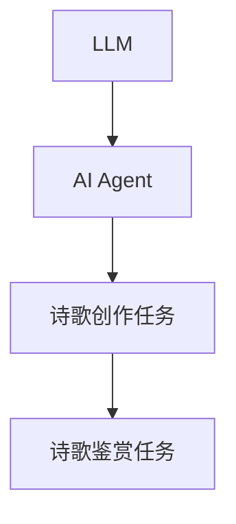
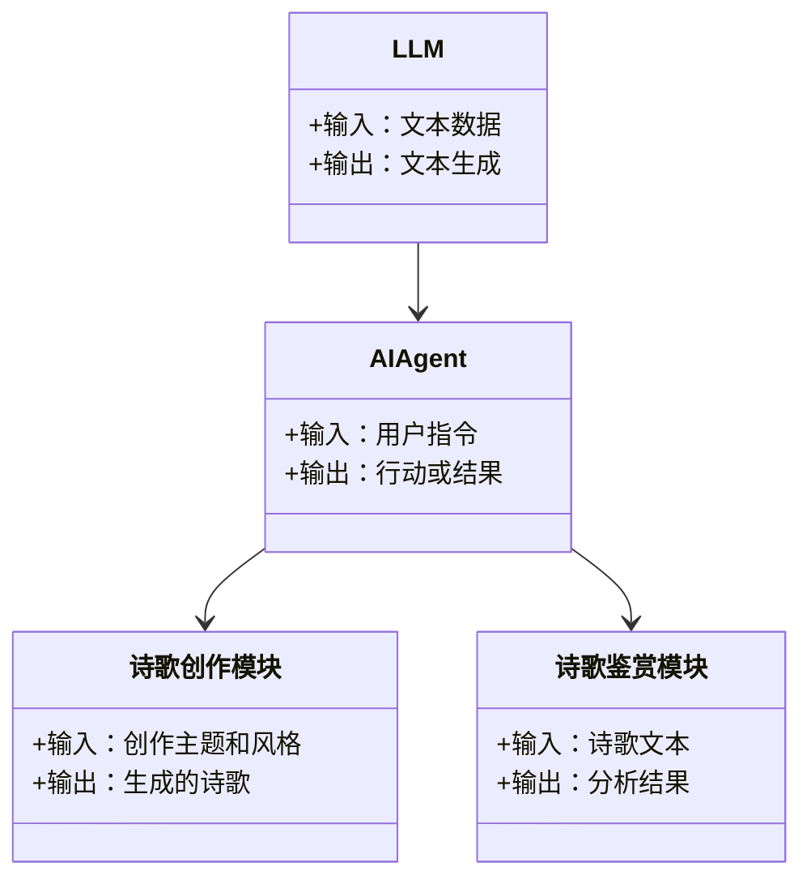
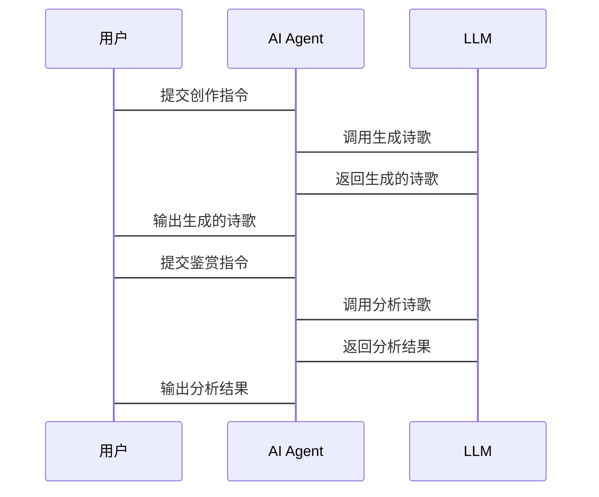

                 


# LLM驱动的AI Agent诗歌创作与鉴赏

> 关键词：LLM，AI Agent，诗歌创作，诗歌鉴赏，自然语言处理，人工智能

> 摘要：本文探讨了利用大语言模型（LLM）驱动的AI Agent在诗歌创作与鉴赏中的应用。通过分析LLM和AI Agent的核心概念、算法原理、系统架构，并结合实际项目案例，深入剖析了LLM驱动的AI Agent在诗歌创作与鉴赏中的技术实现与应用场景，为读者提供了从理论到实践的全面指导。

---

# 第一部分: LLM驱动的AI Agent诗歌创作与鉴赏背景与基础

# 第1章: LLM与AI Agent概述

## 1.1 LLM的基本概念与技术特点

### 1.1.1 大语言模型（LLM）的定义与发展

大语言模型（LLM, Large Language Model）是指基于深度学习技术训练的大型神经网络模型，能够理解和生成人类语言。LLM的核心在于其庞大的参数规模和强大的语言理解能力，其训练数据通常包含海量的文本数据，如书籍、网页和其他文档。

LLM的发展始于2018年的GPT（Generative Pre-trained Transformer）模型，随后经历了GPT-2、GPT-3、GPT-4等版本的升级，模型的参数规模从最初的1.5亿参数增长到现在的万亿级别。LLM的能力不仅限于生成文本，还包括问答、翻译、摘要、诗歌创作等多种任务。

### 1.1.2 LLM的核心技术特点

1. **基于Transformer架构**：LLM的核心是Transformer模型，具有自注意力机制（Self-Attention），能够捕捉文本中的长距离依赖关系，理解上下文。
2. **预训练与微调**：LLM通过大量的未标注数据进行预训练，掌握语言的基本规律，然后通过特定任务的数据进行微调，提升任务-specific性能。
3. **生成式模型**：LLM能够根据输入生成连贯的文本，支持多种生成策略，如贪心算法和随机采样。

### 1.1.3 LLM在自然语言处理中的应用

- **文本生成**：包括诗歌创作、文章生成、对话生成等。
- **文本理解**：包括问答、文本摘要、情感分析等。
- **多语言支持**：LLM可以处理多种语言，支持跨语言任务。

## 1.2 AI Agent的基本概念与功能

### 1.2.1 AI Agent的定义与分类

AI Agent（智能体）是指在计算机系统中能够感知环境并采取行动以实现目标的实体。AI Agent可以是软件程序，也可以是机器人或其他智能设备。根据功能和应用场景的不同，AI Agent可以分为以下几类：

1. **简单反射型智能体**：基于当前感知直接采取行动，不依赖内部状态。
2. **基于模型的反射型智能体**：依赖内部状态和环境模型来决策。
3. **目标驱动型智能体**：根据明确的目标采取行动。
4. **效用驱动型智能体**：基于效用函数优化决策。

### 1.2.2 AI Agent的核心功能与能力

1. **感知能力**：通过传感器或接口获取环境信息。
2. **决策能力**：基于感知信息和内部状态，选择最优行动。
3. **行动能力**：通过执行器或输出接口采取行动。
4. **学习能力**：通过与环境的交互不断优化自身的决策策略。

### 1.2.3 AI Agent与人类交互的特点

AI Agent与人类交互的特点包括：

1. **自然语言理解与生成**：支持通过自然语言进行交流。
2. **实时性**：能够快速响应用户的指令。
3. **个性化服务**：根据用户需求和偏好提供定制化服务。

## 1.3 诗歌创作与鉴赏的背景与挑战

### 1.3.1 诗歌创作的历史与现状

诗歌是人类文化的重要组成部分，其创作历史悠久，形式多样。传统的诗歌创作依赖于诗人的灵感和文学素养，而现代技术的发展为诗歌创作提供了新的可能性。通过AI技术辅助诗歌创作，可以突破传统创作的局限性，为诗歌创作带来新的活力。

### 1.3.2 诗歌鉴赏的复杂性与多样性

诗歌鉴赏是一项复杂的任务，需要对诗歌的语言、意象、情感、结构等进行深入分析。不同读者对同一首诗的理解和感受可能截然不同，这使得诗歌鉴赏具有高度的主观性和多样性。

### 1.3.3 利用AI技术辅助诗歌创作与鉴赏的意义

1. **提高创作效率**：AI可以快速生成诗歌，为诗人提供灵感和素材。
2. **个性化服务**：AI可以根据用户的需求和偏好，生成符合特定主题和风格的诗歌。
3. **辅助学习**：AI可以帮助初学者理解诗歌的结构和语言，提高诗歌创作能力。
4. **促进文化传播**：AI可以将诗歌翻译成多种语言，促进诗歌的传播和交流。

## 1.4 LLM驱动的AI Agent在诗歌创作与鉴赏中的结合

### 1.4.1 LLM与AI Agent的协同工作原理

LLM驱动的AI Agent通过结合大语言模型的文本生成能力和AI Agent的决策能力，实现诗歌创作与鉴赏的自动化。LLM负责生成诗歌文本，AI Agent负责根据用户的指令选择合适的创作策略和鉴赏方法。

### 1.4.2 诗歌创作与鉴赏中的具体应用场景

1. **诗歌创作**：用户可以通过与AI Agent对话，输入创作主题和风格，AI Agent利用LLM生成诗歌。
2. **诗歌鉴赏**：用户可以上传诗歌，AI Agent通过LLM进行分析，提供诗歌的结构、意象、情感等方面的解读。
3. **个性化推荐**：AI Agent可以根据用户的喜好，推荐相似风格的诗歌。

### 1.4.3 本章小结

本章介绍了LLM和AI Agent的基本概念、技术特点和功能，探讨了诗歌创作与鉴赏的背景和挑战，并分析了LLM驱动的AI Agent在诗歌创作与鉴赏中的应用潜力。

---

# 第2章: LLM驱动的AI Agent核心概念与联系

## 2.1 LLM与AI Agent的核心概念原理

### 2.1.1 LLM的训练与推理机制

1. **预训练**：LLM通过大量的未标注数据进行自监督学习，掌握语言的基本规律。
2. **微调**：针对特定任务，使用标注数据对模型进行微调，优化任务-specific性能。
3. **生成策略**：在生成阶段，可以通过贪心算法或随机采样生成文本。

### 2.1.2 AI Agent的感知与决策能力

1. **感知**：AI Agent通过输入接口获取用户的指令或环境信息。
2. **决策**：基于感知信息和内部状态，AI Agent选择最优行动。
3. **执行**：通过输出接口执行决策结果。

### 2.1.3 诗歌创作与鉴赏中的任务分解

1. **创作任务**：根据用户指令生成诗歌。
2. **鉴赏任务**：分析诗歌的结构、语言、情感等。

## 2.2 核心概念属性特征对比表格

| 概念       | 属性               | 特征                                   |
|------------|--------------------|----------------------------------------|
| LLM        | 输入               | 文本数据                               |
|             | 输出               | 文本生成                               |
| AI Agent    | 输入               | 用户指令                               |
|             | 输出               | 行动或结果                             |

## 2.3 ER实体关系图架构



## 2.4 本章小结

本章详细讲解了LLM和AI Agent的核心概念与原理，并通过对比表格和实体关系图展示了两者之间的联系，为后续章节的分析奠定了基础。

---

# 第3章: LLM驱动的AI Agent算法原理

## 3.1 LLM的算法原理

### 3.1.1 变压量自注意力机制

自注意力机制（Self-Attention）是Transformer模型的核心组件，用于计算序列中每个位置与其他位置的相关性。公式如下：

$$
\text{Attention}(Q, K, V) = \text{softmax}\left(\frac{QK^T}{\sqrt{d_k}}\right)V
$$

其中，$Q$、$K$、$V$分别是查询、键、值向量，$d_k$是键的维度。

### 3.1.2 前馈网络结构

Transformer的前馈网络由两个线性变换层组成，中间接一个ReLU激活函数：

$$
f(x) = \text{ReLU}(W_1x + b_1)
$$

$$
g(x) = W_2f(x) + b_2
$$

### 3.1.3 损失函数与优化器

常用的损失函数是交叉熵损失：

$$
\mathcal{L} = -\sum_{i=1}^{n} y_i \log p(y_i)
$$

优化器通常使用Adam：

$$
\theta_{t+1} = \theta_t - \eta \frac{\partial \mathcal{L}}{\partial \theta_t}
$$

### 3.1.4 模型训练流程

1. **预训练**：使用大规模未标注数据进行自监督学习。
2. **微调**：针对具体任务，使用标注数据进行微调。
3. **生成**：根据输入生成文本。

### 3.1.5 诗歌创作与鉴赏的数学模型

诗歌创作可以看作是一个文本生成任务，模型通过条件生成的方式，根据用户指令生成诗歌。鉴赏任务则需要对诗歌进行特征提取和分析，通常使用词向量（如Word2Vec）或BERT等预训练模型。

## 3.2 AI Agent的算法原理

### 3.2.1 状态空间与动作空间

1. **状态空间**：表示AI Agent所处的环境状态，通常是一个高维向量。
2. **动作空间**：表示AI Agent可以采取的行动，通常是一个离散的或连续的向量。

### 3.2.2 策略网络与价值网络

策略网络（Policy Network）用于生成行动策略，价值网络（Value Network）用于评估当前状态的价值：

$$
\pi(a|s) = \text{softmax}(W_p s + b_p)
$$

$$
V(s) = W_v s + b_v
$$

### 3.2.3 奖励机制与强化学习

强化学习（Reinforcement Learning）通过奖励机制优化AI Agent的决策策略：

$$
R(s, a) = r \text{（奖励）}
$$

### 3.2.4 诗歌创作与鉴赏的强化学习模型

在诗歌创作中，可以将生成的诗歌质量作为奖励，通过强化学习优化生成策略。在诗歌鉴赏中，可以将用户的反馈作为奖励，优化鉴赏模型的准确性。

## 3.3 诗歌创作与鉴赏的算法结合

### 3.3.1 诗歌生成的条件设置

1. **主题**：指定诗歌的主题，如“爱情”、“自然”等。
2. **风格**：指定诗歌的风格，如“古诗”、“现代诗”等。
3. **长度**：指定诗歌的行数和字数。

### 3.3.2 诗歌鉴赏的特征提取

1. **词汇分析**：分析诗歌中的关键词汇，提取诗歌的主题和情感。
2. **结构分析**：分析诗歌的押韵、节奏等结构特征。
3. **情感分析**：判断诗歌的情感倾向，如“悲伤”、“快乐”等。

### 3.3.3 诗歌创作与鉴赏的闭环优化

通过将生成与鉴赏结合，形成一个闭环优化系统。生成的诗歌经过鉴赏模块的评估，反馈生成模块，优化生成策略。

## 3.4 本章小结

本章详细讲解了LLM和AI Agent的算法原理，并探讨了如何将这些算法应用于诗歌创作与鉴赏。

---

# 第4章: LLM驱动的AI Agent系统分析与架构设计

## 4.1 系统功能设计

### 4.1.1 诗歌创作模块

1. **用户输入**：用户输入创作主题和风格。
2. **生成诗歌**：AI Agent调用LLM生成诗歌。
3. **输出结果**：生成的诗歌返回给用户。

### 4.1.2 诗歌鉴赏模块

1. **用户输入**：用户上传诗歌或输入诗歌文本。
2. **分析诗歌**：AI Agent调用LLM分析诗歌的结构、语言、情感等。
3. **输出结果**：分析结果返回给用户。

### 4.1.3 用户交互模块

1. **用户指令**：用户通过自然语言与AI Agent交互。
2. **AI Agent响应**：AI Agent根据用户指令生成或分析诗歌。

## 4.2 系统架构设计

### 4.2.1 领域模型类图



### 4.2.2 系统交互序列图



## 4.3 系统接口设计

1. **输入接口**：用户通过自然语言或命令行输入创作或鉴赏指令。
2. **输出接口**：生成的诗歌或分析结果通过文本或图形界面输出。
3. **API接口**：提供RESTful API，供其他系统调用。

## 4.4 本章小结

本章详细分析了LLM驱动的AI Agent系统的功能设计和架构设计，并通过类图和序列图展示了系统的交互流程。

---

# 第5章: LLM驱动的AI Agent项目实战

## 5.1 项目环境安装与配置

### 5.1.1 安装Python与依赖库

```bash
pip install numpy
pip install matplotlib
pip install transformers
pip install torch
```

### 5.1.2 安装LLM模型

选择一个预训练的LLM模型，如GPT-3或Bert。通过Hugging Face Transformers库安装：

```bash
pip install transformers
pip install torch
```

## 5.2 项目核心实现

### 5.2.1 LLM驱动的诗歌创作模块实现

```python
from transformers import GPT2LMHeadModel, GPT2Tokenizer

# 初始化模型和分词器
model_name = "gpt2"
tokenizer = GPT2Tokenizer.from_pretrained(model_name)
model = GPT2LMHeadModel.from_pretrained(model_name)

# 生成诗歌
def generate_poetry(prompt, max_length=100):
    inputs = tokenizer.encode(prompt, return_tensors='pt')
    outputs = model.generate(inputs, max_length=max_length, do_sample=True)
    poetry = tokenizer.decode(outputs[0], skip_special_tokens=True)
    return poetry

# 示例
prompt = "爱情的火焰"
poetry = generate_poetry(prompt)
print(poetry)
```

### 5.2.2 诗歌鉴赏模块实现

```python
from transformers import BertTokenizer, BertModel
import torch

# 初始化模型和分词器
tokenizer = BertTokenizer.from_pretrained('bert-base-uncased')
model = BertModel.from_pretrained('bert-base-uncased')

# 鉴赏诗歌
def analyze_poetry(poetry_text):
    inputs = tokenizer.encode(poetry_text, return_tensors='pt', padding=True, truncation=True)
    with torch.no_grad():
        outputs = model(inputs)
    last_hidden_states = outputs.last_hidden_state
    # 提取特征向量
    feature_vector = last_hidden_states[:, 0, :].numpy()
    return feature_vector

# 示例
poetry_text = "爱情的火焰，燃烧我的心"
feature_vector = analyze_poetry(poetry_text)
print(feature_vector)
```

### 5.2.3 系统交互实现

```python
import requests

# 提交创作指令
response = requests.post('http://localhost:8000/generate', json={'prompt': '爱情的火焰'})
print(response.json())

# 提交鉴赏指令
response = requests.post('http://localhost:8000/analyze', json={'poetry_text': '爱情的火焰，燃烧我的心'})
print(response.json())
```

## 5.3 项目实现解读与分析

1. **诗歌创作模块**：通过调用LLM生成诗歌，用户可以指定创作主题和风格。
2. **诗歌鉴赏模块**：通过BERT模型对诗歌进行特征提取和分析，生成诗歌的结构和情感分析结果。
3. **系统交互**：通过API接口实现用户与AI Agent之间的交互，支持多种输入输出方式。

## 5.4 本章小结

本章通过实际项目案例，详细讲解了LLM驱动的AI Agent在诗歌创作与鉴赏中的实现方法，并给出了代码实现和系统交互流程。

---

# 第6章: LLM驱动的AI Agent最佳实践与注意事项

## 6.1 最佳实践 tips

1. **选择合适的LLM模型**：根据具体任务选择适合的模型，如GPT-3适合生成，BERT适合分析。
2. **优化系统性能**：通过模型剪枝、量化等技术优化系统性能，减少计算资源消耗。
3. **提升用户体验**：设计友好的用户界面，支持多种输入输出方式，提高用户交互体验。

## 6.2 小结

本章总结了LLM驱动的AI Agent在诗歌创作与鉴赏中的最佳实践，为读者提供了实际应用的指导。

## 6.3 注意事项

1. **数据隐私**：确保用户数据的安全和隐私，避免数据泄露。
2. **模型可解释性**：提高模型的可解释性，方便用户理解和信任生成结果。
3. **多语言支持**：支持多种语言的诗歌创作与鉴赏，扩大应用范围。

## 6.4 拓展阅读

1. **深度学习与自然语言处理**：深入学习深度学习和自然语言处理的基础知识。
2. **强化学习与AI Agent**：研究强化学习在AI Agent中的应用。
3. **诗歌生成与分析工具**：探索更多诗歌生成与分析的工具和框架。

## 6.5 本章小结

本章提供了LLM驱动的AI Agent在诗歌创作与鉴赏中的最佳实践和注意事项，帮助读者更好地理解和应用相关技术。

---

# 结语

通过本文的详细介绍，读者可以全面了解LLM驱动的AI Agent在诗歌创作与鉴赏中的技术实现和应用。从背景知识到算法原理，从系统设计到项目实战，再到最佳实践，本文为读者提供了从理论到实践的完整指导。未来，随着技术的不断发展，LLM驱动的AI Agent在诗歌创作与鉴赏中的应用将更加广泛和深入。

--- 

* 如果需要更详细的内容，如数学公式的推导、代码实现的具体步骤、图表的详细说明等，请进一步明确要求，我将为您补充完善。

