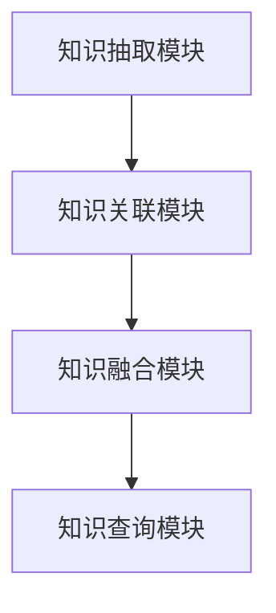
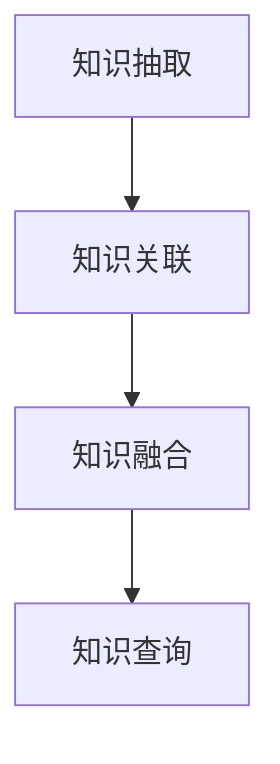
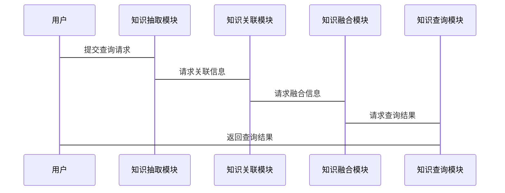

                 


# LLM驱动的AI Agent跨学科知识整合器

> 关键词：LLM、AI Agent、跨学科、知识整合、大语言模型  
> 摘要：本文深入探讨了大语言模型（LLM）驱动的AI Agent在跨学科知识整合中的应用。通过分析LLM与AI Agent的核心原理，结合实际案例和系统架构设计，展示了如何利用这些技术实现跨学科知识的有效整合。文章还详细讲解了相关的算法原理和项目实战，为读者提供了全面的技术视角。

---

# 第一部分: 背景介绍

## 第1章: LLM与AI Agent基本概念

### 1.1 LLM的基本概念

#### 1.1.1 大语言模型的定义与特点
大语言模型（Large Language Model, LLM）是基于深度学习技术构建的自然语言处理模型，具有以下特点：
- **大规模数据训练**：使用海量文本数据进行训练，具备广泛的知识覆盖。
- **多任务能力**：能够处理多种自然语言处理任务，如文本生成、问答系统、机器翻译等。
- **上下文理解**：通过上下文理解语义，生成符合逻辑的文本输出。

#### 1.1.2 LLM的核心技术原理
大语言模型的核心技术包括：
- **Transformer架构**：采用自注意力机制（Self-Attention）处理序列数据，捕捉文本中的长距离依赖关系。
- **预训练与微调**：通过预训练任务（如掩码语言模型任务）获取通用语言理解，再通过特定任务数据进行微调。

#### 1.1.3 LLM的应用场景与优势
- **文本生成**：用于内容创作、代码生成等。
- **问答系统**：提供智能问答服务。
- **机器翻译**：实现多种语言之间的互译。

### 1.2 AI Agent的基本概念

#### 1.2.1 AI Agent的定义与分类
AI Agent（人工智能代理）是一种能够感知环境并采取行动以实现目标的智能体。根据功能和应用场景，AI Agent可以分为：
- **简单反射型Agent**：基于预定义规则进行简单反应。
- **基于模型的反射型Agent**：通过内部模型理解和推理环境。
- **目标驱动型Agent**：根据目标选择最优行动。

#### 1.2.2 AI Agent的核心功能与特点
- **感知环境**：通过传感器或接口获取外部信息。
- **决策与推理**：基于感知信息做出决策。
- **执行行动**：通过执行器将决策转化为实际行动。

#### 1.2.3 AI Agent的应用领域与挑战
- **智能家居**：控制家电、管理能源。
- **自动驾驶**：实现车辆的自主驾驶。
- **智能助手**：提供个人助理服务。

### 1.3 LLM与AI Agent的结合

#### 1.3.1 LLM驱动AI Agent的必要性
大语言模型具备强大的文本理解和生成能力，能够为AI Agent提供自然语言处理的核心支持。

#### 1.3.2 LLM与AI Agent的协同工作模式
- **知识整合**：LLM作为知识库，为AI Agent提供跨学科的知识支持。
- **智能交互**：通过LLM实现自然语言的用户交互，提升用户体验。

#### 1.3.3 跨学科知识整合的实现路径
通过LLM驱动AI Agent，整合不同领域的知识，实现跨学科问题的高效解决。

### 1.4 本章小结
本章介绍了大语言模型和AI Agent的基本概念，并探讨了它们的结合方式及其在跨学科知识整合中的应用潜力。

---

## 第2章: 跨学科知识整合的背景与价值

### 2.1 跨学科知识整合的定义与意义

#### 2.1.1 跨学科知识整合的定义
跨学科知识整合是指将不同学科领域的知识有机结合起来，形成新的知识体系。

#### 2.1.2 跨学科整合的必要性与价值
- **解决复杂问题**：许多实际问题需要跨学科知识的协同解决。
- **推动创新**：跨学科整合能够激发新的研究方向和创新成果。

#### 2.1.3 跨学科整合的挑战与解决方案
- **知识孤岛问题**：不同领域之间的知识难以共享和整合。
- **多学科协同的复杂性**：需要协调不同领域的知识体系和术语。

### 2.2 LLM在跨学科整合中的作用

#### 2.2.1 LLM处理跨学科知识的能力
大语言模型能够理解和生成多种语言，具备处理跨学科文本的能力。

#### 2.2.2 LLM在知识整合中的优势
- **知识抽取**：从多领域文本中提取关键信息。
- **知识关联**：发现不同领域知识之间的联系。

#### 2.2.3 LLM驱动AI Agent的跨学科应用
通过LLM驱动的AI Agent，实现跨学科知识的动态整合与应用。

### 2.3 AI Agent在跨学科整合中的应用

#### 2.3.1 AI Agent作为知识整合工具的潜力
AI Agent可以作为跨学科知识整合的桥梁，连接不同领域的知识资源。

#### 2.3.2 AI Agent在不同学科中的具体应用
- **医疗领域**：整合医学和药学知识，辅助医生制定治疗方案。
- **教育领域**：为学生提供跨学科的学习资源。

#### 2.3.3 跨学科整合对AI Agent发展的推动作用
跨学科整合的需求推动了AI Agent技术的不断进步和创新。

### 2.4 本章小结
本章探讨了跨学科知识整合的背景和价值，并分析了LLM和AI Agent在其中的重要作用。

---

## 第3章: LLM驱动的AI Agent核心概念与联系

### 3.1 LLM驱动AI Agent的核心原理

#### 3.1.1 LLM作为知识库的构建与应用
- **知识库构建**：通过训练数据构建大规模的知识图谱。
- **知识检索**：基于用户输入，快速检索相关知识。

#### 3.1.2 AI Agent的决策机制
- **意图识别**：通过自然语言处理技术识别用户意图。
- **知识推理**：基于知识库进行推理，生成最优决策。

#### 3.1.3 跨学科知识整合的实现流程
- **知识抽取**：从不同领域的文本中提取关键信息。
- **知识关联**：建立知识之间的关联关系。
- **知识融合**：将关联的知识整合成统一的知识体系。

### 3.2 LLM与AI Agent的关系

#### 3.2.1 LLM作为AI Agent的核心模块
- **自然语言处理**：LLM为AI Agent提供文本理解和生成能力。
- **知识支持**：LLM作为知识库，为AI Agent提供跨学科的知识支持。

#### 3.2.2 AI Agent作为LLM的应用载体
- **任务执行**：AI Agent通过LLM实现具体任务的执行。
- **人机交互**：AI Agent通过自然语言与用户交互，提升用户体验。

#### 3.2.3 二者协同工作的优势
- **高效性**：LLM提供强大的知识处理能力，AI Agent提供灵活的执行能力。
- **智能性**：结合LLM的理解能力与AI Agent的执行能力，实现更智能的跨学科知识整合。

### 3.3 跨学科知识整合的核心要素

#### 3.3.1 知识抽取
从多领域的文本数据中提取关键信息，如实体识别、关系抽取。

#### 3.3.2 知识关联
发现不同领域知识之间的关联，建立知识图谱。

#### 3.3.3 知识融合
将关联的知识整合成统一的知识体系，支持跨学科问题的解决。

### 3.4 本章小结
本章详细讲解了LLM驱动AI Agent的核心原理，并分析了跨学科知识整合的核心要素。

---

## 第4章: 跨学科知识整合的算法原理

### 4.1 LLM的算法原理

#### 4.1.1 Transformer模型的结构与特点
- **编码器**：通过自注意力机制生成文本的语义表示。
- **解码器**：基于编码器输出生成目标文本。

#### 4.1.2 自注意力机制的数学公式
自注意力机制的计算公式如下：
$$
\text{Attention}(Q, K, V) = \text{softmax}\left(\frac{QK^T}{\sqrt{d_k}}\right)V
$$
其中，$Q$、$K$、$V$分别是查询、键、值向量，$d_k$是向量的维度。

#### 4.1.3 LLM的训练过程
- **预训练**：使用掩码语言模型任务训练模型。
- **微调**：在特定任务数据上进行微调。

### 4.2 AI Agent的算法原理

#### 4.2.1 意图识别的算法
- **基于词袋模型**：统计文本中关键词的出现频率。
- **基于深度学习**：使用卷积神经网络或循环神经网络进行意图分类。

#### 4.2.2 知识推理的算法
- **基于规则的推理**：根据预定义的规则进行推理。
- **基于知识图谱的推理**：基于知识图谱进行路径推理。

#### 4.2.3 决策机制的算法
- **基于Q-Learning的决策**：通过Q值函数选择最优行动。
- **基于强化学习的决策**：通过强化学习优化决策策略。

### 4.3 跨学科知识整合的算法实现

#### 4.3.1 知识抽取的算法
- **实体识别**：使用命名实体识别（NER）技术提取实体。
- **关系抽取**：通过关系抽取模型识别实体之间的关系。

#### 4.3.2 知识关联的算法
- **基于图的关联**：构建知识图谱，通过图结构表示知识关联。
- **基于向量的关联**：通过向量空间模型计算知识之间的相似性。

#### 4.3.3 知识融合的算法
- **基于规则的融合**：根据预定义的规则进行知识融合。
- **基于机器学习的融合**：使用机器学习模型自动学习知识融合的规则。

### 4.4 本章小结
本章详细讲解了跨学科知识整合的算法原理，包括LLM和AI Agent的核心算法，以及知识抽取、关联和融合的具体实现方法。

---

## 第5章: 跨学科知识整合的系统分析与架构设计

### 5.1 问题场景介绍

#### 5.1.1 背景描述
假设我们需要构建一个跨学科知识整合系统，整合医学、计算机科学、材料科学等多个领域的知识，为研究人员提供综合性的知识支持。

#### 5.1.2 问题描述
现有知识库多局限于单一领域，难以满足跨学科研究的需求。如何整合多领域的知识，构建统一的知识体系？

### 5.2 系统功能设计

#### 5.2.1 领域模型设计
- **知识抽取模块**：从多领域文本中提取实体、关系等信息。
- **知识关联模块**：建立知识之间的关联关系。
- **知识融合模块**：将关联的知识整合成统一的知识体系。
- **知识查询模块**：支持用户进行跨学科的知识查询。

#### 5.2.2 系统功能设计图


### 5.3 系统架构设计

#### 5.3.1 系统架构图


#### 5.3.2 核心模块设计
- **知识抽取模块**：负责从多领域文本中提取关键信息。
- **知识关联模块**：建立知识之间的关联关系。
- **知识融合模块**：将关联的知识整合成统一的知识体系。
- **知识查询模块**：支持用户进行跨学科的知识查询。

#### 5.3.3 接口设计
- **API接口**：提供RESTful API，供外部系统调用。
- **数据接口**：支持多种数据格式的输入输出。

### 5.4 系统交互设计

#### 5.4.1 交互流程图


### 5.5 本章小结
本章详细分析了跨学科知识整合系统的架构设计，包括功能设计、系统架构和交互设计。

---

## 第6章: 跨学科知识整合的项目实战

### 6.1 环境安装与配置

#### 6.1.1 安装Python环境
```bash
python --version
pip install --upgrade pip
```

#### 6.1.2 安装必要的库
```bash
pip install numpy
pip install transformers
pip install torch
```

### 6.2 系统核心实现源代码

#### 6.2.1 知识抽取模块
```python
from transformers import pipeline

ner = pipeline("ner")
def extract_entities(text):
    return ner(text)
```

#### 6.2.2 知识关联模块
```python
from transformers import AutoTokenizer, AutoModelForMaskedLM

tokenizer = AutoTokenizer.from_pretrained("bert-base-uncased")
model = AutoModelForMaskedLM.from_pretrained("bert-base-uncased")
```

#### 6.2.3 知识融合模块
```python
from kgtoolkit import KnowledgeGraph

kg = KnowledgeGraph()
kg.add_entity("Drug", "Drug entity")
kg.add_relation("treats", "Drug", "Disease")
```

#### 6.2.4 知识查询模块
```python
def query_knowledge(query):
    # 实现知识查询逻辑
    pass
```

### 6.3 代码实现与解读

#### 6.3.1 知识抽取模块实现
- 使用`transformers`库中的`pipeline`进行实体识别。

#### 6.3.2 知识关联模块实现
- 使用BERT模型进行关系抽取和文本相似度计算。

#### 6.3.3 知识融合模块实现
- 使用知识图谱工具构建统一的知识体系。

#### 6.3.4 知识查询模块实现
- 根据用户查询需求，从知识图谱中检索相关知识。

### 6.4 实际案例分析

#### 6.4.1 案例背景
假设我们需要整合医学和计算机科学领域的知识，构建一个跨学科的知识库。

#### 6.4.2 案例分析
- **知识抽取**：从医学文献中提取药物和疾病实体。
- **知识关联**：建立药物与疾病的治疗关系。
- **知识融合**：将药物与疾病的关系整合到知识图谱中。
- **知识查询**：用户可以查询某种药物是否用于治疗某种疾病。

### 6.5 项目小结
本章通过实际案例展示了跨学科知识整合的实现过程，包括环境配置、代码实现和案例分析。

---

## 第7章: 总结与展望

### 7.1 总结

#### 7.1.1 核心内容回顾
- LLM驱动的AI Agent在跨学科知识整合中的应用。
- 系统架构设计和算法实现。

#### 7.1.2 应用价值总结
- 提升跨学科研究的效率。
- 促进多领域知识的协同创新。

### 7.2 未来展望

#### 7.2.1 技术发展方向
- 提升模型的跨学科知识处理能力。
- 优化AI Agent的决策算法。

#### 7.2.2 应用领域拓展
- 在教育、医疗、科研等领域进一步推广。

### 7.3 注意事项与建议

#### 7.3.1 注意事项
- 数据隐私保护。
- 知识整合的准确性。

#### 7.3.2 实践建议
- 结合具体应用场景选择合适的模型和算法。
- 定期更新知识库，保持知识的时效性。

### 7.4 本章小结
本章总结了全文的主要内容，并展望了未来的技术发展方向和应用前景。

---

# 结语

通过本文的详细讲解，我们深入探讨了LLM驱动的AI Agent在跨学科知识整合中的应用。从核心概念到系统架构，从算法原理到项目实战，我们全面分析了实现跨学科知识整合的各个方面。希望本文能够为相关领域的研究和实践提供有价值的参考。未来，随着技术的不断进步，跨学科知识整合将发挥更大的作用，推动各领域的创新发展。

