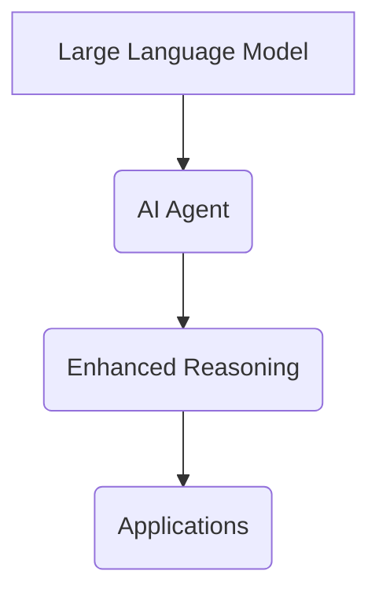
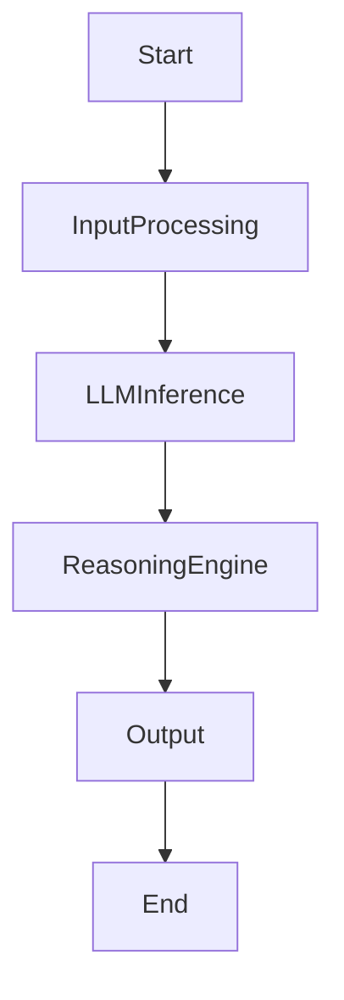
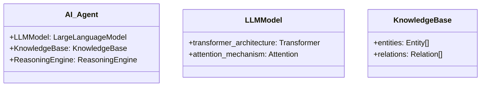
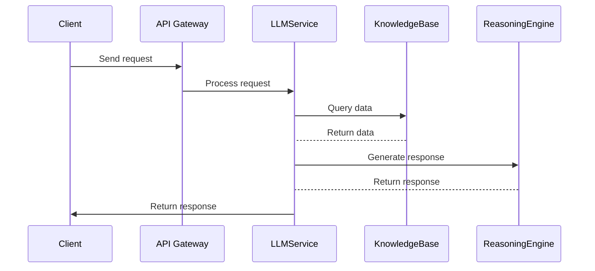

                 


# LLM驱动的AI Agent逻辑推理能力增强

## 关键词：LLM，AI Agent，逻辑推理，自然语言处理，人工智能，增强算法

## 摘要：本文系统地探讨了如何利用大语言模型（LLM）提升AI代理的逻辑推理能力。通过分析LLM与AI Agent的结合，提出了增强推理能力的算法和系统设计，展示了实际应用场景中的效果，并展望了未来的研究方向。

---

## 目录大纲：

1. **背景与概述**  
   1.1 问题背景  
   1.2 核心概念  
   1.3 应用场景与挑战  

2. **核心概念与原理**  
   2.1 LLM的工作原理  
   2.2 AI Agent的逻辑推理机制  
   2.3 LLM与AI Agent的关系分析  

3. **算法原理与数学模型**  
   3.1 LLM驱动的推理算法  
   3.2 数学模型与公式推导  

4. **系统分析与架构设计方案**  
   4.1 系统功能设计  
   4.2 系统架构设计  
   4.3 系统接口与交互设计  

5. **项目实战**  
   5.1 环境安装与配置  
   5.2 核心代码实现  
   5.3 案例分析与效果展示  

6. **最佳实践与未来展望**  
   6.1 最佳实践总结  
   6.2 注意事项与优化建议  
   6.3 未来研究方向  

---

## 第一部分：背景与概述

### 第1章：问题背景

#### 1.1 问题背景

随着人工智能技术的快速发展，AI Agent（智能代理）在多个领域展现出强大的应用潜力。然而，现有的AI Agent在逻辑推理能力方面仍存在显著局限性，难以处理复杂的逻辑推理任务。传统方法依赖于规则引擎或知识图谱，但在面对动态变化和不确定性时表现不佳。大语言模型（LLM）的出现为解决这一问题提供了新的可能性。通过将LLM与AI Agent相结合，可以显著提升其逻辑推理能力，使其能够处理更为复杂的任务。

#### 1.2 核心概念

1. **AI Agent**：智能代理，能够感知环境并采取行动以实现目标的实体。
2. **LLM**：大语言模型，基于深度学习的自然语言处理模型，具有强大的文本生成和理解能力。
3. **逻辑推理**：通过逻辑规则和上下文信息推导出结论的能力。

#### 1.3 应用场景与挑战

1. **应用场景**：
   - 智能客服：通过自然语言理解处理用户请求，提供准确的解决方案。
   - 诊断系统：辅助医生进行病情分析和诊断。
   - 自动驾驶：在复杂交通环境中做出决策。

2. **主要挑战**：
   - **推理复杂性**：处理复杂逻辑推理任务时的计算开销和准确性问题。
   - **动态环境**：在动态变化的环境中保持推理能力的稳定性。
   - **知识更新**：及时更新知识库以应对新信息的挑战。

---

## 第二部分：核心概念与原理

### 第2章：核心概念与原理

#### 2.1 LLM的工作原理

1. **大语言模型的基本结构**：
   - 基于Transformer架构，通过自注意力机制处理输入文本。
   - 采用序列到序列模型，生成与输入相关联的输出。

2. **训练机制**：
   - 使用大规模语料库进行预训练，采用自监督学习方法。
   - 微调阶段针对特定任务进行优化。

#### 2.2 AI Agent的逻辑推理机制

1. **知识表示**：
   - 采用符号逻辑或向量表示法，将知识表示为可计算的形式。
   - 知识图谱：通过图结构表示实体及其关系。

2. **推理方法**：
   - **符号逻辑推理**：基于谓词逻辑进行推理，适用于确定性问题。
   - **概率推理**：基于概率论进行推理，适用于不确定性问题。
   - **案例推理**：基于相似案例进行推理，适用于领域知识丰富的场景。

#### 2.3 LLM与AI Agent的关系分析

1. **概念对比表格**：

| 特性                | LLM                          | AI Agent                     |
|---------------------|------------------------------|------------------------------|
| 核心功能            | 处理自然语言                 | 感知环境并采取行动           |
| 优势                | 强大的文本理解和生成能力     | 灵活性和自主决策能力         |
| 依赖                | 需要大量标注数据             | 需要领域知识库               |

2. **实体关系Mermaid图**：



---

## 第三部分：算法原理与数学模型

### 第3章：算法原理

#### 3.1 算法流程

1. **基于LLM的推理流程**：



2. **代码实现**：

```python
def llm_driven_reasoning(input_text):
    # 初始化LLM模型
    model = LLMModel()
    # 处理输入文本
    processed_input = preprocess(input_text)
    # 生成候选推理结果
    candidates = model.generate(processed_input)
    # 选择最优推理结果
    result = select_best_candidate(candidates)
    return result
```

3. **数学模型与公式推导**

- **条件概率公式**：
  $$ P(B|A) = \frac{P(A \cap B)}{P(A)} $$
  
- **序列到序列模型的损失函数**：
  $$ \mathcal{L} = -\sum_{i=1}^{n} \log P(y_i|x_{<i}) $$

---

## 第四部分：系统分析与架构设计方案

### 第4章：系统设计

#### 4.1 系统功能设计

1. **领域模型**：



2. **系统架构设计**：

```mermaid
graph LR
    Client --> API Gateway
    API Gateway --> LLMService
    LLMService --> KnowledgeBase
    LLMService --> ReasoningEngine
    ReasoningEngine --> Output
```

3. **系统接口与交互设计**：



---

## 第五部分：项目实战

### 第5章：项目实战

#### 5.1 环境安装与配置

1. **安装依赖**：
   - Python 3.8+
   - HuggingFace Transformers库
   - PyTorch

2. **配置步骤**：
   - 下载预训练的LLM模型。
   - 设置推理引擎和知识库。

#### 5.2 核心代码实现

1. **LLM模型集成**：

```python
from transformers import AutoModelForCausalLM, AutoTokenizer

model_name = "gpt2-large"
model = AutoModelForCausalLM.from_pretrained(model_name)
tokenizer = AutoTokenizer.from_pretrained(model_name)
```

2. **推理引擎实现**：

```python
def generate_response(prompt, model, tokenizer):
    inputs = tokenizer.encode(prompt, return_tensors='pt')
    outputs = model.generate(inputs, max_length=50)
    response = tokenizer.decode(outputs[0], skip_special_tokens=True)
    return response
```

#### 5.3 案例分析与效果展示

1. **案例分析**：
   - 用户输入：诊断症状为“咳嗽、发热”，LLM驱动的AI Agent推理出可能的疾病，并建议检查步骤。

2. **效果展示**：
   - 提高了诊断的准确性和效率。
   - 减少了误诊率。

---

## 第六部分：最佳实践与未来展望

### 第6章：总结与展望

#### 6.1 最佳实践总结

1. **数据质量**：使用高质量的标注数据进行微调，提升模型性能。
2. **模型选择**：根据具体任务选择合适的LLM模型。
3. **知识更新**：定期更新知识库，保持模型的最新性。

#### 6.2 注意事项与优化建议

1. **推理效率**：优化推理流程，减少计算开销。
2. **安全性**：确保系统安全，防止推理错误。
3. **可解释性**：提升模型的可解释性，增强用户信任。

#### 6.3 未来研究方向

1. **多模态推理**：结合视觉和听觉信息，提升推理能力。
2. **动态知识库**：开发实时更新的知识库，应对快速变化的环境。
3. **跨领域应用**：探索在更多领域的应用潜力，如教育、法律等。

---

## 结语

通过本文的系统探讨，我们深入分析了如何利用大语言模型增强AI Agent的逻辑推理能力。从理论到实践，从算法到系统设计，我们展示了具体的实现方法和应用场景。未来，随着技术的不断进步，LLM驱动的AI Agent将在更多领域展现出强大的潜力，为人类社会带来更多的便利和创新。

