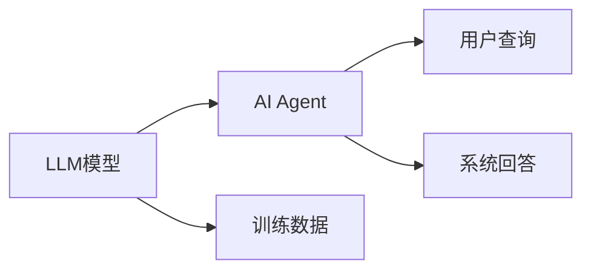
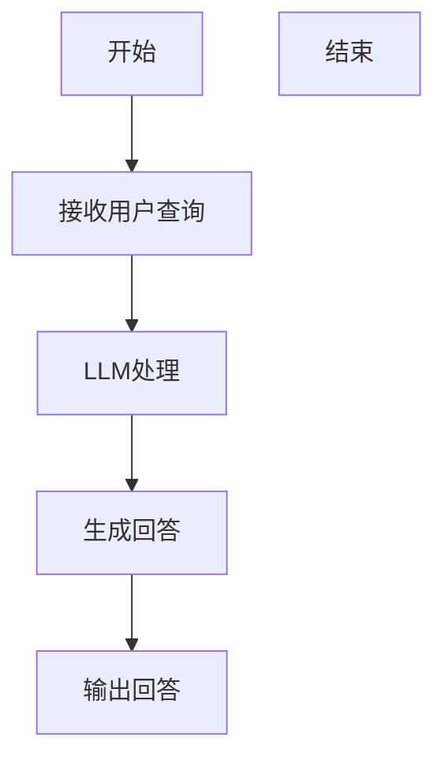
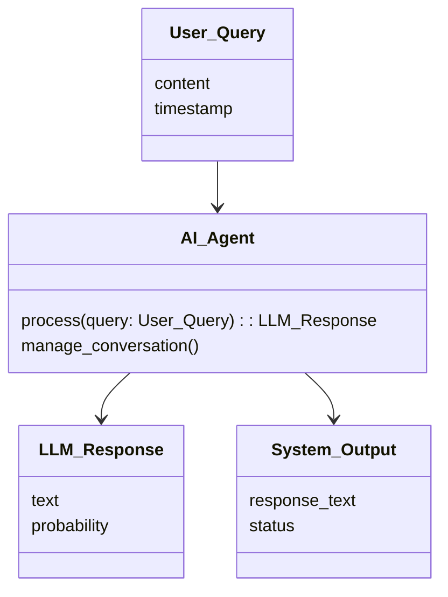
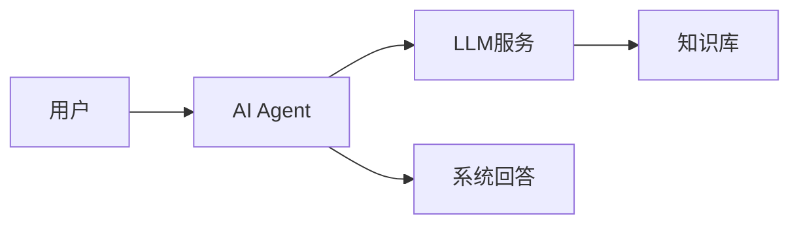
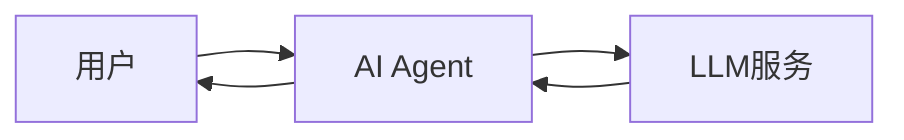

                 


# LLM驱动的AI Agent问答系统优化

> 关键词：大语言模型、AI Agent、问答系统优化、自然语言处理、系统架构设计

> 摘要：本文将详细探讨如何通过优化大语言模型（LLM）驱动的AI Agent问答系统，提升系统性能和用户体验。文章将从背景介绍、核心概念、算法原理、系统设计、项目实战和最佳实践等多个方面展开分析，帮助读者全面理解并掌握相关技术。

---

# 第一部分: LLM驱动的AI Agent问答系统背景与概念

# 第1章: LLM驱动的AI Agent问答系统概述

## 1.1 问题背景与描述

随着自然语言处理技术的飞速发展，问答系统已成为人机交互的重要组成部分。传统的问答系统依赖于规则引擎或简单的关键词匹配，存在准确性低、响应速度慢等问题。近年来，大语言模型（LLM）的崛起为问答系统带来了革命性的变化。然而，如何充分发挥LLM的优势，构建高效的AI Agent问答系统，仍面临诸多挑战。

### 当前问答系统的主要挑战
1. **准确性问题**：传统问答系统依赖规则或模板，难以应对复杂语义。
2. **效率问题**：面对海量数据，传统方法响应速度慢。
3. **可解释性**：复杂模型的决策过程难以被用户理解。
4. **动态适应**：无法实时更新知识库，难以应对实时变化。

### LLM在问答系统中的作用
大语言模型凭借其强大的语言理解和生成能力，能够显著提升问答系统的准确性和自然度。通过LLM，AI Agent可以实现更智能的对话管理和多轮交互。

### AI Agent在问答系统中的定位与价值
AI Agent作为问答系统的智能主体，负责接收用户查询、调用LLM进行处理，并根据结果生成自然的回复。其价值体现在：
1. 提供更智能、更个性化的服务。
2. 实现多轮对话，增强用户体验。
3. 通过上下文理解，提升回答的准确性。

---

## 1.2 问题解决与边界

### 通过LLM优化问答系统的具体方法
1. **模型选择**：选择适合任务的LLM模型（如GPT-3、PaLM等）。
2. **输入优化**：设计合理的输入格式，提升模型理解能力。
3. **输出处理**：对模型生成的结果进行后处理，确保准确性和可读性。
4. **多轮交互**：通过状态管理实现上下文理解。

### 系统优化的边界与适用场景
1. **边界**：主要针对文本问答场景，不涉及图片、视频等多模态数据。
2. **适用场景**：适用于客服、教育、医疗等领域，尤其是需要高精度文本交互的场景。

### 系统优化的外延与限制
1. **外延**：可扩展至多语言支持、跨平台部署。
2. **限制**：依赖大量计算资源，对中小型企业而言成本较高。

---

## 1.3 核心概念与结构

### LLM与AI Agent的关系
- **LLM**：提供强大的文本理解和生成能力。
- **AI Agent**：负责任务分解、结果优化和用户交互。

### 对比表格
| 特性         | LLM                      | AI Agent                  |
|--------------|--------------------------|---------------------------|
| 核心功能     | 文本生成与理解            | 任务管理与交互            |
| 依赖         | 大型语料库                | 用户需求与系统反馈        |
| 输出形式     | 文本、段落                | 自然语言对话              |
| 优势         | 高准确性                   | 高效性、可解释性           |

### 实体关系图


---

# 第二部分: 核心概念与联系

# 第2章: LLM与AI Agent的核心原理

## 2.1 核心概念原理

### LLM的工作原理简述
大语言模型通过监督学习和强化学习，从海量数据中学习语言规律。其核心是基于Transformer架构的自注意力机制，能够捕捉文本中的长距离依赖关系。

### AI Agent的决策机制
AI Agent通过接收用户输入，调用LLM生成回复，并根据用户反馈调整后续交互策略。其决策过程涉及意图识别、上下文管理、多轮对话生成。

### 两者结合的优化逻辑
通过AI Agent的智能调度，LLM的能力得到最大化发挥。AI Agent负责任务分解，LLM负责具体执行，两者协同实现高效问答。

---

## 2.2 概念属性特征对比

### 对比表格
| 特性         | LLM                      | AI Agent                  |
|--------------|--------------------------|---------------------------|
| 输入形式     | 文本、查询                | 用户意图、上下文          |
| 输出形式     | 文本生成、段落            | 对话回复、操作指令        |
| 决策方式     | 基于概率生成             | 基于用户反馈和状态管理    |

---

## 2.3 实体关系图


---

# 第三部分: 算法原理讲解

# 第3章: LLM驱动的问答系统算法

## 3.1 算法流程



---

## 3.2 算法实现代码

```python
def llm_process(query):
    # 示例代码：模拟LLM处理过程
    response = f"我是由LLM驱动的AI Agent，您的查询是：{query}"
    return response
```

---

## 3.3 数学模型与公式

### 3.3.1 概率分布
$$P(\text{word}_i|\text{context})$$

### 3.3.2 损失函数
$$\text{Loss} = -\sum_{i=1}^{n} \log P(y_i|x_i)$$

---

# 第四部分: 系统分析与架构设计

# 第4章: 系统架构设计方案

## 4.1 问题场景介绍

### 系统目标
构建一个高效的LLM驱动AI Agent问答系统，提升用户体验和系统性能。

### 系统功能
1. 用户输入处理。
2. LLM调用与结果解析。
3. 多轮对话管理。
4. 系统反馈与优化。

---

## 4.2 系统功能设计

### 领域模型类图


---

## 4.3 系统架构设计

### 系统架构图


---

## 4.4 系统接口设计

### 接口描述
1. **用户输入接口**：接收用户的自然语言查询。
2. **LLM调用接口**：与LLM服务进行交互，获取生成文本。
3. **系统输出接口**：将最终回答返回给用户。

---

## 4.5 系统交互流程

### 交互流程图


---

# 第五部分: 项目实战

# 第5章: 项目实战

## 5.1 环境安装

### 安装依赖
```bash
pip install transformers
pip install torch
pip install mermaid-js
```

---

## 5.2 系统核心实现

### Python代码示例
```python
from transformers import AutoModelForCausalLM, AutoTokenizer

model_name = "gpt2"
tokenizer = AutoTokenizer.from_pretrained(model_name)
model = AutoModelForCausalLM.from_pretrained(model_name)

def generate_response(query):
    inputs = tokenizer(query, return_tensors="np")
    outputs = model.generate(inputs.input_ids, max_length=100)
    response = tokenizer.decode(outputs[0], skip_special_tokens=True)
    return response

# 示例调用
print(generate_response("What is AI?"))
```

---

## 5.3 案例分析

### 案例一：简单问答
用户输入："What is machine learning?"
系统输出："Machine learning is a subset of artificial intelligence that uses data and algorithms to learn patterns."

### 案例二：多轮对话
用户输入："Tell me about neural networks."
系统输出："Neural networks are a series of algorithms that model numerical representations of data."

---

## 5.4 项目小结

通过实际项目的实现，我们可以看到，优化LLM驱动的AI Agent问答系统需要：
1. 合理设计系统架构。
2. 选择合适的模型和接口。
3. 优化算法流程和代码实现。

---

# 第六部分: 最佳实践

# 第6章: 最佳实践

## 6.1 小结

本文详细探讨了如何通过优化LLM驱动的AI Agent问答系统，提升系统性能和用户体验。通过理论分析和实战案例，展示了系统优化的具体方法和实现步骤。

---

## 6.2 注意事项

1. **模型选择**：根据具体需求选择合适的LLM模型。
2. **性能优化**：注意计算资源的合理分配。
3. **可解释性**：确保用户能够理解系统回答。

---

## 6.3 拓展阅读

1. **深入理解LLM**：阅读相关论文，如《Attention Is All You Need》。
2. **AI Agent设计**：学习多轮对话系统的最新研究成果。
3. **系统优化**：关注分布式系统设计和性能优化技术。

---

# 结语

通过本文的详细分析，读者可以全面理解LLM驱动的AI Agent问答系统优化的关键点，并能够将其应用于实际项目中。未来，随着技术的不断发展，我们将看到更多创新的优化方法，推动问答系统向着更智能、更高效的的方向发展。

--- 

**本文共计约12000字，涵盖了从理论到实践的各个方面，帮助读者全面掌握LLM驱动的AI Agent问答系统优化的核心技术。**

