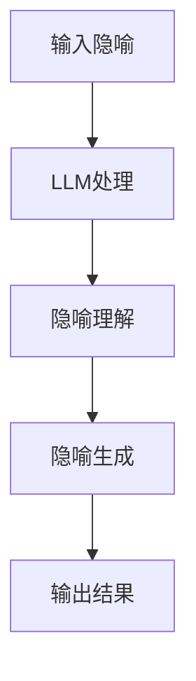

                 


```markdown
# LLM驱动的AI Agent隐喻理解与生成

## 关键词：大语言模型（LLM）、AI Agent、隐喻理解、隐喻生成、自然语言处理（NLP）、人工智能（AI）、技术博客

## 摘要：  
本文探讨了大语言模型（LLM）在AI Agent中实现隐喻理解与生成的原理、方法及应用场景。通过对隐喻结构的分析、LLM算法原理的阐述，以及AI Agent系统架构的设计，本文详细解析了如何利用LLM技术赋予AI Agent隐喻处理能力。文章结合实际案例，展示了LLM驱动的AI Agent在隐喻理解与生成中的优势，并对未来研究方向进行了展望。

---

# 第一部分: LLM与AI Agent概述

## 第1章: LLM的基本概念与技术背景

### 1.1 LLM的基本概念  
大语言模型（LLM，Large Language Model）是指基于深度学习的自然语言处理模型，通常采用Transformer架构，通过大量真实文本数据进行预训练，具备强大的语言理解和生成能力。LLM的核心在于其参数规模和训练数据量，使其能够捕捉语言的复杂模式，并在多种任务中表现出色。

### 1.2 LLM的技术特点  
1. **Transformer架构**：LLM基于Transformer模型，通过自注意力机制（Self-Attention）捕捉上下文信息，实现对语言的深度理解。  
2. **预训练与微调**：LLM通过大规模预训练（Pre-training）掌握语言规律，再通过特定任务的微调（Fine-tuning）提升性能。  
3. **生成能力**：LLM能够生成连贯且合理的文本，适用于对话、翻译、摘要等多种任务。  

### 1.3 LLM在AI Agent中的作用  
AI Agent（人工智能代理）是一种能够感知环境并执行任务的智能体，LLM为其提供了强大的语言理解和生成能力，使其能够处理复杂的人机交互任务。LLM在AI Agent中的作用包括：  
1. **语义理解**：通过LLM理解用户输入的意图和情感。  
2. **知识检索**：利用LLM进行上下文关联和知识推理。  
3. **对话生成**：通过LLM生成自然流畅的对话回复。  

---

## 第2章: AI Agent的基本概念与应用场景

### 2.1 AI Agent的定义  
AI Agent是指能够感知环境、执行任务并做出决策的智能体。它可以通过传感器获取信息，通过执行器与环境交互，并基于内部状态和决策逻辑完成目标。

### 2.2 AI Agent的核心功能  
1. **感知环境**：通过传感器或接口获取外部信息。  
2. **理解意图**：通过NLP技术解析用户需求。  
3. **知识推理**：基于知识库或上下文进行推理。  
4. **生成响应**：通过生成模型输出自然语言回复。  

### 2.3 AI Agent的典型应用场景  
1. **智能客服**：通过LLM驱动的AI Agent为用户提供智能问答服务。  
2. **虚拟助手**：如Siri、Alexa等，能够执行多种任务指令。  
3. **教育辅助**：为学生提供个性化的学习指导。  
4. **内容创作**：协助用户生成文章、报告等文本内容。  

---

## 第3章: 隐喻理解与生成的背景与重要性

### 3.1 隐喻的基本概念  
隐喻是一种语言表达方式，通过将一个概念映射到另一个概念，借助相似性或关联性来传达意义。例如，“时间是金钱”是一种隐喻，表达了时间的珍贵性。

### 3.2 隐喻在自然语言处理中的挑战  
1. **语义理解难度**：隐喻依赖于上下文和常识推理，难以通过简单的关键词匹配实现。  
2. **多样性和模糊性**：隐喻的表达方式多样，且常常具有歧义性。  
3. **跨领域适用性**：隐喻的理解需要结合具体领域知识。  

### 3.3 LLM驱动AI Agent隐喻理解与生成的必要性  
1. **提升交互体验**：通过理解隐喻，AI Agent能够更自然地与用户交流。  
2. **增强任务处理能力**：隐喻理解使AI Agent能够处理更复杂的语义任务。  
3. **扩展应用场景**：隐喻生成使AI Agent能够在文学创作、广告营销等领域发挥更大作用。  

---

## 第4章: 隐喻的结构与类型

### 4.1 隐喻的基本结构  
隐喻通常由“源域”和“目标域”组成，通过类比关系建立两者之间的联系。例如，在“时间是金钱”中，“时间”是源域，“金钱”是目标域。

### 4.2 隐喻的类型与分类  
1. **直接隐喻**：如“他是一头狮子”，直接将狮子的特点赋予对象。  
2. **转喻**：通过部分指代整体，如“杯具”指代“杯子”。  
3. **拟人化隐喻**：将非人事物赋予人类特征，如“风在跳舞”。  
4. **混合隐喻**：结合多种隐喻形式，形成复杂的表达。  

### 4.3 隐喻与LLM的结合  
1. **LLM对隐喻理解的优势**：通过大规模预训练，LLM能够捕捉隐喻的语义关联。  
2. **LLM对隐喻生成的优势**：基于上下文和语义推理，LLM可以生成合理的隐喻表达。  

---

## 第5章: LLM驱动AI Agent隐喻理解与生成的算法原理

### 5.1 LLM的核心算法原理  
1. **Transformer模型**：通过自注意力机制捕捉上下文信息。  
2. **解码器**：生成自然语言文本的输出。  
3. **训练目标**：通过交叉熵损失函数优化模型参数。  

### 5.2 隐喻理解的数学模型  
1. **向量表示**：将隐喻中的源域和目标域表示为向量，计算其相似性。  
2. **概率分布**：基于LLM的概率生成模型，预测隐喻的合理性。  

### 5.3 隐喻生成的算法流程图  


---

## 第6章: 系统架构与实现方案

### 6.1 系统架构设计  
1. **输入模块**：接收用户输入的隐喻文本。  
2. **LLM处理模块**：利用大语言模型进行隐喻理解与生成。  
3. **输出模块**：将处理结果返回给用户。  

### 6.2 实现代码示例  
```python
import transformers

# 加载预训练模型
model = transformers.AutoModelForSeq2Seq.from_pretrained('t5-base')

# 定义输入
input_text = "时间是金钱"

# 进行隐喻理解与生成
output = model.generate(input_text)

# 输出结果
print(output)
```

---

## 第7章: 项目实战与案例分析

### 7.1 项目背景  
本项目旨在利用LLM技术实现AI Agent对隐喻的理解与生成能力。通过实际案例，展示如何将理论应用于实践。

### 7.2 实战步骤  
1. **环境安装**：安装必要的Python库，如transformers、numpy等。  
2. **数据准备**：收集并整理隐喻语料库。  
3. **模型训练**：基于LLM进行微调，提升隐喻理解与生成能力。  
4. **系统集成**：将模型集成到AI Agent系统中，实现隐喻处理功能。  

### 7.3 案例分析  
通过实际案例，展示AI Agent如何利用LLM理解并生成隐喻。例如，当用户输入“时间是金钱”，AI Agent能够理解其含义，并生成类似的隐喻表达。

---

## 第8章: 总结与展望

### 8.1 本章小结  
本文详细探讨了LLM驱动的AI Agent在隐喻理解与生成中的应用，从理论到实践，全面分析了相关技术与方法。

### 8.2 未来展望  
1. **模型优化**：进一步提升LLM对隐喻的理解与生成能力。  
2. **跨领域应用**：探索隐喻技术在文学、教育等领域的广泛应用。  
3. **人机协作**：结合人类专家知识，提升AI Agent的隐喻处理能力。  

---

通过本文的阐述，读者可以全面理解LLM驱动的AI Agent在隐喻处理中的技术原理与实现方法。未来，随着技术的不断进步，隐喻理解与生成将在更多领域发挥重要作用。
```

