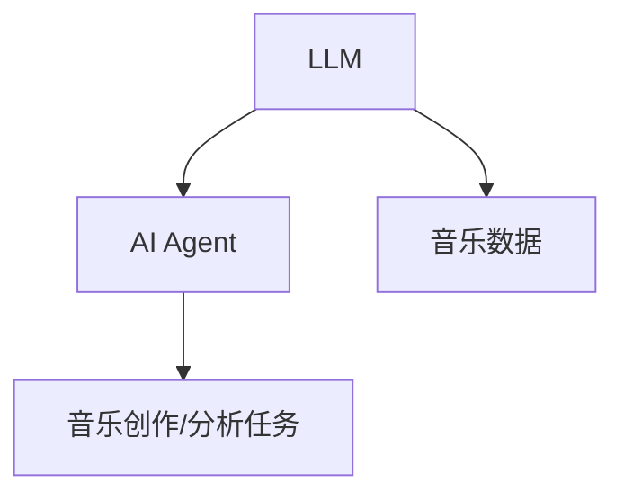
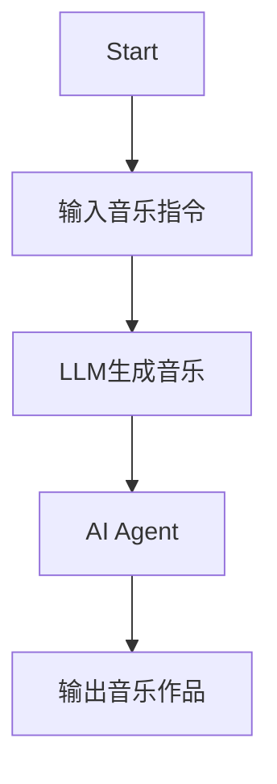

                 

# LLM驱动的AI Agent音乐创作与分析

> 关键词：LLM, AI Agent, 音乐创作, 音乐分析, 大型语言模型, AI驱动

> 摘要：本文探讨了利用大型语言模型（LLM）驱动AI代理在音乐创作与分析中的应用，分析了LLM和AI Agent的核心原理，详细阐述了其在音乐创作与分析中的算法实现、系统架构设计及实际案例，并展望了未来的发展趋势。

---

# 第一部分: LLM驱动的AI Agent音乐创作与分析基础

## 第1章: 背景介绍

### 1.1 LLM与AI Agent的背景

#### 1.1.1 大型语言模型（LLM）的定义与特点
- **定义**：大型语言模型（LLM）是基于深度学习的自然语言处理模型，如GPT系列、BERT系列等。这些模型通过大量数据的预训练，能够生成与理解人类语言。
- **特点**：
  - **大规模训练数据**：通常使用海量文本数据进行预训练。
  - **多任务能力**：通过微调可以应用于文本生成、问答系统、机器翻译等多种任务。
  - **上下文理解**：能够理解上下文，并生成连贯的文本。

#### 1.1.2 AI Agent的基本概念
- **定义**：AI Agent（人工智能代理）是指能够感知环境并采取行动以实现目标的智能体。它可以是一个软件程序，能够执行任务、解决问题或与用户交互。
- **特点**：
  - **自主性**：能够在没有外部干预的情况下运行。
  - **反应性**：能够根据环境变化调整行为。
  - **目标导向**：所有行动都是为了实现特定目标。

#### 1.1.3 LLM驱动AI Agent的音乐创作与分析背景
- **背景**：随着AI技术的发展，音乐创作与分析逐渐从传统的手工创作转向智能化、自动化。LLM和AI Agent的结合为音乐创作与分析提供了新的可能性。
- **目标**：通过LLM驱动的AI Agent，实现音乐创作的自动化和音乐分析的智能化，帮助音乐人更高效地创作音乐，同时提供深度的音乐分析服务。

### 1.2 音乐创作与分析的AI驱动趋势

#### 1.2.1 音乐创作的数字化转型
- **传统音乐创作**：依赖于音乐人的灵感和技能，创作过程较为缓慢且依赖人工。
- **数字化创作工具**：如MIDI软件、DAW（数字音频工作站）等工具的出现，使音乐创作更加便捷。
- **AI驱动创作**：通过AI技术，音乐创作可以实现自动化，如自动生成旋律、和弦进行等。

#### 1.2.2 AI在音乐分析中的应用潜力
- **音乐特征提取**：通过AI技术提取音乐的音调、节奏、情感等特征。
- **音乐情感分析**：分析音乐的情感倾向，如快乐、悲伤等。
- **音乐风格识别**：识别音乐的风格，如古典、摇滚、流行等。

#### 1.2.3 LLM在音乐创作与分析中的独特优势
- **文本生成能力**：LLM可以生成歌词、乐谱等文本内容。
- **多模态处理能力**：能够结合文本、音频等多种模态信息，进行综合分析。
- **上下文理解能力**：能够理解音乐创作的上下文，生成连贯的音乐内容。

### 1.3 本章小结
本章介绍了LLM和AI Agent的基本概念及其在音乐创作与分析中的应用背景，探讨了AI驱动音乐创作与分析的潜力和趋势，为后续章节的深入讨论奠定了基础。

---

## 第2章: LLM与AI Agent的核心概念与联系

### 2.1 LLM的核心原理

#### 2.1.1 LLM的训练机制
- **预训练**：使用大量通用文本数据进行无监督学习，目标是让模型预测文本中的下一个词。
- **微调**：针对特定任务（如音乐创作）进行有监督学习，优化模型性能。

#### 2.1.2 LLM的生成机制
- **自回归生成**：基于前一个词生成下一个词，逐步生成完整的文本或音乐内容。
- **概率生成模型**：通过概率分布生成内容，模型会根据上下文计算每个可能的下一个词的概率。

#### 2.1.3 LLM的音乐创作能力
- **歌词生成**：生成符合音乐风格和主题的歌词。
- **旋律生成**：基于给定的和弦进行生成旋律。
- **音乐风格转换**：将一种风格的音乐转换为另一种风格。

### 2.2 AI Agent的基本原理

#### 2.2.1 AI Agent的定义与分类
- **定义**：AI Agent是一个智能实体，能够感知环境并采取行动以实现目标。
- **分类**：
  - **简单反射型**：基于简单的规则做出反应。
  - **基于模型的反应型**：基于环境模型做出决策。
  - **目标驱动型**：具有明确的目标，采取行动以实现目标。
  - **实用驱动型**：基于效用函数做出决策，以最大化效用。

#### 2.2.2 AI Agent的核心功能
- **感知**：通过传感器或API获取环境信息。
- **决策**：基于感知信息做出决策。
- **行动**：执行决策，影响环境。

#### 2.2.3 AI Agent的决策机制
- **基于规则的决策**：根据预定义的规则做出决策。
- **基于模型的决策**：使用预测模型（如机器学习模型）做出决策。
- **基于效用的决策**：根据效用函数选择最优行动。

### 2.3 LLM与AI Agent的结合

#### 2.3.1 LLM驱动AI Agent的音乐创作
- **创作流程**：
  1. AI Agent接收用户的创作需求（如“创作一首流行歌曲”）。
  2. LLM生成歌词和旋律。
  3. AI Agent根据生成的音乐内容进行优化和调整。
  4. 输出最终的音乐作品。

#### 2.3.2 LLM驱动AI Agent的音乐分析
- **分析流程**：
  1. AI Agent接收待分析的音乐作品。
  2. LLM提取音乐的特征（如情感、风格）。
  3. AI Agent结合特征进行深入分析（如情感分类）。
  4. 输出分析结果。

#### 2.3.3 LLM与AI Agent的协同工作流程
- **协同流程**：
  1. 用户向AI Agent提出需求（如“分析这首音乐的情感”）。
  2. AI Agent调用LLM进行音乐分析。
  3. LLM返回分析结果。
  4. AI Agent根据分析结果采取行动（如推荐相似风格的音乐）。

### 2.4 核心概念对比表格

| 概念 | LLM | AI Agent |
|------|------|----------|
| 核心功能 | 生成文本/音乐 | 执行任务/决策 |
| 输入 | 文本/音乐指令 | 多模态输入 |
| 输出 | 音乐生成 | 任务完成 |

### 2.5 ER实体关系图

### 2.6 本章小结
本章详细讨论了LLM和AI Agent的核心原理及其在音乐创作与分析中的应用，通过对比表格和实体关系图展示了它们的联系，为后续章节的深入分析奠定了基础。

---

## 第3章: LLM驱动AI Agent音乐创作的算法原理

### 3.1 算法原理概述

#### 3.1.1 LLM的音乐生成流程
- **预处理**：将音乐需求转化为文本指令（如“生成一首流行歌曲”）。
- **生成**：通过自回归的方式逐步生成音乐内容。
- **后处理**：对生成的内容进行优化和调整。

#### 3.1.2 AI Agent的音乐创作逻辑
- **需求解析**：解析用户的创作需求。
- **内容生成**：调用LLM生成音乐内容。
- **优化调整**：根据反馈优化音乐内容。

#### 3.1.3 算法的数学模型
- **概率生成模型**：
  $$ P(x) = \prod_{i=1}^{n} P(x_i | x_{<i}) $$
  其中，$x$ 表示生成的音乐内容，$x_{<i}$ 表示前 $i$ 个词的条件。

### 3.2 算法流程图

### 3.3 数学模型与公式

#### 3.3.1 概率生成模型
$$ P(x) = 

---

以上是文章的初步框架，后续将根据这一结构逐步展开每个部分的内容，确保每一部分都详尽且逻辑清晰。接下来，我将按照这一目录结构，逐步完成每一部分的撰写。

