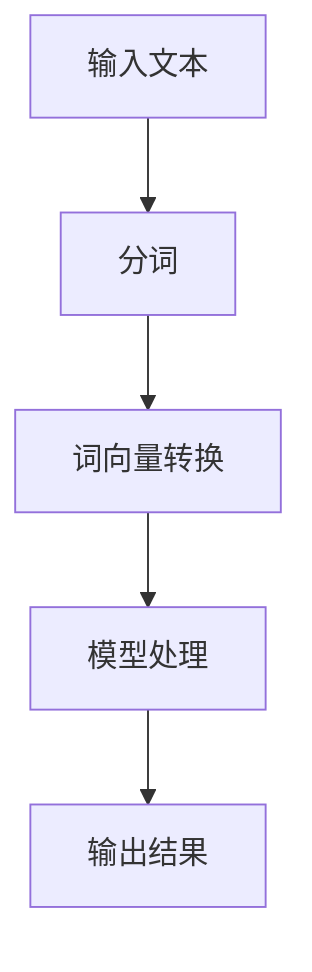
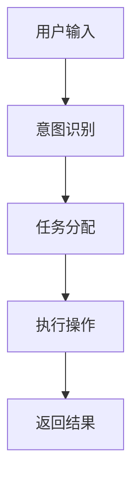
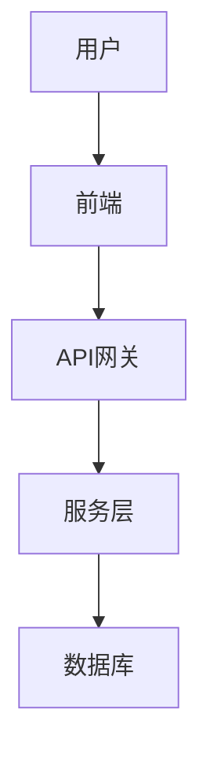

                 


# NLP技术在企业AI Agent中的应用与实现

## 关键词
- 自然语言处理 (NLP)
- 人工智能代理 (AI Agent)
- 企业智能化
- 深度学习
- 机器学习
- 系统架构设计

## 摘要
本文深入探讨了自然语言处理（NLP）技术在企业AI代理（AI Agent）中的应用与实现。文章从NLP和AI Agent的基本概念入手，分析了NLP技术在企业智能化转型中的重要性。通过详细讲解NLP的核心算法、数学模型以及系统架构设计，本文为读者提供了从理论到实践的全面指导。最后，结合实际案例，展示了如何将NLP技术应用于企业AI Agent的开发中，帮助企业在数字化转型中获得竞争优势。

---

## 第1章: NLP技术与企业AI Agent的背景介绍

### 1.1 NLP技术的基本概念
#### 1.1.1 自然语言处理的定义
自然语言处理（NLP）是人工智能（AI）领域的重要分支，致力于研究如何让计算机理解和处理人类的自然语言。NLP的目标是使计算机能够像人类一样阅读、理解和生成文本。

#### 1.1.2 NLP的核心任务与应用场景
NLP的核心任务包括：
- **分词**：将连续的文本分割成词语或短语。
- **词性标注**：确定每个词的语法类别（如名词、动词、形容词等）。
- **句法分析**：分析句子的语法结构。
- **语义理解**：理解文本的深层含义。
- **情感分析**：判断文本的情感倾向（如正面、负面或中性）。
- **意图识别**：识别用户的意图或需求。

NLP的应用场景广泛，包括智能客服、机器翻译、新闻摘要、情感分析等。

#### 1.1.3 NLP技术的演进历程
NLP技术经历了从基于规则的方法到基于统计学习的深度学习方法的演变。近年来，随着深度学习技术的发展，基于预训练模型（如BERT、GPT）的方法在NLP领域取得了显著进展。

### 1.2 AI Agent的基本概念
#### 1.2.1 AI Agent的定义与特点
AI Agent是一种智能代理系统，能够感知环境、理解用户需求，并通过自主决策和行动来实现目标。AI Agent的特点包括：
- **自主性**：能够在没有外部干预的情况下运行。
- **反应性**：能够根据环境的变化做出实时响应。
- **目标导向**：通过明确的目标驱动行动。
- **学习能力**：能够通过经验不断优化自身性能。

#### 1.2.2 AI Agent的分类与应用场景
AI Agent可以根据功能和应用场景分为以下几类：
- **任务型AI Agent**：专注于完成特定任务，如智能客服、订单处理。
- **决策型AI Agent**：用于辅助决策，如金融投资、医疗诊断。
- **交互型AI Agent**：提供人机交互服务，如智能音箱、虚拟助手。

#### 1.2.3 AI Agent与传统自动化的区别
与传统自动化相比，AI Agent具有更强的智能性和适应性，能够处理复杂、动态的环境，并通过学习和优化不断提升性能。

### 1.3 NLP技术在企业AI Agent中的应用背景
#### 1.3.1 企业智能化转型的需求
随着数字化转型的深入推进，企业需要通过智能化技术提升效率、降低成本、优化用户体验。AI Agent作为智能化转型的重要工具，能够为企业提供高效、个性化的服务。

#### 1.3.2 NLP技术在企业AI Agent中的独特价值
NLP技术使得AI Agent能够理解和处理人类语言，从而实现更自然、更高效的用户交互。例如，智能客服可以通过NLP技术快速理解用户的问题并提供准确的解决方案。

#### 1.3.3 当前NLP技术的挑战与机遇
尽管NLP技术在企业AI Agent中的应用前景广阔，但也面临一些挑战，如数据质量、模型训练成本、多语言支持等。这些挑战也为技术创新和优化提供了机遇。

## 1.4 本章小结
本章介绍了NLP技术和AI Agent的基本概念，并分析了NLP技术在企业AI Agent中的应用背景。通过理解NLP和AI Agent的核心概念，企业可以更好地利用这些技术实现智能化转型。

---

## 第2章: NLP技术的核心概念与算法原理

### 2.1 NLP技术的核心概念
#### 2.1.1 语言模型与序列模型
语言模型是NLP的核心，用于计算一串文字的概率。序列模型（如RNN、LSTM）能够处理序列数据，如文本和时间序列。

#### 2.1.2 NLP的数学模型与公式
语言模型的概率公式为：
$$ P(w_1, w_2, ..., w_n) = \prod_{i=1}^{n} P(w_i | w_1, ..., w_{i-1}) $$

Transformer模型的注意力机制公式为：
$$ \text{Attention}(Q, K, V) = \text{softmax}\left(\frac{QK^T}{\sqrt{d_k}}\right)V $$

#### 2.1.3 NLP算法的流程图


### 2.2 NLP算法的原理与实现
#### 2.2.1 传统NLP算法
- **支持向量机（SVM）**：用于分类任务，如情感分析。
- **条件随机场（CRF）**：用于序列标注任务，如分词。

#### 2.2.2 深度学习算法
- **循环神经网络（RNN）**：用于处理序列数据。
- **长短期记忆网络（LSTM）**：克服了RNN的梯度消失问题。
- **Transformer模型**：基于自注意力机制，广泛应用于机器翻译和文本生成。

#### 2.2.3 预训练模型
- **BERT**：一种基于Transformer的预训练模型，适用于多种NLP任务。
- **GPT**：用于生成文本，能够进行对话生成和内容创作。

### 2.3 NLP技术的数学模型与公式
#### 2.3.1 语言模型的数学表达
语言模型的概率公式为：
$$ P(w_1, w_2, ..., w_n) = \prod_{i=1}^{n} P(w_i | w_1, ..., w_{i-1}) $$

#### 2.3.2 Transformer模型的注意力机制
Transformer模型的注意力机制公式为：
$$ \text{Attention}(Q, K, V) = \text{softmax}\left(\frac{QK^T}{\sqrt{d_k}}\right)V $$

### 2.4 NLP算法的实现步骤
1. 数据预处理：包括分词、去除停用词等。
2. 模型训练：选择合适的算法或预训练模型进行训练。
3. 模型优化：通过调整超参数和优化策略提升模型性能。
4. 模型部署：将模型集成到AI Agent系统中，提供实时服务。

## 2.5 本章小结
本章详细讲解了NLP技术的核心概念和算法原理，包括语言模型、序列模型、预训练模型等内容。通过理解这些内容，读者可以更好地掌握NLP技术的实现方法。

---

## 第3章: 企业AI Agent的系统架构与设计

### 3.1 系统功能设计
#### 3.1.1 用户需求分析
用户需求是AI Agent设计的基础。通过用户调研和需求分析，明确AI Agent的功能需求和性能指标。

#### 3.1.2 系统功能模块划分
AI Agent的系统功能模块包括：
- **输入处理模块**：接收用户的输入并进行初步处理。
- **意图识别模块**：通过NLP技术识别用户的意图。
- **任务处理模块**：根据意图分配任务并执行。
- **输出生成模块**：生成并返回结果。

#### 3.1.3 系统功能流程图


### 3.2 系统架构设计
#### 3.2.1 分层架构设计
AI Agent的系统架构通常采用分层设计，包括：
- **数据层**：处理数据的存储和访问。
- **业务逻辑层**：实现核心业务逻辑。
- **用户接口层**：提供用户交互界面。

#### 3.2.2 微服务架构设计
微服务架构适用于复杂的企业系统，能够提高系统的可扩展性和可维护性。

#### 3.2.3 系统架构图


### 3.3 系统接口设计
#### 3.3.1 API接口定义
API接口是系统与外部交互的重要接口。常用接口包括：
- `/api/v1/nlp/analyze`：文本分析接口。
- `/api/v1/agent/action`：任务执行接口。

#### 3.3.2 接口调用流程
1. 用户发送请求到前端。
2. 前端通过API网关调用服务层接口。
3. 服务层处理请求并返回结果。
4. 结果返回到前端并展示给用户。

### 3.4 系统交互设计
#### 3.4.1 用户与AI Agent的交互流程
1. 用户输入问题或需求。
2. AI Agent解析输入并识别意图。
3. AI Agent执行任务并返回结果。
4. 用户确认或进一步交互。

#### 3.4.2 交互中的异常处理
- **输入错误**：识别并提示用户重新输入。
- **服务异常**：记录错误信息并通知管理员。

#### 3.4.3 交互中的反馈机制
- **实时反馈**：用户操作后立即返回结果。
- **进度反馈**：对于耗时任务，提供进度更新。

## 3.5 本章小结
本章详细讲解了企业AI Agent的系统架构与设计，包括功能设计、架构设计、接口设计和交互设计等内容。通过合理的系统设计，企业可以构建高效、稳定的AI Agent系统。

---

## 第4章: NLP技术在企业AI Agent中的实现

### 4.1 项目实战
#### 4.1.1 环境安装
- 安装Python和必要的库（如TensorFlow、Keras、NLTK）。
- 安装预训练模型（如BERT、GPT）。

#### 4.1.2 核心实现代码
```python
import tensorflow as tf
from tensorflow import keras

# 加载预训练模型
model = keras.models.load_model('nlp_model.h5')

# 定义输入处理函数
def process_input(text):
    tokens = tokenizer.text_to_tokens(text)
    inputs = tokenizer.tokens_to_sequences(tokens)
    return inputs

# 定义意图识别函数
def identify_intent(text):
    inputs = process_input(text)
    predictions = model.predict(inputs)
    return labels[predictions.argmax()]

# 示例使用
text = "我需要查询今天的订单状态"
intent = identify_intent(text)
print(f"意图识别结果：{intent}")
```

#### 4.1.3 代码应用解读与分析
上述代码展示了如何利用预训练模型进行意图识别。通过定义输入处理函数和意图识别函数，可以将用户输入的文本转换为模型可处理的格式，并通过模型预测用户的意图。

### 4.2 项目小结
通过实际案例分析，读者可以了解如何将NLP技术应用于企业AI Agent的开发中。从环境安装到代码实现，整个过程展示了NLP技术的实际应用价值。

## 4.3 本章小结
本章通过项目实战展示了NLP技术在企业AI Agent中的具体实现。通过实际案例分析，读者可以更好地理解如何将理论应用于实践。

---

## 第5章: 总结与展望

### 5.1 总结
本文详细探讨了NLP技术在企业AI Agent中的应用与实现，从NLP技术的基本概念到AI Agent的系统架构设计，再到具体的实现案例，为读者提供了全面的指导。

### 5.2 未来展望
随着NLP技术的不断发展，企业AI Agent的应用前景将更加广阔。未来，NLP技术在企业智能化转型中的作用将更加重要，同时也需要解决更多技术挑战。

---

## 附录

### 附录A: 进一步学习的资源
- **书籍**：《自然语言处理实战：基于Python的机器学习和深度学习》
- **在线课程**：Coursera上的“自然语言处理专项课程”
- **工具与库**：TensorFlow、Keras、NLTK

### 附录B: 常用NLP算法与应用场景对照表
| 算法名称       | 应用场景                     |
|----------------|-----------------------------|
| SVM            | 文本分类、情感分析           |
| CRF            | 命名实体识别、序列标注       |
| RNN            | 机器翻译、文本生成         |
| LSTM            | 时间序列分析、对话生成     |
| Transformer      | 机器翻译、问答系统         |

### 附录C: 常用AI Agent框架
- **Rasa**：开源的对话式AI框架。
- **Microsoft Bot Framework**：微软的机器人框架。
- **Dialogflow**：谷歌的对话式AI平台。

---

通过本文的学习，读者可以深入了解NLP技术在企业AI Agent中的应用与实现，为企业的智能化转型提供有力的技术支持。

