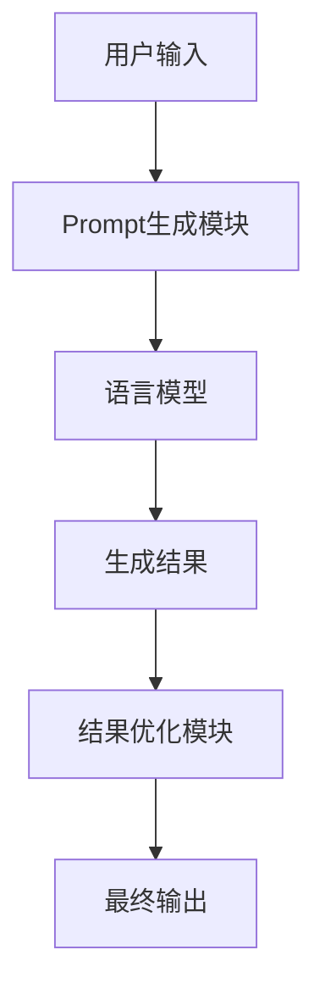

                 


# 《Prompt工程：设计高效指令的艺术》

## 文章关键词
- Prompt工程
- 自然语言处理
- AI大模型
- 对话系统
- 系统架构

## 摘要
Prompt工程是设计高效指令的艺术，涉及Prompt的生成、优化和应用。本文从Prompt工程的背景出发，深入探讨其核心概念、数学模型、系统架构和实际应用。通过具体案例分析，详细讲解Prompt在自然语言处理、对话系统中的应用，以及系统架构设计与工程实践。最后，总结最佳实践和未来趋势。

---

## 第一部分：Prompt工程基础

### 第1章：Prompt工程概述

#### 1.1 Prompt工程的定义与背景
- **1.1.1 什么是Prompt工程**
  - Prompt工程是设计高效指令的艺术，旨在优化AI大模型的输出效果。
  - Prompt通过自然语言指令引导模型生成所需内容。
  - Prompt工程的重要性：提升生成质量、降低错误率、提高用户体验。

- **1.1.2 Prompt工程的发展背景**
  - AI大模型的普及：GPT系列模型的崛起。
  - 自然语言处理的需求：文本生成、对话系统广泛应用。
  - 优化需求：用户对生成内容的精准性和自然度要求提高。

- **1.1.3 Prompt工程的核心目标**
  - 提供清晰的指令，引导模型生成预期结果。
  - 最大化生成内容的质量和相关性。
  - 提升用户体验，降低误用风险。

#### 1.2 Prompt工程的关键概念
- **1.2.1 Prompt的分类与特点**
  - 分类：简单Prompt、复杂Prompt、动态Prompt。
  - 特点：简洁性、明确性、可调节性。

- **1.2.2 Prompt与AI大模型的关系**
  - Prompt作为输入指令，影响模型的生成结果。
  - 模型的输出质量取决于Prompt的设计。

- **1.2.3 Prompt设计的基本原则**
  - 简洁性：避免冗长复杂的指令。
  - 明确性：确保指令清晰，避免歧义。
  - 一致性：保持Prompt风格一致，提升生成效果。

#### 1.3 Prompt工程的应用场景
- **1.3.1 自然语言处理中的Prompt应用**
  - 文本生成：生成文章、摘要、翻译。
  - 问答系统：引导模型回答准确问题。

- **1.3.2 对话系统中的Prompt设计**
  - 用户意图识别：通过Prompt引导对话方向。
  - 系统响应生成：生成自然流畅的回复。

- **1.3.3 创意生成中的Prompt策略**
  - 文案创作：生成广告文案、营销策略。
  - 内容创作：生成文章、视频脚本。

---

### 第2章：Prompt设计的核心原理

#### 2.1 Prompt的数学模型与算法

- **2.1.1 Prompt的数学模型**
  - 输入：$P_{input} = x$
  - 输出：$P_{output} = y$
  - 概率计算：$P(y|x) = \text{模型}(x)$

- **2.1.2 基于语言模型的Prompt生成公式**
  - $P(y|x) = \prod_{i=1}^{n} P(y_i | y_{<i}, x)$

- **2.1.3 Prompt的损失函数与优化目标**
  - 损失函数：$L = -\sum_{i=1}^{n} \log P(y_i | y_{<i}, x)$
  - 优化目标：最小化损失函数，提升生成质量。

- **2.1.4 Prompt生成算法的流程图**
  ```mermaid
  graph TD
  A[输入Prompt] --> B[语言模型] --> C[生成文本]
  D[优化目标] --> C
  ```

- **2.1.5 Prompt生成的数学公式**
  - 输入：$x = \text{"生成一段关于AI的介绍"}$
  - 输出：$y = \text{"人工智能（AI）是指通过计算机模拟人类智能的技术，涵盖学习、推理和自适应能力。"}$

- **2.1.6 Prompt生成的案例分析**
  - 案例：生成一句话描述AI。
    - 输入：$x = \text{"定义人工智能"}$
    - 输出：$y = \text{"人工智能是模拟人类智能的计算机技术"}$

#### 2.2 Prompt设计的优化技巧

- **2.2.1 Prompt设计的基本原则**
  - 简洁性：避免冗长指令。
  - 明确性：确保指令清晰。
  - 一致性：保持风格统一。

- **2.2.2 Prompt的优化策略**
  - 逐步优化法：从小规模优化开始，逐步调整。
  - A/B测试法：通过实验验证优化效果。
  - 用户反馈法：根据用户反馈调整Prompt设计。

- **2.2.3 Prompt优化的数学模型**
  - 损失函数：$L = \sum_{i=1}^{n} (y_i - \hat{y_i})^2$
  - 优化目标：最小化损失函数，提升生成质量。

---

### 第3章：Prompt的优化技巧

#### 3.1 Prompt设计的基本原则

- **3.1.1 简洁性**
  - 示例：生成一句话描述AI。
    - 输入：$x = \text{"定义人工智能"}$
    - 输出：$y = \text{"人工智能是模拟人类智能的计算机技术"}$

- **3.1.2 明确性**
  - 示例：生成一段关于AI的介绍。
    - 输入：$x = \text{"详细描述人工智能"}$
    - 输出：$y = \text{"人工智能是模拟人类智能的计算机技术，涵盖学习、推理和自适应能力。"}$

- **3.1.3 一致性**
  - 示例：生成一段关于AI的介绍。
    - 输入：$x = \text{"详细描述人工智能"}$
    - 输出：$y = \text{"人工智能是模拟人类智能的计算机技术，涵盖学习、推理和自适应能力。"}$

#### 3.2 Prompt的优化策略

- **3.2.1 逐步优化法**
  - 示例：从简单的“生成一句话”开始，逐步增加复杂性。

- **3.2.2 A/B测试法**
  - 示例：比较不同Prompt设计的效果，选择最优方案。

- **3.2.3 用户反馈法**
  - 示例：根据用户反馈调整Prompt设计，提升生成效果。

---

## 第二部分：Prompt工程的实际应用

### 第4章：Prompt在自然语言处理中的应用

#### 4.1 基于Prompt的文本生成

- **4.1.1 生成摘要**
  - 示例：输入：$x = \text{"生成一段关于AI的摘要"}$
  - 输出：$y = \text{"人工智能（AI）是指通过计算机模拟人类智能的技术，涵盖学习、推理和自适应能力。"}$

- **4.1.2 生成翻译**
  - 示例：输入：$x = \text{"将英文翻译成中文"}$
  - 输出：$y = \text{"人工智能（AI）是指通过计算机模拟人类智能的技术，涵盖学习、推理和自适应能力。"}$

- **4.1.3 生成问答**
  - 示例：输入：$x = \text{"什么是人工智能？"}$
  - 输出：$y = \text{"人工智能是模拟人类智能的计算机技术。"}$

#### 4.2 基于Prompt的文本分类

- **4.2.1 分类任务的Prompt设计**
  - 示例：输入：$x = \text{"判断文本是否属于科技领域"}$
  - 输出：$y = \text{"是"}$

- **4.2.2 分类效果的评估方法**
  - 准确率：$\text{Accuracy} = \frac{\text{正确分类数}}{\text{总样本数}}$
  - F1分数：$\text{F1} = 2 \times \frac{\text{Precision} \times \text{Recall}}{\text{Precision} + \text{Recall}}$

---

### 第5章：Prompt在对话系统中的应用

#### 5.1 对话系统的Prompt设计

- **5.1.1 用户意图识别**
  - 示例：输入：$x = \text{"我想了解人工智能"}$
  - 输出：$y = \text{"您想了解人工智能的哪些方面？"}$

- **5.1.2 系统响应生成**
  - 示例：输入：$x = \text{"人工智能是什么？"}$
  - 输出：$y = \text{"人工智能是模拟人类智能的计算机技术。"}$

#### 5.2 基于Prompt的对话流控制

- **5.2.1 对话上下文的管理**
  - 示例：输入：$x = \text{"继续上次的对话"}$
  - 输出：$y = \text{"好的，请继续。"}$

- **5.2.2 对话状态的更新**
  - 示例：输入：$x = \text{"我想要了解机器学习"}$
  - 输出：$y = \text{"机器学习是人工智能的一个分支，您想了解哪些方面？"}$

---

## 第三部分：系统架构与工程实践

### 第6章：Prompt工程的系统架构设计

#### 6.1 系统功能模块划分

- **6.1.1 Prompt生成模块**
  - 功能：接收输入Prompt，生成相应文本。
  - 示例：输入：$x = \text{"生成一段关于AI的介绍"}$
    - 输出：$y = \text{"人工智能是模拟人类智能的计算机技术，涵盖学习、推理和自适应能力。"}$

- **6.1.2 模型调用模块**
  - 功能：调用AI大模型，生成文本。
  - 示例：调用GPT-3生成文本。

- **6.1.3 结果优化模块**
  - 功能：优化生成结果，提升质量。
  - 示例：自动修正语法错误，调整语气。

#### 6.2 系统架构图



#### 6.3 系统接口设计

- **输入接口**
  - 示例：用户输入Prompt，如$x = \text{"生成一段关于AI的介绍"}$

- **输出接口**
  - 示例：生成文本，如$y = \text{"人工智能是模拟人类智能的计算机技术，涵盖学习、推理和自适应能力。"}$

- **调用接口**
  - 示例：调用语言模型，生成文本。

#### 6.4 系统交互流程图


---

### 第7章：Prompt工程的工程实践

#### 7.1 环境安装与配置

- **7.1.1 安装Python**
  - 示例：`python --version` 检查Python版本。
- **7.1.2 安装依赖库**
  - 示例：`pip install openai`

#### 7.2 系统核心实现源代码

- **7.2.1 Prompt生成模块**
  ```python
  import openai

  def generate_text(prompt):
      response = openai.Completion.create(
          model="gpt-3.5-turbo",
          prompt=prompt
      )
      return response.choices[0].message.content
  ```

- **7.2.2 结果优化模块**
  ```python
  def optimize_text(text):
      # 示例：修正语法错误
      return text.replace("re:", "e.g.:")
  ```

#### 7.3 代码应用解读与分析

- **7.3.1 Prompt生成模块的应用**
  - 示例：生成一段关于AI的介绍。
    ```python
    prompt = "生成一段关于人工智能的介绍"
    print(generate_text(prompt))
    ```

- **7.3.2 结果优化模块的应用**
  - 示例：优化生成文本。
    ```python
    text = "人工智能是指计算机模拟人类智能的技术"
    print(optimize_text(text))
    ```

#### 7.4 实际案例分析和详细讲解剖析

- **7.4.1 案例分析**
  - 示例：生成一段关于AI的介绍。
    - 输入：$x = \text{"生成一段关于人工智能的介绍"}$
    - 输出：$y = \text{"人工智能是模拟人类智能的计算机技术，涵盖学习、推理和自适应能力。"}$

- **7.4.2 详细讲解剖析**
  - Prompt设计：简洁明确，引导生成高质量文本。
  - 模型调用：使用GPT-3.5生成文本。
  - 结果优化：修正语法错误，提升文本质量。

---

## 附录

### 附录A：参考文献

- 姜森林.《人工智能入门》
- 李明.《自然语言处理实战》

### 附录B：工具推荐

- OpenAI API
- Hugging Face
- Google AI

---

## 总结

通过以上内容，我们详细探讨了Prompt工程的设计原理、实际应用和系统架构。从基础概念到高级技巧，再到系统实现，本文为读者提供了全面的指导。希望读者能够通过本文，掌握Prompt工程的核心要点，并在实际应用中取得更好的效果。

--- 

## 最佳实践 Tips

- **明确性原则**：确保Prompt清晰明确，避免歧义。
- **简洁性原则**：避免冗长复杂的指令。
- **一致性原则**：保持Prompt风格一致，提升生成效果。
- **实验与反馈**：通过A/B测试和用户反馈优化Prompt设计。

## 小结

本文系统地介绍了Prompt工程的设计艺术，从理论到实践，为读者提供了全面的指导。通过本文，读者可以掌握Prompt工程的核心要点，并在实际应用中设计出高效的指令。

## 注意事项

- 在实际应用中，注意Prompt的可调节性，根据需求动态调整。
- 避免过度复杂的Prompt设计，保持简洁明确。
- 定期收集用户反馈，优化Prompt设计。

## 拓展阅读

- 《Effective Prompt Design for Large Language Models》
- 《Advanced Techniques in Natural Language Processing》

--- 

## 结语

Prompt工程是设计高效指令的艺术，通过本文的学习，读者可以掌握Prompt工程的核心要点，并在实际应用中设计出高效的指令。未来，随着AI技术的不断发展，Prompt工程将发挥越来越重要的作用。希望本文能为读者提供有价值的指导，帮助他们在Prompt工程领域取得更大的成功。

