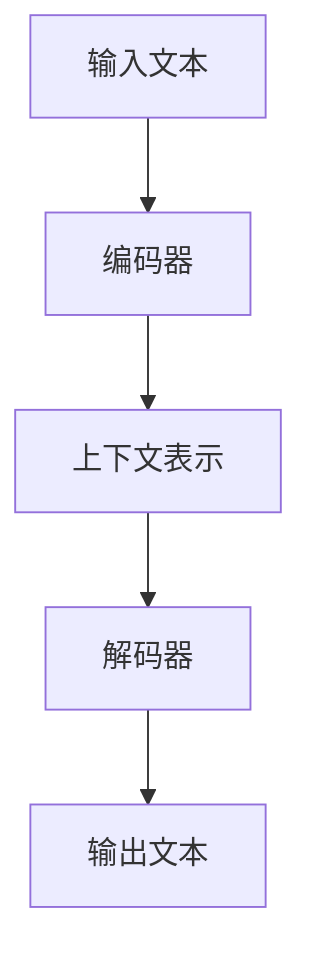
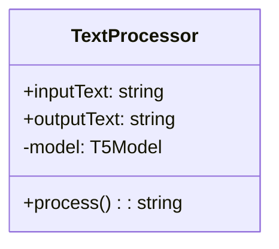
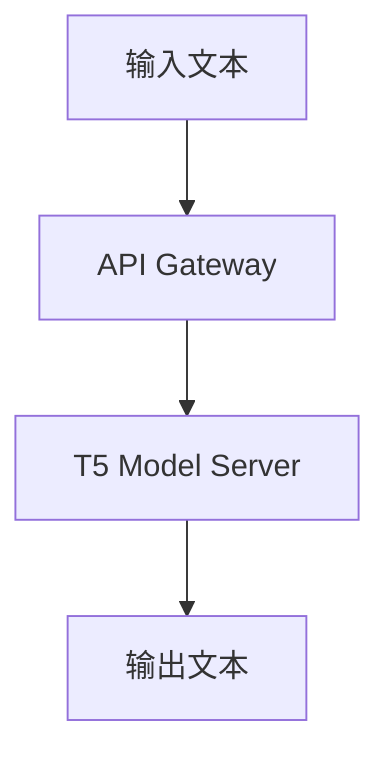
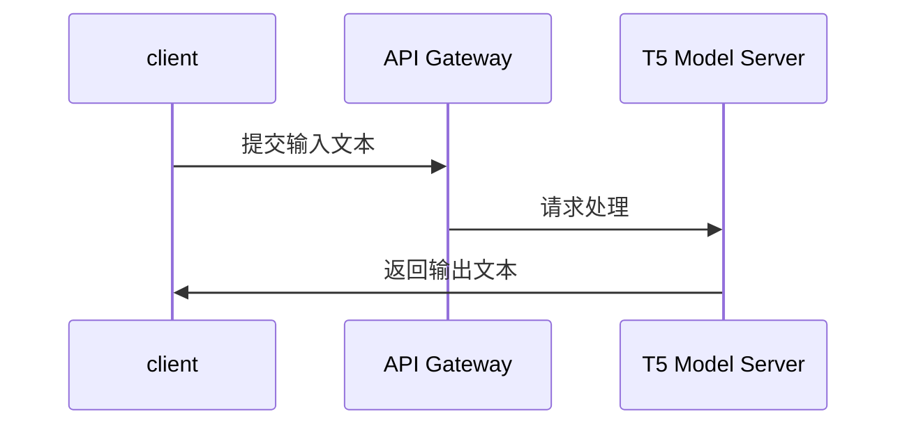

                 


# T5模型：构建多功能的文本处理AI Agent

> 关键词：T5模型、文本处理、AI Agent、自然语言处理、机器学习

> 摘要：本文详细介绍了T5模型在构建多功能文本处理AI Agent中的应用，从模型背景、核心概念、算法原理到系统设计和项目实战，全面解析如何利用T5模型实现高效的文本处理任务。

---

## 第1章 T5模型与文本处理AI Agent的背景介绍

### 1.1 问题背景与问题描述

#### 1.1.1 当前文本处理技术的局限性
传统的文本处理技术，如基于规则的文本解析或简单的关键词匹配，在面对复杂语义理解和生成任务时显得力不从心。例如，简单的关键词匹配无法理解用户的真实意图，也无法处理上下文相关的信息。

#### 1.1.2 多功能文本处理的需求
现代应用中，文本处理AI Agent需要同时支持多种功能，如文本摘要、翻译、问答、对话生成等。这就要求模型具备强大的上下文理解能力、跨语言处理能力以及多任务学习能力。

#### 1.1.3 T5模型的提出与目标
T5（Text-to-Text Transformer）模型由Google于2020年提出，旨在通过统一的文本到文本转换框架，实现多种文本处理任务。T5模型的核心思想是将所有文本处理任务转化为文本生成任务，从而简化模型结构并提高训练效率。

---

### 1.2 T5模型的核心概念与问题解决

#### 1.2.1 T5模型的核心概念
T5模型采用编码器-解码器架构，通过交叉注意力机制实现高效的上下文理解和生成。与传统的编码器-解码器模型（如BERT）不同，T5通过文本生成的方式统一处理多种任务。

#### 1.2.2 T5模型如何解决文本处理问题
T5模型通过将所有任务转化为文本生成任务，避免了重复训练和优化多个独立模型的问题。例如，文本摘要任务可以转化为“将输入文本生成一个更短的总结”，而问答任务可以转化为“根据上下文生成答案”。

#### 1.2.3 T5模型的边界与外延
T5模型主要关注文本生成任务，其边界在于无法直接处理非文本数据（如图像或音频）。然而，通过结合其他模态的信息，T5模型可以进一步扩展其应用范围。

---

### 1.3 T5模型的核心要素组成

#### 1.3.1 T5模型的架构特点
T5模型由编码器和解码器两个部分组成，编码器负责将输入文本转换为上下文表示，解码器负责根据上下文生成输出文本。

#### 1.3.2 T5模型与其他模型的对比
与BERT模型相比，T5模型更注重生成能力，而BERT模型更擅长理解和推理。与GPT模型相比，T5模型在解码器中加入了交叉注意力机制，能够更好地利用编码器提供的上下文信息。

#### 1.3.3 T5模型的性能优势
T5模型在多种文本处理任务中表现出色，包括文本摘要、翻译、问答等。其统一的框架使得训练和部署更加高效。

---

## 第2章 T5模型的核心概念与联系

### 2.1 T5模型的核心原理

#### 2.1.1 T5模型的基本原理
T5模型的核心原理是将文本处理任务转化为生成任务，通过交叉注意力机制实现高效的信息整合。

#### 2.1.2 T5模型的训练目标
T5模型的目标是最小化生成文本与真实文本之间的差异，通过交叉熵损失函数进行优化。

#### 2.1.3 T5模型的损失函数
$$
\text{Loss} = -\sum_{i=1}^{n} \text{log} p(y_i | x, y_{<i})
$$

---

### 2.2 T5模型的核心概念属性特征对比

#### 2.2.1 T5模型与其他大模型的对比
| 模型 | 输入 | 输出 | 架构特点 |
|------|------|------|----------|
| BERT | 文本 | 文本 | 基于Transformer的编码器，擅长理解 |
| GPT  | 文本 | 文本 | 基于Transformer的解码器，擅长生成 |
| T5   | 文本 | 文本 | 统一的编码器-解码器架构，擅长生成 |

---

### 2.3 T5模型的ER实体关系图



---

## 第3章 T5模型的算法原理讲解

### 3.1 T5模型的算法流程

#### 3.1.1 输入处理
输入文本经过分词和编码处理，转换为模型可处理的向量形式。

#### 3.1.2 编码器处理
编码器通过自注意力机制提取输入文本的上下文信息，生成上下文表示。

#### 3.1.3 解码器处理
解码器根据编码器生成的上下文表示，逐步生成输出文本，每一步生成的结果会影响下一步的生成过程。

#### 3.1.4 输出生成
最终生成的文本经过解码和格式化处理，输出给用户。

---

### 3.2 T5模型的算法实现

#### 3.2.1 编码器结构
编码器由多个Transformer层组成，每个层包括自注意力机制和前馈神经网络。

$$
\text{Encoder}(x) = \text{LayerNorm}(\text{Dropout}(x + \text{MultiHead}(x)))
$$

---

#### 3.2.2 解码器结构
解码器同样由多个Transformer层组成，每个层包括自注意力机制和交叉注意力机制。

$$
\text{Decoder}(y, \text{Encoder}(x)) = \text{LayerNorm}(\text{Dropout}(y + \text{MultiHead}(\text{Encoder}(x), y)))
$$

---

#### 3.2.3 交叉注意力机制
交叉注意力机制允许解码器在生成每个词时，参考编码器提供的所有上下文信息。

$$
\text{Attention}(Q, K, V) = \text{softmax}\left(\frac{QK^T}{\sqrt{d_k}}\right)V
$$

---

## 第4章 T5模型的系统分析与架构设计

### 4.1 问题场景介绍

#### 4.1.1 多功能文本处理的需求
AI Agent需要同时支持多种文本处理功能，如摘要、翻译、问答等。

#### 4.1.2 T5模型的应用场景
T5模型可以应用于多种文本处理任务，如客服对话系统、智能翻译工具等。

---

### 4.2 系统功能设计

#### 4.2.1 领域模型设计



---

### 4.3 系统架构设计



---

### 4.4 系统接口设计

| 接口名称 | 输入 | 输出 |
|----------|------|------|
| process | string | string |

---

### 4.5 系统交互设计



---

## 第5章 T5模型的项目实战

### 5.1 环境安装

```bash
pip install transformers
```

---

### 5.2 核心实现代码

```python
from transformers import T5Tokenizer, T5Model

tokenizer = T5Tokenizer.from_pretrained('t5-small')
model = T5Model.from_pretrained('t5-small')

def process_text(input_text):
    inputs = tokenizer(input_text, return_tensors='np')
    outputs = model.generate(inputs.input_ids)
    return tokenizer.decode(outputs[0], skip_special_tokens=True)
```

---

### 5.3 案例分析

#### 案例1：文本摘要
输入文本：一篇长文章
输出文本：文章的摘要

#### 案例2：翻译任务
输入文本：Hello, how are you?
输出文本：你好，你怎么样？

---

## 第6章 总结与展望

### 6.1 总结
本文详细介绍了T5模型在构建多功能文本处理AI Agent中的应用，从模型背景、核心概念到算法原理和系统设计，全面解析了T5模型的优势和应用潜力。

### 6.2 展望
未来，随着大语言模型的不断发展，T5模型在文本处理领域的应用将更加广泛，包括多模态处理、实时对话生成等。

---

## 最佳实践 Tips

1. 在使用T5模型时，注意模型的训练数据和应用场景，避免偏见和错误。
2. 合理选择模型的规模和参数，平衡性能与资源消耗。
3. 在实际应用中，结合具体业务需求，对模型进行微调和优化。

---

## 小结

通过本文的详细讲解，读者可以深入了解T5模型的核心原理和应用场景，为构建高效的文本处理AI Agent提供了理论和实践指导。希望本文能为读者在文本处理领域提供有价值的参考和启发。

---

## 注意事项

1. 模型训练时，确保数据质量和多样性，避免过拟合。
2. 在实际应用中，注意模型的推理速度和资源消耗，优化部署环境。
3. 定期更新模型和相关技术，跟进行业最新进展。

---

## 拓展阅读

1. [Transformers: State-of-the-art language models](https://huggingface.co/transformers)
2. [T5 Model Paper](https://arxiv.org/abs/1910.14696)
3. [Hugging Face T5模型教程](https://huggingface.co/blog/t5)

---

希望这篇文章能为您提供有价值的参考和启发！

