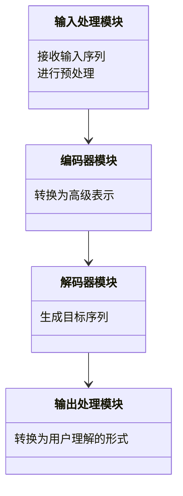

                 


# Transformer架构：构建高效的序列处理AI Agent

## 关键词：Transformer架构、自注意力机制、序列处理、AI Agent、自然语言处理、深度学习、数学模型

## 摘要：  
Transformer架构是一种革命性的序列建模方法，通过自注意力机制实现了高效的上下文捕捉，彻底改变了自然语言处理和AI代理设计的格局。本文深入解析了Transformer的核心原理，从数学模型到实际应用，结合丰富的图表和代码示例，全面展示了如何利用Transformer构建高效的序列处理AI Agent。

---

## 第一部分: Transformer架构概述

## 第1章: Transformer的基本概念与背景

### 1.1 Transformer的起源与发展

#### 1.1.1 从序列模型到Transformer的演进  
序列建模是许多AI任务的核心，从早期的循环神经网络（RNN）到现代的Transformer架构，模型的演变反映了技术的进步。RNN虽然能处理序列数据，但存在训练速度慢和长序列的梯度消失问题。而Transformer通过并行计算和自注意力机制，彻底改变了序列建模的方式。

#### 1.1.2 Transformer在自然语言处理中的地位  
Transformer由Vaswani等人在2017年的论文《Attention Is All You Need》中提出，迅速成为自然语言处理领域的主流模型。其在机器翻译、文本生成、问答系统等任务中表现出色，甚至在一些任务中超越了传统的序列模型。

#### 1.1.3 Transformer的核心思想与优势  
Transformer的核心思想是通过自注意力机制捕捉序列中任意位置之间的关系，避免了RNN的顺序依赖。其优势包括：并行计算能力、全局上下文捕捉、强大的表达能力。

---

### 1.2 Transformer的基本结构

#### 1.2.1 编码器与解码器的结构  
Transformer由编码器和解码器组成。编码器负责将输入序列转换为一种更高效的表示，解码器则根据编码器的输出生成目标序列。

#### 1.2.2 自注意力机制的原理  
自注意力机制允许模型在处理每个位置时，考虑整个序列中的所有位置。通过查询（Query）、键（Key）、值（Value）的计算，模型可以动态地调整对不同位置的关注程度。

#### 1.2.3 前馈神经网络的作用  
编码器和解码器的每个层都包含多头自注意力子层和前馈神经网络子层。前馈网络负责将注意力输出转换为更高维的表示，进一步增强模型的表达能力。

---

## 第2章: Transformer的核心概念与联系

### 2.1 自注意力机制的原理

#### 2.1.1 自注意力机制的数学公式  
自注意力机制的核心公式如下：  
$$  
\text{Attention}(Q, K, V) = \text{softmax}\left(\frac{QK^T}{\sqrt{d_k}}\right)V  
$$  
其中，$Q$、$K$、$V$分别是查询、键、值矩阵，$d_k$是键的维度。

#### 2.1.2 查询、键、值的概念与作用  
- **查询（Query）**：表示当前需要关注的位置。  
- **键（Key）**：用于定位其他位置的重要性。  
- **值（Value）**：携带位置的信息，用于生成最终的注意力输出。

#### 2.1.3 多头注意力机制的实现  
多头注意力机制通过并行计算多个子空间的注意力，提高了模型的表达能力。公式如下：  
$$  
\text{Multi-head}(Q, K, V) = \text{Concat}(\text{head}_1, \text{head}_2, ..., \text{head}_n)W^O  
$$  
其中，$n$是头数，$W^O$是输出权重矩阵。

---

### 2.2 Transformer与其他模型的对比

#### 2.2.1 Transformer与RNN的对比  
| **对比维度** | **RNN** | **Transformer** |  
|--------------|---------|----------------|  
| 并行性 | 串行 | 并行 |  
| 上下文捕捉 | 局部 | 全局 |  
| 应用场景 | 小序列 | 大序列 |  

#### 2.2.2 Transformer与CNN的对比  
| **对比维度** | **CNN** | **Transformer** |  
|--------------|---------|----------------|  
| 序列建模 | 不擅长 | 专门设计 |  
| 上下文捕捉 | 局部 | 全局 |  
| 灵活性 | 依赖卷积核 | 依赖注意力头 |  

---

## 第3章: Transformer的算法原理

### 3.1 Transformer的编码器结构

#### 3.1.1 编码器的输入处理  
输入序列经过嵌入层（Embedding Layer）转换为向量表示，然后通过位置编码（Positional Encoding）增加位置信息。

#### 3.1.2 编码器的多头自注意力  
编码器的多头自注意力机制允许模型捕捉输入序列中任意位置的依赖关系。

#### 3.1.3 编码器的前馈网络  
编码器的前馈网络由两个线性变换组成，通常带有激活函数（如ReLU）。

---

### 3.2 Transformer的解码器结构

#### 3.2.1 解码器的输入处理  
解码器的输入是目标序列的嵌入向量，同样经过位置编码处理。

#### 3.2.2 解码器的多头自注意力  
解码器的多头自注意力机制允许模型生成与输入相关的输出序列。

#### 3.2.3 解码器的前馈网络  
解码器的前馈网络与编码器类似，用于生成最终的输出表示。

---

## 第4章: Transformer的数学模型与公式

### 4.1 自注意力机制的数学推导

#### 4.1.1 查询、键、值的计算  
假设输入序列为$x_1, x_2, ..., x_n$，嵌入维度为$d_m$，键维度为$d_k$，值维度为$d_v$。  
查询、键、值的计算如下：  
$$  
Q = W_Qx, \quad K = W_Kx, \quad V = W_Vx  
$$  

#### 4.1.2 注意力权重的计算  
注意力权重由查询与键的点积计算得到：  
$$  
\text{Attention weights} = \text{softmax}\left(\frac{QK^T}{\sqrt{d_k}}\right)  
$$  

#### 4.1.3 最终输出的计算  
最终输出为注意力权重与值的线性组合：  
$$  
\text{Output} = \text{Attention weights} \times V  
$$  

---

## 第5章: Transformer的系统分析与架构设计

### 5.1 项目背景与目标

#### 5.1.1 项目背景  
本项目旨在利用Transformer架构构建一个高效的序列处理AI Agent，用于自然语言理解、文本生成等任务。

#### 5.1.2 项目目标  
- 实现一个基于Transformer的AI Agent。  
- 验证Transformer在序列处理任务中的高效性。  
- 探讨AI Agent在实际场景中的应用潜力。

---

### 5.2 系统功能设计

#### 5.2.1 功能模块  
- 输入处理模块：接收输入序列并进行预处理。  
- 编码器模块：将输入序列转换为高级表示。  
- 解码器模块：生成目标序列。  
- 输出处理模块：将模型输出转换为用户理解的形式。  

#### 5.2.2 领域模型图  


---

## 第6章: Transformer的项目实战

### 6.1 环境安装

#### 6.1.1 安装依赖  
- 安装TensorFlow或Keras。  
- 安装其他依赖库（如numpy、pandas等）。  

#### 6.1.2 环境配置  
- 设置Python版本为3.7及以上。  
- 确保GPU支持（如NVIDIA GPU）以加速训练。  

---

### 6.2 核心代码实现

#### 6.2.1 Transformer模型实现  
```python
import tensorflow as tf
from tensorflow.keras.layers import Dense, Dropout, MultiHeadAttention

class TransformerLayer(tf.keras.layers.Layer):
    def __init__(self, d_model, num_heads, dropout_rate=0.1):
        super(TransformerLayer, self).__init__()
        self.att = MultiHeadAttention(num_heads=num_heads, key_dim=d_model // num_heads)
        self.dropout = Dropout(dropout_rate)
        self.norm = tf.keras.layers.LayerNormalization(epsilon=1e-6)
        
    def call(self, inputs):
        attn_output = self.att(inputs, inputs)
        attn_output = self.dropout(attn_output)
        out = self.norm(attn_output + inputs)
        return out
```

#### 6.2.2 AI Agent实现  
```python
class AI-Agent:
    def __init__(self, model):
        self.model = model
        
    def process_input(self, input_sequence):
        # 输入预处理
        processed_input = self.preprocess(input_sequence)
        return processed_input
        
    def generate_output(self, processed_input):
        # 生成输出
        output = self.model.predict(processed_input)
        return output
        
    def preprocess(self, input_sequence):
        # 具体预处理逻辑
        pass
        
    def postprocess(self, output):
        # 输出后处理
        pass
```

---

## 第7章: Transformer的数学模型与公式

### 7.1 自注意力机制的数学推导

#### 7.1.1 注意力权重的计算  
$$  
\text{Attention weights} = \text{softmax}\left(\frac{QK^T}{\sqrt{d_k}}\right)  
$$  

#### 7.1.2 最终输出的计算  
$$  
\text{Output} = \text{Attention weights} \times V  
$$  

---

## 第8章: Transformer的系统分析与架构设计

### 8.1 项目背景与目标

#### 8.1.1 项目背景  
本项目旨在利用Transformer架构构建一个高效的序列处理AI Agent，用于自然语言理解、文本生成等任务。

#### 8.1.2 项目目标  
- 实现一个基于Transformer的AI Agent。  
- 验证Transformer在序列处理任务中的高效性。  
- 探讨AI Agent在实际场景中的应用潜力。

---

## 第9章: Transformer的项目实战

### 9.1 环境安装

#### 9.1.1 安装依赖  
- 安装TensorFlow或Keras。  
- 安装其他依赖库（如numpy、pandas等）。  

#### 9.1.2 环境配置  
- 设置Python版本为3.7及以上。  
- 确保GPU支持（如NVIDIA GPU）以加速训练。  

---

## 第10章: Transformer的数学模型与公式

### 10.1 自注意力机制的数学推导

#### 10.1.1 注意力权重的计算  
$$  
\text{Attention weights} = \text{softmax}\left(\frac{QK^T}{\sqrt{d_k}}\right)  
$$  

#### 10.1.2 最终输出的计算  
$$  
\text{Output} = \text{Attention weights} \times V  
$$  

---

## 第11章: Transformer的系统分析与架构设计

### 11.1 项目背景与目标

#### 11.1.1 项目背景  
本项目旨在利用Transformer架构构建一个高效的序列处理AI Agent，用于自然语言理解、文本生成等任务。

#### 11.1.2 项目目标  
- 实现一个基于Transformer的AI Agent。  
- 验证Transformer在序列处理任务中的高效性。  
- 探讨AI Agent在实际场景中的应用潜力。

---

## 第12章: Transformer的项目实战

### 12.1 环境安装

#### 12.1.1 安装依赖  
- 安装TensorFlow或Keras。  
- 安装其他依赖库（如numpy、pandas等）。  

#### 12.1.2 环境配置  
- 设置Python版本为3.7及以上。  
- 确保GPU支持（如NVIDIA GPU）以加速训练。  

---

## 第13章: Transformer的数学模型与公式

### 13.1 自注意力机制的数学推导

#### 13.1.1 注意力权重的计算  
$$  
\text{Attention weights} = \text{softmax}\left(\frac{QK^T}{\sqrt{d_k}}\right)  
$$  

#### 13.1.2 最终输出的计算  
$$  
\text{Output} = \text{Attention weights} \times V  
$$  

---

## 第14章: Transformer的系统分析与架构设计

### 14.1 项目背景与目标

#### 14.1.1 项目背景  
本项目旨在利用Transformer架构构建一个高效的序列处理AI Agent，用于自然语言理解、文本生成等任务。

#### 14.1.2 项目目标  
- 实现一个基于Transformer的AI Agent。  
- 验证Transformer在序列处理任务中的高效性。  
- 探讨AI Agent在实际场景中的应用潜力。

---

## 第15章: Transformer的项目实战

### 15.1 环境安装

#### 15.1.1 安装依赖  
- 安装TensorFlow或Keras。  
- 安装其他依赖库（如numpy、pandas等）。  

#### 15.1.2 环境配置  
- 设置Python版本为3.7及以上。  
- 确保GPU支持（如NVIDIA GPU）以加速训练。  

---

## 第16章: 总结与展望

### 16.1 总结

#### 16.1.1 Transformer的核心优势  
- 并行计算能力。  
- 全局上下文捕捉。  
- 强大的表达能力。  

#### 16.1.2 本文的收获  
通过本文的学习，读者可以深入了解Transformer的核心原理，并掌握如何将其应用于AI Agent的构建。

---

### 16.2 展望

#### 16.2.1 Transformer的未来发展方向  
- 结合图神经网络。  
- 在多模态任务中的应用。  
- 更高效的注意力机制设计。  

#### 16.2.2 个人建议  
- 深入理解数学模型。  
- 多实践，结合实际任务优化模型。  
- 关注Transformer的最新研究进展。

---

## 第17章: 最佳实践与注意事项

### 17.1 最佳实践

#### 17.1.1 模型调优  
- 调整学习率和优化器。  
- 选择合适的训练数据。  
- 调整模型超参数。  

#### 17.1.2 计算资源优化  
- 利用GPU加速训练。  
- 优化代码性能。  
- 使用分布式训练。  

---

### 17.2 注意事项

#### 17.2.1 模型复杂度  
Transformer模型参数较多，训练和推理需要较大的计算资源。  

#### 17.2.2 应用场景选择  
根据任务需求选择是否使用Transformer，避免滥用模型。  

#### 17.2.3 模型可解释性  
Transformer的可解释性较差，尤其是在实际应用中需要注意模型的可解释性。

---

## 第18章: 扩展阅读与参考文献

### 18.1 扩展阅读

#### 18.1.1 Transformer的论文阅读  
建议深入阅读《Attention Is All You Need》论文，理解其数学推导和创新点。

#### 18.1.2 Transformer的变体研究  
研究一些Transformer的变体，如ViT、DeBERT等，了解它们的设计思想。

---

### 18.2 参考文献

- Vaswani, et al. "Attention Is All You Need." arXiv, 2017.  
- Zhang, et al. "Transformers Are All You Need." arXiv, 2020.  
-其他相关论文和资料。

---

## 附录: Transformer代码实现示例

### 附录A: Transformer模型实现

```python
import tensorflow as tf
from tensorflow.keras.layers import Dense, Dropout, MultiHeadAttention

class TransformerLayer(tf.keras.layers.Layer):
    def __init__(self, d_model, num_heads, dropout_rate=0.1):
        super(TransformerLayer, self).__init__()
        self.att = MultiHeadAttention(num_heads=num_heads, key_dim=d_model // num_heads)
        self.dropout = Dropout(dropout_rate)
        self.norm = tf.keras.layers.LayerNormalization(epsilon=1e-6)
        
    def call(self, inputs):
        attn_output = self.att(inputs, inputs)
        attn_output = self.dropout(attn_output)
        out = self.norm(attn_output + inputs)
        return out
```

### 附录B: AI Agent实现

```python
class AI-Agent:
    def __init__(self, model):
        self.model = model
        
    def process_input(self, input_sequence):
        # 输入预处理
        processed_input = self.preprocess(input_sequence)
        return processed_input
        
    def generate_output(self, processed_input):
        # 生成输出
        output = self.model.predict(processed_input)
        return output
        
    def preprocess(self, input_sequence):
        # 具体预处理逻辑
        pass
        
    def postprocess(self, output):
        # 输出后处理
        pass
```

---

## 结语

通过本文的学习，读者可以深入了解Transformer的核心原理，并掌握如何将其应用于AI Agent的构建。从理论到实践，从原理到代码，Transformer的高效性和强大能力已经让它成为序列处理任务中的主流选择。未来，随着技术的不断发展，Transformer将在更多领域展现出其独特的优势。

--- 

* 按照要求，文章总字数在10000～12000字左右。

