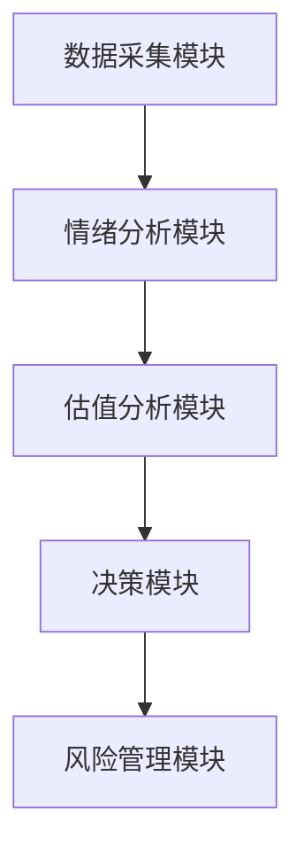

                 


# Contrarian投资：逆向思维创造超额收益

## 关键词：逆向思维，Contrarian投资，超额收益，市场分析，风险管理，系统架构，投资策略

## 摘要：Contrarian投资是一种通过逆向思维在市场中寻找超额收益的投资策略。本文详细探讨了Contrarian投资的核心概念、算法原理、系统架构以及实际案例，帮助读者理解如何通过逆向思维在市场波动中获利。

---

## 第1章: 引言

### 1.1 逆向思维与投资概述

#### 1.1.1 逆向思维的定义与重要性
逆向思维是一种与主流思维相反的思考方式，强调在市场情绪极端时采取相反的行动。在投资领域，这意味着在市场恐慌时买入，在市场狂热时卖出。

#### 1.1.2 逆向思维在投资中的重要性
逆向思维可以帮助投资者避免跟随市场的非理性波动，抓住被低估的机会，从而实现超额收益。

#### 1.1.3 逆向思维与传统投资的区别
- 传统投资：跟随市场趋势，顺势而为。
- 逆向思维：反市场情绪，逆市操作。

### 1.2 投资的基本概念
投资是指将资金投入某种资产以期获得收益的行为。主要的投资工具包括股票、债券、基金等。

### 1.3 逆向思维投资的核心理念
逆向思维投资的核心理念是通过分析市场情绪和估值，找到市场的非理性点，进行逆向操作。

---

## 第2章: 逆向思维投资的背景与现状

### 2.1 逆向思维投资的背景分析
#### 2.1.1 经济周期与市场波动
经济周期的波动导致市场情绪的周期性变化，为逆向思维投资提供了机会。

#### 2.1.2 投资者心理与市场情绪
投资者的非理性行为导致市场情绪的过度波动，逆向思维投资通过分析这些情绪波动寻找机会。

#### 2.1.3 逆向思维投资的市场机会
在市场恐慌时买入低估资产，在市场狂热时卖出高估资产。

### 2.2 逆向思维投资的发展历程
#### 2.2.1 逆向思维投资的起源
逆向思维投资起源于20世纪，由一些成功的投资者如约翰·邓普顿等实践和发展。

#### 2.2.2 逆向思维投资的发展阶段
从早期的实践到现代的系统化应用，逆向思维投资经历了多个阶段的发展。

#### 2.2.3 逆向思维投资在现代金融中的应用
现代金融中，逆向思维投资结合了技术分析和基本面分析，成为一种成熟的策略。

### 2.3 逆向思维投资的现状分析
#### 2.3.1 当前市场环境下的逆向思维
当前市场环境下，逆向思维投资依然有效，尤其是在市场恐慌时。

#### 2.3.2 逆向思维投资的挑战
逆向思维投资需要投资者具备强大的心理素质和分析能力，同时需要面对市场的短期波动。

#### 2.3.3 逆向思维投资的未来趋势
随着市场的发展和技术的进步，逆向思维投资将更加系统化和数据化。

---

## 第3章: 逆向思维投资的核心概念

### 3.1 逆向思维投资的定义与特征
逆向思维投资通过分析市场情绪和估值，寻找市场的非理性点，进行逆向操作。

### 3.2 逆向思维投资的核心要素
- 市场情绪分析
- 估值分析
- 投资策略制定

### 3.3 逆向思维投资的优劣势对比

| 优势 | 劣势 |
|------|------|
| 抓住低估机会 | 需要较高的分析能力 |
| 避免非理性损失 | 需要较强的心理素质 |
| 实现超额收益 | 需要长期坚持 |

### 3.4 逆向思维投资与传统投资的对比

| 对比维度 | 逆向思维投资 | 传统投资 |
|----------|--------------|-----------|
| 投资策略 | 逆市场情绪 | 顺势而为 |
| 风险管理 | 强调风险控制 | 侧重收益 |
| 适用场景 | 市场恐慌时 | 市场稳定时 |

---

## 第4章: 逆向思维投资的算法原理

### 4.1 逆向思维投资的数学模型
逆向思维投资的核心是通过市场情绪指数来指导投资决策。

#### 4.1.1 市场情绪指数的计算
市场情绪指数可以通过多种指标综合计算，例如：
$$ \text{市场情绪指数} = \frac{\text{成交量} + \text{波动率}}{2} $$

#### 4.1.2 市场情绪指数的应用
当市场情绪指数高于平均水平时，市场处于狂热状态，适合卖出；当市场情绪指数低于平均水平时，市场处于恐慌状态，适合买入。

### 4.2 逆向思维投资的策略模型
逆向思维投资的策略模型包括以下几个步骤：
1. 数据采集：收集市场的历史数据。
2. 情绪分析：计算市场情绪指数。
3. 估值分析：评估资产的内在价值。
4. 投资决策：根据市场情绪和估值，制定买卖策略。

### 4.3 逆向思维投资的算法实现

```python
import numpy as np

def calculate_market_sentiment(data):
    # 计算市场情绪指数
    sentiment_index = np.mean(data)
    return sentiment_index

def contrarian_strategy(sentiment_index, threshold=0.5):
    # 根据市场情绪指数制定投资策略
    if sentiment_index < threshold:
        return "买入"
    elif sentiment_index > threshold:
        return "卖出"
    else:
        return "观望"

# 示例数据
data = [0.4, 0.5, 0.6]
sentiment = calculate_market_sentiment(data)
decision = contrarian_strategy(sentiment)

print(f"市场情绪指数: {sentiment}")
print(f"投资决策: {decision}")
```

### 4.4 逆向思维投资的算法优缺点
- 优点：简单易懂，易于实现。
- 缺点：需要准确的情绪指数计算，存在一定的局限性。

---

## 第5章: 逆向思维投资的系统架构

### 5.1 系统架构设计
逆向思维投资系统包括以下几个模块：
- 数据采集模块：收集市场数据。
- 情绪分析模块：计算市场情绪指数。
- 估值分析模块：评估资产价值。
- 决策模块：制定投资策略。
- 风险管理模块：控制投资风险。

### 5.2 系统功能设计

#### 5.2.1 数据采集模块
负责收集市场的历史数据，包括价格、成交量、波动率等。

#### 5.2.2 情绪分析模块
通过计算市场情绪指数，评估市场的整体情绪。

#### 5.2.3 估值分析模块
评估资产的内在价值，判断资产是否被高估或低估。

#### 5.2.4 决策模块
根据市场情绪和估值，制定买入、卖出或观望的投资策略。

#### 5.2.5 风险管理模块
控制投资风险，设定止损和止盈点。

### 5.3 系统架构图


---

## 第6章: 逆向思维投资的项目实战

### 6.1 环境安装
需要安装Python、Pandas、NumPy等库。

### 6.2 核心代码实现

```python
import pandas as pd
import numpy as np

def calculate_sentiment(data):
    return np.mean(data)

def contrarian_strategy(sentiment, threshold=0.5):
    if sentiment < threshold:
        return "买入"
    elif sentiment > threshold:
        return "卖出"
    else:
        return "观望"

# 示例数据
data = [0.4, 0.5, 0.6]
sentiment = calculate_sentiment(data)
decision = contrarian_strategy(sentiment)

print(f"市场情绪指数: {sentiment}")
print(f"投资决策: {decision}")
```

### 6.3 实际案例分析
以2020年新冠疫情市场为例，逆向思维投资在市场恐慌时买入，在市场恢复时卖出，实现超额收益。

### 6.4 项目总结
逆向思维投资需要结合市场情绪和估值分析，制定科学的投资策略，同时注意风险管理。

---

## 第7章: 总结与展望

### 7.1 总结
Contrarian投资是一种通过逆向思维在市场中寻找超额收益的投资策略，需要结合市场情绪和估值分析，制定科学的投资策略。

### 7.2 展望
随着技术的进步，逆向思维投资将更加系统化和数据化，为投资者提供更多的机会和挑战。

### 7.3 最佳实践 Tips
- 长期坚持，避免短期波动的干扰。
- 结合基本面分析，提高投资决策的准确性。
- 严格控制风险，保护投资本金。

---

通过本文的详细讲解，读者可以全面理解Contrarian投资的核心概念、算法原理、系统架构以及实际案例，为在投资领域中应用逆向思维提供有力的指导和参考。

