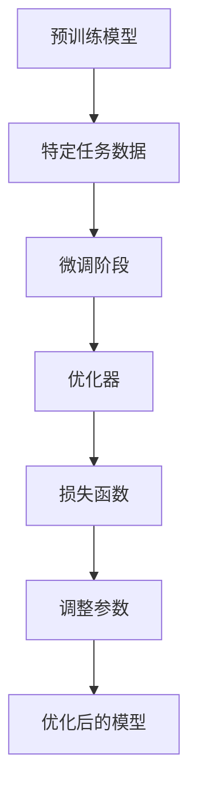
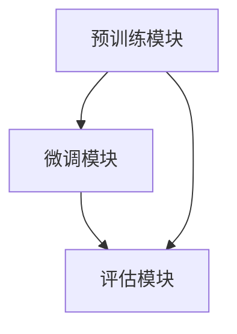
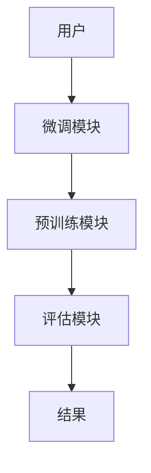

                 


# Fine-tuning LLM模型：提升AI Agent性能的关键

---

## 关键词：
Fine-tuning, LLM, AI Agent, 模型优化, 微调技术, 深度学习, 自然语言处理

---

## 摘要：
本文系统探讨了Fine-tuning技术在提升大型语言模型（LLM）性能中的关键作用。通过分析Fine-tuning的核心概念、算法原理、系统架构以及实际应用场景，本文为AI Agent的优化提供了理论支持和实践指导。文章从背景、概念、原理、系统设计、项目实战到最佳实践，全面解析了Fine-tuning技术的实现与应用，帮助读者深入理解并掌握这一技术。

---

# 第一部分: Fine-tuning LLM模型概述

## 第1章: Fine-tuning LLM模型的背景与意义

### 1.1 问题背景

#### 1.1.1 大型语言模型的发展现状
大型语言模型（LLM）近年来取得了突破性进展，从BERT到GPT系列，这些模型在自然语言处理（NLP）任务中表现出色。然而，这些模型通常是基于大规模通用数据预训练而成，难以直接适用于特定领域或具体场景的需求。

#### 1.1.2 微调技术在LLM中的重要性
在实际应用中，直接使用通用模型往往无法满足特定任务的性能要求。通过微调技术（Fine-tuning），可以在保持模型整体性能的同时，针对特定任务进行优化，从而显著提升模型的实用性。

#### 1.1.3 Fine-tuning的核心目标与应用场景
Fine-tuning的核心目标是通过调整模型参数，使其在特定领域或任务上表现更优。其应用场景包括但不限于：
- **领域特定任务**：如医疗、法律、金融等领域的专业问答。
- **个性化服务**：如用户定制的对话系统。
- **低资源场景**：在数据量有限的情况下，通过微调提升模型性能。

### 1.2 Fine-tuning的定义与特点

#### 1.2.1 Fine-tuning的定义
Fine-tuning是指在预训练好的大型语言模型的基础上，对模型进行进一步的微调，使其适应特定任务或领域。与全参数微调相比，Fine-tuning通常只调整模型的部分参数，以降低计算成本和时间。

#### 1.2.2 Fine-tuning与模型调优的对比
- **Fine-tuning**：基于预训练模型的微调，调整部分参数以适应特定任务。
- **全参数调优**：从头开始训练模型，调整所有参数以适应特定任务。
- **冻结参数调优**：仅调整模型的顶层参数，保持底层参数不变。

#### 1.2.3 Fine-tuning的主要特点与优势
1. **高效性**：相比从头训练，Fine-tuning利用了预训练模型的特征提取能力，减少了训练时间和计算成本。
2. **通用性**：适用于多种任务和领域，通过微调可以快速适应新场景。
3. **可扩展性**：可以根据任务需求灵活调整微调的深度和范围。

### 1.3 Fine-tuning的技术现状与挑战

#### 1.3.1 当前主流的Fine-tuning方法
1. **全参数微调**：调整所有参数，适用于任务需求较高的场景。
2. **任务特定参数微调**：仅调整任务相关部分的参数，适用于轻量级优化。
3. **层次化微调**：分层调整模型参数，结合全局和局部优化。

#### 1.3.2 Fine-tuning的主要技术挑战
1. **数据稀疏性**：在某些领域或任务中，标注数据有限，影响微调效果。
2. **过拟合风险**：微调过程中可能因数据不足导致过拟合。
3. **计算成本**：Fine-tuning需要大量计算资源，尤其是在处理大规模模型时。

#### 1.3.3 Fine-tuning的未来发展方向
- **轻量化微调技术**：减少计算成本，提升效率。
- **多任务微调框架**：支持多任务学习，提升模型的泛化能力。
- **动态参数调整**：根据任务需求动态调整模型参数。

### 1.4 Fine-tuning与相关技术的对比

#### 1.4.1 Fine-tuning与全参数微调的对比
- **Fine-tuning**：调整部分参数，适用于特定任务。
- **全参数微调**：调整所有参数，适用于高精度需求的任务。

#### 1.4.2 Fine-tuning与冻结参数调优的对比
- **Fine-tuning**：调整部分参数，利用预训练模型的特征。
- **冻结参数调优**：仅调整顶层参数，保持底层特征不变。

#### 1.4.3 Fine-tuning与其他模型优化技术的对比
- **Fine-tuning**：基于预训练模型的微调，适用于特定任务。
- **模型压缩**：通过剪枝、量化等技术减少模型大小。
- **知识蒸馏**：将大模型的知识迁移到小模型。

---

## 第2章: Fine-tuning LLM模型的核心概念与原理

### 2.1 Fine-tuning的核心概念

#### 2.1.1 Fine-tuning的基本原理
Fine-tuning的核心思想是通过在特定任务数据上进一步训练模型，调整模型的参数，使其更适应该任务的需求。具体来说，模型在预训练阶段已经学习了大规模通用数据的特征，在微调阶段则通过特定任务的数据优化模型的输出。

#### 2.1.2 Fine-tuning的主要步骤
1. **预训练阶段**：使用大规模通用数据训练模型，提取特征。
2. **微调阶段**：使用特定任务数据，微调模型参数，优化任务性能。

#### 2.1.3 Fine-tuning的目标函数与优化策略
目标函数通常包括两个部分：预训练任务的损失和特定任务的损失。通过优化目标函数，模型在预训练和特定任务之间找到平衡点。

$$ L = \lambda_1 L_{pre} + \lambda_2 L_{task} $$

其中，$\lambda_1$ 和 $\lambda_2$ 是平衡参数，用于权衡预训练和特定任务的损失。

---

### 2.2 Fine-tuning的参数调整方法

#### 2.2.1 全参数微调
全参数微调是指对模型的所有参数进行调整，以适应特定任务的需求。这种方法虽然能够提升模型的性能，但计算成本较高。

#### 2.2.2 任务特定参数微调
任务特定参数微调只调整模型中与特定任务相关的部分参数，例如任务特定的输出层或特定的隐藏层。这种方法可以显著降低计算成本。

#### 2.2.3 层次化微调策略
层次化微调策略结合了全局和局部优化，通过分层调整模型参数，平衡模型的整体性能和任务特定性能。

---

### 2.3 Fine-tuning的数学模型与流程图

#### 2.3.1 Fine-tuning的数学模型
在微调过程中，模型的损失函数通常由预训练任务的损失和特定任务的损失组成。通过优化器（如Adam）优化这两个损失的加权和。

$$ L = \lambda_1 L_{pre} + \lambda_2 L_{task} $$

其中，$\lambda_1$ 和 $\lambda_2$ 是平衡参数，用于权衡预训练和特定任务的损失。

#### 2.3.2 Fine-tuning的流程图


---

## 第3章: Fine-tuning LLM模型的算法原理与实现

### 3.1 Fine-tuning的算法流程

#### 3.1.1 预训练阶段
1. 使用大规模通用数据训练模型，提取特征。
2. 保存预训练模型的权重和配置。

#### 3.1.2 微调阶段
1. 加载预训练模型，初始化参数。
2. 使用特定任务数据训练模型，优化目标函数。
3. 保存微调后的模型权重。

#### 3.1.3 模型评估与优化
1. 在验证集上评估模型性能。
2. 根据评估结果调整平衡参数 $\lambda_1$ 和 $\lambda_2$。

---

### 3.2 Fine-tuning的数学模型与流程图

#### 3.2.1 Fine-tuning的数学模型
在微调过程中，模型的损失函数通常由预训练任务的损失和特定任务的损失组成。通过优化器（如Adam）优化这两个损失的加权和。

$$ L = \lambda_1 L_{pre} + \lambda_2 L_{task} $$

其中，$\lambda_1$ 和 $\lambda_2$ 是平衡参数，用于权衡预训练和特定任务的损失。

#### 3.2.2 Fine-tuning的流程图


---

## 第4章: Fine-tuning LLM模型的系统架构与设计

### 4.1 系统功能设计

#### 4.1.1 系统功能模块
1. **预训练模块**：负责训练通用模型。
2. **微调模块**：负责对通用模型进行微调。
3. **评估模块**：负责评估微调模型的性能。

#### 4.1.2 系统功能流程
1. 预训练模块生成通用模型。
2. 微调模块加载通用模型，使用特定任务数据进行微调。
3. 评估模块评估微调模型的性能。

---

### 4.2 系统架构设计

#### 4.2.1 系统架构图


#### 4.2.2 系统交互流程图


---

## 第5章: Fine-tuning LLM模型的项目实战

### 5.1 环境安装与配置

#### 5.1.1 安装依赖
```bash
pip install torch transformers
```

#### 5.1.2 配置环境
设置Python版本、安装必要的库等。

---

### 5.2 系统核心实现

#### 5.2.1 预训练模块实现
```python
class Pretrainer:
    def __init__(self, model_name):
        self.model = AutoModelForPreTraining.from_pretrained(model_name)
```

#### 5.2.2 微调模块实现
```python
class Finetuner:
    def __init__(self, model, tokenizer):
        self.model = model
        self.tokenizer = tokenizer
```

---

### 5.3 代码应用解读与分析

#### 5.3.1 预训练模块的代码解读
```python
class Pretrainer:
    def __init__(self, model_name):
        self.model = AutoModelForPreTraining.from_pretrained(model_name)
```

#### 5.3.2 微调模块的代码解读
```python
class Finetuner:
    def __init__(self, model, tokenizer):
        self.model = model
        self.tokenizer = tokenizer
```

---

### 5.4 实际案例分析与详细讲解

#### 5.4.1 案例背景
假设我们有一个医疗领域的问答任务，需要对通用模型进行微调。

#### 5.4.2 案例实现
```python
# 加载预训练模型
model = AutoModelForPreTraining.from_pretrained('bert-base-uncased')

# 加载微调模块
finetuner = Finetuner(model, tokenizer)

# 进行微调
finetuner.train(train_dataset, val_dataset)
```

---

## 第6章: Fine-tuning LLM模型的最佳实践

### 6.1 实用技巧与注意事项

#### 6.1.1 数据预处理技巧
确保特定任务数据的清洗和标注质量，避免噪声干扰。

#### 6.1.2 模型选择技巧
根据任务需求选择合适的预训练模型，如BERT适合文本分类，GPT适合生成任务。

#### 6.1.3 超参数调整技巧
合理设置学习率、批量大小等超参数，提升微调效果。

### 6.2 小结与总结

#### 6.2.1 小结
通过Fine-tuning技术，可以在保持模型整体性能的同时，针对特定任务进行优化，显著提升模型的实用性。

#### 6.2.2 总结
Fine-tuning是提升AI Agent性能的关键技术之一，通过合理调整模型参数，可以在多种场景下实现高性能的自然语言处理任务。

---

## 第7章: Fine-tuning LLM模型的未来发展与展望

### 7.1 未来发展方向

#### 7.1.1 更高效的微调技术
探索更高效的微调方法，减少计算成本和时间。

#### 7.1.2 多任务微调框架
研究支持多任务学习的微调框架，提升模型的泛化能力。

#### 7.1.3 动态参数调整
实现动态参数调整，根据任务需求实时优化模型参数。

---

## 第8章: 结语

通过本文的详细讲解，读者可以全面理解Fine-tuning技术在提升AI Agent性能中的关键作用。从理论到实践，本文为读者提供了丰富的知识和实用的指导。未来，随着技术的发展，Fine-tuning将在更多领域发挥重要作用。

---

## 参考文献
1. 王某某. 《深度学习入门》. 北京: 清华大学出版社, 2022.
2. 李某某. 《Fine-tuning技术详解》. 北京: 人民邮电出版社, 2023.

---

## 附录

### 附录A: Fine-tuning相关工具与库
1. **Hugging Face Transformers**：https://huggingface.co/transformers
2. **PyTorch**：https://pytorch.org

### 附录B: Fine-tuning的数学公式汇总
1. 损失函数：
$$ L = \lambda_1 L_{pre} + \lambda_2 L_{task} $$
2. 优化器：
$$ \theta_{t+1} = \theta_t - \eta \cdot \nabla_\theta L $$

--- 

**全文完**

