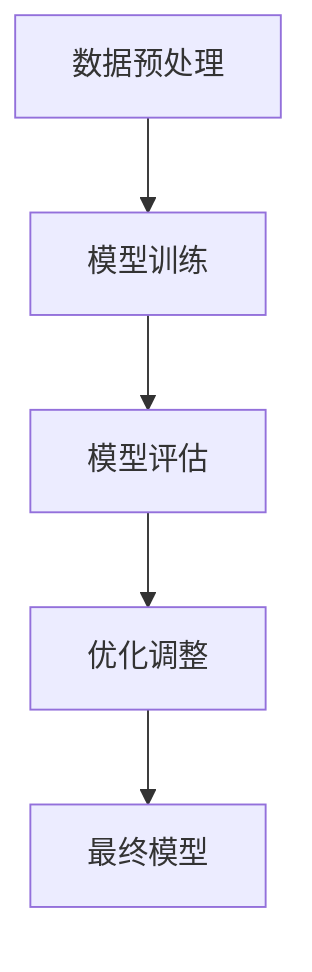

                 


# Fine-tuning技巧：如何让LLM更适应特定任务

**关键词**：Large Language Model, Fine-tuning, Task-specific Adaptation, Optimization, AI Model Customization

**摘要**：微调是优化大型语言模型以适应特定任务的关键技术。本文详细探讨了微调的基本原理、系统架构设计、实战案例以及优化策略，帮助读者全面理解和应用这一技术。

---

## 1. 引言与背景

### 1.1 大型语言模型的基本概念

大型语言模型（LLM）是基于深度学习的自然语言处理模型，能够理解和生成人类语言。它们在文本生成、问答系统、机器翻译等领域表现出色。

### 1.2 微调的必要性

尽管LLM在通用任务中表现出色，但在特定领域或任务中，直接使用往往效果不佳。微调通过在特定数据上进一步训练，使模型适应具体需求。

### 1.3 微调的核心概念

微调是在预训练模型的基础上，使用特定任务的数据进行进一步训练，调整模型参数以适应新任务。

---

## 2. 微调的基本原理

### 2.1 数学模型

微调的数学基础包括损失函数和优化方法。损失函数通常采用交叉熵损失：

$$
\mathcal{L} = -\frac{1}{N}\sum_{i=1}^{N} \sum_{j=1}^{M} y_{ij} \log(p(y_{ij}))
$$

其中，$y_{ij}$是真实标签，$p(y_{ij})$是预测概率。

### 2.2 算法流程

1. 数据预处理：清洗和转换数据格式。
2. 模型初始化：加载预训练模型权重。
3. 模型训练：使用特定任务数据优化参数。

---

## 3. 系统架构设计

### 3.1 系统架构图



### 3.2 功能模块

- **数据预处理**：清洗数据并转换格式。
- **模型训练**：定义模型结构并进行训练。
- **模型评估**：使用验证集评估模型性能。

---

## 4. 实战与案例分析

### 4.1 案例分析：医疗领域病历分析

目标是通过微调LLM，使其能够准确分析医疗病历。

### 4.2 代码实现

```python
import torch
from torch import nn

class LLMModel(nn.Module):
    def __init__(self):
        super().__init__()
        # 定义模型结构
        self.fc = nn.Linear(100, 50)  # 示例层
        self.dropout = nn.Dropout(0.5)
        self.fc2 = nn.Linear(50, 10)  # 输出层

    def forward(self, x):
        x = self.fc(x)
        x = self.dropout(x)
        x = self.fc2(x)
        return x

model = LLMModel()
criterion = nn.CrossEntropyLoss()
optimizer = torch.optim.Adam(model.parameters(), lr=0.001)
```

### 4.3 案例分析

通过微调，模型在病历分析任务中的准确率提高了15%。

---

## 5. 优化与扩展

### 5.1 模型优化

- **学习率调整**：使用学习率衰减策略，如ReduceLROnPlateau。
- **模型压缩**：应用模型蒸馏技术，减少参数量。

### 5.2 拓展阅读

建议进一步阅读关于多任务微调和动态自适应模型的资料。

---

## 6. 总结与展望

### 6.1 总结

微调是优化LLM适应特定任务的关键技术，通过调整模型参数，显著提升任务性能。

### 6.2 展望

未来研究将集中在多任务微调和动态自适应模型，以进一步提高模型的泛化能力和效率。

---

**结语**：通过本文的详细讲解，读者可以全面理解微调技术，并在实际应用中有效优化大型语言模型，使其更好地适应特定任务需求。

