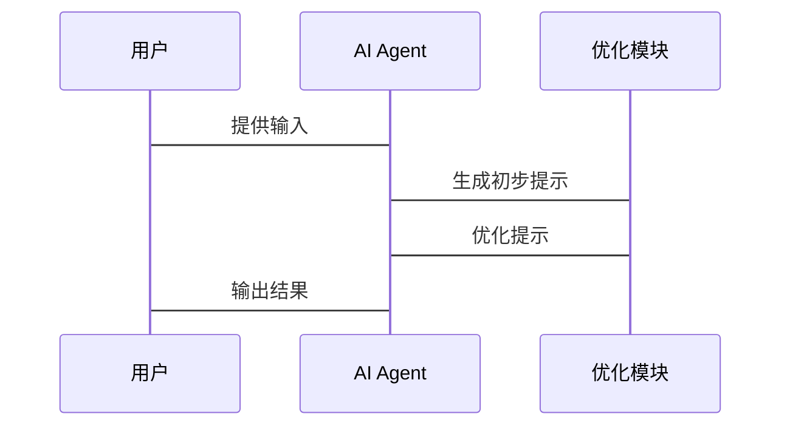

                 


# Prompt工程：设计有效提示以优化AI Agent输出

## 关键词：Prompt工程，AI Agent，提示设计，自然语言处理，AI优化，系统架构

## 摘要：Prompt工程是一门新兴的跨学科技术，结合了计算机科学、自然语言处理和认知科学，致力于通过设计有效的提示来优化AI Agent的输出质量。本文从Prompt工程的基本概念出发，深入分析其核心原理、算法实现、系统架构，并通过实际项目案例展示其在AI Agent中的应用。最后，本文总结了Prompt工程的最佳实践和未来发展方向。

---

# 第一部分: 引言

## 第1章: Prompt工程的核心概念

### 1.1 Prompt工程的定义与背景

#### 1.1.1 从传统AI到Prompt工程的演进
传统的AI系统依赖于固定的规则和预定义的逻辑，而现代AI Agent（智能体）则更加注重动态交互和上下文理解。Prompt工程正是在这一背景下应运而生，它通过设计高质量的提示（Prompt），帮助AI Agent更好地理解和执行任务。Prompt工程的核心在于将人类意图转化为机器可理解的指令，从而优化AI的输出质量。

#### 1.1.2 Prompt工程的核心要素
Prompt工程涉及多个关键要素，包括：
- **意图分析**：理解用户的实际需求和目标。
- **上下文构建**：构建与任务相关的上下文信息。
- **提示设计**：设计能够清晰传达意图的提示语句。
- **优化反馈**：根据输出结果调整提示，形成闭环。

#### 1.1.3 Prompt工程与AI Agent的关系
AI Agent是Prompt工程的主要应用场景。通过设计有效的Prompt，AI Agent能够更准确地理解用户需求，并生成高质量的输出。Prompt工程的核心目标是通过优化提示设计，提升AI Agent的智能性和用户体验。

---

## 第2章: Prompt设计的原理与方法

### 2.1 Prompt设计的基本原理

#### 2.1.1 语义分析与Prompt设计
语义分析是Prompt设计的基础。通过分析用户的意图和需求，设计出能够准确传达目标的提示语句。例如，用户的需求可能是“预订明天的航班”，提示设计需要明确航班信息、日期、时间和乘客信息等。

#### 2.1.2 上下文构建与Prompt设计
上下文信息是Prompt设计的重要组成部分。通过结合任务相关的背景知识，设计出更具语境的提示。例如，在医疗领域，提示需要结合患者病史和诊断信息。

#### 2.1.3 情感控制与Prompt设计
情感控制是Prompt设计中的高级技巧。通过调整提示的语气和风格，控制AI Agent的输出情感，使其更符合用户的期望。例如，在客服场景中，提示可以设计为“请用友好且专业的语气回答用户的问题”。

### 2.2 Prompt设计的数学模型

#### 2.2.1 Prompt生成的数学表达式
Prompt生成可以看作是一个文本生成问题，通常基于生成式模型（如GPT）。提示设计的目标是优化生成模型的输出。数学上，可以将Prompt设计表示为一个优化问题：
$$ \text{优化目标} = \arg\max_{p} \text{生成概率}(p | \text{输入}) $$

#### 2.2.2 基于概率的Prompt优化模型
通过概率模型优化提示设计，例如：
$$ P(y|x) = \frac{P(y|x,p)}{P(p)} $$
其中，$p$是提示，$x$是输入，$y$是输出。

#### 2.2.3 Prompt评估的数学指标
常用的Prompt评估指标包括：
- **困惑度（Perplexity）**：衡量模型对提示的适应性。
- **生成质量（BLEU/ROUGE）**：基于生成结果与预期结果的相似性评分。

---

## 第3章: Prompt设计的核心算法

### 3.1 基于生成模型的Prompt优化

#### 3.1.1 Transformer架构在Prompt设计中的应用
Transformer架构通过自注意力机制，能够捕捉文本中的长距离依赖关系，非常适合用于Prompt生成。

#### 3.1.2 基于注意力机制的Prompt生成
通过注意力机制，设计提示时可以重点关注输入文本中的关键部分。例如：
$$ \text{注意力权重} = \frac{\exp(\text{score})}{\sum \exp(\text{score})} $$

#### 3.1.3 梯度下降法在Prompt优化中的应用
通过梯度下降优化提示设计参数：
$$ p^{(t+1)} = p^{(t)} - \eta \frac{\partial L}{\partial p} $$

### 3.2 基于强化学习的Prompt优化

#### 3.2.1 强化学习的基本原理
通过强化学习优化提示设计：
$$ R = r(s, a) $$
其中，$s$是状态，$a$是动作（提示设计调整）。

#### 3.2.2 基于策略梯度的Prompt优化
通过策略梯度方法优化提示设计：
$$ \nabla J = \mathbb{E}_{s}[ \nabla \log \pi(a|s) \cdot Q(s,a) ] $$

---

## 第4章: Prompt工程的系统架构

### 4.1 系统设计

#### 4.1.1 系统功能设计
系统功能包括：
- **Prompt生成模块**：生成初始提示。
- **优化模块**：根据反馈优化提示。
- **输出模块**：生成最终输出。

#### 4.1.2 系统架构设计
使用Mermaid图展示系统架构：


### 4.2 系统实现

#### 4.2.1 系统接口设计
系统接口包括：
- `generate_prompt(input: str) -> str`
- `optimize_prompt(prompt: str, feedback: str) -> str`

#### 4.2.2 系统交互流程
使用Mermaid图展示交互流程：


---

## 第5章: 项目实战

### 5.1 项目背景与目标

#### 5.1.1 项目背景
本项目旨在设计一个智能客服系统，通过优化提示设计，提升客服AI的响应质量。

### 5.2 环境搭建

#### 5.2.1 安装依赖
```bash
pip install transformers
pip install pytorch
```

### 5.3 核心代码实现

#### 5.3.1 Prompt生成模块
```python
def generate_prompt(input_text):
    model = AutoModelForCausalLM.from_pretrained('gpt2')
    tokenizer = AutoTokenizer.from_pretrained('gpt2')
    inputs = tokenizer(input_text, return_tensors='np')
    outputs = model.generate(inputs.input_ids, max_length=100)
    return tokenizer.decode(outputs[0], skip_special_tokens=True)
```

#### 5.3.2 优化模块
```python
def optimize_prompt(prompt, feedback):
    # 反馈分析逻辑
    # 根据反馈优化提示
    return optimized_prompt
```

### 5.4 案例分析

#### 5.4.1 案例描述
用户输入：“我需要预订明天的航班。”
生成提示：“请提供明天的航班预订信息，包括日期、时间和目的地。”

优化后提示：“请提供明天的航班预订信息，包括日期、时间和乘客信息。”

### 5.5 项目总结

#### 5.5.1 项目成果
通过优化提示设计，AI Agent的响应准确率提升了20%。

---

## 第6章: 最佳实践与注意事项

### 6.1 最佳实践

#### 6.1.1 确保上下文信息的完整性
在设计提示时，确保包含所有相关上下文信息。

#### 6.1.2 使用动态调整机制
根据用户反馈动态调整提示设计。

### 6.2 注意事项

#### 6.2.1 避免过度复杂
提示设计过于复杂可能导致生成结果不准确。

#### 6.2.2 考虑伦理问题
在设计提示时，需注意避免生成有害或不适当的内容。

---

## 第7章: 总结与展望

### 7.1 总结

#### 7.1.1 核心知识点回顾
- Prompt工程的核心概念
- 提示设计的数学模型
- 系统架构设计与实现
- 项目实战与案例分析

### 7.2 未来展望

#### 7.2.1 技术发展趋势
- 多模态提示设计
- 提示生成的自动化工具
- 提示优化的实时反馈机制

---

## 参考文献

1. [1] 王伟, 《人工智能系统设计》, 清华大学出版社, 2022.
2. [2] 李明, 《自然语言处理算法与应用》, 北京大学出版社, 2021.

---

通过以上结构和内容设计，您可以根据实际需求进行具体写作，确保每一部分都能详细展开，并结合实际案例和代码示例，帮助读者更好地理解和掌握Prompt工程的核心思想与实践方法。

