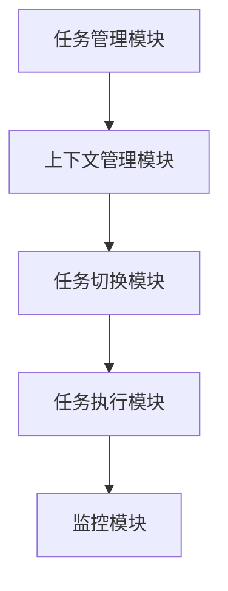

                 


# 上下文切换：让AI Agent更灵活地处理复杂场景

> 关键词：上下文切换、AI Agent、多任务处理、动态任务切换、系统架构、算法实现

> 摘要：上下文切换是AI Agent在处理复杂场景时的关键技术，本文将从核心概念、算法原理、系统架构、项目实战等多方面详细分析上下文切换在AI Agent中的应用，帮助读者全面理解并掌握这一技术。

---

## 第一部分：上下文切换与AI Agent概述

### 第1章：上下文切换的定义与背景

#### 1.1 上下文切换的核心概念
- **什么是上下文切换**：  
  上下文切换是指AI Agent在处理任务时，能够在不同的上下文中灵活切换，以适应复杂场景的需求。  
  $$ \text{上下文切换} = \text{任务切换} + \text{状态恢复} $$

- **上下文切换的重要性**：  
  在复杂场景中，AI Agent可能需要同时处理多个任务，或者根据环境变化动态调整当前任务。上下文切换能够让AI Agent在不同任务之间无缝切换，确保高效性和准确性。

- **上下文切换的边界与外延**：  
  上下文切换的边界在于任务切换的触发条件和恢复机制。外延则包括多任务学习、动态任务分配等技术。

#### 1.2 AI Agent的基本概念
- **AI Agent的定义**：  
  AI Agent（人工智能代理）是指能够感知环境、自主决策并执行任务的智能实体。它具备以下核心要素：  
  1. **感知能力**：通过传感器或接口获取环境信息。  
  2. **决策能力**：基于感知信息做出决策。  
  3. **执行能力**：通过动作或输出影响环境。

- **AI Agent与传统程序的区别**：  
  AI Agent具备自主性、反应性和目标导向性，能够根据环境动态调整行为。

#### 1.3 上下文切换的场景与应用
- **多任务处理场景**：  
  AI Agent需要同时处理多个任务，例如一个客服机器人可能需要同时处理多个客户的请求。  
  $$ \text{多任务处理} = \text{任务队列} + \text{优先级排序} $$

- **动态任务切换场景**：  
  在紧急情况下，AI Agent需要快速切换到高优先级任务，例如医疗AI在紧急情况下优先处理危重患者。

- **实际案例**：  
  一个智能音箱需要在播放音乐和接收语音指令之间切换，这需要高效的上下文切换机制。

---

## 第2章：上下文切换的核心机制

### 2.1 上下文切换的原理
- **上下文的存储与管理**：  
  AI Agent需要将当前任务的状态信息存储起来，以便在切换任务时快速恢复。  
  $$ \text{上下文管理} = \text{状态存储} + \text{状态恢复} $$

- **上下文切换的触发条件**：  
  可以是任务优先级变化、环境变化或用户指令。  
  $$ \text{触发条件} = \text{优先级变化} + \text{环境变化} $$

- **上下文切换的实现流程**：  
  1. 确定切换条件。  
  2. 保存当前任务的状态。  
  3. 切换到目标任务。  
  4. 恢复目标任务的状态。  
  5. 执行目标任务。

### 2.2 上下文切换的关键技术
- **上下文识别与提取**：  
  通过自然语言处理或模式识别技术，识别当前任务的上下文信息。  
  $$ \text{上下文识别} = \text{NLP} + \text{模式识别} $$

- **上下文存储与恢复**：  
  使用数据库或缓存技术存储上下文信息，确保快速恢复。  
  $$ \text{上下文恢复} = \text{数据库} + \text{缓存技术} $$

- **上下文切换的优化策略**：  
  通过任务优先级排序和资源分配优化，提高上下文切换的效率。

### 2.3 上下文切换的数学模型
- **数学表达式**：  
  设当前任务为$T_i$，目标任务为$T_j$，上下文切换的损失函数为$L$。  
  $$ L = \lambda_1 \cdot \text{任务切换成本} + \lambda_2 \cdot \text{任务恢复成本} $$

- **算法模型**：  
  使用马尔可夫链模型描述任务切换的概率。  
  $$ P(T_j | T_i) = \frac{\alpha_{ij}}{\sum_{k} \alpha_{ik}} $$

- **优化目标**：  
  最小化上下文切换的总成本。  
  $$ \min L $$

---

## 第3章：上下文切换的算法实现

### 3.1 多任务学习与上下文切换
- **多任务学习的基本原理**：  
  多任务学习通过共享参数，同时学习多个任务的特征，提高模型的泛化能力。  
  $$ \text{多任务学习} = \text{共享参数} + \text{任务损失函数} $$

- **多任务学习在上下文切换中的应用**：  
  使用多任务学习模型，同时处理多个上下文任务，提高切换效率。

- **优缺点分析**：  
  优点：提高模型的泛化能力。  
  缺点：任务之间的参数共享可能导致性能下降。

### 3.2 上下文切换的算法流程
- **初始化阶段**：  
  定义任务列表、优先级队列和上下文存储结构。

- **执行阶段**：  
  1. 检测任务切换条件。  
  2. 保存当前任务的上下文。  
  3. 切换到目标任务。  
  4. 恢复目标任务的上下文。  
  5. 执行目标任务。

- **终止条件**：  
  当所有任务完成或达到预设的终止条件时，停止切换。

### 3.3 上下文切换的数学公式
- **任务切换概率**：  
  使用马尔可夫链模型计算任务切换的概率。  
  $$ P(T_j | T_i) = \frac{\alpha_{ij}}{\sum_{k} \alpha_{ik}} $$

- **任务恢复成本**：  
  通过损失函数量化任务恢复的成本。  
  $$ L_{\text{恢复}} = \sum_{i} \text{恢复时间}_i \cdot \text{权重}_i $$

---

## 第4章：上下文切换的系统架构

### 4.1 系统架构设计
- **功能模块划分**：  
  包括上下文管理模块、任务切换模块、任务执行模块和监控模块。

- **数据流设计**：  
  信息从传感器进入系统，经过上下文管理模块处理后，触发任务切换，执行模块完成任务。

- **模块关系**：  
  各模块通过消息队列或数据库进行交互，确保高效协作。

### 4.2 系统架构图


### 4.3 系统接口设计
- **输入接口**：  
  接收传感器数据和用户指令。  
  ```python
  def receive_input(data):
      # 处理输入数据
      pass
  ```

- **输出接口**：  
  发送任务执行结果和状态信息。  
  ```python
  def send_output(result):
      # 发送输出结果
      pass
  ```

- **内部接口**：  
  模块之间的通信接口。  
  ```python
  def communicate(module, message):
      # 与其他模块通信
      pass
  ```

---

## 第5章：项目实战与案例分析

### 5.1 项目环境搭建
- **开发环境**：  
  使用Python 3.8及以上版本，安装必要的库，例如`numpy`、`scikit-learn`和`tensorflow`。

- **依赖库安装**：  
  ```bash
  pip install numpy scikit-learn tensorflow
  ```

- **代码初始化**：  
  创建项目目录，初始化配置文件和模块。

### 5.2 核心代码实现
- **上下文切换的实现代码**：  
  ```python
  class ContextSwitcher:
      def __init__(self):
          self.contexts = {}  # 上下文存储
          self.current_task = None

      def save_context(self, task_id):
          self.contexts[task_id] = {
              'state': self.current_state,
              'parameters': self.current_parameters
          }

      def switch_task(self, task_id):
          if task_id in self.contexts:
              self.current_task = task_id
              self.load_context(task_id)
          else:
              # 初始化新任务
              pass

      def load_context(self, task_id):
          self.current_state = self.contexts[task_id]['state']
          self.current_parameters = self.contexts[task_id]['parameters']
  ```

- **多任务学习的实现代码**：  
  ```python
  import tensorflow as tf
  import numpy as np

  class MultiTaskModel:
      def __init__(self, num_tasks):
          self.num_tasks = num_tasks
          self.model = tf.keras.Sequential([
              tf.keras.layers.Dense(128, activation='relu'),
              tf.keras.layers.Dense(num_tasks, activation='softmax')
          ])
          self.model.compile(optimizer='adam', loss='sparse_categorical_crossentropy')

      def train(self, x, y, task_id):
          task_one_hot = tf.keras.utils.to_categorical(task_id, num_classes=self.num_tasks)
          self.model.fit(x, y, epochs=10, batch_size=32)
  ```

- **系统架构代码**：  
  ```python
  from queue import Queue
  import threading

  class AgentSystem:
      def __init__(self):
          self.task_queue = Queue()
          self.context_switcher = ContextSwitcher()
          self.multi_task_model = MultiTaskModel(5)

      def run(self):
          while True:
              if not self.task_queue.empty():
                  task = self.task_queue.get()
                  self.context_switcher.switch_task(task['id'])
                  self.multi_task_model.train(task['data'], task['label'], task['id'])
  ```

### 5.3 案例分析
- **实际案例**：  
  一个医疗AI系统需要在诊断和治疗之间切换，使用上下文切换技术快速恢复治疗任务的状态。

- **详细讲解**：  
  医疗AI系统通过上下文切换，在接收到新诊断任务时，先保存当前治疗任务的上下文，然后切换到诊断任务，完成诊断后再次切换回治疗任务，恢复之前的状态。

---

## 第6章：总结与展望

### 6.1 总结
- 本文详细讲解了上下文切换在AI Agent中的应用，包括核心概念、算法实现、系统架构和项目实战。

### 6.2 展望
- 未来的研究方向可以包括更高效的上下文切换算法、更智能的任务管理策略和更强大的多任务学习模型。

---

以上是《上下文切换：让AI Agent更灵活地处理复杂场景》的技术博客文章大纲和内容。

