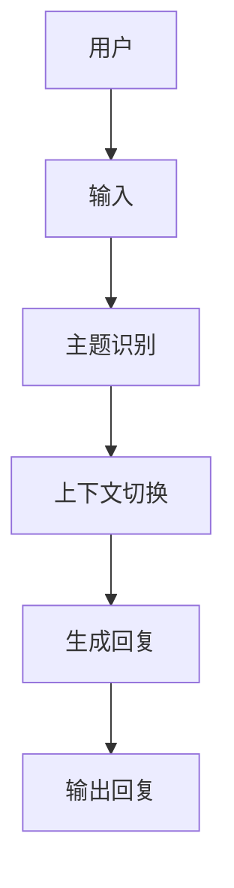
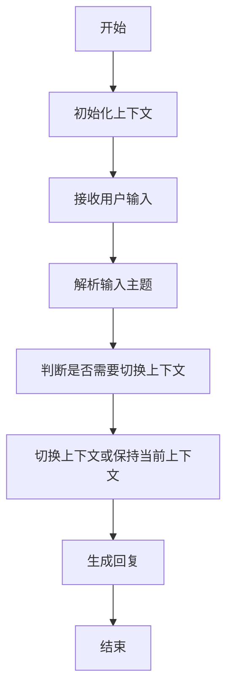
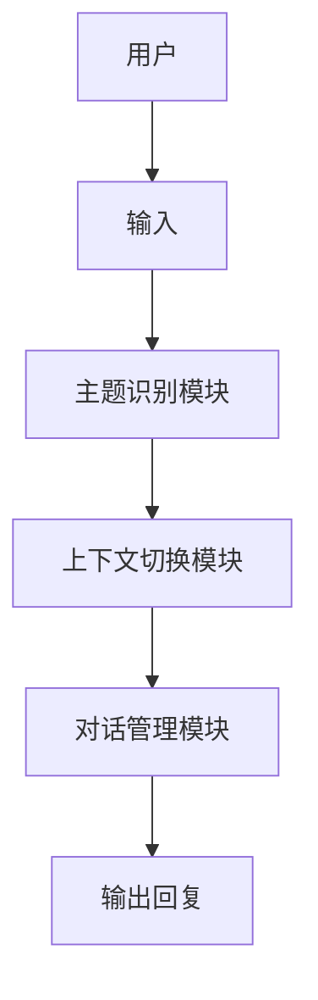
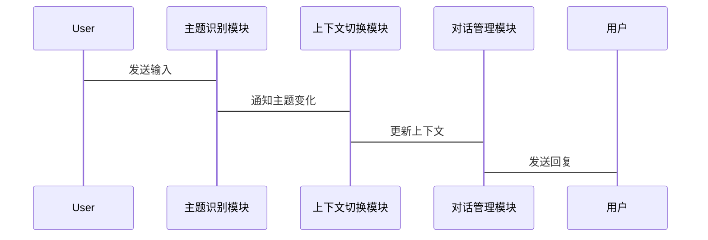

                 


# 上下文切换：让AI Agent灵活应对多主题对话

---

## 关键词

上下文切换, 多主题对话, AI Agent, 对话管理, 自然语言处理, 实体关系图, 算法流程图

---

## 摘要

本文详细探讨了上下文切换在AI Agent中的应用，分析了多主题对话中的上下文管理问题，并提出了基于自然语言处理的上下文切换算法。文章从背景介绍、核心概念、算法原理、系统架构到项目实战，全面阐述了上下文切换的实现方法和应用场景，为AI Agent的开发提供了理论支持和实践指导。

---

# 第一部分: 上下文切换的背景与概念

## 第1章: 上下文切换的背景与问题背景

### 1.1 上下文切换的核心概念

#### 1.1.1 什么是上下文切换

上下文切换是指在多主题对话中，AI Agent能够根据对话内容的变化，动态调整当前处理的主题和上下文信息。例如，当用户从讨论天气转到讨论旅行时，AI Agent需要识别主题变化并切换上下文。

#### 1.1.2 多主题对话的定义与特点

多主题对话是指对话内容涉及多个不同主题，且主题之间可能没有直接关联。例如，用户可能在对话中交替讨论天气、旅行和健康话题。

#### 1.1.3 AI Agent在多主题对话中的角色

AI Agent需要在多主题对话中灵活切换上下文，确保每个主题的回复准确且连贯。这要求AI Agent具备上下文记忆和主题识别能力。

---

### 1.2 问题背景与挑战

#### 1.2.1 当前AI对话系统的局限性

大多数AI对话系统只能处理单一主题的对话，无法有效处理多主题对话中的上下文切换问题。

#### 1.2.2 多主题对话中的常见问题

- 主题识别困难：AI Agent难以准确识别主题变化。
- 上下文丢失：主题切换后，之前的上下文信息无法有效利用。
- 回答不连贯：由于上下文切换不及时，导致回答缺乏连贯性。

#### 1.2.3 上下文切换的必要性与重要性

上下文切换是实现多主题对话的关键技术，能够提升AI Agent的对话能力和用户体验。

---

### 1.3 问题描述与解决思路

#### 1.3.1 多主题对话中的上下文管理问题

AI Agent需要能够识别主题变化，并在主题变化时切换上下文，同时保持对话的连贯性。

#### 1.3.2 上下文切换的核心目标

- 准确识别主题变化。
- 动态切换上下文。
- 确保对话的连贯性。

#### 1.3.3 解决问题的思路与方法

结合自然语言处理技术，通过主题识别和上下文管理实现上下文切换。

---

### 1.4 上下文切换的边界与外延

#### 1.4.1 上下文切换的边界条件

- 主题变化的明确性：主题变化是否可以通过语言特征识别。
- 上下文信息的有效性：切换后的上下文信息是否足够支持对话。

#### 1.4.2 相关概念的对比与区分

| 概念         | 描述                                   |
|--------------|--------------------------------------|
| 上下文切换   | 动态调整当前主题和上下文信息           |
| 多主题对话   | 涉及多个主题的对话                   |
| 对话管理      | 对话过程的规划与控制                 |

#### 1.4.3 上下文切换的外延与应用场景

上下文切换广泛应用于智能客服、智能助手、智能对话系统等领域。

---

### 1.5 核心概念结构与组成

#### 1.5.1 上下文切换的构成要素

- 主题识别：识别当前对话的主题。
- 上下文存储：存储当前主题的上下文信息。
- 上下文切换：根据主题变化切换上下文。

#### 1.5.2 各要素之间的关系与作用

- 主题识别触发上下文切换。
- 上下文存储提供切换后的上下文信息。
- 上下文切换确保对话的连贯性。

#### 1.5.3 核心概念的系统性分析

通过构建实体关系图，可以清晰地理解上下文切换系统中各要素的关系。

---

## 第2章: 上下文切换的核心原理

### 2.1 上下文切换的原理与机制

#### 2.1.1 上下文信息的存储与管理

- 使用数据结构（如哈希表）存储上下文信息。
- 根据主题进行上下文信息的分类存储。

#### 2.1.2 上下文切换的触发条件

- 主题识别算法检测到主题变化。
- 用户输入的内容与当前上下文无关。

#### 2.1.3 上下文切换的实现过程

1. 识别主题变化。
2. 切换到新的上下文。
3. 生成基于新上下文的回复。

---

### 2.2 核心概念的属性与特征对比

| 属性         | 描述                                   |
|--------------|--------------------------------------|
| 主题识别      | 通过关键词和语义分析识别主题           |
| 上下文存储    | 存储与主题相关的上下文信息             |
| 上下文切换    | 根据主题变化切换上下文信息             |

---

### 2.3 实体关系图与上下文切换架构

使用Mermaid绘制实体关系图：



---

## 第3章: 上下文切换的算法实现

### 3.1 算法原理概述

#### 3.1.1 基于上下文的对话管理算法

- 使用主题识别算法（如基于关键词的分类）识别当前主题。
- 根据主题切换上下文。
- 生成基于新上下文的回复。

#### 3.1.2 多主题对话的切换机制

- 基于主题相似度的切换策略。
- 基于用户意图的切换策略。

#### 3.1.3 上下文信息的更新与维护

- 使用数据结构动态更新上下文信息。

---

### 3.2 算法实现的数学模型

#### 3.2.1 上下文表示的数学模型

- 使用向量表示上下文信息，例如词嵌入（Word Embedding）。

#### 3.2.2 多主题对话切换的数学公式

$$ P(\text{主题切换}|x) = \frac{\text{主题变化特征}(x)}{\text{总特征}(x)} $$

其中，$x$ 表示用户输入的内容，$\text{主题变化特征}(x)$ 表示与主题变化相关的特征。

---

### 3.3 算法流程图与实现代码

使用Mermaid绘制算法流程图：



#### 核心代码实现

```python
def context_switch(user_input, current_context):
    # 主题识别
    theme = identify_theme(user_input)
    # 判断是否需要切换上下文
    if theme not in current_context:
        current_context = switch_context(theme)
    return current_context
```

---

## 第4章: 系统分析与架构设计

### 4.1 系统分析

#### 4.1.1 问题场景介绍

多主题对话中，AI Agent需要动态切换上下文，确保对话的连贯性。

#### 4.1.2 系统功能设计

- 主题识别功能。
- 上下文切换功能。
- 对话管理功能。

#### 4.1.3 系统架构设计

使用Mermaid绘制系统架构图：



#### 4.1.4 系统交互设计

使用Mermaid绘制交互序列图：



---

## 第5章: 项目实战

### 5.1 项目环境安装

- 安装Python和相关库（如TensorFlow、Numpy）。

### 5.2 核心代码实现

```python
def identify_theme(text):
    # 使用关键词匹配识别主题
    keywords = {
        '天气': ['天气', '气候', '温度'],
        '旅行': ['旅行', '景点', '酒店'],
        '健康': ['健康', '健身', '饮食']
    }
    for theme, words in keywords.items():
        for word in words:
            if word in text:
                return theme
    return None
```

### 5.3 案例分析

#### 案例1：天气和旅行主题切换

用户输入：
1. "今天天气真好。"
2. "你能推荐一些旅行景点吗？"

处理过程：
1. 初始主题为天气。
2. 接收到旅行主题输入，触发主题切换。
3. 切换到旅行主题的上下文。
4. 生成旅行相关的回复。

---

## 第6章: 总结与展望

### 6.1 最佳实践 Tips

- 定期更新上下文信息。
- 使用高效的上下文存储结构。

### 6.2 项目小结

本文详细阐述了上下文切换的实现方法和应用场景，为AI Agent的开发提供了理论支持和实践指导。

### 6.3 注意事项

- 注意上下文切换的及时性。
- 避免上下文信息的混淆。

### 6.4 拓展阅读

推荐阅读《自然语言处理实战》和《对话系统设计与实现》。

---

# 结语

上下文切换是实现多主题对话的关键技术，通过本文的分析与实践，读者可以深入了解上下文切换的实现方法，并将其应用于实际项目中。

