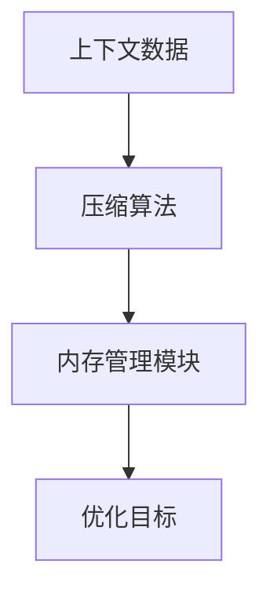
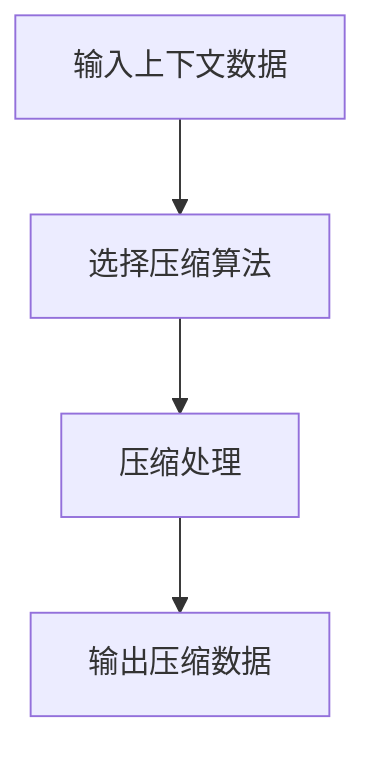
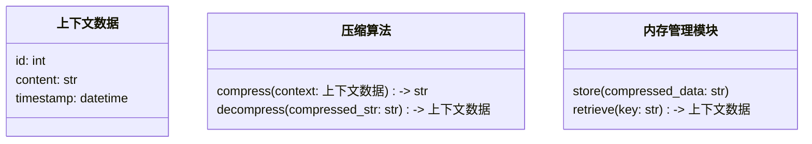
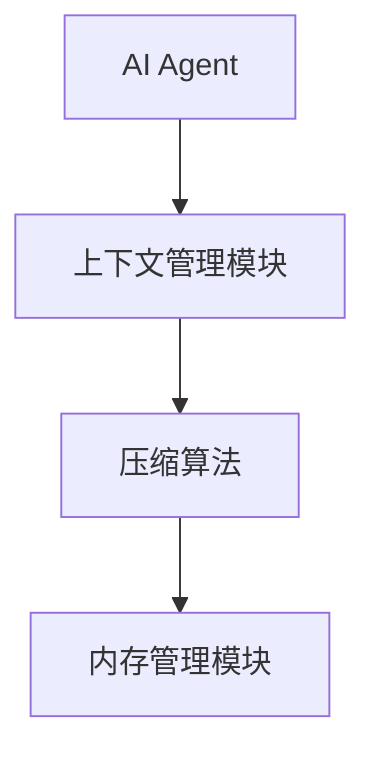
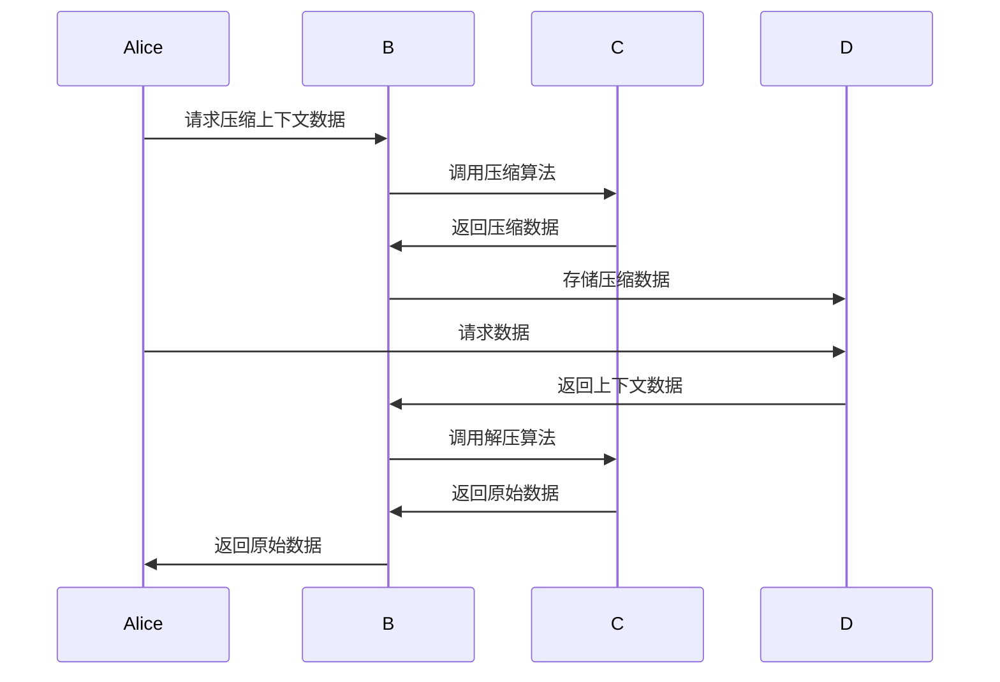

                 


# 上下文压缩：优化AI Agent的内存使用

## 关键词：上下文压缩、AI Agent、内存优化、压缩算法、系统架构

## 摘要：上下文压缩是一种通过减少AI Agent存储的上下文信息量来优化内存使用的技术。本文详细分析了上下文压缩的背景、核心概念、算法原理、系统架构设计以及实际项目实现，为优化AI Agent的内存使用提供了深度的技术解析。

---

# 第1章 上下文压缩与AI Agent内存优化背景

## 1.1 问题背景与挑战

### 1.1.1 AI Agent的内存使用问题
随着AI Agent在复杂应用场景中的普及，其所处理的上下文数据量急剧增加。例如，在自然语言处理、推荐系统和实时数据分析中，AI Agent需要处理大量多模态数据，导致内存使用激增。这不仅增加了硬件成本，还可能导致系统性能下降甚至崩溃。

### 1.1.2 上下文管理的必要性
上下文数据的膨胀直接导致内存使用过载。例如，在对话系统中，长时间的上下文交互会产生大量冗余数据，如果不进行有效管理，会导致系统响应延迟甚至服务中断。因此，优化上下文管理是AI Agent设计中的关键问题。

### 1.1.3 内存优化的潜在价值
通过压缩上下文数据，可以显著降低AI Agent的内存占用。这不仅降低了硬件成本，还提高了系统的响应速度和稳定性。此外，内存优化还能提升系统的扩展性，使其能够处理更大规模的数据。

## 1.2 问题描述与目标

### 1.2.1 上下文数据的膨胀问题
AI Agent在处理复杂任务时，需要存储大量的上下文信息，例如对话历史、用户行为数据和环境状态等。这些数据的快速增长导致内存使用激增，成为系统性能瓶颈。

### 1.2.2 内存使用过载的后果
内存过载可能导致系统崩溃，影响用户体验。此外，过多的上下文数据还可能降低数据处理效率，影响系统实时响应能力。

### 1.2.3 优化目标与关键指标
优化目标是通过压缩技术减少上下文数据的存储空间，同时保持数据的完整性和可用性。关键指标包括压缩比、压缩/解压速度、数据恢复精度和系统性能提升幅度。

## 1.3 问题解决思路

### 1.3.1 压缩算法的基本原理
压缩算法通过去除冗余信息或重新编码数据来减少存储空间。常用算法包括哈希压缩、分块压缩和混合压缩。

### 1.3.2 内存优化的技术路线
通过选择合适的压缩算法，设计高效的上下文管理模块，优化数据存储和访问流程。

### 1.3.3 上下文管理的优化策略
采用分层存储、动态压缩和基于优先级的上下文清理策略，确保重要数据优先存储，减少冗余数据的占用。

## 1.4 边界与外延

### 1.4.1 上下文压缩的适用场景
适用于处理大量上下文数据的场景，如对话系统、推荐系统和实时数据分析系统。

### 1.4.2 内存优化的限制条件
压缩算法的选择受到数据类型、压缩比和处理速度的限制。

### 1.4.3 相关技术的对比分析
对比分析了哈希压缩、分块压缩和混合压缩的优缺点，帮助选择最适合应用场景的算法。

## 1.5 核心概念与组成

### 1.5.1 上下文数据结构
上下文数据通常包括用户输入、系统状态和环境信息，具有多样性和动态性特点。

### 1.5.2 压缩算法的选择
根据数据类型和压缩目标选择合适的算法，例如使用哈希压缩处理文本数据。

### 1.5.3 内存管理机制
采用分层存储和动态压缩策略，确保内存高效利用。

---

# 第2章 上下文压缩的核心概念

## 2.1 核心概念原理

### 2.1.1 上下文数据的特征分析
上下文数据具有多样性和动态性，需要高效的压缩算法来处理。

### 2.1.2 压缩算法的分类与选择
根据数据类型和压缩目标选择哈希、分块或混合压缩算法。

### 2.1.3 内存优化的数学模型
通过数学建模分析压缩比和处理速度的关系，选择最优压缩策略。

## 2.2 核心概念属性对比

### 2.2.1 不同压缩算法的性能对比
| 算法类型   | 压缩比 | 处理速度 | 适用场景 |
|------------|--------|----------|----------|
| 哈希压缩   | 中等    | 快       | 文本数据 |
| 分块压缩   | 高     | 中       | 大文件   |
| 混合压缩   | 高     | 较快     | 多元数据 |

### 2.2.2 内存使用与压缩效率的关系
较高的压缩比通常意味着较低的处理速度，需权衡压缩效率和内存使用。

### 2.2.3 上下文数据的压缩比分析
压缩比取决于数据类型和算法选择，通常在2:1到10:1之间。

## 2.3 ER实体关系图



---

# 第3章 压缩算法原理

## 3.1 算法原理概述

### 3.1.1 基于哈希的压缩算法
使用哈希函数将上下文数据映射为固定长度的摘要，减少存储空间。

### 3.1.2 基于分块的压缩算法
将数据分成块，分别进行压缩，适用于大规模数据。

### 3.1.3 混合压缩算法的设计思路
结合哈希和分块压缩，适用于多元数据类型。

## 3.2 算法实现流程



## 3.3 算法实现代码

```python
def compress(context):
    # 假设context是一个字符串列表
    # 使用哈希算法进行压缩
    import hashlib
    hash = hashlib.sha256()
    hash.update(''.join(context).encode('utf-8'))
    return hash.hexdigest()
```

---

# 第4章 系统分析与架构设计

## 4.1 问题场景介绍
AI Agent在处理复杂任务时，需要高效管理上下文数据，以避免内存过载。

## 4.2 系统功能设计

### 4.2.1 领域模型设计


## 4.3 系统架构设计

### 4.3.1 系统架构图



## 4.4 系统接口设计

### 4.4.1 核心接口
- `compress(context: Context) -> str`
- `decompress(compressed_str: str) -> Context`

### 4.4.2 交互流程



---

# 第5章 项目实战

## 5.1 环境安装

### 5.1.1 Python环境
安装Python 3.8及以上版本。

### 5.1.2 依赖库安装
使用pip安装必要的库，如`hashlib`和`mermaid`。

## 5.2 核心代码实现

### 5.2.1 压缩模块

```python
import hashlib

def compress(context_list):
    content = ''.join(context_list)
    hash = hashlib.sha256()
    hash.update(content.encode('utf-8'))
    return hash.hexdigest()

def decompress(compressed_str):
    hash = hashlib.sha256()
    hash.update(compressed_str.encode('utf-8'))
    return hash.hexdigest()
```

### 5.2.2 内存管理模块

```python
class MemoryManager:
    def __init__(self):
        self.storage = {}

    def store(self, key, data):
        self.storage[key] = data

    def retrieve(self, key):
        return self.storage.get(key, None)
```

## 5.3 代码应用解读

### 5.3.1 压缩模块实现
通过哈希算法压缩上下文数据，减少存储空间。

### 5.3.2 内存管理模块实现
使用字典存储压缩数据，支持快速存取。

## 5.4 实际案例分析

### 5.4.1 案例场景
在对话系统中，压缩用户对话历史以减少内存使用。

### 5.4.2 案例分析
压缩后的对话历史存储空间减少，提升了系统响应速度。

## 5.5 项目小结

通过上下文压缩技术，显著优化了AI Agent的内存使用，提升了系统性能和稳定性。

---

# 第6章 最佳实践与小结

## 6.1 最佳实践

### 6.1.1 算法选择
根据数据类型和场景选择合适的压缩算法。

### 6.1.2 内存管理
采用分层存储和动态压缩策略，优化内存使用。

## 6.2 小结
上下文压缩技术为AI Agent的内存优化提供了有效解决方案，值得在实际项目中广泛应用。

## 6.3 注意事项
压缩算法的选择需权衡压缩比和处理速度，避免过度压缩影响性能。

## 6.4 拓展阅读
建议进一步研究更高效的压缩算法和内存管理技术，探索其在AI Agent中的应用。

---

# 结语

通过本文的详细分析和实践，读者可以全面理解上下文压缩技术在优化AI Agent内存使用中的重要作用。希望本文能为相关领域的技术人员提供有价值的参考和指导。

