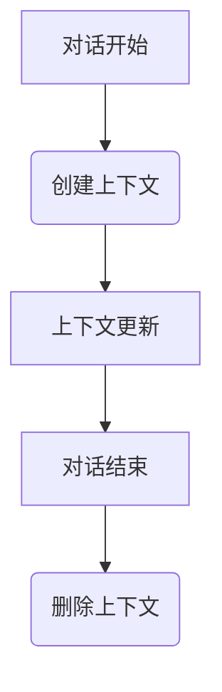

                 

# 上下文管理：增强AI Agent的对话连贯性

> 关键词：上下文管理，AI Agent，对话系统，自然语言处理，对话连贯性，知识图谱，记忆网络

> 摘要：上下文管理是实现AI Agent与人类对话连贯性的关键。本文将从上下文管理的核心概念、技术实现、算法原理、系统架构到实际应用案例进行全面解析，深入探讨如何通过上下文管理提升AI Agent的对话能力。

---

## 第1章: 上下文管理的核心概念

### 1.1 上下文管理的定义与背景

#### 1.1.1 什么是上下文管理
上下文管理是指在对话过程中，AI Agent能够理解和维护当前对话的上下文信息，包括用户的历史输入、对话的主题、相关实体等。这种能力使得AI Agent能够保持对话的连贯性和一致性。

#### 1.1.2 上下文管理的重要性
在现代对话系统中，上下文管理是实现自然语言理解（NLU）和自然语言生成（NLG）的关键。通过上下文管理，AI Agent能够更好地理解用户意图，提供更准确和连贯的回复。

#### 1.1.3 上下文管理的演进历程
从早期的基于规则的上下文管理到现代的基于深度学习的上下文管理，上下文管理技术经历了从简单到复杂的演进。当前，基于记忆网络和知识图谱的上下文管理方法正在得到广泛应用。

### 1.2 AI Agent与上下文管理的关系

#### 1.2.1 AI Agent的基本概念
AI Agent是一种智能体，能够感知环境、理解用户需求并执行相应的操作。AI Agent的核心能力包括感知、推理和行动。

#### 1.2.2 上下文管理在AI Agent中的作用
上下文管理是AI Agent实现对话能力的关键模块。它负责维护对话的上下文信息，确保AI Agent能够根据当前对话的状态生成合适的回复。

#### 1.2.3 上下文管理与对话连贯性的关系
上下文管理通过维护对话的历史信息，确保每一轮对话都与前一轮保持连贯，从而提升对话的自然性和流畅性。

---

## 第2章: 上下文管理的核心要素

### 2.1 上下文的表示与存储

#### 2.1.1 上下文的表示方法
上下文的表示方法包括基于向量的表示和基于符号的表示。基于向量的表示方法（如词嵌入）能够捕捉上下文的语义信息，而基于符号的表示方法则更适用于需要精确语义分析的场景。

| 表示方法 | 优点 | 缺点 |
|----------|------|------|
| 基于向量的表示 | 捕捉语义信息能力强 | 难以直接解释 |
| 基于符号的表示 | 可解释性高 | 计算效率低 |

#### 2.1.2 上下文的存储方式
上下文的存储方式包括基于数据库的存储和基于知识图谱的存储。基于数据库的存储适合简单的上下文信息，而基于知识图谱的存储则能够处理复杂的语义关系。

#### 2.1.3 上下文的生命周期
上下文的生命周期包括创建、更新和删除。在对话过程中，上下文信息会随着对话的推进而动态变化。

### 2.2 上下文的关联性与动态性

#### 2.2.1 上下文的关联性分析
上下文的关联性分析是通过计算当前对话内容与历史对话内容的相关性来实现的。常用的关联性分析方法包括余弦相似度和Jaccard相似度。

#### 2.2.2 上下文的动态更新机制
上下文的动态更新机制是指在对话过程中，根据新的对话内容不断更新上下文信息。这种机制通常基于反馈机制实现。

#### 2.2.3 上下文的有效性评估
上下文的有效性评估是通过评估当前上下文信息对对话的贡献程度来实现的。有效的上下文信息能够提高对话的准确性和连贯性。

---

## 第3章: 上下文管理的关键技术

### 3.1 基于注意力机制的上下文表示

#### 3.1.1 注意力机制的基本原理
注意力机制是一种基于权重分配的机制，能够突出对话中重要的信息。在上下文表示中，注意力机制可以帮助模型关注对话中最重要的部分。

#### 3.1.2 基于Transformer的上下文表示方法
基于Transformer的上下文表示方法通过多头注意力机制实现上下文的多维度表示，能够捕捉对话中的复杂语义关系。

#### 3.1.3 注意力机制在对话中的应用
在对话生成中，注意力机制可以帮助模型根据上下文信息生成更连贯的回复。

### 3.2 基于记忆网络的上下文管理

#### 3.2.1 记忆网络的基本结构
记忆网络是一种用于存储和检索上下文信息的结构，通常包括读写操作。

#### 3.2.2 基于记忆网络的上下文存储与检索
基于记忆网络的上下文存储与检索通过读写操作实现对上下文信息的动态管理。

#### 3.2.3 记忆网络在对话系统中的应用
在对话系统中，记忆网络可以用于存储对话历史信息，并根据当前对话内容检索相关的历史信息。

---

## 第4章: 上下文管理的算法实现

### 4.1 基于上下文的对话生成算法

#### 4.1.1 基于RNN的对话生成模型
基于RNN的对话生成模型通过循环神经网络实现上下文的连续表示。

#### 4.1.2 基于Transformer的对话生成模型
基于Transformer的对话生成模型通过多头注意力机制实现上下文的多维度表示。

#### 4.1.3 基于上下文的条件生成模型
基于上下文的条件生成模型通过条件概率生成对话回复，能够根据上下文信息生成更连贯的回复。

### 4.2 上下文关联性评估算法

#### 4.2.1 基于相似度的上下文关联性评估
基于相似度的上下文关联性评估通过计算对话内容的相似度来评估上下文的关联性。

#### 4.2.2 基于语义理解的上下文关联性评估
基于语义理解的上下文关联性评估通过语义分析技术评估对话内容的语义关联性。

#### 4.2.3 基于图结构的上下文关联性评估
基于图结构的上下文关联性评估通过构建对话内容的语义图谱来评估上下文的关联性。

---

## 第5章: 上下文管理的系统架构

### 5.1 问题场景介绍

#### 5.1.1 对话系统的组成
对话系统通常包括自然语言理解模块、对话管理模块和自然语言生成模块。

#### 5.1.2 上下文管理在对话系统中的作用
上下文管理是对话系统的核心模块之一，负责维护对话的上下文信息。

### 5.2 系统功能设计

#### 5.2.1 领域模型设计
领域模型设计包括用户需求分析、系统功能设计和交互流程设计。

#### 5.2.2 系统架构设计
系统架构设计包括分层架构和微服务架构。

#### 5.2.3 接口设计与交互流程
接口设计与交互流程设计包括API接口设计和交互序列图设计。

### 5.3 系统实现

#### 5.3.1 系统实现的关键步骤
系统实现的关键步骤包括环境搭建、代码实现和系统测试。

#### 5.3.2 核心代码实现
核心代码实现包括上下文管理模块的实现和对话生成模块的实现。

#### 5.3.3 代码解读与分析
代码解读与分析包括代码结构分析和功能模块解读。

---

## 第6章: 项目实战

### 6.1 智能客服系统的上下文管理实现

#### 6.1.1 项目背景介绍
智能客服系统是一种常见的对话系统，广泛应用于客户服务领域。

#### 6.1.2 系统实现
系统实现包括环境搭建、代码实现和系统测试。

#### 6.1.3 代码解读与分析
代码解读与分析包括上下文管理模块的实现和对话生成模块的实现。

#### 6.1.4 实际案例分析
实际案例分析包括系统功能分析和性能优化建议。

---

## 第7章: 总结与展望

### 7.1 总结

#### 7.1.1 上下文管理的核心作用
上下文管理是实现AI Agent对话连贯性的关键。

#### 7.1.2 上下文管理的关键技术
上下文管理的关键技术包括基于注意力机制的上下文表示和基于记忆网络的上下文管理。

### 7.2 展望

#### 7.2.1 上下文管理的未来发展方向
上下文管理的未来发展方向包括多模态上下文管理、动态上下文管理和基于知识图谱的上下文管理。

#### 7.2.2 上下文管理在更多场景中的应用
上下文管理将在更多场景中得到应用，包括智能客服、智能家居和自动驾驶等领域。

---

## 第8章: 附录

### 8.1 最佳实践

#### 8.1.1 上下文管理的实践建议
上下文管理的实践建议包括选择合适的上下文表示方法和动态更新机制。

#### 8.1.2 上下文管理的常见问题与解决方案
上下文管理的常见问题与解决方案包括上下文信息的有效性和上下文信息的存储问题。

### 8.2 小结

#### 8.2.1 上下文管理的核心内容回顾
上下文管理的核心内容包括上下文的表示与存储、上下文的关联性与动态性、上下文管理的关键技术和上下文管理的系统架构。

### 8.3 注意事项

#### 8.3.1 上下文管理的注意事项
上下文管理的注意事项包括上下文信息的有效性和上下文信息的隐私保护。

### 8.4 拓展阅读

#### 8.4.1 推荐阅读的书籍和论文
推荐阅读的书籍和论文包括《注意力机制：从原理到实践》和《基于知识图谱的对话系统研究》。

---

通过以上章节的详细讲解，我们可以全面了解上下文管理在增强AI Agent对话连贯性中的重要作用，并掌握其实现的关键技术和应用方法。

