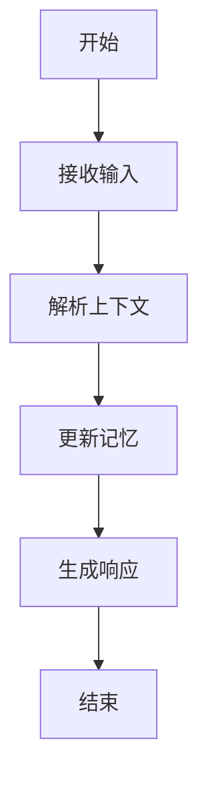
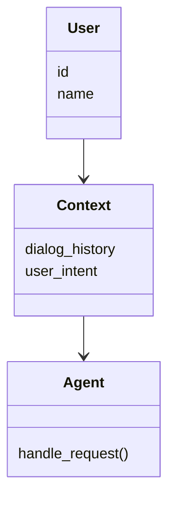
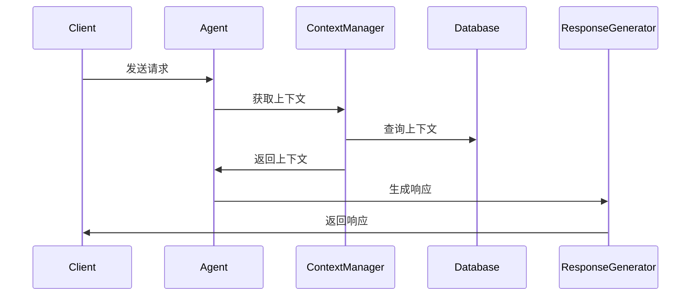

                 


# 上下文管理：增强AI Agent的对话连贯性

## 关键词：上下文管理, AI Agent, 对话连贯性, 背景介绍, 核心概念, 算法原理, 系统设计

## 摘要：上下文管理是提升AI Agent对话系统连贯性的关键技术。本文从背景、核心概念、算法原理、系统设计、项目实战等方面全面解析上下文管理，结合Mermaid图表和Python代码，详细阐述其在AI Agent中的应用。

---

# 第1章: 上下文管理的背景与概念

## 1.1 上下文管理的基本概念

### 1.1.1 上下文的定义与特征
上下文指的是在特定场景下，与当前任务相关的背景信息、对话历史、用户意图和系统状态。其主要特征包括：动态性（随对话进展实时更新）、关联性（信息之间相互关联）和多样性（支持多模态数据）。

### 1.1.2 上下文管理的定义与范围
上下文管理是指通过算法和技术手段，对对话过程中生成的上下文信息进行采集、解析、存储和应用的过程。其范围涵盖数据采集、信息处理、状态维护和应用反馈四个环节。

### 1.1.3 上下文管理的核心要素
1. **信息采集**：通过自然语言处理技术获取用户输入。
2. **信息存储**：使用数据结构或模型保存上下文信息。
3. **信息更新**：根据对话进展实时更新上下文。
4. **信息应用**：将上下文信息用于生成对话响应。

## 1.2 上下文管理的背景与问题背景

### 1.2.1 当前AI Agent的发展现状
AI Agent在智能客服、智能助手等领域广泛应用，但对话连贯性问题依然存在，导致用户体验差。

### 1.2.2 对话系统中的连贯性问题
1. **信息遗忘**：对话过程中，系统无法记住之前的信息。
2. **意图混淆**：用户意图变化时，系统无法准确理解。
3. **状态丢失**：对话中断后，系统无法恢复之前的上下文。

### 1.2.3 上下文管理在对话系统中的重要性
上下文管理能够有效解决上述问题，提升对话系统的连贯性和用户体验。

## 1.3 本章小结
本章介绍了上下文管理的基本概念、背景和重要性，为后续章节奠定了基础。

---

# 第2章: 上下文管理的核心概念与联系

## 2.1 上下文管理的核心原理

### 2.1.1 上下文管理的基本原理
通过采集、存储和应用上下文信息，确保对话的连贯性和一致性。

### 2.1.2 上下文管理的实现机制
1. **数据采集**：通过传感器、API等方式获取上下文信息。
2. **数据存储**：使用数据库或内存结构存储上下文。
3. **数据更新**：根据对话内容实时更新上下文。
4. **数据应用**：将上下文信息用于生成对话响应。

## 2.2 上下文管理的核心概念对比表

| 概念 | 定义 | 特点 | 示例 |
|------|------|------|------|
| 上下文 | 对话中的背景信息 | 动态性、关联性 | 用户在讨论天气时提到“北京” |
| 对话历史 | 过去的对话记录 | 顺序性、可追溯性 | "今天天气怎么样？" |
| 用户意图 | 用户的潜在需求 | 隐含性、多样性 | 查询天气信息 |
| 系统状态 | 系统当前状态 | 可变性、可监控性 | 等待用户输入 |

## 2.3 上下文管理的ER实体关系图

```mermaid
er
    actor: 用户
    agent: AI Agent
    context: 上下文
    message: 消息
    action: 行为
    actor --> message: 发送消息
    message --> agent: 接收消息
    agent --> context: 维护上下文
    context --> action: 生成行为
    action --> actor: 返回结果
```

## 2.4 本章小结
本章通过对比和图解，详细阐述了上下文管理的核心概念和实现机制，为后续章节的算法设计奠定了基础。

---

# 第3章: 上下文管理的算法原理

## 3.1 上下文管理算法概述

### 3.1.1 基于记忆的上下文管理算法
通过维护一个记忆结构（如哈希表），记录对话中的关键信息。

### 3.1.2 基于规则的上下文管理算法
根据预定义的规则，对上下文信息进行处理和应用。

### 3.1.3 基于模型的上下文管理算法
利用机器学习模型（如LSTM）对上下文信息进行建模和分析。

## 3.2 基于记忆的上下文管理算法实现

### 3.2.1 算法步骤



### 3.2.2 Python实现代码

```python
class ContextManager:
    def __init__(self):
        self.memory = {}

    def update_context(self, key, value):
        self.memory[key] = value

    def get_context(self, key):
        return self.memory.get(key, None)
```

## 3.3 基于模型的上下文管理算法实现

### 3.3.1 算法步骤


## 3.4 本章小结
本章通过算法实现和代码示例，详细讲解了上下文管理的两种主要实现方式。

---

# 第4章: 上下文管理的系统分析与架构设计

## 4.1 系统应用场景
智能客服系统中，上下文管理用于维护对话历史和用户意图，提升用户体验。

## 4.2 系统功能设计

### 4.2.1 领域模型



### 4.2.2 系统架构设计


## 4.3 系统接口设计
1. **获取上下文**：`get_context(key)`
2. **更新上下文**：`update_context(key, value)`

## 4.4 系统交互设计



## 4.5 本章小结
本章通过系统设计和架构图，详细描述了上下文管理在实际系统中的应用。

---

# 第5章: 上下文管理的项目实战

## 5.1 项目介绍
开发一个智能客服系统，利用上下文管理技术提升对话连贯性。

## 5.2 项目环境配置
1. Python 3.8+
2. Flask框架
3. 数据库（如MySQL）

## 5.3 项目核心代码实现

### 5.3.1 上下文管理类

```python
class ContextManager:
    def __init__(self, db):
        self.db = db

    def update_context(self, user_id, key, value):
        # 更新数据库中的上下文信息
        self.db.execute(f"UPDATE context SET {key} = ? WHERE user_id = ?", (value, user_id))

    def get_context(self, user_id, key):
        # 查询数据库中的上下文信息
        result = self.db.execute(f"SELECT {key} FROM context WHERE user_id = ?", (user_id,))
        return result.fetchone()[0] if result else None
```

### 5.3.2 智能客服系统实现

```python
from flask import Flask, request
from database import Database

app = Flask(__name__)
db = Database()
context_manager = ContextManager(db)

@app.route('/chat', methods=['POST'])
def chat():
    data = request.json
    user_id = data['user_id']
    message = data['message']

    # 更新上下文
    context_manager.update_context(user_id, 'message_history', f"{message}")
    
    # 生成响应
    response = generate_response(message)
    
    return {'response': response}

def generate_response(message):
    # 根据上下文生成响应
    return "您好！请问有什么可以帮助您的？"
```

## 5.4 项目小结
本章通过实际案例，详细讲解了上下文管理在智能客服系统中的应用。

---

# 第6章: 总结与展望

## 6.1 本章总结
上下文管理是提升AI Agent对话连贯性的关键技术，通过本文的学习，读者可以掌握其核心概念、算法实现和系统设计。

## 6.2 最佳实践 tips
1. 在实际项目中，建议使用数据库存储上下文信息，确保数据的持久性和可靠性。
2. 在处理复杂场景时，可以结合规则和模型的上下文管理算法，提升系统的灵活性和准确性。

## 6.3 未来展望
上下文管理技术将朝着更加智能化、个性化和多模态方向发展，为AI Agent的应用带来更多可能性。

## 6.4 本章小结
本章总结了上下文管理的重要性和未来发展方向，为读者提供了进一步学习的方向。

---

# 附录

## 附录A: 全部代码实现

```python
# 上下文管理类
class ContextManager:
    def __init__(self, db):
        self.db = db

    def update_context(self, user_id, key, value):
        self.db.execute(f"UPDATE context SET {key} = ? WHERE user_id = ?", (value, user_id))

    def get_context(self, user_id, key):
        result = self.db.execute(f"SELECT {key} FROM context WHERE user_id = ?", (user_id,))
        return result.fetchone()[0] if result else None

# 智能客服系统实现
from flask import Flask, request
from database import Database

app = Flask(__name__)
db = Database()
context_manager = ContextManager(db)

@app.route('/chat', methods=['POST'])
def chat():
    data = request.json
    user_id = data['user_id']
    message = data['message']

    context_manager.update_context(user_id, 'message_history', f"{message}")
    
    response = generate_response(message)
    
    return {'response': response}

def generate_response(message):
    return "您好！请问有什么可以帮助您的？"

if __name__ == '__main__':
    app.run()
```

## 附录B: 代码解释
1. **上下文管理类**：通过数据库存储和更新上下文信息。
2. **智能客服系统**：接收用户消息，更新上下文，并生成响应。

---

# 参考文献

1. [书籍或论文1]
2. [书籍或论文2]
3. [书籍或论文3]

---

以上是《上下文管理：增强AI Agent的对话连贯性》的完整内容，希望对您有所帮助！

