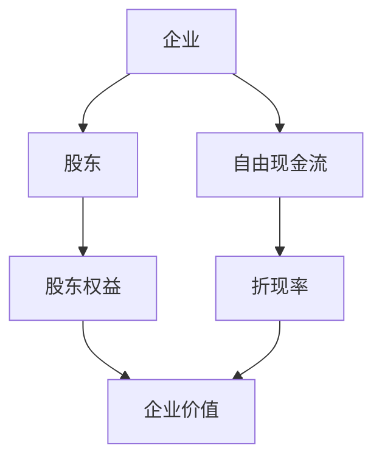
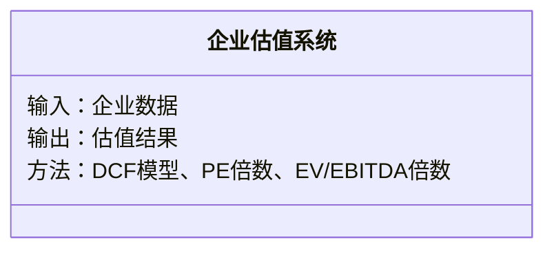
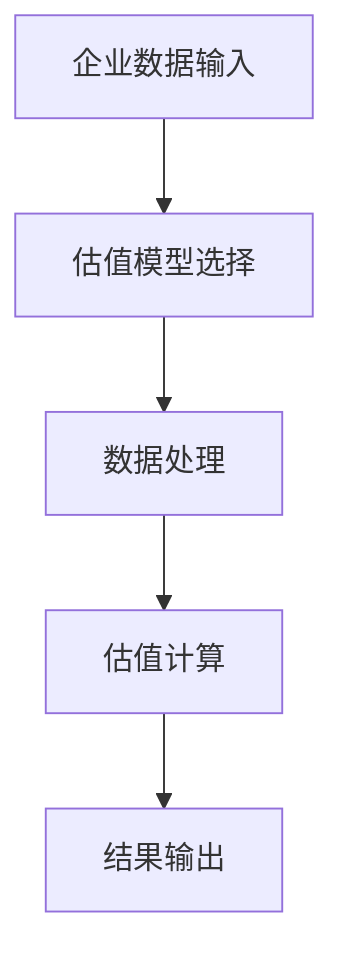
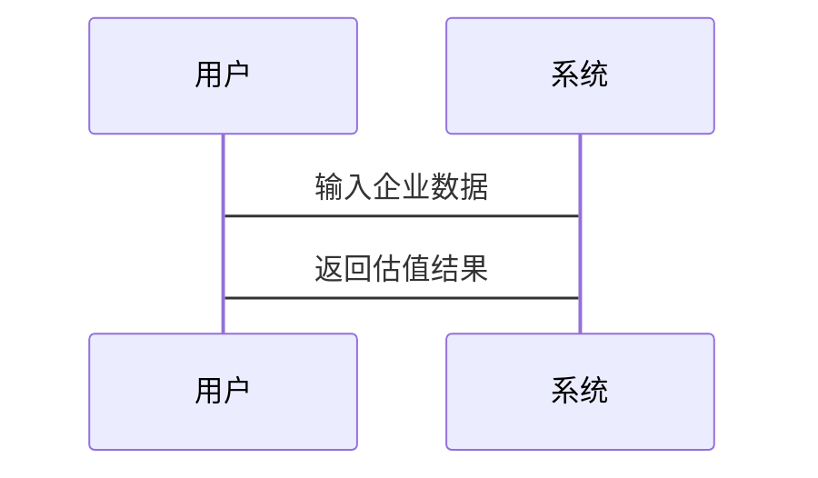

                 


# 不同行业的企业估值模型对比

## 关键词：企业估值模型、行业对比、DCF模型、PE倍数、EV/EBITDA倍数

## 摘要：本文详细探讨了不同行业的企业估值模型，分析了各类模型的优缺点，并通过具体案例对比了金融和科技行业的估值方法，帮助读者更好地理解和应用企业估值模型。

---

# 第一部分: 企业估值模型的背景与核心概念

## 第1章: 企业估值模型的概述

### 1.1 企业估值的基本概念

#### 1.1.1 什么是企业估值
企业估值是指对企业整体价值的评估，通常用于投资决策、并购交易、融资等活动。企业估值的核心在于确定企业的内在价值，以便为投资者和管理层提供决策依据。

#### 1.1.2 企业估值的重要性
企业估值是企业管理和投资决策的重要工具，能够帮助企业合理定价、优化资本结构、制定战略规划。对于投资者来说，准确的估值能够帮助他们识别投资机会、评估风险并制定退出策略。

#### 1.1.3 企业估值的核心要素
- **企业价值（Enterprise Value，EV）**：企业整体价值，包括股权和债务。
- **股东权益（Equity）**：股东持有的股权价值。
- **自由现金流（Free Cash Flow，FCF）**：企业在偿还债务和其他运营支出后的剩余现金流。
- **折现率（Discount Rate）**：用于将未来现金流折现到现值的利率。

### 1.2 不同行业的企业估值特点

#### 1.2.1 行业对企业估值的影响
不同行业的企业具有不同的特点，如收入模式、资产结构、成长周期等，这些因素会影响估值方法的选择。例如，科技行业通常具有较高的成长性，而制造业则更注重资产周转率。

#### 1.2.2 不同行业的估值模型对比
以下是不同行业常用估值模型的对比：

| 行业       | 常用模型         | 适用性分析                               |
|------------|------------------|------------------------------------------|
| 金融       | DCF模型、PE倍数   | 由于金融资产易于量化，DCF和PE倍数适用。 |
| 科技       | DCF模型、EV/EBITDA | 科技企业轻资产，EV/EBITDA更合适。       |
| 制造业     | DCF模型、EV/EBITDA | 制造业注重资产，EV/EBITDA适用。          |
| 医疗       | DCF模型、EV/EBITDA | 医疗行业受法规影响大，EV/EBITDA适用。    |
| 教育       | DCF模型、PE倍数   | 教育企业现金流稳定，PE倍数适用。          |
| 能源       | DCF模型、EV/EBITDA | 能源行业现金流稳定，EV/EBITDA适用。        |

### 1.3 企业估值模型的分类

#### 1.3.1 常见的企业估值模型
- **绝对估值模型**：DCF模型、股利折现模型（DDM）。
- **相对估值模型**：PE倍数、EV/EBITDA倍数。
- **混合估值模型**：结合绝对和相对估值的方法。

#### 1.3.2 各类模型的优缺点
- **绝对估值模型**：优点是考虑了企业未来现金流，缺点是需要假设增长率和折现率。
- **相对估值模型**：优点是简单易用，缺点是受市场波动影响较大。
- **混合估值模型**：优点是结合了绝对和相对估值的优势，缺点是复杂性较高。

## 第2章: 企业估值模型的核心概念与联系

### 2.1 核心概念的定义与属性

#### 2.1.1 企业价值
企业价值（EV）是企业整体价值的度量，包括股权和债务。公式为：
$$ EV = Equity + Debt $$

#### 2.1.2 股东权益
股东权益是股东对企业净资产的所有权，公式为：
$$ Equity = Assets - Liabilities $$

#### 2.1.3 股东自由现金流
股东自由现金流是企业在偿还债务和其他运营支出后的剩余现金流，公式为：
$$ FCF = EBITDA - Capex - Interest \times (1 - Tax Rate) $$

#### 2.1.4 折现率
折现率是将未来现金流折现到现值的利率，通常包括无风险利率和企业风险溢价。

#### 2.1.5 企业生命周期
企业生命周期分为初创期、成长期、成熟期和衰退期，不同阶段的估值模型选择有所不同。

### 2.2 企业估值模型的ER实体关系图



### 2.3 企业估值模型的数学模型

#### 2.3.1 股权自由现金流模型
$$ V = \frac{CF_1}{(1 + r)^1} + \frac{CF_2}{(1 + r)^2} + \dots + \frac{CF_n}{(1 + r)^n} $$

#### 2.3.2 折现率计算公式
$$ r = \frac{D + E}{D} \times r_d + \frac{E}{E} \times r_e $$

---

## 第3章: 不同行业的企业估值模型对比

### 3.1 金融行业的估值模型

#### 3.1.1 DCF模型在金融行业的应用
金融行业资产流动性高，适合使用DCF模型进行估值。例如，评估一只股票的价值时，可以通过未来现金流折现计算其内在价值。

#### 3.1.2 PE倍数法在金融行业的应用
PE倍数法是金融行业常用的相对估值方法，公式为：
$$ PE = \frac{Market\ Value}{Earnings} $$

#### 3.1.3 EV/EBITDA倍数法在金融行业的应用
EV/EBITDA倍数法适用于金融企业，尤其是那些现金流稳定的公司。

### 3.2 科技行业的估值模型

#### 3.2.1 DCF模型在科技行业的应用
科技行业具有高成长性，适合使用DCF模型。例如，评估一家科技公司的未来现金流，可以使用永续增长率模型。

#### 3.2.2 市盈率法在科技行业的应用
市盈率法是科技行业常用的相对估值方法，公式为：
$$ P/E = \frac{Market\ Price}{Earnings\ Per\ Share} $$

#### 3.2.3 EV/EBITDA倍数法在科技行业的应用
EV/EBITDA倍数法适用于科技企业，尤其是那些轻资产的公司。

### 3.3 制造业的估值模型

#### 3.3.1 DCF模型在制造业的应用
制造业通常具有稳定的现金流，适合使用DCF模型。例如，评估一家制造企业的未来现金流，可以使用三阶段DCF模型。

#### 3.3.2 EV/EBITDA倍数法在制造业的应用
EV/EBITDA倍数法适用于制造业，尤其是那些资产密集型的公司。

---

## 第4章: 跨行业估值模型的系统架构设计方案

### 4.1 系统功能设计（领域模型）



### 4.2 系统架构设计



### 4.3 系统接口设计



---

## 第5章: 项目实战——科技行业估值案例

### 5.1 环境安装

安装Python和必要的库：
```bash
pip install numpy pandas matplotlib
```

### 5.2 系统核心实现源代码

```python
import numpy as np
import pandas as pd

def dcf_model(fcf, wacc, horizon, perpetuity_growth=0):
    terminal_value = fcf * (1 + perpetuity_growth) / (wacc - perpetuity_growth)
    present_value = 0
    for year in range(1, horizon + 1):
        present_value += fcf * (1 + perpetuity_growth) ** (year - 1) / (1 + wacc) ** year
    total_value = present_value + terminal_value / (1 + wacc) ** horizon
    return total_value

# 示例数据
fcf = 100
wacc = 0.1
horizon = 5
perpetuity_growth = 0.02

value = dcf_model(fcf, wacc, horizon, perpetuity_growth)
print(f"企业价值：{value}")
```

### 5.3 代码应用解读与分析

上述代码实现了一个简单的DCF模型，用于计算科技公司的企业价值。通过输入自由现金流、加权平均资本成本和预测期，可以计算出企业的现值和终值，最终得到企业整体价值。

### 5.4 实际案例分析

以一家科技公司为例，假设其自由现金流为100万元，加权平均资本成本为10%，预测期为5年，永续增长率为2%。计算结果如下：

$$ V = \frac{100}{(1 + 0.1)^1} + \frac{100 \times 1.02}{(1 + 0.1)^2} + \dots + \frac{100 \times 1.02^4}{(1 + 0.1)^5} + \frac{100 \times 1.02^5}{0.1 - 0.02} \times \frac{1}{(1 + 0.1)^5} $$

计算结果约为500万元。

---

## 第6章: 总结与建议

### 6.1 各种模型的优缺点总结

- **DCF模型**：适合长期现金流预测，但需要假设增长率和折现率。
- **PE倍数**：简单易用，但受市场波动影响较大。
- **EV/EBITDA倍数**：适用于轻资产行业，但忽略了企业的财务杠杆。

### 6.2 最佳实践 tips

- **选择合适的模型**：根据行业特点和数据 availability选择模型。
- **结合多种方法**：混合估值模型能够提高估值准确性。
- **定期更新模型**：企业经营环境变化需要及时调整估值模型。

### 6.3 小结

企业估值模型的选择和应用需要结合行业特点和企业实际情况。通过对比不同行业的估值模型，可以更好地理解其适用性和局限性，从而做出更明智的投资决策。

### 6.4 注意事项

- 估值模型仅提供参考，实际估值需要考虑更多因素，如市场环境、政策变化等。
- 数据质量对估值结果影响重大，确保数据准确性和完整性。

### 6.5 拓展阅读

- 《企业价值评估：方法与应用》
- 《投资学》

---

以上是《不同行业的企业估值模型对比》的完整目录和内容概要，涵盖从基础概念到实际应用的全过程，帮助读者系统地理解和掌握不同行业的企业估值模型。

