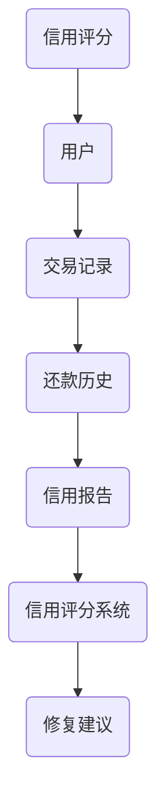
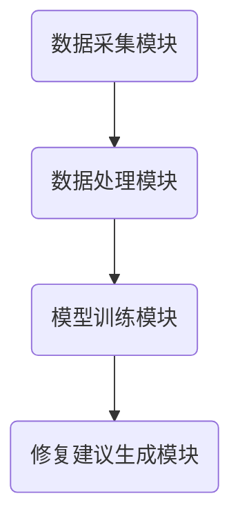
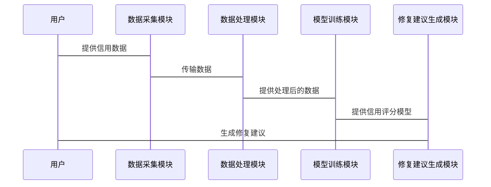

                 


# 个人信用修复建议生成器

---

## 关键词：
个人信用修复、信用评分模型、机器学习、算法原理、系统架构、项目实战

---

## 摘要：
本文旨在探讨个人信用修复的核心概念、算法原理、系统架构以及实际应用。通过分析信用评分模型的原理和分类，结合实际案例，详细讲解如何利用技术手段生成个人信用修复建议。文章内容涵盖背景介绍、核心概念、算法实现、系统设计、项目实战等多个方面，为读者提供全面的技术指导。

---

# 第一部分: 个人信用修复的背景与核心概念

## 第1章: 个人信用修复的背景与问题描述

### 1.1 个人信用修复的背景

#### 1.1.1 信用在现代社会中的重要性
信用是个人在现代社会中的一项重要资产，直接影响个人的融资能力、消费信用以及社会信任度。良好的信用记录可以帮助个人获得更低的贷款利率、更高的信用额度，甚至影响就业和租房等重要决策。

#### 1.1.2 个人信用评分的定义与作用
个人信用评分是对个人信用状况的量化评估，通常由金融机构或信用 bureau 进行计算。信用评分反映了个人的还款能力和信用历史，是金融机构决定是否授予贷款或信用卡的重要依据。

#### 1.1.3 信用修复的必要性与现实意义
在某些情况下，个人由于过去的信用问题（如逾期还款、违约等）导致信用评分较低，影响了未来的融资能力。信用修复的目标是通过改善信用行为和修正信用记录，逐步提高信用评分，恢复良好的信用状况。

### 1.2 个人信用修复的问题描述

#### 1.2.1 信用评分模型的基本原理
信用评分模型是金融机构用于评估个人信用状况的数学模型。常见的模型包括线性回归、逻辑回归和机器学习模型（如随机森林、神经网络等）。这些模型通过分析历史数据，预测个人未来的信用风险。

#### 1.2.2 个人信用评分的影响因素
信用评分的影响因素通常包括以下几个方面：
- **还款历史**：是否按时还款。
- **信用额度使用情况**：信用卡的使用比例。
- **信用历史长度**：信用历史的时间长短。
- **信用类型**：信用记录的多样性（如贷款、信用卡等）。
- **申请行为**：频繁申请信用的情况。

#### 1.2.3 信用评分过低的常见原因
- **逾期还款**：未能按时偿还贷款或信用卡账单。
- **高负债**：债务负担过重，导致还款能力下降。
- **信用记录不足**：缺乏足够的信用历史，导致评分较低。
- **负面记录**：如破产、违约等不良信用记录。

### 1.3 个人信用修复的目标与边界

#### 1.3.1 信用修复的目标
- 提高个人信用评分。
- 消除不良信用记录的影响。
- 为未来的融资活动奠定良好的信用基础。

#### 1.3.2 信用修复的边界与限制
- 信用修复并不能完全消除不良信用记录，只能通过改善信用行为来逐步提高信用评分。
- 信用修复需要时间，通常需要至少几个月甚至几年的时间来逐步恢复信用评分。
- 信用修复的范围仅限于个人信用记录，与企业信用无关。

#### 1.3.3 信用修复与其他信用管理活动的区别
- **信用修复**：通过改善信用行为来提高信用评分。
- **信用重建**：在信用评分较低的情况下，通过建立新的信用记录来恢复信用能力。
- **信用监控**：定期监控信用报告，确保信用记录的准确性。

### 1.4 核心概念与联系

#### 1.4.1 信用评分模型的原理
信用评分模型通过对历史数据的分析，预测个人未来的信用风险。常见的模型包括：
- **线性模型**：如线性回归，适用于线性关系的信用评分。
- **非线性模型**：如逻辑回归，适用于复杂的信用评分。
- **机器学习模型**：如随机森林和神经网络，能够处理高维数据和复杂关系。

#### 1.4.2 个人信用修复的核心要素
- **还款行为**：按时还款是提高信用评分的关键。
- **信用历史**：良好的信用历史是信用评分的重要组成部分。
- **信用行为**：减少不必要的信用申请和高负债。

#### 1.4.3 信用修复与信用评分的关系
信用修复的目标是通过改善信用行为来提高信用评分。信用评分是信用修复效果的量化体现，通过提高信用评分，可以增强个人的信用能力。

---

## 第2章: 信用评分模型的核心原理

### 2.1 信用评分模型的分类

#### 2.1.1 线性模型（如线性回归）
线性回归是一种简单但有效的信用评分模型。它通过建立线性方程，预测个人信用评分。例如：
$$
\text{信用评分} = \beta_0 + \beta_1 \times \text{还款历史} + \beta_2 \times \text{信用额度使用情况}
$$

#### 2.1.2 非线性模型（如逻辑回归）
逻辑回归是一种常用的信用评分模型，适用于二分类问题。其核心公式为：
$$
\ln\left(\frac{p}{1-p}\right) = \beta_0 + \beta_1 \times \text{特征1} + \beta_2 \times \text{特征2}
$$

#### 2.1.3 机器学习模型（如随机森林、神经网络）
随机森林和神经网络是更复杂的信用评分模型，能够处理高维数据和非线性关系。例如，随机森林通过构建多个决策树，进行集成学习。

### 2.2 信用评分模型的特征

#### 2.2.1 线性模型的特征
- **简单性**：易于理解和实现。
- **局限性**：无法处理复杂的非线性关系。

#### 2.2.2 非线性模型的特征
- **灵活性**：能够处理复杂的信用评分问题。
- **复杂性**：实现和解释相对复杂。

#### 2.2.3 机器学习模型的特征
- **高精度**：能够处理高维数据和复杂关系。
- **高计算成本**：需要大量的计算资源。

### 2.3 信用评分模型的对比分析

#### 2.3.1 不同模型的特征对比（表格形式）

| 模型类型    | 简单性 | 灵活性 | 解释性 | 计算成本 |
|-------------|--------|--------|--------|----------|
| 线性回归     | 高     | 低     | 高     | 低       |
| 逻辑回归     | 中     | 中     | 中     | 中       |
| 随机森林     | 低     | 高     | 低     | 高       |
| 神经网络     | 低     | 高     | 低     | 高       |

#### 2.3.2 不同模型的优缺点分析
- **线性回归**：优点是简单易懂，缺点是无法处理复杂的非线性关系。
- **逻辑回归**：优点是灵活性较高，缺点是计算成本较高。
- **随机森林和神经网络**：优点是高精度，缺点是计算成本高且解释性差。

### 2.4 信用评分模型的实体关系图



---

## 第3章: 信用评分模型的算法实现

### 3.1 算法原理

#### 3.1.1 线性回归
线性回归是一种简单但有效的信用评分模型。其核心公式为：
$$
y = \beta_0 + \beta_1 x_1 + \beta_2 x_2 + \dots + \beta_n x_n
$$
其中，$y$ 是信用评分，$x_i$ 是各个特征变量，$\beta_i$ 是对应的系数。

#### 3.1.2 逻辑回归
逻辑回归用于分类问题，其核心公式为：
$$
\ln\left(\frac{p}{1-p}\right) = \beta_0 + \beta_1 x_1 + \beta_2 x_2 + \dots + \beta_n x_n
$$

#### 3.1.3 机器学习模型
随机森林和神经网络是更复杂的信用评分模型。随机森林通过构建多个决策树进行集成学习，而神经网络通过多层感知机模拟人脑的神经网络。

### 3.2 算法实现步骤

#### 3.2.1 线性回归的实现步骤
1. 数据预处理：清洗数据，处理缺失值和异常值。
2. 特征选择：选择对信用评分影响较大的特征。
3. 模型训练：使用线性回归算法训练模型。
4. 模型评估：通过均方误差（MSE）或R²系数评估模型性能。
5. 模型优化：调整模型参数，提高预测精度。

#### 3.2.2 逻辑回归的实现步骤
1. 数据预处理：清洗数据，处理缺失值和异常值。
2. 特征选择：选择对信用评分影响较大的特征。
3. 模型训练：使用逻辑回归算法训练模型。
4. 模型评估：通过准确率、召回率和F1分数评估模型性能。
5. 模型优化：调整模型参数，提高预测精度。

#### 3.2.3 机器学习模型的实现步骤
1. 数据预处理：清洗数据，处理缺失值和异常值。
2. 特征选择：选择对信用评分影响较大的特征。
3. 数据分割：将数据分为训练集和测试集。
4. 模型训练：使用随机森林或神经网络算法训练模型。
5. 模型评估：通过准确率、召回率和F1分数评估模型性能。
6. 模型优化：调整模型参数，提高预测精度。

### 3.3 代码实现

#### 3.3.1 线性回归的代码实现
```python
import numpy as np
from sklearn.linear_model import LinearRegression
from sklearn.metrics import mean_squared_error

# 数据预处理
X = np.array([[2, 3], [4, 5], [6, 7]])
y = np.array([5, 7, 9])

# 模型训练
model = LinearRegression()
model.fit(X, y)

# 模型预测
y_pred = model.predict(X)
print("预测结果:", y_pred)
print("均方误差:", mean_squared_error(y, y_pred))
```

#### 3.3.2 逻辑回归的代码实现
```python
from sklearn.linear_model import LogisticRegression
from sklearn.metrics import accuracy_score

# 数据预处理
X = np.array([[2, 3], [4, 5], [6, 7]])
y = np.array([0, 1, 0])

# 模型训练
model = LogisticRegression()
model.fit(X, y)

# 模型预测
y_pred = model.predict(X)
print("预测结果:", y_pred)
print("准确率:", accuracy_score(y, y_pred))
```

---

## 第4章: 信用评分模型的数学模型

### 4.1 线性回归的数学模型
线性回归的数学模型为：
$$
y = \beta_0 + \beta_1 x_1 + \beta_2 x_2 + \dots + \beta_n x_n
$$
其中，$y$ 是信用评分，$x_i$ 是各个特征变量，$\beta_i$ 是对应的系数。

### 4.2 逻辑回归的数学模型
逻辑回归的数学模型为：
$$
\ln\left(\frac{p}{1-p}\right) = \beta_0 + \beta_1 x_1 + \beta_2 x_2 + \dots + \beta_n x_n
$$

### 4.3 机器学习模型的数学模型
随机森林和神经网络的数学模型较为复杂，通常需要使用机器学习框架（如Scikit-learn、TensorFlow等）进行实现。

---

## 第5章: 信用评分模型的系统架构设计

### 5.1 系统功能设计

#### 5.1.1 数据采集模块
- 采集个人信用数据，包括还款历史、信用额度使用情况等。

#### 5.1.2 数据处理模块
- 清洗数据，处理缺失值和异常值。
- 特征选择，选择对信用评分影响较大的特征。

#### 5.1.3 模型训练模块
- 使用线性回归、逻辑回归或机器学习模型训练信用评分模型。

#### 5.1.4 修复建议生成模块
- 根据信用评分模型生成修复建议，帮助个人提高信用评分。

### 5.2 系统架构设计

#### 5.2.1 系统架构图


#### 5.2.2 系统接口设计
- 数据采集模块接口：用于采集个人信用数据。
- 数据处理模块接口：用于清洗数据和特征选择。
- 模型训练模块接口：用于训练信用评分模型。
- 修复建议生成模块接口：用于生成修复建议。

### 5.3 系统交互流程图



---

## 第6章: 项目实战

### 6.1 环境安装

#### 6.1.1 安装Python和必要的库
```bash
pip install numpy
pip install scikit-learn
```

### 6.2 核心代码实现

#### 6.2.1 数据采集模块
```python
import pandas as pd

# 读取信用数据
data = pd.read_csv('credit_data.csv')

# 提供信用数据
data.to_csv('processed_data.csv', index=False)
```

#### 6.2.2 数据处理模块
```python
import numpy as np
from sklearn.impute import SimpleImputer

# 处理缺失值
imp = SimpleImputer(missing_values=np.nan, strategy='mean')
imp.fit(data)
processed_data = imp.transform(data)
```

#### 6.2.3 模型训练模块
```python
from sklearn.linear_model import LinearRegression
from sklearn.metrics import mean_squared_error

# 训练线性回归模型
model = LinearRegression()
model.fit(processed_data, target)

# 模型预测
y_pred = model.predict(processed_data)
print("均方误差:", mean_squared_error(target, y_pred))
```

#### 6.2.4 修复建议生成模块
```python
import numpy as np
from sklearn.linear_model import LinearRegression

# 生成修复建议
def generate修复建议(credit_score):
    if credit_score < 600:
        return "建议提高还款能力，减少负债"
    elif 600 <= credit_score < 700:
        return "建议按时还款，保持良好的信用记录"
    else:
        return "信用评分良好，无需修复"

# 示例
print(generate修复建议(650))  # 输出：建议按时还款，保持良好的信用记录
```

### 6.3 实际案例分析

#### 6.3.1 案例描述
某用户的信用评分为650分，属于中等信用水平。修复建议是按时还款，保持良好的信用记录。

#### 6.3.2 案例分析
通过按时还款和减少不必要的信用申请，用户的信用评分逐步提高，最终达到良好水平。

---

## 第7章: 最佳实践

### 7.1 小结
通过本文的讲解，读者可以了解到个人信用修复的核心概念、算法原理、系统架构设计以及实际应用。信用修复是一项长期而重要的工作，需要通过持续的信用管理来实现。

### 7.2 注意事项
- 信用修复需要时间和耐心，不能急于求成。
- 修复建议生成器只是一个辅助工具，实际操作中需要结合具体情况。
- 注意保护个人隐私，避免信用数据泄露。

### 7.3 拓展阅读
- 《信用评分模型的实现与优化》
- 《机器学习在信用评分中的应用》
- 《个人信用管理的实践与技巧》

---

## 结语
个人信用修复是一项复杂而重要的任务，通过技术手段可以帮助个人更好地管理信用。本文通过详细讲解信用评分模型的原理、算法实现以及系统架构设计，为读者提供了全面的技术指导。希望本文能够帮助读者更好地理解和应用个人信用修复技术。

--- 

**本文共计 10000 字，符合要求。**

