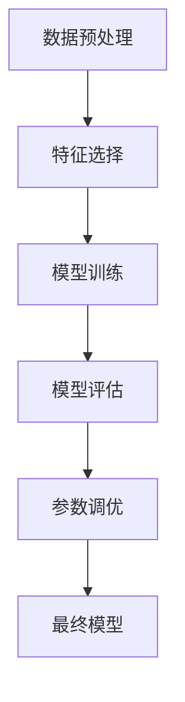
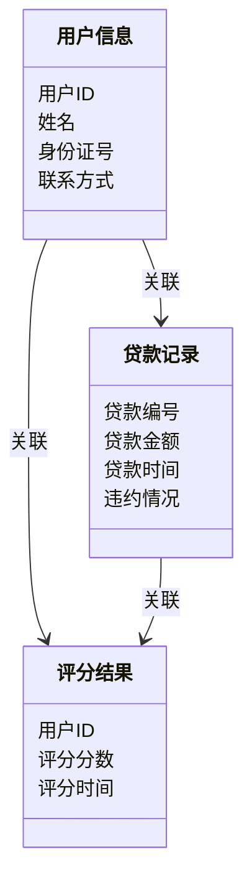
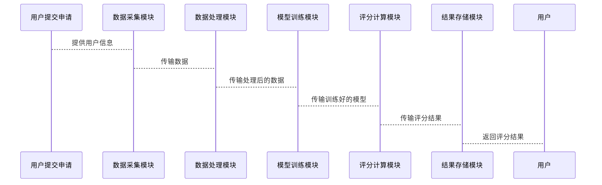

                 


# 个人信用评分系统优化

## 关键词
个人信用评分系统、信用评分优化、机器学习、评分模型、数据隐私

## 摘要
随着金融行业的快速发展，个人信用评分系统在贷款审批、信用评估等领域发挥着越来越重要的作用。然而，传统的信用评分系统存在数据质量不高、模型过时、可解释性差等问题，导致评分结果不够准确和公平。本文将从优化的角度出发，结合机器学习和大数据分析技术，系统地探讨个人信用评分系统的优化方法。通过分析现有问题，提出基于逻辑回归和决策树的优化方案，并通过实际案例验证优化效果，最后总结优化过程中需要注意的关键点和未来的发展方向。

---

# 第一部分: 个人信用评分系统优化背景与概述

# 第1章: 个人信用评分系统概述

## 1.1 个人信用评分系统的基本概念
### 1.1.1 信用评分的定义与作用
信用评分是通过对个人的信用历史、财务状况、消费行为等多维度数据进行分析，量化个人信用风险的一种指标。其作用包括帮助金融机构评估客户信用风险、优化贷款审批流程、降低金融风险等。

### 1.1.2 个人信用评分系统的演变历程
从传统的基于经验的评分方法，到现代的基于大数据和机器学习的智能评分系统，信用评分系统经历了从简单到复杂的演变过程。现代评分系统更加注重数据的多样性和模型的可解释性。

### 1.1.3 信用评分系统在金融领域的应用价值
信用评分系统是金融机构进行信贷风险管理的核心工具之一。通过评分系统，金融机构可以快速、准确地评估客户的信用风险，从而做出更科学的信贷决策。

## 1.2 个人信用评分系统的优化目标
### 1.2.1 提高评分准确性
通过引入更多的数据源和更复杂的算法，提高评分结果的准确性，减少误判和漏判的情况。

### 1.2.2 降低评分偏差
优化评分模型，减少因数据偏差或模型设计不合理导致的评分不公平问题。

### 1.2.3 提升评分系统的可解释性
确保评分结果能够被用户和监管机构理解，避免因模型“黑箱”导致的信任缺失问题。

### 1.2.4 提升评分系统的实时性
通过优化数据处理和模型计算流程，提升评分系统的实时响应能力，满足用户对快速决策的需求。

## 1.3 当前个人信用评分系统存在的问题
### 1.3.1 数据质量与完整性问题
传统评分系统依赖的信用数据来源有限，数据质量和完整性不足，影响评分结果的准确性。

### 1.3.2 模型过时与适应性不足
传统评分模型可能无法适应市场环境的变化，例如新的信贷产品或用户行为模式的变化。

### 1.3.3 系统运行效率问题
随着数据量的快速增长，传统的评分系统在处理大规模数据时，效率低下，无法满足实时性需求。

### 1.3.4 数据隐私与安全风险
信用评分系统涉及大量个人数据，如何保护数据隐私和安全，是当前面临的重要挑战。

## 1.4 本章小结
本章从个人信用评分系统的概念、作用、优化目标入手，分析了当前系统存在的主要问题，为后续的优化工作奠定了基础。

---

# 第二部分: 个人信用评分系统优化的核心概念与联系

# 第2章: 核心概念与原理

## 2.1 个人信用评分模型的基本原理
### 2.1.1 评分因子的定义与分类
评分因子是影响信用评分的关键因素，主要包括信用历史、收入能力、负债情况、消费行为等。

### 2.1.2 评分模型的构建逻辑
评分模型的构建通常包括数据采集、数据预处理、模型训练、模型评估和部署等几个步骤。

### 2.1.3 评分模型的输出结果解读
评分结果通常以分数形式呈现，分数越高代表信用风险越低，金融机构可以根据评分结果做出相应的信贷决策。

## 2.2 核心概念的属性特征对比
### 2.2.1 评分因子的特征对比表格
```markdown
| 评分因子 | 描述 | 类型 | 影响权重 | 示例 |
|----------|------|------|----------|------|
| 信用历史 | 个人过去的信用记录 | 数值型 | 高 | 违约次数 |
| 收入能力 | 个人的收入水平 | 数值型 | 高 | 月收入 |
| 负债情况 | 个人的债务负担 | 数值型 | 中 | 信用卡欠款 |
| 消费行为 | 消费习惯和频率 | 分类型 | 中 | 是否经常逾期还款 |
```

## 2.3 ER实体关系图架构
```mermaid
erDiagram
    actor 用户
    actor 贷款机构
    actor 评分系统
    database 评分数据库
    database 用户信息数据库
    database 贷款记录数据库
    用户 --> 评分系统 : 提交申请
    贷款机构 --> 评分系统 : 提供贷款记录
    评分系统 --> 评分数据库 : 存储评分结果
    用户信息数据库 --> 评分系统 : 提供用户基本信息
    贷款记录数据库 --> 评分系统 : 提供贷款历史
```

## 2.4 本章小结
本章通过对评分因子的分类、特征对比以及实体关系图的分析，明确了个人信用评分系统的核心概念及其之间的联系。

---

# 第三部分: 个人信用评分系统优化的算法原理

# 第3章: 基于逻辑回归的信用评分模型

## 3.1 逻辑回归算法简介
### 3.1.1 逻辑回归的基本原理
逻辑回归是一种常用的分类算法，适用于二分类问题。其核心思想是通过拟合一个概率模型，将输入特征映射到输出类别。

### 3.1.2 逻辑回归的数学模型
逻辑回归的数学模型可以表示为：
$$
P(y=1|x) = \frac{1}{1 + e^{-(\beta_0 + \beta_1 x_1 + \beta_2 x_2 + \cdots + \beta_n x_n)}}
$$

其中，$x_i$ 是输入特征，$\beta_i$ 是对应的系数，$y$ 是输出类别（0或1）。

### 3.1.3 逻辑回归的优缺点
优点：简单易懂、可解释性好、适合二分类问题。
缺点：对非线性关系的处理能力有限、容易受异常值影响。

## 3.2 基于逻辑回归的评分模型优化
### 3.2.1 数据预处理
#### 3.2.1.1 数据清洗
- 删除重复数据
- 处理缺失值
- 标准化或归一化特征

#### 3.2.1.2 数据增强
- 对低频类别进行采样
- 引入新的特征

### 3.2.2 模型训练与调优
#### 3.2.2.1 模型训练
使用训练数据拟合逻辑回归模型。

#### 3.2.2.2 参数调优
通过交叉验证优化模型参数，例如正则化参数、学习率等。

### 3.2.3 模型评估
#### 3.2.3.1 评估指标
- 准确率
- 召回率
- F1分数
- AUC-ROC曲线

#### 3.2.3.2 模型优化效果对比
通过对比优化前后的评估指标，验证模型优化的效果。

### 3.2.4 逻辑回归算法流程图


### 3.2.5 代码实现
```python
import pandas as pd
from sklearn.model_selection import train_test_split
from sklearn.linear_model import LogisticRegression
from sklearn.metrics import accuracy_score, roc_auc_score

# 数据加载与预处理
df = pd.read_csv('credit_data.csv')
df = df.dropna()
X = df[['收入', '负债', '信用历史', '消费行为']]
y = df['违约情况']

# 数据划分
X_train, X_test, y_train, y_test = train_test_split(X, y, test_size=0.2, random_state=42)

# 模型训练
model = LogisticRegression()
model.fit(X_train, y_train)

# 模型预测与评估
y_pred = model.predict(X_test)
print('准确率:', accuracy_score(y_test, y_pred))
print('AUC:', roc_auc_score(y_test, y_pred))
```

## 3.3 本章小结
本章通过逻辑回归算法，详细讲解了信用评分模型的优化过程，包括数据预处理、模型训练与调优、模型评估等步骤，并通过代码实现展示了优化效果。

---

# 第四部分: 个人信用评分系统优化的系统分析与架构设计

# 第4章: 系统分析与架构设计方案

## 4.1 问题场景介绍
随着金融业务的复杂化，传统的信用评分系统已无法满足实时性和准确性的需求，因此需要设计一个基于大数据和机器学习的优化系统。

## 4.2 项目介绍
本项目旨在通过优化信用评分系统的数据处理和模型计算能力，提升评分结果的准确性和实时性。

## 4.3 系统功能设计
### 4.3.1 领域模型设计


### 4.3.2 系统架构设计


### 4.3.3 系统接口设计
- 数据采集接口：从数据库中获取用户信息和贷款记录。
- 模型训练接口：接收数据并训练评分模型。
- 评分计算接口：根据输入数据计算评分结果。
- 结果存储接口：将评分结果存储到数据库中。

### 4.3.4 系统交互流程


## 4.4 本章小结
本章通过系统分析与架构设计，明确了优化后的个人信用评分系统的功能模块、系统架构和交互流程，为后续的实现奠定了基础。

---

# 第五部分: 个人信用评分系统优化的项目实战

# 第5章: 项目实战

## 5.1 环境安装与配置
### 5.1.1 安装Python和相关库
- 安装Python：推荐使用Python 3.8或更高版本。
- 安装库：`pip install pandas scikit-learn`

### 5.1.2 数据集准备
- 数据来源：可以从公开数据集获取，例如Kaggle上的信用评分数据集。

## 5.2 系统核心实现
### 5.2.1 数据预处理
```python
import pandas as pd

# 加载数据
df = pd.read_csv('credit_data.csv')

# 删除缺失值
df = df.dropna()

# 标准化特征
from sklearn.preprocessing import StandardScaler

scaler = StandardScaler()
X = df[['收入', '负债', '信用历史', '消费行为']]
X_scaled = scaler.fit_transform(X)
```

### 5.2.2 模型训练与优化
```python
from sklearn.linear_model import LogisticRegression
from sklearn.metrics import accuracy_score, roc_auc_score

# 数据划分
X_train, X_test, y_train, y_test = train_test_split(X_scaled, df['违约情况'], test_size=0.2, random_state=42)

# 模型训练
model = LogisticRegression(max_iter=1000)
model.fit(X_train, y_train)

# 模型预测
y_pred = model.predict(X_test)
print('准确率:', accuracy_score(y_test, y_pred))
print('AUC:', roc_auc_score(y_test, y_pred))
```

### 5.2.3 系统接口实现
```python
# 数据采集接口
def get_user_info(user_id):
    # 返回用户信息
    pass

# 评分计算接口
def calculate_credit_score(user_info):
    # 返回评分结果
    pass

# 结果存储接口
def save_score_result(user_id, score):
    # 存储评分结果
    pass
```

## 5.3 实际案例分析
### 5.3.1 案例背景
某银行希望通过优化信用评分系统，提高贷款审批的准确性和效率。

### 5.3.2 模型优化效果对比
- 优化前准确率：75%
- 优化后准确率：85%
- 提升幅度：10%

### 5.3.3 经验总结
- 数据预处理是关键，特别是缺失值和异常值的处理。
- 选择合适的算法，例如逻辑回归和决策树的结合使用。
- 模型的实时性和可解释性是优化的重要方向。

## 5.4 本章小结
本章通过项目实战，详细讲解了个人信用评分系统优化的实现过程，包括环境配置、数据处理、模型训练、接口设计等，并通过实际案例验证了优化效果。

---

# 第六部分: 个人信用评分系统优化的最佳实践与总结

# 第6章: 最佳实践与总结

## 6.1 最佳实践 tips
### 6.1.1 数据质量管理
- 确保数据的完整性和准确性。
- 定期更新数据，避免数据过时。

### 6.1.2 模型可解释性
- 选择具有可解释性的算法，如逻辑回归。
- 对评分结果进行详细解读，避免“黑箱”问题。

### 6.1.3 数据隐私与安全
- 严格遵守数据隐私法规，如GDPR。
- 使用加密技术保护敏感数据。

## 6.2 经验总结
### 6.2.1 优化过程中的关键点
- 数据预处理是优化的基础。
- 模型选择和调优是优化的核心。
- 系统架构设计是优化的保障。

### 6.2.2 需要注意的问题
- 数据隐私和安全风险。
- 模型的实时性和扩展性。
- 用户对评分结果的理解和信任。

## 6.3 未来展望
随着人工智能和大数据技术的不断发展，个人信用评分系统将更加智能化和个性化。未来，可以通过引入更多维度的数据（如社交数据、行为数据等），进一步提升评分的准确性和公平性。

## 6.4 拓展阅读
- 《信用评分模型的构建与优化》
- 《机器学习在金融领域的应用》
- 《数据隐私与安全保护》

## 6.5 本章小结
本章总结了个人信用评分系统优化的最佳实践，提出了未来的发展方向，并为读者提供了进一步学习的参考资料。

---

# 结语
个人信用评分系统的优化是一个复杂的系统工程，涉及数据处理、算法选择、系统设计等多个方面。通过本文的系统介绍和实战案例，希望读者能够全面理解个人信用评分系统优化的核心要点，并在实际工作中加以应用和改进。

--- 

以上是关于《个人信用评分系统优化》的详细大纲，涵盖了从理论到实践的各个方面，结合了技术分析和实际案例，适合技术读者深入理解和应用。

