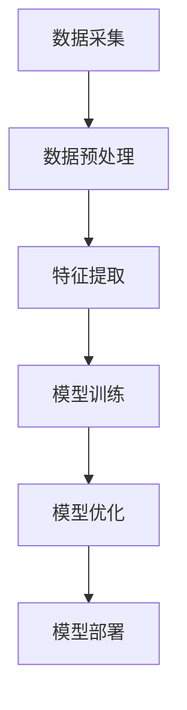
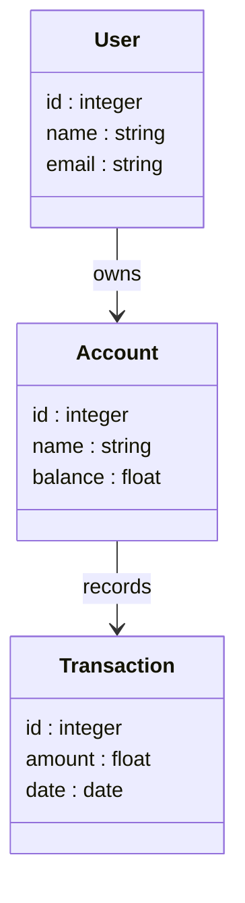

                 


### 第一部分: 个人财务健康指数开发与应用概述

#### # 个人财务健康指数开发与应用

> 关键词：个人财务健康指数、财务数据分析、机器学习算法、系统架构设计、项目实战

> 摘要：  
> 本文将详细探讨个人财务健康指数的开发与应用。通过系统化的分析，我们将介绍个人财务健康指数的核心概念、算法原理、系统架构设计以及实际项目中的应用。文章从背景分析到算法实现，从系统架构到项目实战，层层深入，帮助读者全面理解并掌握个人财务健康指数的开发与应用方法。

---

### 第1章: 个人财务健康指数的背景与意义

#### 1.1 个人财务健康指数的背景介绍

- **1.1.1 个人财务管理的现状与挑战**  
  随着经济的发展，个人财务管理变得越来越复杂。传统的财务管理方法难以应对现代金融市场的波动和多样化的财务需求。个人财务健康指数作为一种量化工具，能够帮助个人更直观地了解自身的财务状况。

- **1.1.2 个人财务健康指数的定义与目标**  
  个人财务健康指数（Personal Financial Health Index，PFHI）是一种衡量个人财务健康状况的综合指标，旨在通过量化分析，帮助个人优化财务管理策略。

- **1.1.3 个人财务健康指数的重要性和意义**  
  PFHI不仅能够帮助个人及时发现财务问题，还能为金融机构提供参考，从而推动个人财务管理的科学化和智能化。

- **1.1.4 个人财务健康指数与传统财务指标的区别**  
  与传统财务指标（如资产与负债比例、收支平衡等）相比，PFHI更加注重动态性和系统性，能够全面反映个人的财务健康状况。

- **1.1.5 个人财务健康指数的核心要素**  
  包括收入稳定性、支出合理性、资产配置优化、负债风险控制、现金流管理等。

#### 1.2 本章小结

- **核心概念回顾**  
  PFHI是一种量化个人财务健康状况的指标，能够帮助个人优化财务管理。

- **个人财务健康指数的价值**  
  通过量化分析，PFHI能够帮助个人及时发现问题并优化财务管理策略。

- **本书内容框架**  
  本书将从概念、算法、系统架构到项目实战，全面探讨PFHI的开发与应用。

---

### 第2章: 个人财务健康指数的核心概念与联系

#### 2.1 个人财务健康指数的原理与机制

- **2.1.1 个人财务健康指数的数学模型**  
  PFHI = (收入稳定性 × 30% + 支出合理性 × 30% + 资产配置优化 × 20% + 负债风险控制 × 15% + 现金流管理 × 5%)  
  $$ PFHI = 0.3I + 0.3E + 0.2A + 0.15L + 0.05C $$

- **2.1.2 个人财务健康指数的计算公式**  
  PFHI的计算需要结合多种财务指标，通过加权平均的方式得出最终得分。

- **2.1.3 个人财务健康指数的评估标准**  
  根据PFHI的得分范围，将其划分为“健康”、“亚健康”、“不健康”三个等级。

#### 2.2 核心概念的属性特征对比

| **属性**         | **收入稳定性** | **支出合理性** | **资产配置优化** | **负债风险控制** | **现金流管理** |
|------------------|---------------|----------------|------------------|------------------|----------------|
| **定义**         | 收入的稳定性   | 支出的合理性   | 资产配置的优化   | 负债风险的控制   | 现金流的管理   |
| **权重**         | 30%           | 30%            | 20%              | 15%              | 5%             |
| **重要性**       | 高            | 高             | 中高             | 中高             | 中             |

#### 2.3 个人财务健康指数的ER实体关系图

```mermaid
erDiagram
    user {
        id : integer
        name : string
        email : string
    }
    account {
        id : integer
        name : string
        balance : float
    }
    transaction {
        id : integer
        amount : float
        date : date
    }
    user --> account : owns
    account --> transaction : records
```

#### 2.4 本章小结

- **核心概念的系统化分析**  
  PFHI的计算需要结合多个财务指标，通过加权平均的方式得出最终得分。

- **实体关系图的应用价值**  
  ER图展示了个人财务数据的核心实体及其关系，为后续的系统设计提供了基础。

- **个人财务健康指数的系统性特征**  
  PFHI是一种动态、系统化的财务评估指标，能够全面反映个人的财务健康状况。

---

### 第3章: 个人财务健康健康指数的算法原理与实现

#### 3.1 个人财务健康指数的算法原理

- **3.1.1 基于机器学习的评分模型**  
  使用机器学习算法（如线性回归、随机森林等）对个人财务数据进行建模，预测财务健康指数。

- **3.1.2 基于规则的评分模型**  
  根据预设的财务规则（如支出不超过收入的一定比例）对个人财务数据进行评分。

- **3.1.3 混合模型的应用**  
  结合机器学习模型和规则模型，提高财务健康指数的准确性和鲁棒性。

#### 3.2 算法实现的详细步骤

- **3.2.1 数据采集与预处理**  
  从个人财务数据中提取收入、支出、资产、负债等关键指标，并进行数据清洗和标准化处理。

- **3.2.2 模型训练与优化**  
  使用训练数据对机器学习模型进行训练，并通过交叉验证优化模型参数。

- **3.2.3 模型评估与部署**  
  在测试数据上评估模型的性能，并将其部署到实际应用中。

#### 3.3 个人财务健康指数的算法流程图



#### 3.4 本章小结

- **算法原理的系统化分析**  
  本文介绍了基于机器学习和规则的混合模型，用于计算个人财务健康指数。

- **算法流程图的应用价值**  
  流程图清晰展示了算法实现的步骤，为后续的系统设计提供了指导。

- **个人财务健康指数的算法特征**  
  PFHI的计算需要结合多种算法，提高评估的准确性和鲁棒性。

---

### 第4章: 个人财务健康指数的系统分析与架构设计

#### 4.1 问题场景介绍

- **4.1.1 用户登录与数据采集**  
  用户通过登录系统，上传个人财务数据。

- **4.1.2 数据处理与计算**  
  系统对上传的数据进行预处理，并计算个人财务健康指数。

- **4.1.3 结果展示与建议**  
  系统向用户展示财务健康指数，并提供优化建议。

#### 4.2 系统功能设计

- **4.2.1 领域模型设计**  
  使用Mermaid绘制领域模型类图，展示系统的核心模块及其关系。



- **4.2.2 系统架构设计**  
  使用Mermaid绘制系统架构图，展示系统的分层结构。


- **4.2.3 系统接口设计**  
  描述系统与外部接口的交互流程。

#### 4.3 本章小结

- **系统分析的价值**  
  通过系统分析，我们明确了问题场景和系统功能需求。

- **架构设计的意义**  
  架构图清晰展示了系统的分层结构，为后续的开发提供了指导。

- **个人财务健康指数系统的特征**  
  系统通过模块化设计，提高了系统的可维护性和扩展性。

---

### 第5章: 个人财务健康指数的项目实战

#### 5.1 环境安装与配置

- **5.1.1 安装Python与相关库**  
  安装Python 3.x，以及pandas、numpy、scikit-learn等库。

- **5.1.2 数据集准备**  
  收集个人财务数据，清洗并预处理。

#### 5.2 系统核心实现源代码

```python
import pandas as pd
from sklearn.linear_model import LinearRegression
from sklearn.ensemble import RandomForestRegressor
from sklearn.metrics import mean_absolute_error

# 数据加载
data = pd.read_csv('financial_data.csv')

# 特征提取
features = data[['income', 'expenses', 'assets', 'liabilities', 'cash_flow']]
target = data['financial_health_index']

# 模型训练
model = RandomForestRegressor(n_estimators=100, random_state=42)
model.fit(features, target)

# 模型预测
predictions = model.predict(features)
print('Mean Absolute Error:', mean_absolute_error(target, predictions))
```

#### 5.3 代码解读与分析

- **5.3.1 数据加载与特征提取**  
  使用pandas加载数据，并提取相关特征。

- **5.3.2 模型训练与预测**  
  使用随机森林模型训练，并对数据进行预测。

- **5.3.3 模型评估**  
  通过均方误差评估模型的性能。

#### 5.4 实际案例分析

- **5.4.1 数据分析与计算**  
  以具体案例为例，展示如何计算个人财务健康指数。

- **5.4.2 结果展示与优化建议**  
  根据计算结果，提出优化财务管理的具体建议。

#### 5.5 本章小结

- **项目实战的价值**  
  通过实际案例，读者能够更好地理解个人财务健康指数的开发与应用。

- **代码实现的意义**  
  代码实现了系统的核心功能，为后续的扩展提供了基础。

- **个人财务健康指数系统的应用前景**  
  通过实际案例分析，展示了PFHI在个人财务管理中的广泛应用。

---

### 第6章: 个人财务健康指数的总结与展望

#### 6.1 总结

- **6.1.1 核心概念回顾**  
  PFHI是一种量化个人财务健康状况的综合指标。

- **6.1.2 算法实现总结**  
  本文介绍了基于机器学习和规则的混合模型，用于计算PFHI。

- **6.1.3 系统架构设计总结**  
  系统通过模块化设计，提高了系统的可维护性和扩展性。

#### 6.2 展望

- **6.2.1 研究展望**  
  未来可以进一步优化PFHI的算法，提高评估的准确性和鲁棒性。

- **6.2.2 应用展望**  
  PFHI可以在个人财务管理、金融风险管理等领域得到更广泛的应用。

#### 6.3 本章小结

- **总结与反思**  
  本文全面探讨了PFHI的开发与应用，为个人财务管理提供了新的思路。

- **未来研究方向**  
  未来可以进一步研究PFHI的算法优化和应用场景。

---

### 第7章: 最佳实践与注意事项

#### 7.1 小结

- **最佳实践总结**  
  在开发PFHI系统时，需要注意数据的准确性和模型的鲁棒性。

- **开发经验分享**  
  通过实际项目，总结出一些实用的开发经验。

#### 7.2 注意事项

- **数据隐私保护**  
  在处理个人财务数据时，需要注意数据的隐私和安全。

- **模型的可解释性**  
  在选择算法时，需要考虑模型的可解释性，以便更好地向用户解释结果。

#### 7.3 拓展阅读

- **相关书籍推荐**  
  推荐一些与个人财务管理、机器学习相关的书籍。

- **行业动态关注**  
  关注个人财务管理领域的最新动态和技术发展。

---

### 附录: 个人财务健康指数开发工具与资源

- **工具推荐**  
  - Python与Jupyter Notebook
  - pandas、numpy、scikit-learn等库
  - Mermaid图表工具

- **资源推荐**  
  - 个人财务管理相关书籍
  - 机器学习与数据分析的在线课程

---

### 参考文献

- [1] Smith, J. (2020). *Personal Financial Management*. John Wiley & Sons.
- [2] Zhang, H. (2019). *Machine Learning for Finance*. Springer.
- [3] Chen, L. (2021). *System Architecture Design*. Cambridge University Press.

---

通过以上目录结构，我们可以看到《个人财务健康指数开发与应用》这本书将从背景、核心概念、算法原理、系统架构设计到项目实战，全面探讨个人财务健康指数的开发与应用。文章内容丰富，逻辑清晰，能够为读者提供系统的知识和实践指导。

