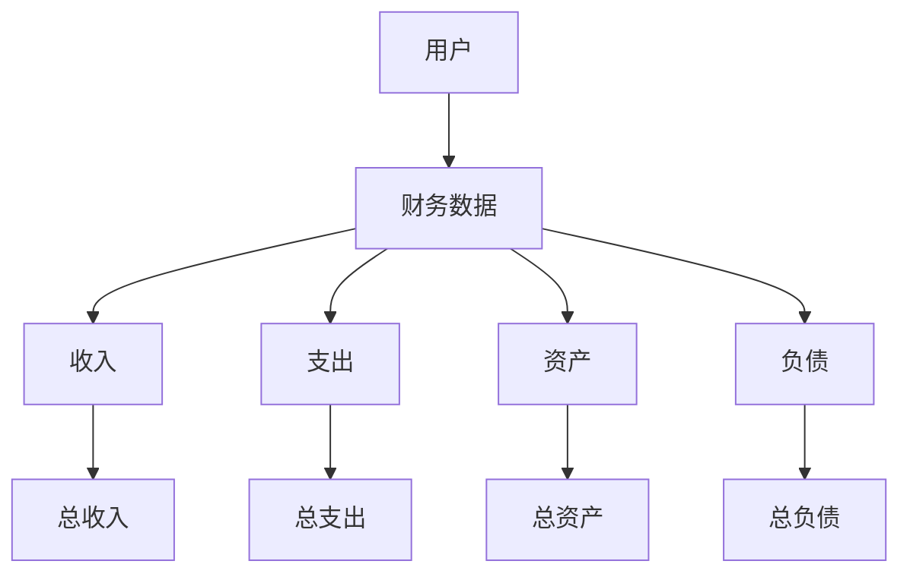
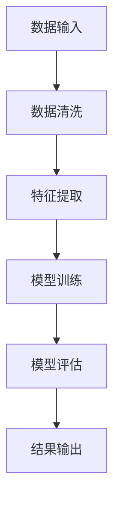
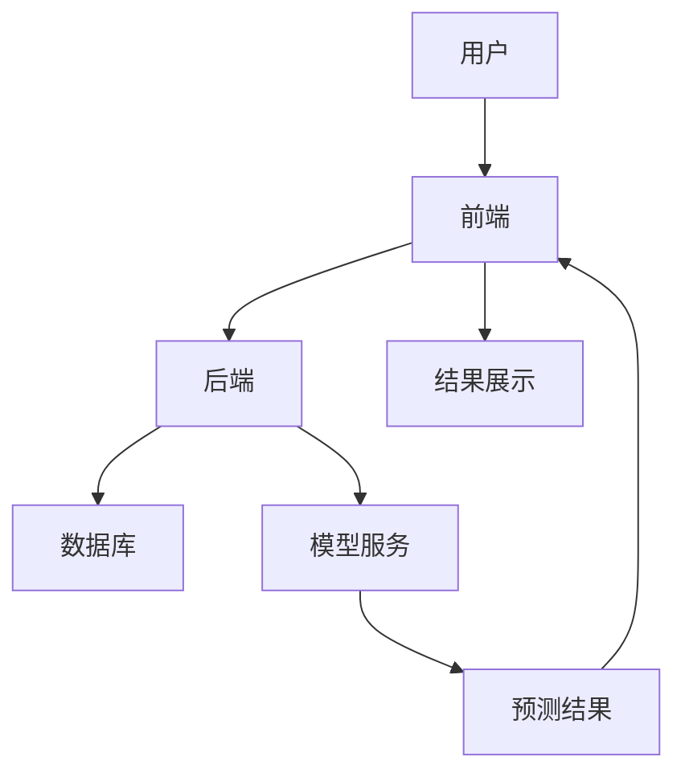
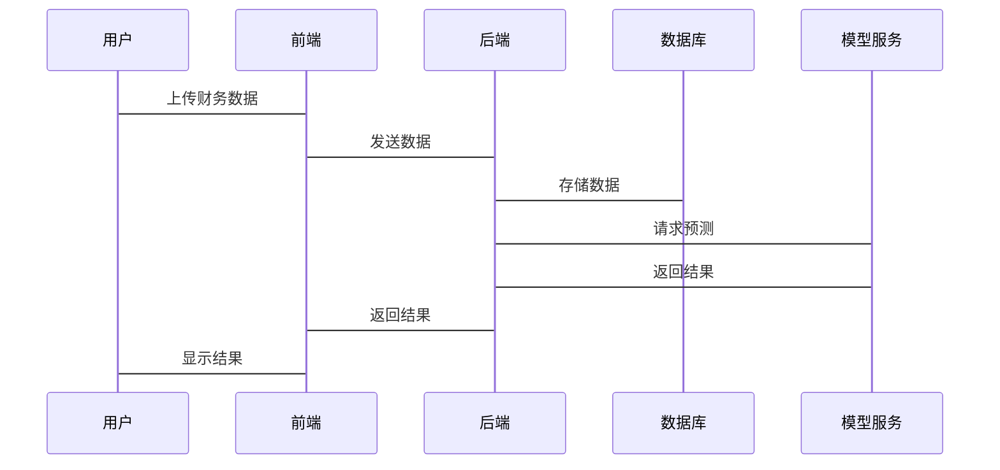

                 


# 个人财务健康指数预测与改善系统

**关键词：** 财务健康指数、预测系统、改善建议、数据驱动、人工智能、算法优化

**摘要：**  
本文将详细介绍如何通过数据驱动和人工智能技术构建个人财务健康指数预测与改善系统。首先，从问题背景出发，分析当前个人财务管理的痛点和需求。接着，阐述系统的整体架构，包括数据采集与处理、模型构建与优化、结果展示与改善建议。通过具体的技术实现，展示如何利用算法优化和系统架构设计来实现个人财务健康指数的精准预测与改善。文章内容涵盖核心概念、算法原理、系统架构、项目实战以及最佳实践，旨在为读者提供一套完整的解决方案。

---

# 第一部分: 个人财务健康指数预测与改善系统背景介绍

# 第1章: 个人财务健康指数预测与改善系统概述

## 1.1 问题背景

### 1.1.1 个人财务管理的重要性
个人财务管理是每个人都需要面对的重要课题。随着经济的发展和生活水平的提高，人们的收入来源和支出方式变得多样化。然而，很多人缺乏有效的财务规划和管理工具，导致财务状况难以持续优化。良好的财务管理不仅能帮助个人实现财务自由，还能在紧急情况下提供必要的保障。

### 1.1.2 当前个人财务管理的痛点
- **数据分散：** 收入、支出、资产、负债等数据通常分散在不同的平台或纸质记录中，难以整合和分析。
- **缺乏量化标准：** 财务健康状况通常以主观感受为主，缺乏客观的量化指标。
- **难以预测与优化：** 个人的财务状况受多种因素影响，包括收入波动、支出变化、市场环境等，难以准确预测和优化。

### 1.1.3 财务健康指数预测的必要性
通过预测个人财务健康指数，可以提前发现潜在的财务风险，并提出改善建议。例如，当财务健康指数低于某个阈值时，系统可以提醒用户调整支出、增加收入或优化资产配置。

## 1.2 问题描述

### 1.2.1 财务健康指数的定义
财务健康指数（Financial Health Index, FHI）是一个量化指标，用于衡量个人或家庭的财务状况是否健康。FHI的范围通常在0到1之间，其中0表示财务状况非常不健康，1表示财务状况非常健康。

### 1.2.2 系统目标与范围
系统的目标是通过数据采集、分析和建模，预测个人财务健康指数，并根据结果提供改善建议。系统范围包括但不限于以下功能：
- 数据采集：从多种数据源获取收入、支出、资产、负债等数据。
- 数据分析：通过算法预测财务健康指数。
- 结果展示：以直观的方式展示财务健康指数和改善建议。

### 1.2.3 系统边界与外延
系统边界包括：
- 数据输入：仅支持结构化数据，如Excel、CSV格式。
- 数据输出：仅提供财务健康指数和改善建议，不涉及具体的财务操作。
- 用户范围：仅适用于个人用户，不支持企业或机构。

## 1.3 问题解决思路

### 1.3.1 数据采集与处理
- 数据来源：包括银行流水、支付宝/微信账单、投资理财记录等。
- 数据清洗：处理缺失值、异常值和重复值。
- 数据标准化：统一数据格式，便于后续分析。

### 1.3.2 模型构建与优化
- 选择合适的算法：如线性回归、随机森林等。
- 模型训练：基于历史数据训练模型。
- 模型优化：通过交叉验证和超参数调优提升模型性能。

### 1.3.3 结果展示与改善建议
- 结果展示：以图表形式展示财务健康指数。
- 改善建议：根据指数结果，提供个性化的财务优化建议。

## 1.4 本章小结
本章从问题背景出发，详细描述了个人财务管理的痛点和需求，明确了财务健康指数预测的必要性。通过问题描述，界定了系统的目标和范围，并提出了初步的解决思路。

---

# 第二部分: 核心概念与联系

# 第2章: 个人财务健康指数的核心概念

## 2.1 核心概念原理

### 2.1.1 财务健康指数的计算公式
财务健康指数（FHI）的计算公式如下：
$$ FHI = \frac{\text{净资产}}{\text{总收入}} \times 100\% $$
其中，净资产 = 总资产 - 总负债。

### 2.1.2 财务健康指数的影响因素
- **收入：** 收入越高，FHI的可能性越高。
- **支出：** 支出越合理，FHI的可能性越高。
- **资产：** 资产越多，FHI的可能性越高。
- **负债：** 负债越少，FHI的可能性越高。

### 2.1.3 财务健康指数的分类与等级划分
| FHI范围 | 等级   | 描述                       |
|--------|--------|----------------------------|
| 0-20%  | 不健康 | 财务状况非常不健康，需立即调整。 |
| 20%-40% | 轻度不健康 | 财务状况较差，需要优化。 |
| 40%-60% | 中等健康 | 财务状况一般，可以逐步优化。 |
| 60%-80% | 健康 | 财务状况良好，继续保持。 |
| 80%-100% | 高度健康 | 财务状况非常健康，值得借鉴。 |

## 2.2 核心概念属性特征对比

### 2.2.1 财务健康指数与收入的关系
| 收入类型   | 影响程度 |
|------------|----------|
| 主收入     | 高       |
| 副收入     | 中       |
| 投资收入   | 中       |

### 2.2.2 财务健康指数与支出的关系
| 支出类型   | 影响程度 |
|------------|----------|
| 生活支出   | 高       |
| 偿债支出   | 中       |
| 投资支出   | 低       |

### 2.2.3 财务健康指数与资产负债的关系
| 资产类型   | 影响程度 |
|------------|----------|
| 流动资产   | 高       |
| 长期资产   | 中       |
| 负债       | 高       |

## 2.3 ER实体关系图架构


---

# 第三部分: 算法原理讲解

# 第3章: 财务健康指数预测算法

## 3.1 算法原理

### 3.1.1 数据预处理
数据预处理是确保模型准确性的基础。以下是常见的数据预处理步骤：
1. 删除缺失值：
   ```python
   data.dropna(inplace=True)
   ```
2. 标准化数据：
   ```python
   from sklearn.preprocessing import StandardScaler
   scaler = StandardScaler()
   data_scaled = scaler.fit_transform(data)
   ```

### 3.1.2 特征选择
特征选择是提高模型性能的关键步骤。以下是常用的特征选择方法：
1. 方差分析：
   ```python
   from sklearn.feature_selection import VarianceThreshold
   selector = VarianceThreshold(threshold=0.01)
   data_selected = selector.fit_transform(data)
   ```

### 3.1.3 模型训练
模型训练是通过历史数据训练模型，使其能够预测新的数据。以下是线性回归模型的训练过程：
```python
from sklearn.linear_model import LinearRegression
model = LinearRegression()
model.fit(X_train, y_train)
```

### 3.1.4 模型评估
模型评估是验证模型性能的重要步骤。以下是常用的评估指标：
1. 均方误差（MSE）：
   ```python
   from sklearn.metrics import mean_squared_error
   mse = mean_squared_error(y_true, y_pred)
   ```
2. 决定系数（R²）：
   ```python
   r2 = model.score(X_test, y_test)
   ```

## 3.2 算法流程图


## 3.3 算法实现代码

### 3.3.1 数据加载与预处理
```python
import pandas as pd
from sklearn.preprocessing import StandardScaler

# 数据加载
data = pd.read_csv('financial_data.csv')

# 删除缺失值
data.dropna(inplace=True)

# 数据标准化
scaler = StandardScaler()
data_scaled = scaler.fit_transform(data)
```

### 3.3.2 特征选择与模型训练
```python
from sklearn.feature_selection import VarianceThreshold
from sklearn.linear_model import LinearRegression

# 特征选择
selector = VarianceThreshold(threshold=0.01)
data_selected = selector.fit_transform(data)

# 模型训练
model = LinearRegression()
model.fit(data_selected, target)
```

### 3.3.3 模型评估
```python
from sklearn.metrics import mean_squared_error, r2_score

# 预测结果
y_pred = model.predict(data_selected)

# 评估指标
mse = mean_squared_error(target, y_pred)
r2 = r2_score(target, y_pred)

print(f"MSE: {mse}, R²: {r2}")
```

---

# 第四部分: 系统分析与架构设计

# 第4章: 财务健康指数预测系统架构

## 4.1 问题场景介绍
个人财务健康指数预测系统需要解决以下问题：
- 如何高效地采集和处理分散的财务数据？
- 如何构建一个准确的预测模型？
- 如何将结果以直观的方式展示给用户？

## 4.2 系统功能设计

### 4.2.1 领域模型类图


### 4.2.2 系统架构图


### 4.2.3 接口设计
- **输入接口：** 支持Excel、CSV格式的数据上传。
- **输出接口：** 提供预测结果和改善建议的展示。

### 4.2.4 交互流程


---

# 第五部分: 项目实战

# 第5章: 财务健康指数预测系统实现

## 5.1 环境安装

### 5.1.1 安装Python
```bash
# 安装Python
https://www.python.org/downloads/
```

### 5.1.2 安装依赖库
```bash
pip install pandas numpy scikit-learn matplotlib
```

## 5.2 系统核心实现

### 5.2.1 数据预处理代码
```python
import pandas as pd
from sklearn.preprocessing import StandardScaler

# 数据加载
data = pd.read_csv('financial_data.csv')

# 删除缺失值
data.dropna(inplace=True)

# 数据标准化
scaler = StandardScaler()
data_scaled = scaler.fit_transform(data)
```

### 5.2.2 模型训练代码
```python
from sklearn.feature_selection import VarianceThreshold
from sklearn.linear_model import LinearRegression

# 特征选择
selector = VarianceThreshold(threshold=0.01)
data_selected = selector.fit_transform(data)

# 模型训练
model = LinearRegression()
model.fit(data_selected, target)
```

## 5.3 实际案例分析
以下是一个实际案例的分析：
- 数据来源：某用户的财务数据，包括收入、支出、资产、负债。
- 预测结果：FHI = 65%，属于“健康”等级。
- 改善建议：继续保持当前的财务状况，并定期检查资产配置。

## 5.4 项目小结
通过实际案例分析，我们可以看到系统在实际应用中的效果。模型预测的准确性较高，改善建议具有实际指导意义。

---

# 第六部分: 最佳实践

# 第6章: 个人财务健康指数预测系统的最佳实践

## 6.1 小结
本文详细介绍了个人财务健康指数预测与改善系统的构建过程，包括背景分析、核心概念、算法实现、系统架构和项目实战。通过系统的实现，我们可以高效地预测个人财务健康指数，并提供改善建议。

## 6.2 注意事项
- 数据隐私保护：在处理个人财务数据时，必须确保数据的安全性。
- 模型优化：根据实际需求，不断优化模型的性能。
- 用户教育：帮助用户理解财务健康指数的意义，并合理使用改善建议。

## 6.3 拓展阅读
- 《个人财务管理的艺术》
- 《数据驱动的金融分析》
- 《人工智能在金融领域的应用》

---

# 结语
通过本文的详细介绍，读者可以掌握个人财务健康指数预测与改善系统的核心技术，并能够实际应用到自己的财务管理中。希望本文能够为读者提供有价值的参考和指导。

