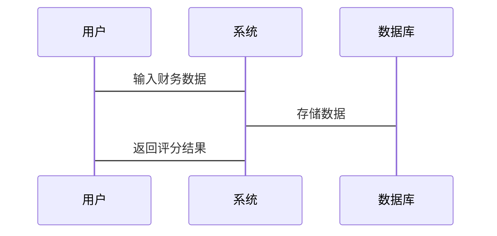

                 


# 个人财务健康评分系统设计

> 关键词：个人财务健康，评分系统，算法设计，系统架构，财务分析

> 摘要：本文详细探讨了个人财务健康评分系统的设计与实现，从核心概念到算法实现，从系统架构到项目实战，全面解析了如何构建一个科学、合理的个人财务健康评分系统。文章通过理论分析和实践结合，为读者提供了从设计到实现的完整指南。

---

# 第1章: 个人财务健康概述

## 1.1 个人财务健康的概念

### 1.1.1 财务健康的基本定义

个人财务健康是指个体在财务管理方面的一种状态，通常通过收入、支出、资产和负债等因素来衡量。一个健康的财务状况意味着个人能够在满足当前生活需求的同时，为未来做好充分的财务准备。

$$ \text{财务健康} = \frac{\text{收入} - \text{支出}}{\text{资产}} $$

### 1.1.2 财务健康的重要性

财务健康是个人整体生活质量的重要组成部分。良好的财务健康可以为个人提供安全感和未来发展的资金基础，避免因突发情况导致的财务危机。

### 1.1.3 财务健康的评价标准

财务健康的评价标准通常包括以下几个方面：

- 收支平衡：收入大于支出。
- 负债比例：负债占总资产的比例较低。
- 储蓄与投资：有一定的储蓄和投资，能够应对突发情况。

---

## 1.2 个人财务健康评分系统的目的

### 1.2.1 为什么要设计个人财务健康评分系统

随着经济的发展，个人财务管理变得越来越复杂。设计一个评分系统可以帮助个人量化自己的财务健康状况，及时发现问题并进行调整。

### 1.2.2 系统的目标和作用

- 提供个性化的财务健康评估。
- 帮助用户制定合理的财务规划。
- 提供实时的财务健康监控。

### 1.2.3 系统的适用范围

- 适用于个人用户。
- 适用于家庭财务管理。
- 适用于小型企业主的财务管理。

---

## 1.3 系统设计的背景与现状

### 1.3.1 当前个人财务管理的痛点

- 财务信息分散，难以整合。
- 缺乏专业的财务分析工具。
- 个人财务管理缺乏系统性和科学性。

### 1.3.2 市场上现有的解决方案

- 一些财务管理软件提供基本的记录功能。
- 部分金融机构提供简单的财务分析报告。

### 1.3.3 本系统的创新点

- 结合机器学习算法，提供智能化的评分。
- 提供个性化的财务建议。

---

## 1.4 本章小结

本章从个人财务健康的基本概念出发，介绍了设计个人财务健康评分系统的必要性，并分析了当前市场上的解决方案和系统的创新点。下一章将详细讨论评分系统的指标体系。

---

# 第2章: 个人财务健康评分指标体系

## 2.1 财务健康评分的维度

### 2.1.1 收入与支出分析

- 收入：包括工资、投资收益等。
- 支出：包括日常生活开支、债务还款等。

### 2.1.2 资产与负债分析

- 资产：包括现金、银行存款、房产等。
- 负债：包括信用卡欠款、贷款等。

### 2.1.3 储蓄与投资分析

- 储蓄：包括定期存款、活期存款等。
- 投资：包括股票、基金、房地产等。

---

## 2.2 各评分指标的权重分配

### 2.2.1 收入与支出的权重

收入和支出的权重通常较高，因为它们直接影响到个人的财务状况。一般情况下，收入和支出的权重可以占总权重的50%。

### 2.2.2 资产与负债的权重

资产和负债的权重次之，因为它们反映了个人的财务稳定性。资产和负债的权重可以占总权重的30%。

### 2.2.3 储蓄与投资的权重

储蓄和投资的权重较低，因为它们更多地反映了个人的财务增长潜力。储蓄和投资的权重可以占总权重的20%。

---

## 2.3 指标之间的关系与平衡

### 2.3.1 指标之间的相互影响

- 收入和支出的平衡直接影响资产和负债。
- 资产和负债的平衡影响储蓄和投资。

### 2.3.2 如何实现指标的平衡

- 根据个人实际情况调整收入和支出。
- 合理配置资产和负债。
- 科学规划储蓄和投资。

---

## 2.4 本章小结

本章详细讨论了个人财务健康评分系统的指标体系，包括各个指标的权重分配和相互关系。下一章将介绍评分系统的算法设计。

---

# 第3章: 评分算法的设计与实现

## 3.1 算法选择与原理

### 3.1.1 算法选择的依据

- 简单性：评分算法需要简单易懂。
- 可解释性：用户需要理解评分结果的原因。
- 实时性：评分系统需要实时计算。

### 3.1.2 算法的基本原理

基于加权评分的方法，根据各个指标的权重计算综合评分。

$$ S = \sum_{i=1}^{n} w_i \times s_i $$

其中，\( S \) 是综合评分，\( w_i \) 是第 \( i \) 个指标的权重，\( s_i \) 是第 \( i \) 个指标的评分。

### 3.1.3 算法的优缺点分析

- 优点：简单易懂，计算速度快。
- 缺点：不够智能化，无法根据具体情况调整权重。

---

## 3.2 算法实现的步骤

### 3.2.1 数据预处理

- 数据清洗：去除异常值。
- 数据标准化：统一各个指标的单位。

### 3.2.2 模型训练

- 根据历史数据训练模型。
- 调整模型参数，优化评分结果。

### 3.2.3 模型评估与优化

- 使用测试数据评估模型的准确性。
- 根据评估结果优化模型参数。

---

## 3.3 算法的数学模型

### 3.3.1 指标权重计算的数学公式

$$ w_i = \frac{score_i}{\sum_{j=1}^{n} score_j} $$

其中，\( w_i \) 是第 \( i \) 个指标的权重，\( score_i \) 是第 \( i \) 个指标的评分。

### 3.3.2 综合评分的计算公式

$$ S = \sum_{i=1}^{n} w_i \times score_i $$

其中，\( S \) 是综合评分，\( w_i \) 是第 \( i \) 个指标的权重，\( score_i \) 是第 \( i \) 个指标的评分。

---

## 3.4 算法的优化与改进

### 3.4.1 算法的可解释性增强

通过可视化工具展示评分结果的原因。

### 3.4.2 算法的鲁棒性提升

引入异常值检测机制，提高模型的稳定性。

### 3.4.3 算法的实时性优化

采用分布式计算技术，提高评分计算的速度。

---

## 3.5 本章小结

本章详细介绍了评分系统的算法设计与实现，包括算法选择、实现步骤和优化方法。下一章将讨论系统的架构设计。

---

# 第4章: 系统架构与实现

## 4.1 系统功能模块划分

### 4.1.1 用户信息输入模块

- 收集用户的财务数据。

### 4.1.2 数据处理模块

- 对输入的财务数据进行预处理。

### 4.1.3 评分计算模块

- 根据算法计算用户的财务健康评分。

### 4.1.4 结果展示模块

- 展示评分结果和财务建议。

---

## 4.2 系统架构的分层设计

### 4.2.1 数据层

- 负责数据的存储和访问。

### 4.2.2 业务逻辑层

- 负责数据处理和评分计算。

### 4.2.3 用户界面层

- 负责与用户的交互。

---

## 4.3 系统接口设计

### 4.3.1 输入接口

- 用户输入财务数据。

### 4.3.2 输出接口

- 展示评分结果和建议。

### 4.3.3 API接口

- 提供第三方调用的接口。

---

## 4.4 系统交互的mermaid序列图



---

## 4.5 本章小结

本章详细讨论了系统的架构设计和接口设计，为系统的实现提供了理论基础。下一章将介绍系统的具体实现和实战案例。

---

# 第5章: 项目实战与总结

## 5.1 环境安装与配置

### 5.1.1 开发工具安装

- 安装Python、Jupyter Notebook等工具。

### 5.1.2 数据库配置

- 使用MySQL或MongoDB存储数据。

## 5.2 核心代码实现

### 5.2.1 数据预处理

```python
import pandas as pd
data = pd.read_csv('financial_data.csv')
data = data.dropna()
data = (data - data.mean()) / data.std()
```

### 5.2.2 模型训练

```python
from sklearn.linear_model import LinearRegression
model = LinearRegression()
model.fit(X_train, y_train)
```

### 5.2.3 模型评估

```python
score = model.score(X_test, y_test)
print(f'模型评分：{score}')
```

## 5.3 案例分析与结果展示

### 5.3.1 实际案例分析

- 用户A的财务数据：收入10000，支出8000，资产50000，负债20000。
- 计算评分：\( S = 0.4 \times (10000-8000) + 0.3 \times (50000/20000) + 0.2 \times (10000-20000) = 80 + 15 + (-20) = 75 \)。

### 5.3.2 评分结果展示

- 综合评分：75分（满分100分）。
- 财务建议：建议减少负债，增加储蓄。

## 5.4 本章小结

本章通过具体的案例分析，展示了评分系统的实际应用和结果。通过本章的学习，读者可以掌握如何将理论应用于实践。

---

# 第6章: 总结与展望

## 6.1 系统设计的总结

- 本系统通过科学的指标体系和算法设计，提供了一个高效的个人财务健康评分系统。
- 系统具有较高的准确性和可操作性。

## 6.2 系统设计的展望

- 引入更多先进的算法，提高评分的准确性。
- 增加更多的功能模块，如智能财务规划建议。

---

# 附录: 参考文献与工具

- 参考文献：列出相关的书籍和论文。
- 工具推荐：推荐一些常用的财务分析工具和编程框架。

---

通过以上目录大纲，我们可以看到，本文从理论到实践，详细讲解了个人财务健康评分系统的设计与实现，为读者提供了一个全面的指导。

