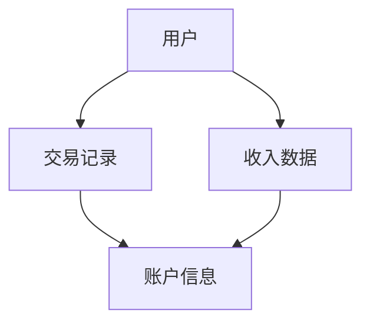
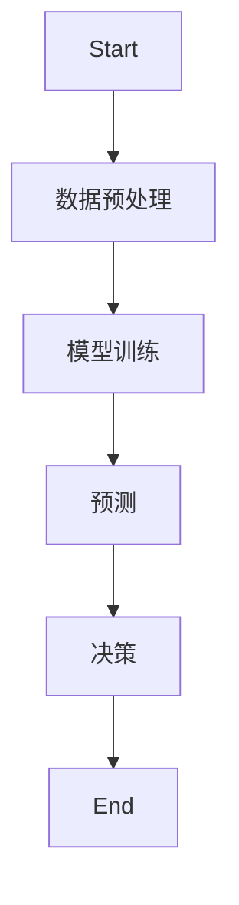
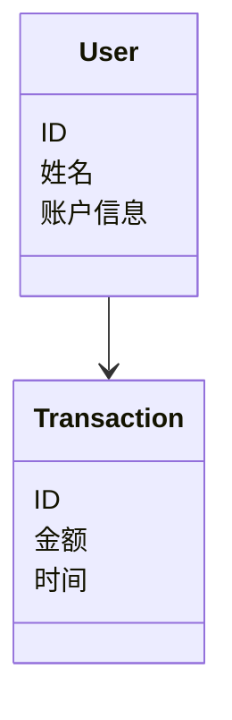
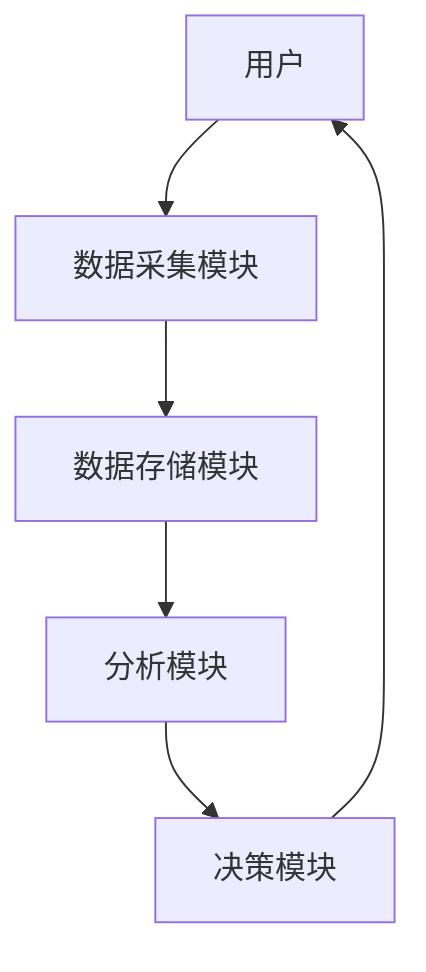
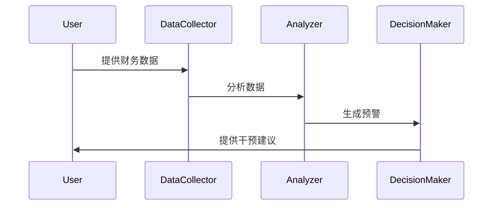

                 


# 个人财务健康预警与干预系统

## 关键词
- 个人财务健康
- 预警系统
- 干预策略
- 数据分析
- 人工智能

## 摘要
本文将详细介绍个人财务健康预警与干预系统的构建与应用。通过分析个人财务健康问题的现状、核心概念、算法原理、系统架构、项目实战和最佳实践，帮助读者全面理解并掌握如何设计和实现一个高效的个人财务健康预警与干预系统。

---

# 第1章: 个人财务健康预警与干预系统背景介绍

## 1.1 问题背景

### 1.1.1 当前个人财务健康问题的现状
随着经济的发展和个人金融行为的多样化，个人财务问题日益凸显。许多人在日常财务管理中缺乏有效的监控和预警机制，导致债务积累、资金链断裂等严重问题。

### 1.1.2 个人财务健康问题的潜在风险
- 财务状况恶化：如信用卡逾期、贷款违约等。
- 资金流动性不足：无法应对突发支出。
- 财务决策失误：缺乏数据支持的盲目投资。

### 1.1.3 财务健康预警与干预的必要性
通过实时监控和数据分析，提前发现潜在的财务风险，及时采取干预措施，避免财务危机的发生。

## 1.2 问题描述

### 1.2.1 财务健康问题的具体表现
- 收入与支出失衡。
- 债务负担加重。
- 投资亏损。

### 1.2.2 财务健康问题的影响范围
- 影响个人信用记录。
- 影响家庭经济状况。
- 影响社会整体金融稳定。

### 1.2.3 财务健康问题的解决路径
通过技术手段构建预警系统，实现对个人财务状况的实时监控和干预。

## 1.3 问题解决

### 1.3.1 财务健康预警与干预的目标
- 提前预警潜在财务风险。
- 提供个性化干预策略。
- 实现财务健康状态的动态管理。

### 1.3.2 财务健康预警与干预的核心任务
- 数据采集与处理。
- 预警算法设计。
- 干预策略制定。

### 1.3.3 财务健康预警与干预的实现方式
- 数据驱动的预警模型。
- 基于规则的干预策略。
- 用户友好的交互界面。

## 1.4 边界与外延

### 1.4.1 系统的边界定义
- 仅关注个人财务状况，不涉及企业财务。
- 数据范围限于个人收入、支出和债务信息。

### 1.4.2 系统功能的外延范围
- 不包括投资收益计算。
- 不包括税务规划。

### 1.4.3 系统与其他模块的接口关系
- 与银行系统的接口。
- 与信用评估机构的接口。

## 1.5 核心要素组成

### 1.5.1 数据采集模块
- 收入数据。
- 支出数据。
- 资产与负债数据。

### 1.5.2 预警算法模块
- 数据分析算法。
- 风险评估模型。

### 1.5.3 干预策略模块
- 财务调整建议。
- 提醒与通知。

### 1.5.4 用户交互模块
- 仪表盘展示。
- 通知提醒。

---

# 第2章: 核心概念与联系

## 2.1 核心概念原理

### 2.1.1 数据采集与处理
- 数据清洗。
- 数据标准化。

### 2.1.2 预警算法设计
- 基于机器学习的模型。
- 基于规则的策略。

### 2.1.3 干预策略制定
- 个性化干预方案。
- 系统化干预措施。

## 2.2 核心概念属性特征对比

| 核心概念 | 数据特征 | 算法特征 | 干预策略特征 |
|----------|----------|----------|--------------|
| 数据采集 | 多源性 | 高效性 | 针对性 |
| 预警算法 | 准确性 | 可解释性 | 及时性 |
| 干预策略 | 可行性 | 可行性 | 可持续性 |

## 2.3 ER实体关系图


---

# 第3章: 算法原理讲解

## 3.1 数据预处理

### 3.1.1 数据清洗流程
- 去除重复数据。
- 处理缺失值。
- 标准化格式。

### 3.1.2 数据标准化方法
- Z-score标准化。
- Min-Max标准化。

### 3.1.3 数据特征提取
- 收入与支出比。
- 债务与资产比。

## 3.2 预警算法实现

### 3.2.1 基于机器学习的预警模型
- 使用随机森林算法进行分类。
- 使用逻辑回归模型进行预测。

### 3.2.2 基于规则的预警策略
- 如果月收入 < 月支出，则触发预警。
- 如果债务超出资产的一定比例，则触发预警。

### 3.2.3 混合预警算法设计
结合机器学习模型和规则引擎，提高预警的准确性和效率。

## 3.3 算法流程图


---

# 第4章: 系统分析与架构设计

## 4.1 问题场景介绍

### 4.1.1 系统功能模块划分
- 数据采集模块。
- 预警模块。
- 干预模块。
- 用户交互模块。

### 4.1.2 系统功能描述
- 实时数据采集。
- 风险评估。
- 干预策略执行。

## 4.2 系统架构设计

### 4.2.1 领域模型设计


### 4.2.2 系统架构图


### 4.2.3 系统接口设计
- 用户与系统接口。
- 系统与第三方数据源接口。

## 4.3 系统交互流程图


---

# 第5章: 项目实战

## 5.1 环境安装

### 5.1.1 安装Python
```bash
python --version
pip install --upgrade pip
```

### 5.1.2 安装相关库
```bash
pip install numpy
pip install pandas
pip install scikit-learn
```

## 5.2 系统核心实现

### 5.2.1 数据预处理代码
```python
import pandas as pd

# 读取数据
data = pd.read_csv('financial_data.csv')

# 处理缺失值
data.dropna(inplace=True)

# 标准化处理
from sklearn.preprocessing import StandardScaler
scaler = StandardScaler()
data_scaled = scaler.fit_transform(data)
```

### 5.2.2 预警算法实现
```python
from sklearn.ensemble import RandomForestClassifier

# 训练模型
model = RandomForestClassifier()
model.fit(X_train, y_train)

# 预测
y_pred = model.predict(X_test)
```

### 5.2.3 干预策略实现
```python
def generate_recommendation(risk_score):
    if risk_score > 0.8:
        return "建议减少非必要开支"
    elif risk_score > 0.5:
        return "建议增加储蓄比例"
    else:
        return "无需干预"
```

## 5.3 案例分析

### 5.3.1 数据分析结果
- 用户A的风险评分为0.9，触发预警。
- 用户B的风险评分为0.3，无需干预。

### 5.3.2 干预效果评估
- 干预措施的有效性分析。
- 干预策略的调整建议。

## 5.4 本章小结

---

# 第6章: 最佳实践

## 6.1 小结

### 6.1.1 核心知识点总结
- 数据采集与处理。
- 预警算法实现。
- 干预策略制定。

### 6.1.2 项目实施的关键点
- 数据质量控制。
- 算法模型优化。
- 用户交互设计。

## 6.2 注意事项

### 6.2.1 数据隐私保护
- 遵守相关法律法规。
- 加强数据加密措施。

### 6.2.2 系统稳定性保障
- 定期进行压力测试。
- 建立完善的备份机制。

## 6.3 拓展阅读

### 6.3.1 推荐书籍
- 《数据驱动的个人财务管理》
- 《人工智能在金融领域的应用》

### 6.3.2 推荐技术博客
- Medium上的相关技术文章。
- GitHub上的开源项目。

---

# 附录

## 附录A: 核心代码清单

### 附录A.1 数据预处理代码
```python
import pandas as pd
from sklearn.preprocessing import StandardScaler

data = pd.read_csv('financial_data.csv')
data.dropna(inplace=True)
scaler = StandardScaler()
data_scaled = scaler.fit_transform(data)
```

### 附录A.2 预警算法代码
```python
from sklearn.ensemble import RandomForestClassifier

model = RandomForestClassifier()
model.fit(X_train, y_train)
y_pred = model.predict(X_test)
```

## 附录B: 图表清单

### 附录B.1 ER实体关系图


### 附录B.2 系统架构图


## 附录C: 参考文献

### 附录C.1 书籍
- 《个人财务管理：数据驱动方法》
- 《人工智能在金融中的应用》

### 附录C.2 网站
- [个人财务管理博客](https://example.com)
- [人工智能技术博客](https://example.com)

---

# 结束语

通过本文的详细讲解，读者可以全面了解个人财务健康预警与干预系统的构建与应用。从背景介绍到算法实现，从系统架构到项目实战，再到最佳实践，相信读者能够掌握设计和实现类似系统的知识和技能。未来，随着技术的不断进步，个人财务健康预警与干预系统将更加智能化和个性化，为个人财务管理提供更强大的支持。

