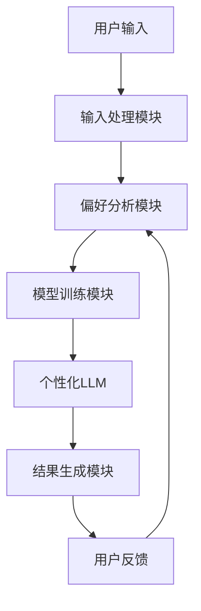
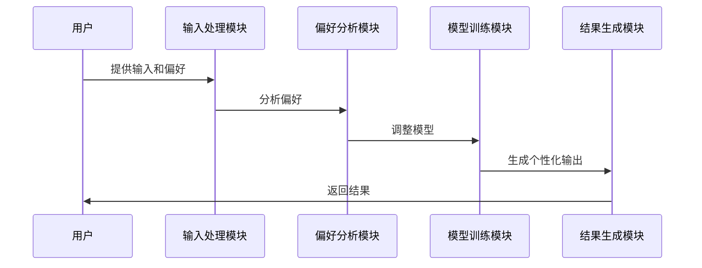

                 


# 个性化AI Agent：根据用户偏好定制LLM

## 关键词：
个性化AI Agent、LLM、用户偏好、定制化、机器学习、自然语言处理

## 摘要：
个性化AI Agent是基于用户偏好定制的大语言模型（LLM），能够根据用户需求调整模型输出，提升用户体验。本文将详细探讨个性化LLM的核心概念、实现方法、系统架构及实际应用，帮助读者深入了解如何构建和优化个性化的AI代理。

---

## 正文

### 第一部分：个性化AI Agent的背景与概念

#### 第1章：个性化AI Agent的核心概念

##### 1.1 个性化AI Agent的定义与背景

- **1.1.1 个性化AI Agent的定义**
  个性化AI Agent是一种智能助手，能够根据用户的具体偏好和需求，动态调整其行为和输出，提供高度个性化的服务。

- **1.1.2 个性化AI Agent的发展背景**
  - 传统AI Agent的局限性：输出固定，无法根据用户偏好调整。
  - 个性化需求的增长：用户期望服务更具针对性和效率。
  - 技术进步：大语言模型（LLM）的发展为个性化定制提供了可能。

- **1.1.3 个性化AI Agent的应用场景**
  - 个人助手：根据用户的日程安排和偏好推荐任务。
  - 电子商务：基于用户购买历史推荐商品。
  - 教育：根据学生的学习风格提供个性化教学内容。

##### 1.2 用户偏好分析的必要性

- **1.2.1 用户偏好的多样性**
  用户的需求和偏好多种多样，单一化的服务无法满足所有用户。

- **1.2.2 个性化服务的需求**
  用户期望服务能够理解并满足其个性化需求，提升使用体验。

- **1.2.3 为什么需要根据用户偏好定制LLM**
  定制LLM可以使其更好地适应用户的语言风格、内容偏好和使用习惯。

##### 1.3 问题背景与问题描述

- **1.3.1 当前LLM的通用性问题**
  现有的LLM通常是通用的，无法针对特定用户的偏好进行优化。

- **1.3.2 用户偏好未充分考虑的局限性**
  忽略用户偏好可能导致输出不符合用户的期望，影响用户体验。

- **1.3.3 个性化LLM的目标与边界**
  目标是通过定制LLM，使其输出更符合用户偏好。边界包括数据隐私和模型性能。

##### 1.4 核心概念与联系

- **核心概念的定义**
  - 用户偏好：用户在使用服务时表现出的特定倾向或需求。
  - 定制化：根据特定需求调整模型参数或架构。

- **核心概念的属性特征对比表**

| 概念       | 特性                   | 描述                                                         |
|------------|------------------------|--------------------------------------------------------------|
| 用户偏好   | 可变性                 | 不同用户有不同的偏好                                         |
| 定制化      | 精准性                 | 根据偏好调整模型，提高准确性                                 |

- **ER实体关系图的Mermaid流程图**

```mermaid
erDiagram
    user[用户] {
        id : 整数
        preference : 偏好设置
    }
    agent[AI代理] {
        id : 整数
        modelParameters : 模型参数
    }
    user --> preference : 提供偏好
    preference --> modelParameters : 影响模型参数
    modelParameters --> agent : 定制代理
```

### 第二部分：LLM的基本原理

#### 第2章：大语言模型（LLM）的工作机制

##### 2.1 LLM的模型结构

- **2.1.1 深度学习模型的基本结构**
  - 输入层、隐藏层、输出层。
  - 每层包括多个神经元，通过权重和激活函数进行计算。

- **2.1.2 变压器（Transformer）架构**
  - 由编码器和解码器组成。
  - 注意力机制：计算每个词与其他词的相关性。

- **2.1.3 注意力机制的原理**
  - 通过查询（Q）、键（K）、值（V）计算注意力权重。
  - 公式：$Attention(Q, K, V) = softmax(\frac{QK^T}{\sqrt{d_k}})V$，其中$d_k$是键的维度。

##### 2.2 LLM的训练与优化

- **2.2.1 监督学习与无监督学习**
  - 监督学习：有标签数据训练。
  - 无监督学习：无标签数据训练，如聚类和降维。

- **2.2.2 预训练与微调（Fine-tuning）**
  - 预训练：在大规模数据上预训练模型。
  - 微调：在特定任务上进行调整，提升性能。

- **2.2.3 模型训练的数学模型**
  - 损失函数：交叉熵损失。
  - 优化器：Adam优化器，公式：$\theta_{t+1} = \theta_t - \eta \nabla L$。

##### 2.3 LLM的调优技巧

- **2.3.1 参数调整的影响**
  - 学习率：影响收敛速度和最终性能。
  - batch大小：影响训练效率和模型泛化能力。

- **2.3.2 模型架构的优化**
  - 增加层数：提升模型表达能力。
  - 调整注意力头数：优化并行计算效率。

- **2.3.3 训练数据的选择与清洗**
  - 数据清洗：去除噪声数据，提高训练质量。
  - 数据增强：扩展数据多样性，提升模型鲁棒性。

### 第三部分：用户偏好分析与建模

#### 第3章：用户偏好分析的方法

##### 3.1 数据收集与处理

- **3.1.1 数据来源渠道**
  - 用户输入日志：记录用户的查询和操作。
  - 用户反馈：直接收集用户的偏好信息。
  - 用户画像：基于用户行为构建画像。

- **3.1.2 数据清洗与预处理**
  - 去除无效数据：如重复、错误数据。
  - 数据标准化：统一数据格式和特征。

- **3.1.3 数据特征提取**
  - 文本特征：使用TF-IDF提取关键词。
  - 用户行为特征：分析用户的点击、购买记录。

##### 3.2 用户画像的构建

- **3.2.1 用户画像的定义**
  用户画像：通过数据构建的用户形象，反映用户的特征和行为。

- **3.2.2 用户画像的构建步骤**
  1. 收集用户数据。
  2. 数据清洗和预处理。
  3. 使用聚类算法将用户分组。
  4. 为每个用户群体创建画像。

- **3.2.3 用户画像的可视化**
  使用图表展示用户特征，如柱状图、饼图。

##### 3.3 偏好模型的建立

- **3.3.1 基于机器学习的偏好建模**
  - 使用分类或回归模型，如SVM、随机森林。
  - 公式：$y = w \cdot x + b$，其中$y$是预测偏好，$x$是特征向量。

- **3.3.2 基于规则的偏好建模**
  - 设定特定规则，如“如果用户经常购买电子产品，则推荐科技新闻”。

- **3.3.3 混合模型的优势**
  结合机器学习和规则，提高准确性和可解释性。

### 第四部分：个性化LLM的定制方法

#### 第4章：根据用户偏好微调LLM

##### 4.1 微调策略

- **4.1.1 参数微调（Parameter Fine-tuning）**
  - 在预训练的基础上，使用特定任务的数据进行微调。
  - 公式：$\theta_{final} = \theta_{pre} + \Delta \theta$。

- **4.1.2 知识蒸馏（Knowledge Distillation）**
  - 将大模型的知识迁移到小模型。
  - 使用教师模型和学生模型，公式：$P(y|x) = \text{softmax}(g(x))$。

- **4.1.3 任务特定微调**
  - 根据任务调整模型，如文本生成、问答系统。

##### 4.2 生成式模型的偏好调整

- **4.2.1 基于偏好向量的调整**
  - 将用户偏好转换为向量，作为生成的约束条件。
  - 公式：$p(y|x) \propto p(y|x) \cdot f(preference)$。

- **4.2.2 偏好嵌入的融合**
  - 将偏好嵌入到生成过程中，影响模型的输出。
  - 使用注意力机制，公式：$a_i = \text{softmax}(q^T k_i)$。

- **4.2.3 动态调整生成策略**
  - 根据实时反馈调整生成内容，如温度调整。

### 第五部分：系统架构与实现

#### 第5章：系统架构设计

##### 5.1 系统功能设计

- **用户输入处理模块**
  - 接收用户的输入，解析偏好。
  - 使用自然语言处理技术提取意图。

- **模型训练模块**
  - 根据用户偏好数据，调整模型参数。
  - 使用分布式训练提升效率。

- **结果生成模块**
  - 根据调整后的模型生成个性化输出。
  - 生成结果后，提供反馈收集模块，用于进一步优化模型。

##### 5.2 系统架构设计的Mermaid图



##### 5.3 系统接口设计

- **输入接口**
  - REST API：接收用户的输入和偏好。
  - JSON格式：包含用户ID、偏好参数。

- **输出接口**
  - 返回生成内容和相关反馈。
  - 支持多种格式，如文本、JSON。

##### 5.4 系统交互的Mermaid序列图



### 第六部分：项目实战

#### 第6章：项目实战

##### 6.1 环境安装与配置

- **安装Python和相关库**
  - 安装Python 3.8及以上版本。
  - 安装必要的库：`transformers`, `scikit-learn`, `tensorflow`。

- **安装开发环境**
  - 安装Jupyter Notebook或VS Code。
  - 配置虚拟环境，确保所有依赖项正确安装。

##### 6.2 核心实现源代码

```python
import torch
from transformers import AutoTokenizer, AutoModelForCausalLM

# 加载预训练模型
tokenizer = AutoTokenizer.from_pretrained('gpt2')
model = AutoModelForCausalLM.from_pretrained('gpt2')

# 定义微调函数
def fine_tune(model, tokenizer, train_dataset, num_epochs=3):
    model.train()
    optimizer = torch.optim.Adam(model.parameters(), lr=1e-5)
    for epoch in range(num_epochs):
        for batch in train_dataset:
            inputs = tokenizer(batch['text'], return_tensors='pt', padding=True, truncation=True)
            labels = torch.tensor(batch['label'], dtype=torch.long)
            outputs = model(**inputs, labels=labels)
            loss = outputs.loss
            optimizer.zero_grad()
            loss.backward()
            optimizer.step()
    return model

# 示例训练数据
train_dataset = [{'text': '推荐科技新闻', 'label': 1}, {'text': '推荐娱乐新闻', 'label': 0}]

# 进行微调
model_fine_tuned = fine_tune(model, tokenizer, train_dataset)
```

##### 6.3 代码应用解读与分析

- **加载预训练模型**
  使用`transformers`库加载预训练的GPT-2模型和分词器。

- **微调函数实现**
  定义一个微调函数，使用Adam优化器，进行反向传播和优化。

- **训练数据准备**
  准备训练数据，包括文本和标签，进行模型微调。

##### 6.4 实际案例分析

- **案例背景**
  假设用户A喜欢科技新闻，用户B喜欢娱乐新闻。

- **数据准备**
  为每个用户收集和他们的互动历史，生成偏好数据。

- **模型微调**
  根据用户的偏好数据，微调预训练模型，生成更符合用户偏好的内容。

##### 6.5 项目小结

- **关键步骤总结**
  - 数据收集与处理。
  - 用户偏好分析。
  - 模型微调。
  - 生成个性化输出。

### 第七部分：总结与展望

#### 第7章：总结与展望

##### 7.1 个性化AI Agent的重要性和实现的关键点

- **个性化LLM的重要性**
  - 提高用户体验。
  - 提升服务效率。
  - 适应不同用户需求。

- **实现的关键点**
  - 精准的用户偏好分析。
  - 高效的模型微调技术。
  - 可扩展的系统架构设计。

##### 7.2 未来展望

- **技术进步**
  - 更高效的大模型训练方法。
  - 更精准的偏好建模技术。
  - 更强大的计算能力支持。

- **应用场景扩展**
  - 教育、医疗、金融等更多领域。
  - 更复杂的用户需求处理。
  - 多模态AI Agent的发展。

---

## 结语

个性化AI Agent的实现是一个复杂而有趣的过程，需要结合用户偏好分析、LLM微调和系统架构设计。通过本文的详细讲解，读者可以深入了解如何构建一个高效的个性化AI Agent，并在实际项目中应用这些方法。未来，随着技术的进步，个性化AI Agent将变得更加智能和多样化，为用户带来更优质的服务体验。

