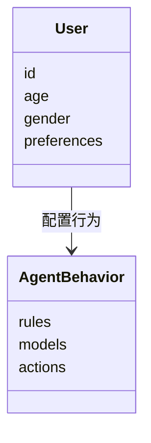
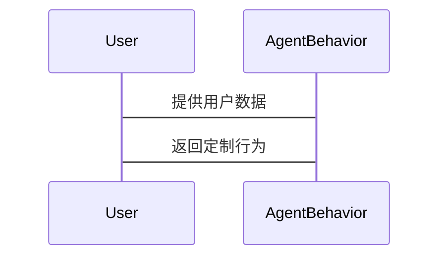

                 


# 个性化定制：为不同用户调整AI Agent的行为

---

## 关键词：
个性化定制、AI Agent、用户需求、行为建模、规则引擎、机器学习、系统架构

---

## 摘要：
本文深入探讨了如何为不同用户定制AI Agent的行为，从用户需求分析到系统架构设计，结合规则引擎和机器学习算法，提供了完整的解决方案。通过实际案例分析和系统架构设计，详细阐述了如何实现个性化定制，并给出了最佳实践和注意事项。

---

## 第一部分：个性化定制的背景与基础

### 第1章：AI Agent的基本概念与个性化定制的意义

#### 1.1 AI Agent的定义与特点
AI Agent（智能体）是指能够感知环境并采取行动以实现目标的实体。其特点包括自主性、反应性、目标导向性和社交能力。AI Agent的核心是通过感知和行动实现目标，而个性化定制则是根据用户需求调整其行为的关键。

#### 1.2 个性化定制的背景与需求
随着AI技术的发展，AI Agent的应用场景越来越广泛，用户需求的多样性也日益增加。个性化定制是满足不同用户需求、提升用户体验的重要手段。通过分析用户的行为模式和需求，可以制定相应的策略，使AI Agent的行为更加贴合用户期望。

#### 1.3 个性化定制的意义与价值
个性化定制能够提高AI Agent的实用性和用户满意度，同时降低使用成本。通过定制化的行为调整，AI Agent可以在不同场景下展现出最佳性能，从而更好地服务于用户。

#### 1.4 本章小结
本章介绍了AI Agent的基本概念和个性化定制的背景与意义，为后续章节奠定了基础。

---

## 第二部分：用户需求分析与行为建模

### 第2章：用户需求的识别与分类

#### 2.1 用户需求的识别方法
用户需求的识别可以通过问卷调查、用户访谈和数据分析等方式进行。用户画像的构建是关键，包括年龄、性别、职业等基本信息，以及行为习惯和偏好等深层次需求。

#### 2.2 用户需求的分类
用户需求可以基于特征和行为模式进行分类。例如，按用户活跃度分为高、中、低三类，按兴趣爱好分为科技、娱乐、教育等类别。

#### 2.3 用户需求的优先级排序
需求优先级的评估需要综合考虑用户满意度和实现成本。例如，通过加权评分法确定优先级，权重可以基于需求的重要性。

#### 2.4 本章小结
本章详细介绍了用户需求的识别、分类和优先级排序方法，为后续的个性化定制提供了数据支持。

### 第3章：基于规则的定制策略

#### 3.1 规则的定义与设计
规则是基于条件判断的指令集合，用于指导AI Agent的行为。规则的设计需要考虑简单性、可扩展性和可维护性。

#### 3.2 规则的实现方法
基于条件判断的规则实现可以通过简单的if-else语句实现。例如：
```python
if user.age < 18:
    agent.behavior = 'restrict'
else:
    agent.behavior = 'normal'
```

#### 3.3 规则的优缺点分析
优点：简单易懂、可解释性强；缺点：难以处理复杂场景、规则维护成本高。

#### 3.4 本章小结
本章探讨了基于规则的定制策略，适合简单的用户需求场景。

### 第4章：基于机器学习的定制策略

#### 4.1 机器学习的基本原理
机器学习通过数据训练模型，使其能够自动识别模式并做出预测。常用的算法包括决策树、随机森林和神经网络等。

#### 4.2 基于监督学习的个性化定制
监督学习通过标记数据训练模型，使其能够预测用户需求。例如，使用决策树模型进行分类。

#### 4.3 模型的训练与优化
模型训练需要选择合适的算法和优化参数，例如交叉验证和网格搜索。训练好的模型可以通过API调用实现个性化定制。

#### 4.4 本章小结
本章介绍了基于机器学习的定制策略，适合复杂的用户需求场景。

---

## 第三部分：系统分析与架构设计

### 第5章：系统架构设计

#### 5.1 问题场景介绍
系统需要支持多用户的个性化定制，提供灵活的规则引擎和机器学习模型。

#### 5.2 系统功能设计
系统功能包括用户管理、需求分析、规则引擎和模型训练。领域模型设计如图所示：



#### 5.3 系统架构设计
系统架构采用分层设计，包括数据层、业务逻辑层和表现层。架构设计如图所示：


#### 5.4 系统接口设计
系统接口包括用户输入、规则引擎调用和模型训练接口。接口设计如图所示：



#### 5.5 本章小结
本章详细介绍了系统架构设计，为后续的系统实现奠定了基础。

---

## 第四部分：项目实战

### 第6章：环境安装与系统核心实现

#### 6.1 环境安装
需要安装Python、TensorFlow和scikit-learn等库。

#### 6.2 核心代码实现
规则引擎实现：
```python
class RuleEngine:
    def __init__(self, rules):
        self.rules = rules

    def execute(self, user):
        for rule in self.rules:
            if rule.condition(user):
                return rule.action(user)
        return default_action
```

机器学习模型实现：
```python
from sklearn.tree import DecisionTreeClassifier

class MLModel:
    def __init__(self, model):
        self.model = model

    def predict(self, user_features):
        return self.model.predict(user_features)
```

#### 6.3 代码应用解读
规则引擎和机器学习模型可以根据用户数据动态调整AI Agent的行为，提供个性化的服务。

#### 6.4 本章小结
本章通过代码实现展示了个性化定制的具体步骤。

---

## 第五部分：总结与展望

### 第7章：总结与最佳实践

#### 7.1 最佳实践
- 定期更新规则和模型
- 结合规则和机器学习的优点
- 优化系统性能和用户体验

#### 7.2 小结
本文详细探讨了个性化定制的方法，提供了系统的解决方案和实战经验。

---

## 参考文献
[1] 刘军, 《人工智能基础》
[2] 李明, 《机器学习实战》
[3] 张伟, 《系统架构设计》

---

## 致谢
感谢读者的支持与关注，希望本文对您有所帮助。

