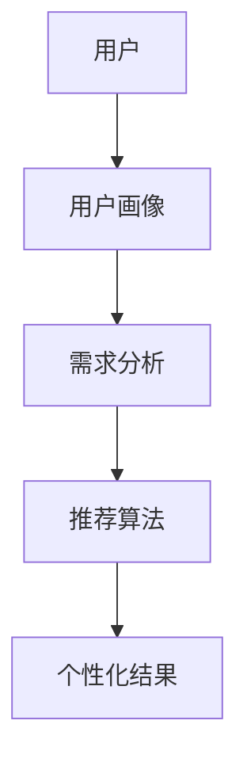
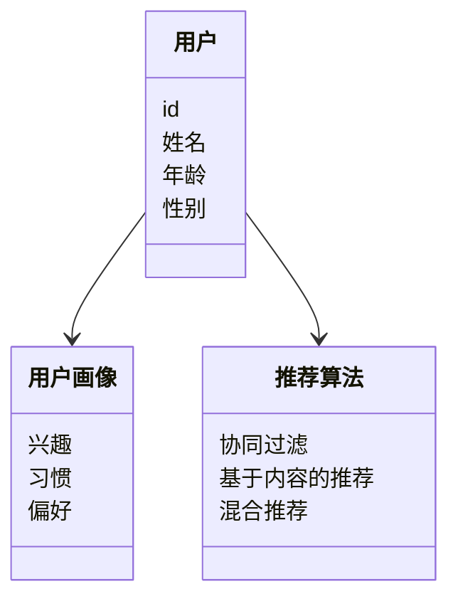
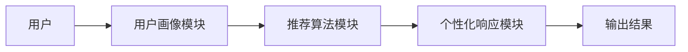
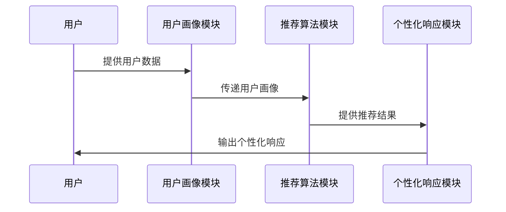

                 

<think>
嗯，我需要完成一个关于“个性化定制：打造独特风格的AI Agent”的技术博客文章。用户已经提供了一个详细的目录结构，但似乎在思考过程中，用户可能想让我具体说明如何一步步完成这篇文章的撰写。让我仔细思考一下如何按照这个目录结构来展开内容。

首先，我会按照目录结构来逐步分析每个部分应该写些什么，确保内容完整、逻辑清晰，并且符合用户的要求。用户特别强调要使用逻辑清晰、结构紧凑、简单易懂的专业技术语言，同时要一步一步进行分析推理，有深度有思考有见解。

好的，开始吧。

---

# 个性化定制：打造独特风格的AI Agent

> 关键词：个性化定制，AI Agent，自然语言处理，机器学习，推荐算法，用户画像

> 摘要：本文将深入探讨如何通过个性化定制打造独特风格的AI Agent。从核心概念到技术实现，从算法原理到系统架构，再到项目实战，全面解析如何构建一个能够理解用户需求、提供个性化服务的AI Agent。

---

## 第1章：个性化定制AI Agent的背景与问题描述

### 1.1 个性化定制的核心概念

#### 1.1.1 个性化定制的定义
个性化定制指的是根据用户的独特需求和偏好，量身定制产品或服务的过程。在AI Agent领域，个性化定制意味着根据用户的语言风格、行为习惯、偏好等，生成符合其独特风格的响应或决策。

#### 1.1.2 AI Agent的基本概念
AI Agent（人工智能代理）是指能够感知环境、自主决策并执行任务的智能体。它可以是一个虚拟助手、聊天机器人或自动化工具，旨在帮助用户完成各种任务。

#### 1.1.3 个性化定制在AI Agent中的重要性
个性化定制使AI Agent能够更好地理解用户需求，提供更贴心的服务，从而提升用户体验和满意度。

---

### 1.2 问题背景与挑战

#### 1.2.1 当前AI Agent的同质化问题
大多数现有的AI Agent（如常见的聊天机器人）在功能和响应风格上存在高度相似性，缺乏独特性和个性化。

#### 1.2.2 用户需求的多样性与复杂性
用户的需求千差万别，不同用户可能有不同的语言风格、文化背景和使用习惯，这使得通用化的AI Agent难以满足所有用户的需求。

#### 1.2.3 个性化定制的技术难点
个性化定制需要结合用户画像、意图识别、推荐算法等多种技术，实现起来具有较高的技术门槛。

---

### 1.3 问题解决与目标设定

#### 1.3.1 个性化定制AI Agent的目标
- 提供个性化、独特的用户体验。
- 根据用户需求动态调整AI Agent的行为和响应。

#### 1.3.2 解决方案的框架与思路
- 收集和分析用户数据，构建用户画像。
- 基于用户画像，设计个性化推荐算法。
- 实现AI Agent的个性化响应生成模块。

#### 1.3.3 边界与外延
个性化定制AI Agent主要关注用户行为和偏好，不涉及用户隐私以外的其他领域。

---

## 第2章：个性化定制的核心概念与联系

### 2.1 核心概念原理

#### 2.1.1 用户画像与需求分析
用户画像是基于用户数据构建的用户特征模型，包括用户的年龄、性别、兴趣爱好等。需求分析则是通过这些特征来理解用户的具体需求。

#### 2.1.2 意图识别与行为预测
意图识别是通过自然语言处理技术理解用户的语言意图，行为预测则是根据用户的历史行为和当前行为，预测用户的下一步行动。

#### 2.1.3 个性化推荐算法
个性化推荐算法是根据用户画像和行为数据，推荐符合用户偏好的内容或服务。

---

### 2.2 核心概念对比分析

#### 2.2.1 用户画像与行为预测的对比
用户画像是静态的用户特征描述，而行为预测是动态的，基于用户的实时行为进行预测。

#### 2.2.2 不同推荐算法的优缺点对比
| 算法类型        | 优点                             | 缺点                             |
|-----------------|----------------------------------|----------------------------------|
| 协同过滤         | 基于用户相似性，推荐准确性高       | 对冷启动用户推荐效果差           |
| 基于内容的推荐   | 对物品本身属性分析深入             | 需要大量高质量的物品数据           |
| 混合推荐         | 结合多种推荐方法，效果较好           | 实现复杂，计算成本较高             |

#### 2.2.3 个性化定制与通用化AI Agent的对比
个性化定制AI Agent能够根据用户需求动态调整，而通用化AI Agent则采用固定的规则和响应方式。

---

### 2.3 实体关系图与流程图

#### 2.3.1 用户画像与需求分析的ER实体关系图
```mermaid
erd
  user
  hasAttribute
  age, gender, interest
  hasBehavior
  interactionHistory
```

#### 2.3.2 个性化推荐算法的流程图


---

## 第3章：自然语言处理与个性化定制

### 3.1 自然语言处理技术

#### 3.1.1 NLP的核心技术与应用
自然语言处理技术包括词法分析、句法分析、语义理解等，广泛应用于文本分类、情感分析、机器翻译等领域。

#### 3.1.2 个性化对话系统的构建
个性化对话系统需要根据用户的语言风格和上下文，生成符合其习惯的回复。

#### 3.1.3 情感分析与用户偏好识别
情感分析可以帮助理解用户的情绪，用户偏好识别则可以进一步细化用户的兴趣和需求。

---

### 3.2 个性化对话系统的实现

#### 3.2.1 对话历史分析
通过对用户的历史对话记录进行分析，提取用户的偏好和习惯，为个性化回复提供依据。

#### 3.2.2 个性化回复生成
基于用户的个性化特征和对话历史，生成符合其风格的回复。

#### 3.2.3 实时反馈与优化
根据用户的实时反馈，不断优化AI Agent的回复策略，提升用户体验。

---

## 第4章：机器学习与个性化推荐

### 4.1 机器学习基础

#### 4.1.1 监督学习与无监督学习
监督学习需要标注数据，适用于分类和回归任务；无监督学习则适用于聚类和降维任务。

#### 4.1.2 强化学习与自适应系统
强化学习通过奖励机制，训练AI Agent在动态环境中做出最优决策。

#### 4.1.3 聚类分析与用户分群
聚类分析可以将用户分成不同的群体，为每个群体提供个性化的服务。

---

### 4.2 个性化推荐算法

#### 4.2.1 协同过滤算法
协同过滤基于用户相似性推荐物品，常用于电影推荐、音乐推荐等场景。

#### 4.2.2 基于内容的推荐
基于物品本身的属性进行推荐，适用于图书推荐、新闻推荐等场景。

#### 4.2.3 混合推荐模型
结合协同过滤和基于内容的推荐，综合考虑用户和物品的特征，推荐效果更佳。

---

### 4.3 推荐算法的数学模型

#### 4.3.1 协同过滤的矩阵分解
$$ R_{u,i} = \theta_u^T \theta_i + b_u + b_i $$

其中：
- $R_{u,i}$：用户u对物品i的评分
- $\theta_u$：用户u的隐向量
- $\theta_i$：物品i的隐向量
- $b_u$：用户u的偏置项
- $b_i$：物品i的偏置项

#### 4.3.2 基于内容的推荐模型
$$ p(i) = \alpha \cdot \text{sim}(u, i) + (1-\alpha) \cdot \text{pop}(i) $$

其中：
- $\text{sim}(u, i)$：用户u与物品i的相似度
- $\text{pop}(i)$：物品i的流行度
- $\alpha$：调节参数

---

## 第5章：系统分析与架构设计方案

### 5.1 系统功能设计

#### 5.1.1 领域模型


#### 5.1.2 系统架构设计


#### 5.1.3 系统交互设计


---

## 第6章：项目实战

### 6.1 环境安装与配置
- 安装Python、TensorFlow、Keras等工具。
- 配置开发环境，如Jupyter Notebook。

### 6.2 系统核心实现源代码

#### 6.2.1 用户画像构建代码
```python
import pandas as pd
from sklearn.preprocessing import StandardScaler

# 加载用户数据
data = pd.read_csv('user_data.csv')

# 标准化处理
scaler = StandardScaler()
scaled_data = scaler.fit_transform(data)
```

#### 6.2.2 推荐算法实现代码
```python
from sklearn.metrics.pairwise import cosine_similarity

# 计算用户相似度
similarity_matrix = cosine_similarity(scaled_data)
```

#### 6.2.3 个性化响应生成代码
```python
def generate_response(user_profile):
    # 根据用户画像生成个性化响应
    pass
```

---

## 第7章：总结与展望

### 7.1 小结
个性化定制AI Agent通过结合用户画像、自然语言处理和推荐算法，能够提供更贴心的服务，提升用户体验。

### 7.2 展望
未来，个性化定制AI Agent将在更多领域得到应用，技术也将更加成熟和多样化。

---

## 第8章：注意事项与最佳实践

### 8.1 注意事项
- 用户隐私保护
- 数据质量和完整性
- 算法的可解释性

### 8.2 最佳实践
- 定期更新用户画像
- 优化推荐算法
- 提供多样化的个性化服务

---

## 第9章：拓展阅读

### 9.1 推荐书籍
- 《机器学习实战》
- 《自然语言处理入门》

### 9.2 推荐博客
- AI Agent开发博客
- 个性化推荐系统博客

---

通过以上步骤，我可以逐步完成整篇文章的撰写，确保内容详实、逻辑清晰，并且符合用户的要求。

