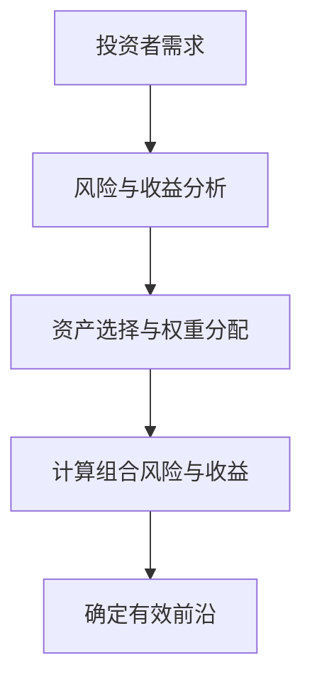

                 


# 个性化投资策略

> 关键词：个性化投资策略、投资组合优化、风险管理、技术分析、现代投资组合理论、算法驱动投资

> 摘要：个性化投资策略是一种根据投资者的财务状况、风险承受能力和投资目标量身定制的投资方法。本文将深入探讨个性化投资策略的核心概念、算法原理、系统架构和实际应用，结合案例分析和最佳实践，为投资者和金融专业人士提供有价值的见解。

---

## 第1章：个性化投资策略概述

### 1.1 核心概念与背景

个性化投资策略是一种基于投资者独特需求和市场环境的投资方法。其核心在于通过分析投资者的财务状况、风险偏好和投资目标，制定量身定制的投资计划。与传统投资策略相比，个性化投资策略更加注重灵活性和适应性，能够在复杂多变的市场环境中帮助投资者实现长期收益目标。

#### 1.1.1 核心要素对比表

| 核心要素         | 个性化投资策略                     | 传统投资策略                     |
|------------------|------------------------------------|------------------------------------|
| 投资目标         | 客户特定目标（如财富增值、退休计划）| 广泛市场目标（如指数跟踪）       |
| 风险承受能力     | 根据客户风险偏好动态调整           | 固定风险容忍度                   |
| 资产配置         | 灵活调整，根据市场变化动态优化       | 固定比例，定期再平衡               |
| 个性化服务       | 高度定制化，一对一服务             | 标准化产品，适用于所有客户         |

#### 1.1.2 核心概念的ER实体关系图

```mermaid
er
actor:investor
actor:市场环境
actor:投资顾问
class:投资策略
class:投资组合
class:风险管理
class:绩效评估
```

### 1.2 个性化投资策略的重要性

个性化投资策略能够帮助投资者在复杂的市场环境中实现风险可控、收益最大化的目标。通过动态调整资产配置和投资组合，投资者可以根据市场变化和个人需求的变化，灵活应对各种挑战。

---

## 第2章：投资组合理论与分析方法

### 2.1 现代投资组合理论（MPT）

现代投资组合理论（MPT）是个性化投资策略的重要理论基础。MPT的核心思想是通过优化资产配置，构建一个在给定风险水平下收益最大的投资组合，或者在给定收益水平下风险最小的投资组合。

#### 2.1.1 有效前沿的构建

有效前沿是指在给定风险水平下，能够提供最高收益的所有投资组合的集合。以下是构建有效前沿的步骤：



#### 2.1.2 MPT的数学模型

MPT的核心公式是投资组合的期望收益和风险的计算公式：

- 投资组合的期望收益：
  $$ E(r_p) = \sum_{i=1}^{n} w_i E(r_i) $$
  其中，$w_i$ 是资产$i$的权重，$E(r_i)$ 是资产$i$的期望收益。

- 投资组合的风险（方差）：
  $$ \sigma_p^2 = \sum_{i=1}^{n} \sum_{j=1}^{n} w_i w_j \sigma_i \sigma_j \rho_{ij} $$
  其中，$\sigma_i$ 和 $\sigma_j$ 是资产$i$和$j$的波动率，$\rho_{ij}$ 是资产$i$和$j$的相关性系数。

### 2.2 技术分析与基本面分析的结合

个性化投资策略需要结合技术分析和基本面分析，以全面评估投资机会。技术分析通过研究市场数据（如价格和成交量）来预测未来的价格走势，而基本面分析则通过研究公司的财务状况和行业前景来评估其内在价值。

#### 2.2.1 技术分析的核心指标

- 移动平均线（MA）：用于识别价格趋势。
- 相对强弱指数（RSI）：用于识别超买或超卖信号。
- 布林带（Bollinger Bands）：用于衡量价格波动性。

#### 2.2.2 基本面分析的核心指标

- 市盈率（P/E）：用于评估股票的估值。
- 净利润增长率：用于评估公司的盈利能力。
- 负债率：用于评估公司的财务健康状况。

---

## 第3章：风险管理与控制

### 3.1 风险评估与量化

在个性化投资策略中，风险管理是核心环节之一。通过量化风险，投资者可以更好地理解和控制投资组合的潜在损失。

#### 3.1.1 风险价值（VaR）

风险价值（VaR）是一种常用的金融风险度量方法，表示在给定置信水平下，投资组合可能遭受的最大损失。VaR的计算公式如下：

$$ VaR = \text{Value at Risk} = \text{损失的金额} $$

#### 3.1.2 风险因子分析

通过分析影响投资组合风险的关键因子（如市场风险、利率风险、流动性风险等），投资者可以更好地识别和管理潜在风险。

### 3.2 风险控制策略

个性化投资策略中的风险管理策略包括风险预算、保险策略和风险分散技术。

#### 3.2.1 风险预算

风险预算是指根据投资者的风险承受能力和投资目标，设定投资组合在不同风险因子下的最大允许风险敞口。

#### 3.2.2 保险策略

保险策略是一种通过购买保险产品来转移风险的策略，常见的保险产品包括期权和保险基金。

---

## 第4章：投资组合构建与优化

### 4.1 资产配置策略

资产配置是个性化投资策略的核心环节之一。根据投资者的风险偏好和收益目标，选择合适的资产类别（如股票、债券、房地产等）和配置比例。

#### 4.1.1 战略性资产配置

战略性资产配置是一种长期投资策略，根据投资者的长期目标和风险承受能力，确定资产的配置比例。

#### 4.1.2 战术性资产调整

战术性资产调整是一种短期投资策略，根据市场环境的变化，对资产配置进行动态调整。

### 4.2 投资组合优化方法

投资组合优化是通过数学模型和算法，找到在给定风险水平下收益最大的投资组合，或者在给定收益水平下风险最小的投资组合。

#### 4.2.1 均值-方差优化

均值-方差优化是一种经典的优化方法，其目标是最大化投资组合的收益，同时最小化其风险（方差）。

$$ \text{最大化 } E(r_p) = \sum_{i=1}^{n} w_i E(r_i) $$
$$ \text{约束 } \sigma_p^2 = \sum_{i=1}^{n} \sum_{j=1}^{n} w_i w_j \sigma_i \sigma_j \rho_{ij} \leq \text{风险预算} $$

#### 4.2.2 风险平价策略

风险平价策略是一种通过调整资产的权重，使得投资组合在不同资产上的风险敞口相等的策略。

---

## 第5章：个性化投资策略的技术实现

### 5.1 系统架构设计

个性化投资策略的系统架构包括以下几个部分：

1. **数据采集模块**：采集市场数据和投资者信息。
2. **风险评估模块**：评估投资者的风险承受能力和市场风险。
3. **投资组合优化模块**：根据投资者需求和市场环境，优化投资组合。
4. **风险管理模块**：实时监控和管理投资组合的风险。
5. **绩效评估模块**：评估投资组合的绩效。

### 5.2 系统接口设计

个性化投资系统的接口设计包括以下几个部分：

1. **投资者信息接口**：用于接收投资者的基本信息和投资目标。
2. **市场数据接口**：用于接收市场数据（如股票价格、指数数据等）。
3. **投资组合优化接口**：用于优化投资组合。
4. **风险管理接口**：用于监控和管理投资组合的风险。

---

## 第6章：案例分析与最佳实践

### 6.1 案例分析

#### 6.1.1 投资者A的案例

投资者A是一位年轻的白领，风险承受能力较高，投资目标是长期财富增值。根据投资者A的需求，我们建议他将资产配置为60%股票、30%债券和10%现金。

### 6.2 最佳实践

1. **定期评估与调整**：根据市场环境和投资者需求的变化，定期评估和调整投资组合。
2. **分散投资**：通过分散投资降低投资组合的风险。
3. **长期投资**：避免短期波动，坚持长期投资策略。

---

## 第7章：未来趋势与挑战

### 7.1 未来趋势

随着金融科技的快速发展，个性化投资策略将更加依赖于人工智能和大数据技术。未来的投资策略将更加智能化和个性化，能够根据投资者的需求和市场环境实时调整。

### 7.2 挑战

个性化投资策略的实现面临以下挑战：

1. **数据隐私问题**：投资者的个人信息和投资数据需要严格保护。
2. **技术复杂性**：个性化投资策略的实现需要复杂的技术支持。
3. **市场波动性**：市场波动性可能会影响投资组合的绩效。

---

## 总结

个性化投资策略是一种基于投资者独特需求和市场环境的投资方法。通过结合现代投资组合理论、技术分析和风险管理，投资者可以制定量身定制的投资计划，实现长期收益目标。未来，随着金融科技的发展，个性化投资策略将更加智能化和个性化，能够根据投资者的需求和市场环境实时调整。

---

* END *

