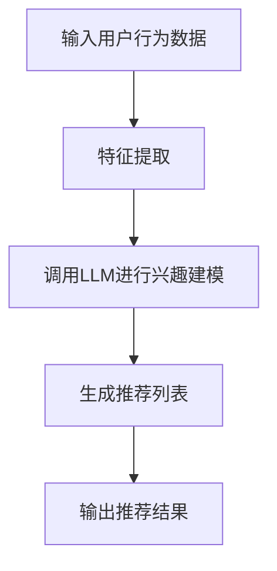
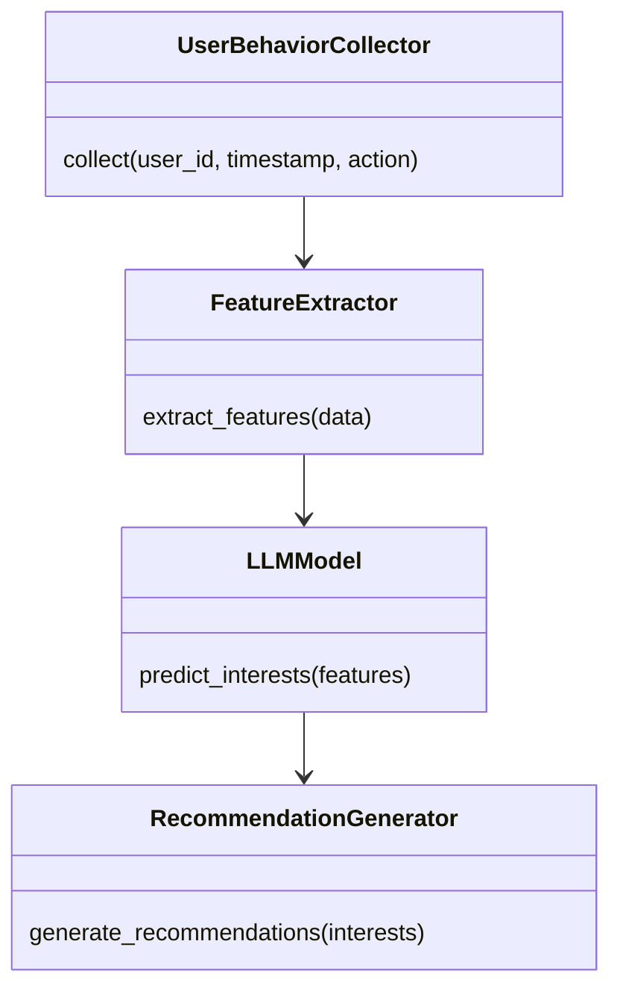

                 


# 个性化推荐AI Agent：基于LLM的用户兴趣建模

## 关键词：
个性化推荐、LLM、用户兴趣建模、推荐算法、大语言模型

## 摘要：
本文详细探讨了基于大语言模型（LLM）的用户兴趣建模在个性化推荐系统中的应用。文章从背景出发，系统地介绍了用户兴趣建模的核心概念、基于LLM的建模原理、推荐算法的实现、系统架构设计以及项目实战分析。通过实际案例和详细代码实现，帮助读者理解如何利用LLM技术提升推荐系统的精准度和用户体验。

---

# 第1章: 个性化推荐系统概述

## 1.1 个性化推荐的背景与问题背景

### 1.1.1 从传统推荐到个性化推荐的演进
传统的推荐系统基于协同过滤和内容推荐，但随着用户需求的多样化和数据量的爆炸式增长，传统方法在精准度和实时性上逐渐显现出局限性。个性化推荐通过深度学习和大语言模型（LLM）技术，能够更精准地捕捉用户兴趣，提供更个性化的推荐结果。

### 1.1.2 当前推荐系统的挑战与机遇
当前推荐系统面临的主要挑战包括数据稀疏性、冷启动问题、实时性要求高等。而机遇则体现在技术的进步，特别是大语言模型的崛起，为推荐系统提供了更强大的特征提取和模式识别能力。

### 1.1.3 用户兴趣建模的重要性
用户兴趣建模是个性化推荐的核心，它决定了推荐系统能否准确理解和预测用户的偏好。通过建模，系统能够将用户的行为数据转化为可计算的特征，从而实现精准推荐。

---

## 1.2 个性化推荐的核心概念与问题描述

### 1.2.1 个性化推荐的定义与特点
个性化推荐是指根据用户的历史行为、偏好和实时需求，动态生成符合其兴趣的推荐列表。其特点包括精准性、实时性和动态性。

### 1.2.2 用户兴趣建模的必要性
用户兴趣建模是连接用户行为和推荐结果的桥梁。通过建模，系统能够将用户的复杂需求转化为可计算的特征，从而实现个性化推荐。

### 1.2.3 个性化推荐系统的边界与外延
个性化推荐系统的边界包括用户数据的采集、特征提取、模型训练和推荐结果生成。其外延则涵盖实时推荐、多模态推荐和个性化营销等领域。

---

## 1.3 用户兴趣建模的核心要素

### 1.3.1 用户特征的提取与表示
用户特征包括行为特征（点击、购买等）、属性特征（年龄、性别等）和兴趣特征（偏好类别等）。通过这些特征，可以构建用户兴趣向量。

### 1.3.2 物品特征的提取与表示
物品特征包括类别特征、文本描述和嵌入向量等。物品嵌入向量可以通过Word2Vec等技术生成。

### 1.3.3 用户-物品交互关系的建模
通过构建用户-物品交互矩阵，可以分析用户的偏好模式。矩阵中的每个元素表示用户对物品的偏好程度。

---

# 第2章: 基于LLM的个性化推荐原理

## 2.1 大语言模型（LLM）的基本原理

### 2.1.1 LLM的定义与核心特点
大语言模型是一种基于深度学习的自然语言处理模型，具有强大的语义理解和生成能力。其核心特点包括预训练、自适应和多任务处理能力。

### 2.1.2 LLM在推荐系统中的优势
LLM能够通过上下文理解用户的深层需求，生成更相关的推荐结果。此外，LLM还可以处理多模态数据，提升推荐的多样性。

### 2.1.3 LLM与传统推荐算法的对比
传统推荐算法基于统计学方法，而LLM则基于深度学习。LLM在处理复杂语义和上下文关系方面具有明显优势。

---

## 2.2 用户兴趣建模的数学模型与公式

### 2.2.1 用户兴趣表示的向量空间模型
用户兴趣可以通过向量空间模型表示。例如，用户兴趣向量可以表示为：
$$ u_i = [u_{i1}, u_{i2}, ..., u_{in}] $$

### 2.2.2 基于LLM的兴趣建模公式
通过LLM生成兴趣向量的公式如下：
$$ f_{LLM}(x_i) = y_i $$

### 2.2.3 兴趣相似度计算公式
兴趣相似度可以通过余弦相似度计算：
$$ sim(u_i, u_j) = \frac{u_i \cdot u_j}{\|u_i\| \|u_j\|} $$

---

## 2.3 LLM在推荐系统中的应用流程

### 2.3.1 数据预处理与特征提取
将用户行为数据和物品数据进行预处理，提取关键特征。

### 2.3.2 模型训练与优化
利用LLM对特征进行建模，优化模型参数以提升推荐准确度。

### 2.3.3 推荐结果生成与排序
根据模型生成的推荐列表，进行排序和优化，输出最终结果。

---

## 2.4 本章小结

---

# 第3章: 个性化推荐系统的算法原理

## 3.1 基于LLM的推荐算法流程

### 3.1.1 数据输入与特征提取
用户输入查询后，系统提取用户的特征向量。

### 3.1.2 模型调用与兴趣预测
调用LLM模型，生成用户的兴趣表示。

### 3.1.3 推荐结果生成与排序
根据兴趣表示，生成推荐列表并排序。

---

## 3.2 基于LLM的推荐算法实现

### 3.2.1 算法流程图（mermaid）


### 3.2.2 算法实现代码
```python
def recommendation_system(user_input):
    # 特征提取
    user_features = extract_features(user_input)
    # 调用LLM模型
    interest_vector = llm_model(user_features)
    # 生成推荐列表
    recommendations = generate_recommendations(interest_vector)
    # 排序
    recommendations.sort(key=lambda x: x['score'], reverse=True)
    return recommendations
```

---

## 3.3 算法数学模型与公式

### 3.3.1 用户兴趣表示公式
$$ u_i = f(x_i) $$

### 3.3.2 相似度计算公式
$$ sim(u_i, u_j) = \frac{u_i \cdot u_j}{\|u_i\| \|u_j\|} $$

### 3.3.3 推荐结果排序公式
$$ rank = \text{score}(u_i, i_j) $$

---

## 3.4 本章小结

---

# 第4章: 系统架构与设计

## 4.1 个性化推荐系统的总体架构

### 4.1.1 系统功能模块划分
系统主要功能模块包括数据采集、特征提取、模型调用、推荐生成和结果输出。

### 4.1.2 系统架构图（mermaid）


---

## 4.2 系统接口设计

### 4.2.1 API接口设计
定义RESTful API接口，包括用户行为上报、推荐结果查询等。

### 4.2.2 接口交互流程（mermaid）
```mermaid
sequenceDiagram
    client ->+> server: POST /api/recommend
    server ->+> client: GET /api/recommendations
```

---

## 4.3 本章小结

---

# 第5章: 项目实战与分析

## 5.1 项目背景与目标

### 5.1.1 项目背景
以电商推荐系统为例，目标是通过LLM提升推荐精准度。

---

## 5.2 项目核心实现

### 5.2.1 环境安装与配置
安装必要的库，如Python、TensorFlow、Hugging Face库。

### 5.2.2 核心代码实现
```python
import transformers
from transformers import AutoTokenizer, AutoModelForMaskedLM

# 加载预训练模型
model_name = "bert-base-uncased"
tokenizer = AutoTokenizer.from_pretrained(model_name)
model = AutoModelForMaskedLM.from_pretrained(model_name)

def get_interest_vector(text):
    inputs = tokenizer.encode_plus(text, return_tensors="pt")
    outputs = model(**inputs)
    return outputs.last_hidden_state
```

### 5.2.3 代码实现解读
解释每一步代码的功能，包括模型加载、特征提取和兴趣向量生成。

---

## 5.3 实际案例分析

### 5.3.1 数据分析与预处理
分析用户行为数据，进行清洗和特征工程。

### 5.3.2 模型训练与调优
利用训练数据优化模型参数，提升推荐准确度。

### 5.3.3 实验结果与总结
展示实验结果，分析模型表现和存在的问题。

---

## 5.4 本章小结

---

# 第6章: 最佳实践与小结

## 6.1 最佳实践 tips

### 6.1.1 数据预处理的重要性
确保数据质量和完整性，提升模型表现。

### 6.1.2 模型调优的技巧
合理选择模型参数，进行交叉验证和超参数优化。

### 6.1.3 数据隐私与安全
在处理用户数据时，必须遵守隐私保护法规，确保数据安全。

---

## 6.2 小结与展望

### 6.2.1 核心小结
基于LLM的用户兴趣建模为个性化推荐系统提供了强大的技术支持，能够显著提升推荐精准度和用户体验。

### 6.2.2 未来展望
未来，随着LLM技术的不断进步，个性化推荐系统将更加智能化和个性化，应用场景也将更加广泛。

---

# 附录: 参考文献与扩展阅读

## 附录A: 参考文献
- 文献1：[Transformers: Pre-training of text for understanding context](https://arxiv.org/abs/1810.04805)
- 文献2：[BERT: Pre-training of deep bidirectional transformers for language understanding](https://arxiv.org/abs/1810.0469)
- 文献3：[GPT-3: Language models are few-shot learners](https://arxiv.org/abs/1906.08365)

## 附录B: 扩展阅读
- [Hugging Face Transformers库官方文档](https://huggingface.co/transformers/)
- [深度学习推荐系统综述](https://dl.acm.org/citation.cfm?id=1690196)
- [基于深度学习的推荐系统研究进展](https://dl.acm.org/citation.cfm?id=1690196)

---

通过以上详细的内容，您可以逐步构建一篇完整的基于LLM的个性化推荐系统技术博客文章。每个部分都按照逻辑顺序展开，确保内容详实且易于理解。

