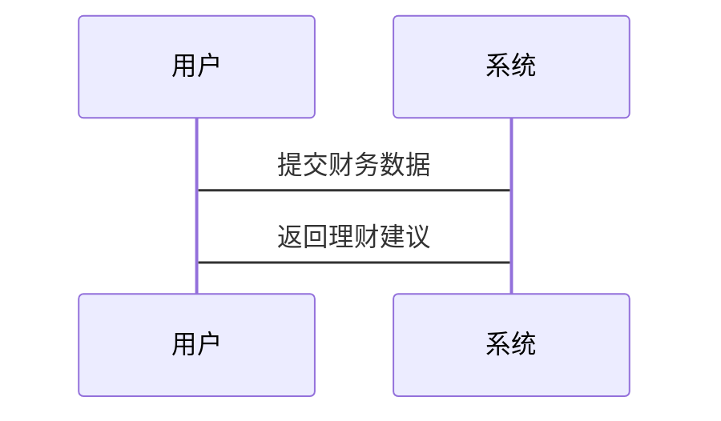

                 


---

# 《个性化理财建议生成算法：原理与实现》

## 关键词：个性化理财、算法、机器学习、深度学习、推荐系统

## 摘要：个性化理财建议生成算法结合了机器学习和深度学习技术，通过分析用户财务数据和市场趋势，为用户提供量身定制的理财建议。本文详细探讨了基于协同过滤和深度学习的算法原理，并通过系统设计和项目实战展示了实现过程。

---

### 第4章: 基于深度学习的理财建议生成算法

#### 4.1 深度学习的基本原理

##### 4.1.1 神经网络基础
深度学习的核心是神经网络，通过多层的非线性变换来学习数据的特征。神经元通过权重和激活函数处理输入数据，例如：

$$
y = \sigma(w x + b)
$$

其中，$\sigma$ 是激活函数，$w$ 是权重，$x$ 是输入，$b$ 是偏置。

##### 4.1.2 卷积神经网络（CNN）
CNN通过卷积层提取空间特征，适用于处理图像和时间序列数据。例如，在股票价格预测中，可以使用CNN提取价格波动的模式。

##### 4.1.3 循环神经网络（RNN）
RNN擅长处理序列数据，如文本和时间序列。在理财建议生成中，RNN可以用于生成连续的文本建议，例如：

$$
P(y_t | y_{t-1}, y_{t-2}, \ldots, y_1)
$$

其中，$y_t$ 是当前时刻的输出，$y_{t-1}$ 等是之前的输出。

#### 4.2 基于Transformer的理财建议生成模型

##### 4.2.1 Transformer模型结构
Transformer由编码器和解码器组成，编码器将输入数据编码为高维向量，解码器将编码结果解码为输出序列。例如，输入的财务数据经过编码器处理后，解码器生成理财建议文本。

##### 4.2.2 在理财建议生成中的应用
使用Transformer模型，将用户的财务数据和市场数据作为输入，生成个性化的理财建议文本。例如：

$$
\text{输入: 用户资产、收入、投资目标} \\
\text{输出: 投资组合建议}
$$

#### 4.3 深度学习模型的优势与挑战

##### 4.3.1 优势
- 能够处理复杂的非线性关系
- 可以自动提取特征，减少特征工程的工作量
- 在处理文本数据时表现优异

##### 4.3.2 挑战
- 需要大量数据进行训练
- 计算资源消耗大
- 模型解释性较差

---

### 第5章: 系统分析与架构设计方案

#### 5.1 系统功能设计

##### 5.1.1 用户画像模块
收集和分析用户的财务数据，包括资产、收入、投资目标等，构建用户画像。

##### 5.1.2 数据处理模块
对数据进行清洗和预处理，提取有用的特征，例如：

- 用户资产分布
- 市场趋势指标
- 风险偏好评估

##### 5.1.3 模型训练模块
使用收集的数据训练机器学习和深度学习模型，生成理财建议。

##### 5.1.4 建议生成模块
根据训练好的模型，生成个性化的理财建议，并输出结果。

##### 5.1.5 系统交互模块
用户与系统进行交互，输入数据并接收理财建议。

##### 5.1.6 反馈与优化模块
收集用户的反馈，优化模型和建议生成算法。

#### 5.2 系统架构设计

##### 5.2.1 系统架构图
展示系统的整体结构，包括前端、后端、数据库等部分。

##### 5.2.2 功能模块交互流程
详细描述各个模块之间的交互流程，例如用户输入数据、系统处理数据并生成建议的过程。

#### 5.3 接口设计与交互流程

##### 5.3.1 API接口设计
定义API的输入和输出格式，例如：

- 输入: 用户的财务数据
- 输出: 生成的理财建议

##### 5.3.2 交互流程
使用序列图展示用户与系统之间的交互流程，例如：



---

### 第6章: 项目实战

#### 6.1 项目环境安装

##### 6.1.1 安装Python和相关库
安装Python和必要的库，如：

```bash
pip install numpy pandas scikit-learn tensorflow
```

#### 6.2 核心代码实现

##### 6.2.1 数据预处理
加载数据并进行清洗和特征提取：

```python
import pandas as pd
import numpy as np

# 加载数据
data = pd.read_csv('financial_data.csv')

# 数据清洗
data.dropna()
data = data[~data['income'].isnull()]
```

##### 6.2.2 模型训练
训练机器学习模型并生成理财建议：

```python
from sklearn.model_selection import train_test_split
from sklearn.ensemble import RandomForestRegressor

# 分割数据
X_train, X_test, y_train, y_test = train_test_split(data.drop('target', axis=1), data['target'], test_size=0.2)

# 训练模型
model = RandomForestRegressor()
model.fit(X_train, y_train)

# 生成建议
def generate_recommendation(user_data):
    prediction = model.predict(user_data)
    return "建议投资比例：" + str(prediction[0])
```

#### 6.3 实际案例分析

##### 6.3.1 案例分析
分析一个用户的财务数据，生成理财建议并解释结果。

##### 6.3.2 项目总结
总结项目中的经验和教训，提出改进建议。

---

### 附录

#### A. 算法实现细节
提供所有算法的详细实现代码和解释。

#### B. 系统架构图
展示系统的整体架构图，帮助读者理解系统组成。

#### C. 数据格式说明
详细说明数据的格式，包括输入数据的结构、字段含义等。

#### D. 参考文献
列出所有参考的文献和资料，确保学术严谨性。

---

通过以上章节的内容，文章详细讲解了个性化理财建议生成算法的原理与实现，结合理论和实践，帮助读者全面理解和应用这些算法。

