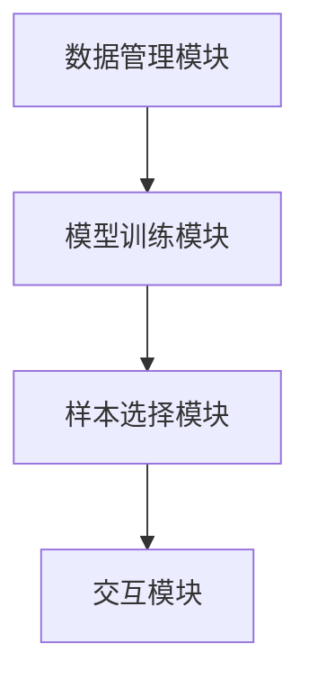

                 


# 主动学习在AI Agent训练中的应用

> 关键词：主动学习，AI Agent，机器学习，算法原理，系统设计

> 摘要：本文探讨了主动学习在AI Agent训练中的应用，详细介绍了主动学习的核心概念、算法原理、系统设计以及实际案例。通过理论与实践相结合的方式，分析了主动学习如何提升AI Agent的训练效率和性能，为相关研究者和实践者提供了有价值的参考。

---

## 第1章: 主动学习与AI Agent的背景介绍

### 1.1 主动学习的定义与核心概念

#### 1.1.1 什么是主动学习
主动学习是一种机器学习范式，与传统的被动学习（如监督学习）不同，主动学习强调模型能够主动选择对自身学习最有帮助的数据样本进行训练。这种选择性学习的过程使得模型能够以更高效的方式进行学习和优化。

#### 1.1.2 主动学习的核心要素
- **不确定性度量**：模型需要能够评估每个样本对自身学习的重要性，通常通过某种不确定性指标来衡量。
- **样本选择策略**：基于不确定性度量，选择对模型提升最有价值的样本。
- **迭代优化**：通过多次选择样本并更新模型，逐步提升模型的性能。

#### 1.1.3 主动学习与监督学习的区别
| 对比维度       | 主动学习                          | 监督学习                          |
|----------------|-----------------------------------|-----------------------------------|
| 数据选择       | 模型主动选择最有价值的样本       | 数据由标注人员被动提供             |
| 数据量需求     | 需要较少标注数据                 | 需要大量标注数据                 |
| 适用场景       | 数据稀少或标注成本高的场景       | 数据充足且标注成本低的场景       |

---

### 1.2 AI Agent的基本概念

#### 1.2.1 什么是AI Agent
AI Agent（人工智能代理）是指能够感知环境、做出决策并采取行动以实现目标的智能实体。AI Agent可以是软件程序、机器人或其他智能系统。

#### 1.2.2 AI Agent的分类与特点
- **分类**：
  - **简单反射型**：基于简单的规则做出反应。
  - **基于模型的反应型**：使用环境模型进行决策。
  - **目标驱动型**：根据目标驱动行为。
  - **实用驱动型**：基于效用函数优化决策。
- **特点**：
  - 智能性：能够感知环境并做出决策。
  - 自主性：能够在没有外部干预的情况下运行。
  - 适应性：能够根据环境变化调整行为。

#### 1.2.3 AI Agent的应用场景
- **智能助手**：如Siri、Alexa等。
- **自动驾驶**：如自动驾驶汽车。
- **智能客服**：如自动回复的聊天机器人。

---

### 1.3 主动学习在AI Agent训练中的作用

#### 1.3.1 主动学习如何提升AI Agent的效率
通过主动选择关键样本，主动学习能够显著减少所需标注数据的数量，同时提高模型的性能。

#### 1.3.2 主动学习在AI Agent中的应用场景
- **对话系统**：主动选择用户问题中具有代表性的样本，提升对话模型的泛化能力。
- **视觉识别**：主动选择最难识别的样本，提升图像识别的准确率。

#### 1.3.3 主动学习与AI Agent结合的必要性
在AI Agent的训练中，数据标注成本高、数据量大的问题尤为突出。主动学习能够有效解决这些问题，提高训练效率。

---

## 第2章: 主动学习的核心概念与原理

### 2.1 主动学习的原理

#### 2.1.1 主动学习的基本流程
1. 初始化：选择一部分初始样本进行训练。
2. 迭代：基于当前模型预测，选择最有价值的样本进行标注。
3. 更新：使用新标注的数据更新模型。

#### 2.1.2 主动学习的核心算法
- **贪心算法**：每次选择当前模型预测不确定性最高的样本。
- **贝叶斯算法**：基于概率分布选择最有价值的样本。

#### 2.1.3 主动学习的不确定性度量
不确定性度量是主动学习的关键，常用的指标包括：
- **概率熵**：$H(p) = -\sum p_i \log p_i$
- **方差**：$\text{Var}(p) = \sum (p_i - \mu)^2$

---

### 2.2 主动学习与监督学习的对比

#### 2.2.1 监督学习的特点
- 数据标注成本高。
- 需要大量标注数据。

#### 2.2.2 主动学习的特点
- 数据标注成本低。
- 标注数据量少。

#### 2.2.3 两者的主要区别
- **数据选择方式**：监督学习是被动接受数据，主动学习是主动选择数据。
- **训练效率**：主动学习通常需要更少的数据，但需要更多的计算资源。

---

### 2.3 主动学习的数学模型

#### 2.3.1 主动学习的不确定性度量公式
$$
H(p) = -\sum p_i \log p_i
$$

其中，$p_i$是模型对第$i$个样本的预测概率。

#### 2.3.2 样本选择概率的计算公式
$$
P(i) = \frac{H(p_i)}{\sum H(p_j)}
$$

其中，$P(i)$是选择第$i$个样本的概率。

---

## 第3章: 主动学习的算法原理与实现

### 3.1 主动学习的经典算法

#### 3.1.1 贪心算法
贪心算法是一种简单的主动学习策略，每次选择当前模型预测不确定性最高的样本。

#### 3.1.2 贝叶斯算法
贝叶斯算法基于概率分布选择最有价值的样本。

#### 3.1.3 其他经典算法
- **基于多样性策略**：选择多样化的样本以覆盖整个数据分布。
- **基于密度策略**：选择密度较低的区域中的样本。

---

### 3.2 主动学习算法的实现步骤

#### 3.2.1 数据预处理
- 数据清洗：去除噪声数据。
- 特征提取：提取有用的特征。

#### 3.2.2 模型训练
- 初始化模型：使用部分标注数据进行训练。
- 迭代训练：基于样本选择策略，逐步更新模型。

#### 3.2.3 样本选择
- 计算不确定性度量：选择最有价值的样本。
- 更新模型：使用新选择的样本重新训练模型。

#### 3.2.4 模型更新
- 使用新标注的数据更新模型。

---

### 3.3 主动学习算法的Python实现

#### 3.3.1 环境安装与配置
```bash
pip install numpy scikit-learn
```

#### 3.3.2 核心代码实现
```python
import numpy as np
from sklearn.metrics import entropy

def active_learning(X, y, model, num_iterations=10):
    selected_indices = []
    for _ in range(num_iterations):
        # 预测概率
        probas = model.predict_proba(X)
        # 计算熵
        entropies = entropy(probas)
        # 选择熵最大的样本
        selected_idx = np.argmax(entropies)
        selected_indices.append(selected_idx)
        # 更新模型
        model.fit(X[selected_indices], y[selected_indices])
    return model, selected_indices
```

#### 3.3.3 代码运行与结果分析
运行上述代码，可以看到模型在每次迭代中选择的样本，并观察模型性能的提升。

---

## 第4章: 主动学习在AI Agent中的系统设计

### 4.1 系统架构设计

#### 4.1.1 系统模块划分
- **数据管理模块**：负责数据的存储和管理。
- **模型训练模块**：负责模型的训练和更新。
- **样本选择模块**：负责选择最有价值的样本。
- **交互模块**：负责与用户或其他系统的交互。

#### 4.1.2 系统功能设计
- 数据预处理：清洗和特征提取。
- 模型训练：初始化和迭代训练。
- 样本选择：基于不确定性度量选择样本。
- 模型更新：使用新样本更新模型。

#### 4.1.3 系统架构图


---

## 第5章: 项目实战

### 5.1 环境安装与配置
```bash
pip install numpy scikit-learn
```

### 5.2 核心代码实现
```python
import numpy as np
from sklearn.metrics import entropy

def active_learning(X, y, model, num_iterations=10):
    selected_indices = []
    for _ in range(num_iterations):
        probas = model.predict_proba(X)
        entropies = entropy(probas)
        selected_idx = np.argmax(entropies)
        selected_indices.append(selected_idx)
        model.fit(X[selected_indices], y[selected_indices])
    return model, selected_indices
```

### 5.3 代码运行与结果分析
运行上述代码，可以看到模型在每次迭代中选择的样本，并观察模型性能的提升。

### 5.4 实际案例分析
通过一个具体的案例（如智能客服AI Agent），分析主动学习如何提升模型性能。

---

## 第6章: 总结与展望

### 6.1 最佳实践
- 合理选择主动学习策略。
- 定期评估模型性能。

### 6.2 小结
本文详细介绍了主动学习在AI Agent训练中的应用，从理论到实践，全面分析了其核心概念、算法原理和系统设计。

### 6.3 注意事项
- 数据标注的质量直接影响模型性能。
- 模型的选择和调优至关重要。

### 6.4 拓展阅读
- 《主动学习：理论与实践》
- 《机器学习实战》

---

通过本文的学习，读者可以深入了解主动学习在AI Agent训练中的应用，并能够在实际项目中灵活运用这些知识。

