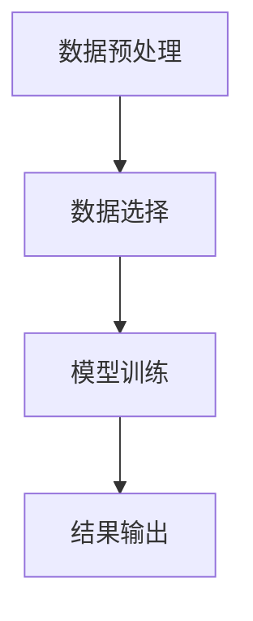
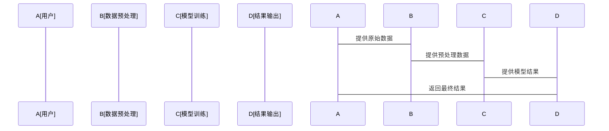

                 


# 主动学习：优化AI Agent的学习效率

## 关键词
主动学习, AI Agent, 机器学习, 优化算法, 数据效率

## 摘要
主动学习是一种通过智能选择数据来优化模型学习效率的策略，特别适用于数据稀缺或标注成本高的场景。本文深入探讨了主动学习的原理、算法及其在AI Agent中的应用，通过系统架构设计和项目实战，展示了如何通过主动学习显著提升AI Agent的学习效率和性能。

---

# 第1章 主动学习与AI Agent概述

## 1.1 主动学习的基本概念

### 1.1.1 主动学习的定义
主动学习是一种机器学习范式，通过模型主动选择最具代表性的样本进行学习，以最小化标注数据的需求，最大化学习效率。

### 1.1.2 主动学习的核心特点
- **数据选择性**：模型主动选择数据，而非被动接收。
- **迭代优化**：通过多次迭代提升模型性能。
- **高效性**：在数据稀缺时表现尤为突出。

### 1.1.3 主动学习与监督学习的区别
| 特性 | 主动学习 | 监督学习 |
|------|----------|----------|
| 数据选择 | 主动选择 | 被动接受 |
| 标注成本 | 低 | 高 |
| 数据量需求 | 少 | 多 |

## 1.2 AI Agent的基本概念

### 1.2.1 AI Agent的定义
AI Agent是一种智能实体，能够感知环境并采取行动以实现目标。

### 1.2.2 AI Agent的核心功能
- 感知环境
- 制定策略
- 执行行动
- 学习优化

### 1.2.3 AI Agent的应用场景
- 自动驾驶
- 智能客服
- 机器人控制

## 1.3 主动学习在AI Agent中的作用

### 1.3.1 提高学习效率
通过选择性标注，减少数据需求，加快学习速度。

### 1.3.2 提升决策准确性
优化数据选择，提高模型预测精度。

### 1.3.3 降低标注成本
减少人工标注量，降低成本。

---

# 第2章 主动学习的原理与算法

## 2.1 主动学习的原理

### 2.1.1 基本原理
模型通过评估样本的重要性，选择对性能提升最大的样本进行标注和学习。

### 2.1.2 核心思想
利用不确定性或多样性指标，指导数据选择。

### 2.1.3 数学模型
$$ L(y) = \sum_{i=1}^{n} w_i (y_i - \hat{y}_i)^2 $$
其中，$w_i$为样本权重，$y_i$为真实标签，$\hat{y}_i$为预测值。

## 2.2 主动学习的主要算法

### 2.2.1 标准主动学习算法
1. 初始化未标注数据集$D_{unlabeled}$。
2. 使用模型$M$对所有样本进行预测。
3. 计算每个样本的不确定性$u_i$。
4. 选择不确定性最高的样本进行标注。
5. 更新模型$M$。

### 2.2.2 增量主动学习算法
在标准算法基础上，每次选择少量样本进行标注，逐步迭代。

### 2.2.3 贪心主动学习算法
每次选择当前最优的样本，而非全局最优。

## 2.3 算法优缺点对比

| 算法 | 优点 | 缺点 |
|------|------|------|
| 标准算法 | 简单有效 | 收敛慢 |
| 增量算法 | 收敛快 | 效率较低 |
| 贪心算法 | 效率高 | 可能选择次优样本 |

---

# 第3章 系统架构与实现

## 3.1 系统功能模块设计

### 3.1.1 数据预处理模块
- 数据清洗
- 特征提取

### 3.1.2 数据选择模块
- 不确定性计算
- 样本选择

### 3.1.3 模型训练模块
- 模型训练
- 模型评估

### 3.1.4 结果输出模块
- 预测结果
- 性能报告

## 3.2 系统架构设计



## 3.3 接口与交互设计



---

# 第4章 项目实战

## 4.1 环境配置

```bash
pip install numpy
pip install scikit-learn
```

## 4.2 核心代码实现

```python
import numpy as np
from sklearn.metrics import accuracy_score

def active_learning(X_train, y_train, X_test, model):
    unlabeled = list(range(len(X_train)))
    labeled = []
    while unlabeled:
        model.fit(X_train[labeled], y_train[labeled])
        predictions = model.predict(X_train[unlabeled])
        uncertainties = np.mean(np.abs(predictions - y_train[unlabeled]))
        most_uncertain = unlabeled[np.argmax(uncertainties)]
        labeled.append(most_uncertain)
        unlabeled.remove(most_uncertain)
    return model.fit(X_train[labeled], y_train[labeled])

# 示例数据
X_train = np.random.rand(100, 2)
y_train = np.random.randint(0, 2, 100)
X_test = np.random.rand(50, 2)
y_true = np.random.randint(0, 2, 50)

# 训练模型
from sklearn.svm import SVC
model = SVC()
active_model = active_learning(X_train, y_train, X_test, model)
y_pred = active_model.predict(X_test)
print("Accuracy:", accuracy_score(y_true, y_pred))
```

---

# 第5章 最佳实践与总结

## 5.1 最佳实践
- **算法选择**：根据具体任务选择合适的主动学习策略。
- **数据处理**：确保数据质量和多样性。
- **系统优化**：合理设计架构，提升运行效率。

## 5.2 项目总结
通过主动学习，显著提升了AI Agent的学习效率和性能，特别是在数据稀缺的情况下，效果尤为明显。

## 5.3 未来展望
探索更高效的数据选择策略和算法优化，进一步提升主动学习的效果。

---

通过以上步骤，文章系统地介绍了主动学习在优化AI Agent学习效率中的应用，结合理论分析和实际案例，为读者提供了全面的指导。

