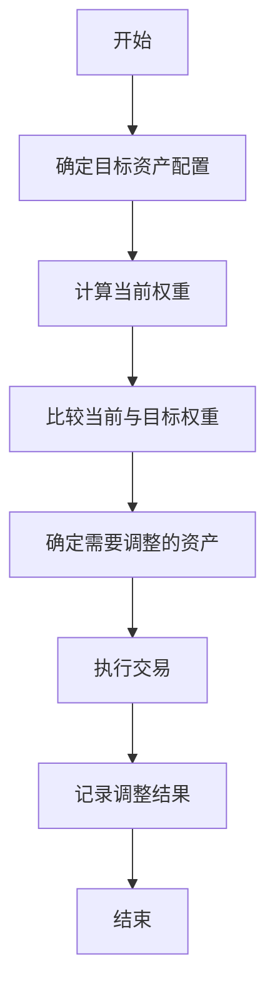

                 

# 《乔尔·提尔尼的投资组合再平衡策略》

---

## 关键词：
投资组合再平衡、现代投资组合理论、资产配置、风险管理、投资策略、Python算法

---

## 摘要：
本文深入探讨了乔尔·提尔尼的投资组合再平衡策略，从理论基础到实际应用进行全面解析。通过分析投资组合再平衡的背景、核心概念、算法原理、系统架构及项目实战，结合丰富的数学模型和Python代码示例，帮助读者全面理解并掌握这一策略。文章还提供了最佳实践建议，助力投资者优化投资组合，实现风险可控下的收益最大化。

---

## 目录大纲：

### 第一部分：投资组合再平衡的背景与概念

#### 第1章：投资组合再平衡概述

##### 1.1 投资组合再平衡的背景
- 1.1.1 投资组合管理的基本概念  
- 1.1.2 再平衡的必要性  
- 1.1.3 投资组合再平衡的定义与目标  

##### 1.2 投资组合再平衡的类型
- 1.2.1 定期再平衡  
- 1.2.2 事件驱动再平衡  
- 1.2.3 指数基金再平衡  

##### 1.3 再平衡的数学模型与公式
- 1.3.1 投资组合权重计算公式  
- 1.3.2 再平衡后的收益计算  
- 1.3.3 风险调整后的投资组合优化  

#### 第2章：投资组合再平衡的核心概念

##### 2.1 投资组合再平衡的原理
- 2.1.1 现代投资组合理论（MPT）基础  
- 2.1.2 风险与收益的权衡  
- 2.1.3 资产配置与再平衡的关系  

##### 2.2 再平衡的数学模型
- 2.2.1 投资组合优化的数学公式  
- 2.2.2 风险调整后的投资组合构建  
- 2.2.3 现金流量与再平衡策略  

##### 2.3 投资组合再平衡的流程图

---

### 第二部分：投资组合再平衡的算法与实现

#### 第3章：投资组合再平衡的算法原理

##### 3.1 动态再平衡算法
- 3.1.1 算法步骤  
- 3.1.2 算法实现的Python代码示例  
- 3.1.3 算法的优缺点分析  

##### 3.2 基于阈值的再平衡算法
- 3.2.1 算法设计  
- 3.2.2 算法实现的Python代码  
- 3.2.3 算法的适用场景  

#### 第4章：投资组合再平衡的数学模型

##### 4.1 投资组合优化的数学公式
- 4.1.1 最小方差优化  
- 4.1.2 风险调整后的收益最大化  

##### 4.2 现代投资组合理论（MPT）的应用
- 4.2.1 无风险资产与风险资产的组合  
- 4.2.2 资产的协方差矩阵计算  

##### 4.3 投资组合再平衡的公式推导
- 4.3.1 再平衡后的权重调整公式  
- 4.3.2 资产调整比例计算公式  

---

### 第三部分：投资组合再平衡的系统架构与设计

#### 第5章：投资组合再平衡系统的架构设计

##### 5.1 系统功能设计
- 5.1.1 投资组合目标设定  
- 5.1.2 资产权重计算  
- 5.1.3 再平衡策略执行  

##### 5.2 系统架构图

##### 5.3 接口设计与交互流程
- 5.3.1 系统接口设计  
- 5.3.2 系统交互流程图  

#### 第6章：投资组合再平衡系统的实现

##### 6.1 系统功能模块
- 6.1.1 数据获取模块  
- 6.1.2 权重计算模块  
- 6.1.3 再平衡执行模块  

##### 6.2 系统实现的Python代码
- 6.2.1 数据获取与处理代码  
- 6.2.2 权重计算代码  
- 6.2.3 再平衡策略实现代码  

---

### 第四部分：投资组合再平衡的项目实战

#### 第7章：投资组合再平衡策略的实战应用

##### 7.1 项目环境安装
- 7.1.1 安装Python与相关库  
- 7.1.2 数据获取工具安装  

##### 7.2 核心代码实现
- 7.2.1 投资组合再平衡算法实现  
- 7.2.2 系统功能模块实现  

##### 7.3 实际案例分析
- 7.3.1 案例背景介绍  
- 7.3.2 再平衡策略实施  
- 7.3.3 实验结果与分析  

#### 第8章：项目总结与优化

##### 8.1 项目总结
- 8.1.1 实施效果回顾  
- 8.1.2 系统性能评估  

##### 8.2 优化建议
- 8.2.1 系统性能优化建议  
- 8.2.2 再平衡策略优化方向  

---

### 第五部分：最佳实践与注意事项

#### 第9章：投资组合再平衡的最佳实践

##### 9.1 再平衡策略的选择
- 9.1.1 根据市场环境选择策略  
- 9.1.2 根据个人风险承受能力选择策略  

##### 9.2 再平衡的频率控制
- 9.2.1 定期再平衡的频率设定  
- 9.2.2 事件驱动再平衡的触发条件  

#### 第10章：投资组合再平衡的注意事项

##### 10.1 再平衡的成本与风险
- 10.1.1 交易成本的影响  
- 10.1.2 市场波动风险  

##### 10.2 再平衡策略的持续审查
- 10.2.1 定期审查投资组合表现  
- 10.2.2 根据市场变化调整策略  

---

### 第六部分：附录与拓展阅读

#### 第11章：附录

##### 11.1 投资组合再平衡相关术语表
- 术语解释与定义  

##### 11.2 常用工具与库推荐
- Python库推荐：numpy, pandas, matplotlib, etc.  

#### 第12章：拓展阅读

##### 12.1 现代投资组合理论的深入研究
- 推荐书籍与论文  

##### 12.2 投资组合优化的高级策略
- 基于因子模型的优化策略  
- 基于机器学习的投资组合优化  

---

### 总结
本文通过详细阐述投资组合再平衡的背景、核心概念、算法实现、系统架构、项目实战及最佳实践，为投资者提供了从理论到实践的全面指导。通过丰富的数学模型、算法代码和系统设计，帮助读者深入理解并有效应用乔尔·提尔尼的投资组合再平衡策略，实现投资收益与风险的最优平衡。

