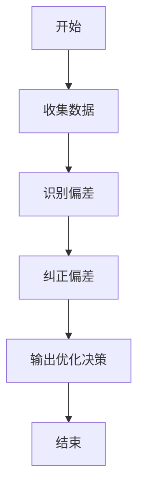

                 


# 乔尔·提林加斯特的投资决策偏差纠正

> **关键词**：投资决策偏差，行为金融学，认知偏差，纠正算法，投资心理学，决策优化，系统设计  
> 
> **摘要**：本文系统分析了投资决策中的偏差问题，深入探讨了乔尔·提林加斯特提出的偏差纠正方法。通过背景介绍、核心概念、算法原理、系统架构和项目实战，本文为投资者提供了从理论到实践的全面指导，帮助其克服决策偏差，提升投资效果。

---

## 第一部分：投资决策偏差概述

### 第1章：投资决策偏差的背景与影响

#### 1.1 投资决策偏差的定义与分类

**1.1.1 什么是投资决策偏差**  
投资决策偏差是指投资者在决策过程中由于认知、情感或环境因素的干扰，导致决策偏离理性或最优状态的现象。这些偏差通常源于人类心理的局限性，如过度自信、从众心理等。

**1.1.2 常见的投资决策偏差类型**  
投资决策偏差可以分为以下几类：  
1. **认知偏差**：如确认偏差、 Availability heuristic（可得性偏差）、锚定效应等。  
2. **情感偏差**：如损失厌恶、过度反应等。  
3. **社会偏差**：如从众心理、羊群效应等。  

**1.1.3 投资决策偏差的影响**  
偏差会显著影响投资者的决策质量，导致投资损失或错失良机。例如，过度自信可能导致过度交易，而损失厌恶可能使投资者错过反弹机会。

#### 1.2 投资者的行为偏差

**1.2.1 认知偏差**  
认知偏差是投资者在信息处理过程中产生的系统性错误。例如，确认偏差使投资者倾向于寻找支持自己观点的信息，忽略反面证据。

**1.2.2 情感偏差**  
情感偏差源于投资者的情绪波动，如恐惧和贪婪。这些情绪可能导致非理性决策，如在市场暴跌时恐慌抛售。

**1.2.3 社会偏差**  
社会偏差源于投资者对社会环境的反应，如从众心理。这可能导致跟风投资，忽视独立分析。

---

### 第2章：投资决策偏差的核心概念

#### 2.1 偏差的属性特征对比

| **偏差类型** | **特征描述** | **影响** | **常见场景** |
|--------------|--------------|----------|--------------|
| 认知偏差      | 系统性错误，源于信息处理 | 影响决策质量 | 股票分析中的确认偏差 |
| 情感偏差      | 非理性情绪驱动 | 导致过度交易 | 市场波动中的贪婪与恐惧 |
| 社会偏差      | 受外部环境影响 | 引发从众投资 | 股市泡沫中的羊群效应 |

#### 2.2 偏差的ER实体关系图

```mermaid
er
    actor 投资者
    actor 市场
    actor 决策偏差
    actor 理性决策
    relationship 投资者 --> 决策偏差: 受到偏差影响
    relationship 决策偏差 --> 市场: 导致非理性交易
    relationship 理性决策 --> 市场: 优化投资策略
```

---

## 第二部分：偏差纠正的算法原理

### 第3章：偏差识别与纠正算法

#### 3.1 算法流程



#### 3.2 算法实现

```python
def identify_bias(data):
    # 数据预处理
    processed_data = preprocess(data)
    # 识别偏差类型
    bias_types = detect_bias(processed_data)
    return bias_types

def correct_bias(data, bias_types):
    # 根据偏差类型生成纠正策略
    correction_strategies = generate_strategies(data, bias_types)
    # 应用纠正策略
    corrected_data = apply_strategies(data, correction_strategies)
    return corrected_data
```

#### 3.3 数学模型与公式

**期望效用理论公式**  
$$ EU = \sum p_i u(x_i) $$  
其中，\( p_i \) 是结果 \( x_i \) 的概率，\( u \) 是效用函数。

**偏差纠正模型**  
$$ C = \sum w_i D_i $$  
其中，\( w_i \) 是偏差权重，\( D_i \) 是偏差程度。

---

### 第4章：系统分析与架构设计

#### 4.1 领域模型


#### 4.2 系统架构


#### 4.3 交互设计


---

## 第三部分：项目实战与最佳实践

### 第6章：偏差纠正系统实现

#### 6.1 环境安装

1. 安装Python和必要的库（如NumPy、Pandas）。
2. 安装可视化工具（如Matplotlib、Seaborn）。

#### 6.2 核心代码实现

```python
import numpy as np
import pandas as pd

def preprocess(data):
    # 数据清洗和转换
    processed = data.dropna().astype(float)
    return processed

def detect_bias(data):
    # 识别偏差类型
    mean = np.mean(data)
    std = np.std(data)
    if data[0] > mean + 2*std:
        return 'anchoring bias'
    else:
        return 'availability heuristic'

def generate_strategies(data, bias_types):
    # 生成纠正策略
    strategies = []
    for bias in bias_types:
        if bias == 'anchoring bias':
            strategies.append('调整基准')
        elif bias == 'availability heuristic':
            strategies.append('扩大样本')
    return strategies
```

#### 6.3 案例分析

**案例背景**  
假设投资者在分析一只股票时，由于锚定效应，过度依赖初始价格，导致低估了风险。

**案例分析**  
通过系统识别出锚定偏差，纠正策略是调整基准价格，结合更多数据点进行分析，最终制定更合理的投资决策。

---

### 第7章：最佳实践与注意事项

#### 7.1 小结  
本文系统介绍了投资决策偏差的识别与纠正方法，结合算法和系统设计，为投资者提供了实践指导。

#### 7.2 注意事项  
1. 数据质量直接影响偏差识别的准确性，需确保数据来源可靠。  
2. 纠正策略需根据具体场景调整，避免一刀切。  
3. 定期回顾和优化系统，以应对市场变化。

#### 7.3 拓展阅读  
推荐阅读《投资学基础》和《行为金融学》，深入理解偏差的根源与应对策略。

---

## 第四部分：总结与展望

### 第9章：总结与未来方向

#### 9.1 本书总结  
本文通过理论分析和实战案例，全面探讨了投资决策偏差的纠正方法，为投资者提供了实用的指导。

#### 9.2 未来方向  
未来研究可以结合AI和大数据技术，开发更智能的偏差纠正系统，进一步提升投资决策的科学性和效率。

---

**全文完**

