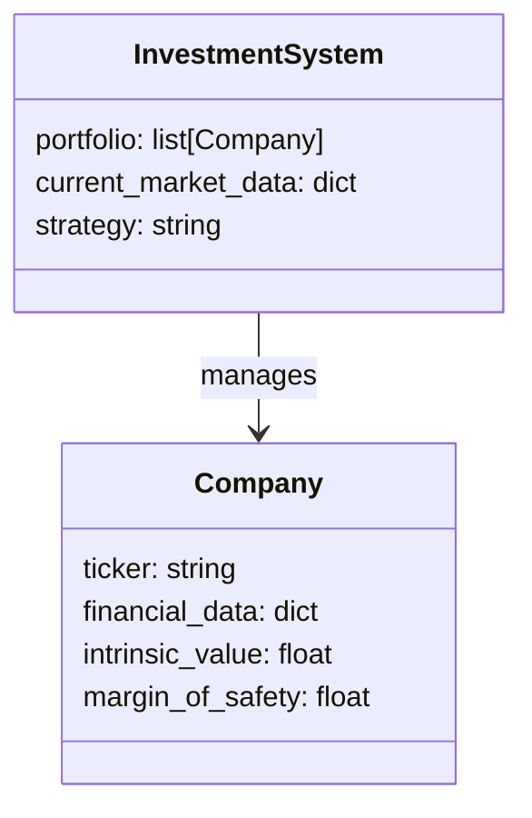
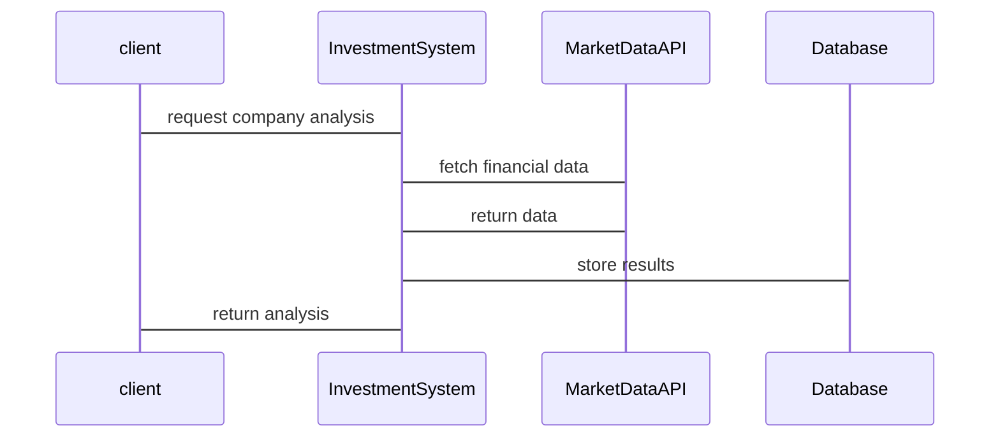

                 


# 乔尔·格林布拉特的价值投资学术研究

> 关键词：价值投资，乔尔·格林布拉特，投资模型，安全边际，基本面分析，量化分析，投资策略

> 摘要：本文通过系统分析乔尔·格林布拉特的价值投资理念，深入探讨其投资模型的核心要素、算法原理和实际应用。文章首先介绍价值投资的基本概念和格林布拉特的投资哲学，接着详细阐述其选股标准和安全边际的计算方法，最后通过系统设计和项目实战，展示如何基于格林布拉特模型构建投资决策系统，并通过实际案例验证其有效性。

---

# 第一部分: 价值投资的背景与核心理念

## 第1章: 价值投资的基本概念

### 1.1 价值投资的定义与特点

#### 1.1.1 价值投资的定义

价值投资是一种以基本面分析为基础的投资策略，旨在通过识别市场中被低估的资产，长期持有以实现超额收益。其核心在于寻找市场价格低于内在价值的标的。

#### 1.1.2 价值投资的核心特点

- **长期视角**：价值投资强调长期持有，避免频繁交易。
- **安全边际**：买入价格低于内在价值，以降低风险。
- **逆向思维**：在市场恐慌时寻找机会，在市场狂热时保持冷静。

#### 1.1.3 价值投资与其它投资策略的区别

| 投资策略 | 核心理念 | 适用场景 |
|----------|----------|----------|
| 价值投资 | 寻找被低估的资产 | 市场恐慌或估值低洼时 |
| 成长投资 | 投资高成长性企业 | 高增长行业或公司 |
| 技术分析 | 通过价格和成交量预测趋势 | 短期交易者 |

### 1.2 乔尔·格林布拉特的价值投资理念

#### 1.2.1 乔尔·格林布拉特的生平简介

乔尔·格林布拉特（Joel Greenblatt）是美国著名投资家，以其独特的“神奇公式”闻名。他在1984年创立了Greenblatt Partners，专注于寻找具有高股东收益率和合理市盈率的公司。

#### 1.2.2 乔尔·格林布拉特的投资哲学

格林布拉特的投资哲学可以概括为以下几点：
1. **寻找市场的非效率性**：利用市场定价错误的机会。
2. **关注基本面**：通过财务指标筛选出优质企业。
3. **注重安全边际**：确保买入价格远低于内在价值。

#### 1.2.3 乔尔·格林布拉特的成功案例

格林布拉特在其职业生涯中成功投资了多家公司，如美国航空（American Airlines）、可口可乐（Coca-Cola）等。他的投资策略在长期实践中表现优异。

### 1.3 价值投资的核心要素

#### 1.3.1 市场的有效性假设

价值投资基于市场有效性的部分无效性。即市场并非总是正确定价资产。

#### 1.3.2 股票的内在价值

内在价值是基于公司未来现金流的现值计算得出的理论价值，与市场价格无关。

#### 1.3.3 安全边际的概念

安全边际 = 内在价值 - 市场价格

### 1.4 价值投资的适用场景与局限性

#### 1.4.1 价值投资的适用场景

- 市场处于低估状态。
- 投资者具备足够的耐心和纪律性。

#### 1.4.2 价值投资的局限性

- 市场短期波动可能导致较大回撤。
- 需要持续关注和调整投资组合。

#### 1.4.3 如何克服价值投资的局限性

- 定期审视投资组合，调整权重。
- 结合宏观经济环境进行动态调整。

---

## 第2章: 乔尔·格林布拉特的投资模型

### 2.1 乔尔·格林布拉特的选股标准

#### 2.1.1 低市盈率与低市净率

市盈率（P/E）= 价格 / 每股收益  
市净率（P/B）= 价格 / 每股净资产

#### 2.1.2 高股息率与稳定的股息增长

股息率 = 每股股息 / 每股价格  
股息增长稳定性：考察公司过去几年的股息增长率。

#### 2.1.3 公司基本面分析

关键指标包括ROE（股东权益回报率）、ROA（资产回报率）、净利率等。

### 2.2 乔尔·格林布拉特的定量模型

#### 2.2.1 模型的基本框架

**神奇公式**：  
$$ \text{评分} = \frac{ROE \times \text{收益质量}}{市盈率} $$

其中，收益质量 = 净利润 / 营业收入。

#### 2.2.2 模型的输入变量与输出结果

| 输入变量 | 输出结果 |
|----------|----------|
| ROE      | 评分     |
| 收益质量 |          |
| 市盈率    |          |

### 2.3 乔尔·格林布拉特的组合管理策略

#### 2.3.1 组合构建的原则

- 分散投资：避免过度集中。
- 保持低周转率：减少交易成本。

#### 2.3.2 组合调整的时机

- 当市场价格显著偏离内在价值时。
- 定期审视公司基本面变化。

#### 2.3.3 组合风险的控制

- 严格控制安全边际。
- 设置止损点。

### 2.4 乔尔·格林布拉特模型与其它价值投资模型的对比

#### 2.4.1 市盈率模型

$$ \text{价值} = \text{市盈率} \times \text{每股收益} $$

#### 2.4.2 市净率模型

$$ \text{价值} = \text{市净率} \times \text{每股净资产} $$

#### 2.4.3 股息率模型

$$ \text{价值} = \frac{\text{股息}}{\text{股息率}} $$

---

## 第3章: 价值投资的数学模型与算法原理

### 3.1 内在价值的计算公式

$$ V = \frac{E}{1 + r} $$

其中，$E$ 是企业未来现金流的现值，$r$ 是折现率。

### 3.2 安全边际的计算方法

$$ \text{安全边际} = \text{内在价值} - \text{市场价格} $$

### 3.3 价值投资的量化分析

#### 3.3.1 算法原理

1. 收集目标公司的财务数据。
2. 计算ROE、ROA等关键指标。
3. 评估市盈率和市净率。
4. 计算内在价值。
5. 确定安全边际。

#### 3.3.2 Python代码实现

```python
def calculate_intrinsic_value(enterprise_value, free_cash_flow, discount_rate):
    return enterprise_value / (1 + discount_rate)

def calculate_margin_of_safety(intrinsic_value, market_price):
    return intrinsic_value - market_price

# 示例
enterprise_value = 100000000
free_cash_flow = 10000000
discount_rate = 0.1
market_price = 50

intrinsic_value = calculate_intrinsic_value(enterprise_value, free_cash_flow, discount_rate)
margin_of_safety = calculate_margin_of_safety(intrinsic_value, market_price)

print(f"内在价值: {intrinsic_value}")
print(f"安全边际: {margin_of_safety}")
```

---

## 第4章: 系统设计与架构方案

### 4.1 系统功能设计

#### 4.1.1 领域模型



#### 4.1.2 系统架构设计


#### 4.1.3 系统交互设计



---

## 第5章: 项目实战与案例分析

### 5.1 项目环境安装

```bash
pip install pandas numpy matplotlib
```

### 5.2 核心代码实现

```python
import pandas as pd

def calculate_roe(net_income, equity):
    return net_income / equity

def calculate_pe(ticker, df):
    pe = df[df['Ticker'] == ticker]['Close'] / df[df['Ticker'] == ticker]['EPS']
    return pe.iloc[0]

# 示例数据
data = {'Ticker': ['AAPL', 'MSFT', 'GOOGL'], 
        'Close': [150, 300, 120], 
        'EPS': [5, 10, 15]}
df = pd.DataFrame(data)

ticker = 'AAPL'
pe = calculate_pe(ticker, df)
print(f"市盈率：{pe}")
```

### 5.3 案例分析

以苹果公司为例，计算其ROE和市盈率，评估是否符合格林布拉特的选股标准。

---

## 第6章: 最佳实践与注意事项

### 6.1 小结

- 理解格林布拉特模型的核心要素。
- 熟练掌握内在价值和安全边际的计算方法。
- 结合实际市场情况动态调整投资策略。

### 6.2 注意事项

- 避免过度依赖单一模型。
- 定期审视投资组合，及时调整。
- 保持对市场的敏感性和对经济环境的关注。

### 6.3 拓展阅读

- 《The Intelligent Investor》
- 《Security Analysis》

---

通过本文的系统分析，读者可以全面理解乔尔·格林布拉特的价值投资理念，并能够实际应用其模型进行投资决策。

