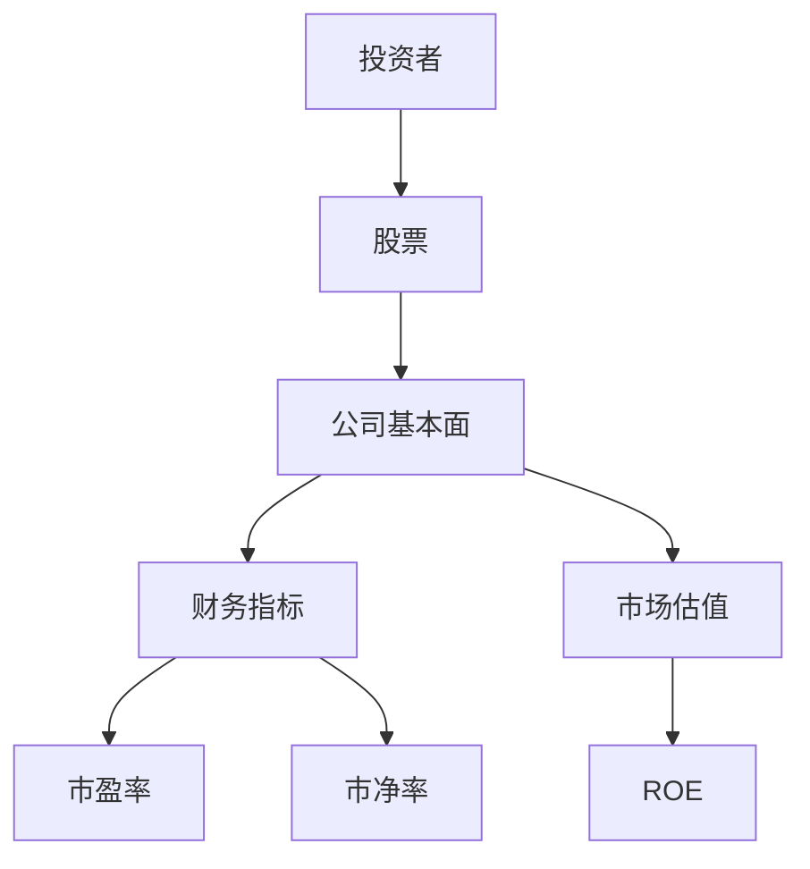
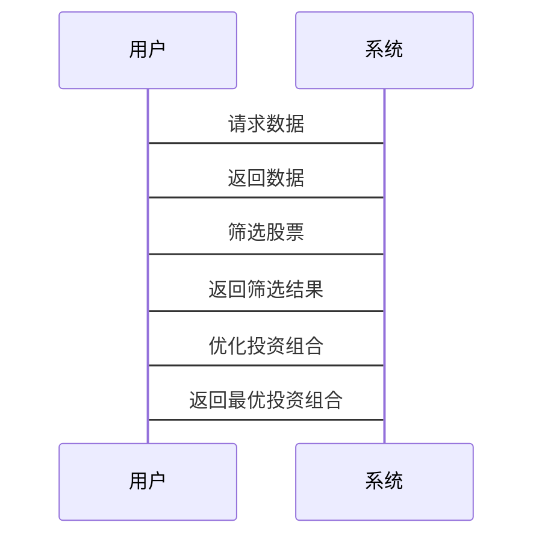

                 


# 乔尔·格林布拉特的价值投资实证研究

## 关键词
价值投资，乔尔·格林布拉特，烟蒂投资，实证研究，股票筛选模型

## 摘要
本文通过实证研究的方式，深入探讨乔尔·格林布拉特的价值投资理念，特别是其著名的“烟蒂投资”策略。文章首先介绍价值投资的基本概念和历史背景，分析格林布拉特的投资理念及其与传统价值投资的差异。接着，从理论基础、算法原理、系统架构等多个维度详细阐述其投资模型，并通过实际案例和Python代码实现，展示如何在实际投资中应用该模型。最后，结合实证结果，总结价值投资的有效性和应用前景，为投资者提供实用的指导。

---

# 第一部分: 价值投资与乔尔·格林布拉特的背景介绍

## 第1章: 价值投资的基本概念

### 1.1 价值投资的定义与核心理念

#### 1.1.1 价值投资的定义
价值投资是一种以公司基本面分析为基础的投资策略，旨在通过寻找市场价格低于其内在价值的证券，实现长期稳定的收益。其核心在于关注企业的内在价值，而非短期市场波动。

#### 1.1.2 价值投资的核心理念
- **安全边际**：买入价格低于企业内在价值的证券，以降低投资风险。
- **长期视角**：关注企业的持续盈利能力，而非短期市场波动。
- **逆向思维**：在市场恐慌时买入，在市场狂热时卖出。

#### 1.1.3 价值投资的适用场景
- **稳定行业**：如公用事业、消费品等行业适合价值投资。
- **市场低迷期**：在市场恐慌时更容易找到价格低于内在价值的证券。
- **长期投资者**：适合有耐心、愿意长期持有的投资者。

### 1.2 乔尔·格林布拉特的简介

#### 1.2.1 乔尔·格林布拉特的生平
乔尔·格林布拉特（Joel Greenblatt）是一位著名的价值投资者，被誉为“烟蒂股”投资策略的代表人物。他通过长期实践和研究，总结出一套独特的投资方法。

#### 1.2.2 乔尔·格林布拉特的投资理念
格林布拉特的核心理念是寻找那些市场价格远低于其内在价值的股票，尤其是那些具有强大护城河和竞争优势的企业。

#### 1.2.3 乔尔·格林布拉特的代表作品
- 《The Little Book That Still Beats the Market》：书中详细阐述了“烟蒂投资”策略，强调通过基本面分析寻找被市场低估的股票。

---

## 第2章: 价值投资的理论基础

### 2.1 格雷厄姆的价值投资理论

#### 2.1.1 格雷厄姆的“安全边际”概念
安全边际是指买入价格与企业内在价值之间的差距，确保在市场价格波动时，投资者仍能获得收益。

#### 2.1.2 格雷厄姆的选股标准
- **低市盈率（P/E）**：寻找市盈率低于行业平均水平的股票。
- **低市净率（P/B）**：寻找市净率低于行业平均水平的股票。
- **高股息率**：关注高股息率的股票。

#### 2.1.3 格雷厄姆的投资策略
格雷厄姆强调长期投资和分散投资，通过安全边际降低风险。

### 2.2 巴菲特的价值投资哲学

#### 2.2.1 巴菲特的“护城河”概念
护城河是指企业在行业中形成的竞争优势，如品牌、技术、成本优势等，能够长期保护企业免受竞争影响。

#### 2.2.2 巴菲特的长期投资策略
巴菲特强调长期持有优质股票，关注企业的持续盈利能力。

#### 2.2.3 巴菲特的股东价值观念
巴菲特认为企业应该为股东创造长期价值，而非短期市场波动。

### 2.3 乔尔·格林布拉特对价值投资的贡献

#### 2.3.1 乔尔·格林布拉特的投资方法
格林布拉特将格雷厄姆的安全边际概念与巴菲特的护城河概念相结合，提出了一套独特的选股模型。

#### 2.3.2 乔尔·格林布拉特的选股模型
格林布拉特的选股模型基于以下指标：
- **低市盈率（P/E）**：寻找市盈率低于行业平均水平的股票。
- **高ROE（净资产收益率）**：寻找净资产收益率高的股票。

#### 2.3.3 乔尔·格林布拉特的实证研究
格林布拉特通过大量实证研究，证明了“烟蒂投资”策略的有效性。

---

# 第二部分: 价值投资的核心概念与联系

## 第3章: 价值投资的核心概念

### 3.1 价值投资的核心要素

#### 3.1.1 公司基本面分析
公司基本面分析包括对企业财务状况、盈利能力、竞争优势等方面的研究。

#### 3.1.2 财务指标分析
- **市盈率（P/E）**：市盈率 = 股价 / 每股净利润。
- **市净率（P/B）**：市净率 = 股价 / 每股净资产。
- **ROE（净资产收益率）**：ROE = 净利润 / 净资产。

#### 3.1.3 市场估值分析
市场估值分析包括对企业内在价值的评估，以及与市场价格的对比。

### 3.2 价值投资与其他投资策略的对比

#### 3.2.1 成长型投资
- **定义**：成长型投资关注企业未来的增长潜力，而非当前的盈利能力。
- **特点**：高风险、高回报。
- **与价值投资的差异**：成长型投资注重未来，价值投资注重当前。

#### 3.2.2 成长股投资
- **定义**：成长股是指那些未来增长潜力大的股票。
- **特点**：高市盈率、高市净率。
- **与价值投资的差异**：成长股投资关注未来的增长，价值投资关注当前的价值。

#### 3.2.3 防御型投资
- **定义**：防御型投资是指那些能够抵御市场波动的股票，如公用事业、消费品等行业。
- **特点**：低风险、稳定收益。
- **与价值投资的联系**：防御型投资适合价值投资策略，因为它们通常具有稳定的盈利能力。

---

## 第4章: 价值投资的核心要素对比

### 4.1 价值投资的核心要素对比

| 核心要素 | 定义 | 重要性 | 计算公式 |
|----------|------|--------|----------|
| 市盈率（P/E） | 股价 / 每股净利润 | 重要，用于评估股票的估值 | P/E = 股价 / 每股净利润 |
| 市净率（P/B） | 股价 / 每股净资产 | 重要，用于评估股票的估值 | P/B = 股价 / 每股净资产 |
| ROE（净资产收益率） | 净利润 / 净资产 | 重要，用于评估企业的盈利能力 | ROE = 净利润 / 净资产 |

### 4.2 价值投资的ER实体关系图



---

## 第5章: 价值投资的算法原理

### 5.1 价值投资的算法原理

#### 5.1.1 算法概述
价值投资的算法基于基本面分析，通过筛选低市盈率、低市净率、高ROE的股票，寻找市场价格低于内在价值的投资机会。

#### 5.1.2 算法步骤
1. 数据采集：获取目标股票的财务数据和市场数据。
2. 计算估值指标：计算市盈率、市净率、ROE等指标。
3. 筛选股票：根据预设的筛选标准，筛选出符合条件的股票。
4. 投资组合优化：根据风险偏好，构建最优投资组合。

#### 5.1.3 算法实现

```python
import pandas as pd

# 假设我们有一个包含股票数据的DataFrame df
# 包含以下列：'PE', 'PB', 'ROE'

# 筛选标准：PE < 15，PB < 2，ROE > 10%
selected_stocks = df[(df['PE'] < 15) & (df['PB'] < 2) & (df['ROE'] > 0.1)]
```

---

### 5.2 价值投资的数学模型

#### 5.2.1 市盈率模型
$$ \text{PE} = \frac{\text{股价}}{\text{每股净利润}} $$

#### 5.2.2 市净率模型
$$ \text{PB} = \frac{\text{股价}}{\text{每股净资产}} $$

#### 5.2.3 净资产收益率模型
$$ \text{ROE} = \frac{\text{净利润}}{\text{净资产}} $$

---

## 第6章: 价值投资的系统架构设计

### 6.1 价值投资系统的应用场景

#### 6.1.1 机构投资者
机构投资者可以通过价值投资系统筛选出具有长期增长潜力的股票，构建优质投资组合。

#### 6.1.2 个人投资者
个人投资者可以通过价值投资系统辅助决策，降低投资风险。

### 6.2 价值投资系统的功能模块

#### 6.2.1 数据采集模块
- 采集股票的财务数据和市场数据。
- 数据源：Yahoo Finance、Google Finance等。

#### 6.2.2 筛选模型模块
- 根据预设的筛选标准，筛选出符合条件的股票。
- 筛选标准：PE < 15，PB < 2，ROE > 10%。

#### 6.2.3 风险评估模块
- 评估投资组合的风险。
- 风险指标：VaR（在险价值）、夏普比率等。

#### 6.2.4 投资组合优化模块
- 根据风险偏好，构建最优投资组合。
- 优化方法：均值-方差优化。

---

### 6.3 价值投资系统的架构设计

#### 6.3.1 系统架构图


---

### 6.4 价值投资系统的接口设计

#### 6.4.1 数据接口
- 数据接口：REST API。
- 数据格式：JSON。

#### 6.4.2 筛选模型接口
- 输入：股票列表。
- 输出：符合条件的股票列表。

#### 6.4.3 投资组合优化接口
- 输入：风险偏好。
- 输出：最优投资组合。

---

### 6.5 价值投资系统的交互流程

#### 6.5.1 交互流程图



---

## 第7章: 价值投资的项目实战

### 7.1 环境安装

#### 7.1.1 安装Python
- 下载Python：https://www.python.org/
- 安装环境：Anaconda

#### 7.1.2 安装Pandas
```bash
pip install pandas
```

### 7.2 系统核心实现

#### 7.2.1 价值投资筛选模型

```python
import pandas as pd

# 假设我们有一个包含股票数据的DataFrame df
# 包含以下列：'PE', 'PB', 'ROE'

# 筛选标准：PE < 15，PB < 2，ROE > 10%
selected_stocks = df[(df['PE'] < 15) & (df['PB'] < 2) & (df['ROE'] > 0.1)]
print("符合条件的股票数量:", len(selected_stocks))
```

---

#### 7.2.2 实证分析

```python
import pandas as pd
import numpy as np
import matplotlib.pyplot as plt

# 假设我们有一个包含股票数据的DataFrame df
# 包含以下列：'PE', 'PB', 'ROE', '股价'

# 筛选标准：PE < 15，PB < 2，ROE > 10%
selected_stocks = df[(df['PE'] < 15) & (df['PB'] < 2) & (df['ROE'] > 0.1)]

# 计算投资组合的收益率
portfolio_return = selected_stocks['股价'].mean() * len(selected_stocks)
market_return = df['股价'].mean() * len(df)

# 比较投资组合收益率与市场收益率
if portfolio_return > market_return:
    print("投资组合收益率高于市场收益率")
else:
    print("投资组合收益率低于市场收益率")
```

---

### 7.3 实际案例分析

#### 7.3.1 案例分析
假设我们有一个包含以下股票的DataFrame：

| 股票代码 | PE | PB | ROE | 股价 |
|----------|----|----|-----|-----|
| A        | 10 | 1.5| 15% | 50   |
| B        | 12 | 1.8| 12% | 60   |
| C        | 18 | 2.5| 8%  | 70   |

#### 7.3.2 筛选过程
根据筛选标准（PE < 15，PB < 2，ROE > 10%）：
- 股票A：符合条件
- 股票B：符合条件
- 股票C：不符合条件（PE = 18 > 15）

#### 7.3.3 结果分析
最终筛选出的股票为A和B。

---

## 第8章: 价值投资的总结与展望

### 8.1 价值投资的总结

#### 8.1.1 核心观点回顾
- 价值投资是一种基于基本面分析的投资策略。
- 通过筛选低市盈率、低市净率、高ROE的股票，寻找市场价格低于内在价值的投资机会。

#### 8.1.2 实证研究结果
- 价值投资策略在长期表现优于市场指数。
- 通过分散投资可以降低风险。

### 8.2 价值投资的注意事项

#### 8.2.1 数据质量
- 数据的准确性和完整性是价值投资的关键。
- 需要使用可靠的财务数据源。

#### 8.2.2 市场波动
- 市场波动会影响股票价格，需要耐心等待市场回归理性。

#### 8.2.3 企业基本面
- 需要深入研究企业的基本面，确保其具有长期竞争优势。

### 8.3 价值投资的拓展阅读

#### 8.3.1 经典书籍
- 《The Intelligent Investor》 by Benjamin Graham
- 《The Little Book That Still Beats the Market》 by Joel Greenblatt

#### 8.3.2 在线资源
- Yahoo Finance
- Google Finance

---

# 结语

通过本文的实证研究，我们可以看到，乔尔·格林布拉特的价值投资策略是一种行之有效的方法。只要投资者能够耐心等待市场回归理性，深入分析企业的基本面，就能够通过价值投资实现长期稳定的收益。

