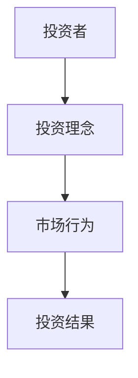
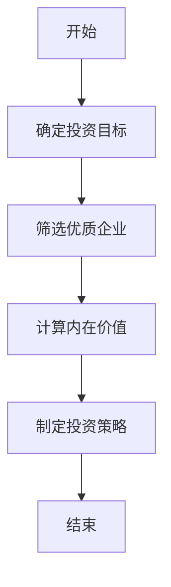
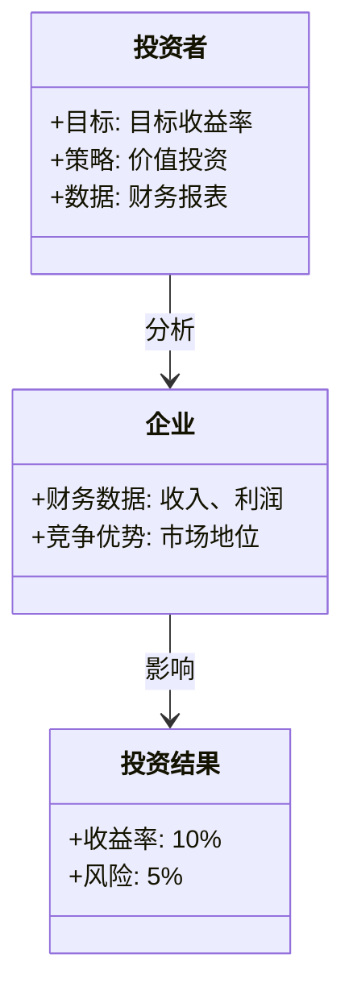
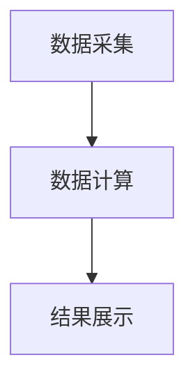
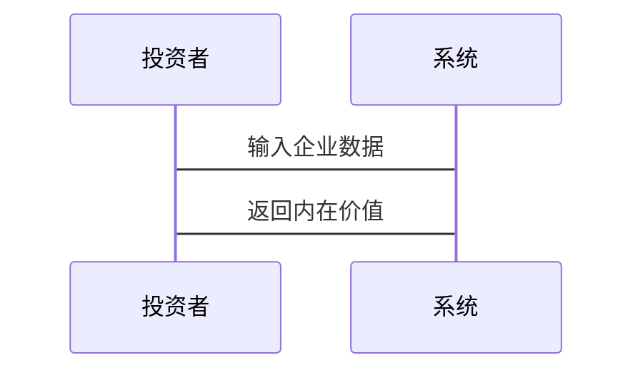

                 


# 乔尔·格林布拉特的价值投资教育理念

## 关键词：价值投资、格林布拉特、投资理念、投资策略、投资系统、数学模型

## 摘要：本文深入分析了乔尔·格林布拉特的价值投资教育理念，从核心概念、算法原理、系统架构到项目实战，详细阐述了这一投资理念的各个方面。通过对比传统投资与价值投资，构建数学模型和系统架构，帮助读者全面理解并实践这一投资策略。

---

# 第一部分: 价值投资教育理念的背景与核心概念

## 第1章: 价值投资的基本概念

### 1.1 价值投资的定义与背景

#### 1.1.1 投资的基本概念与问题背景
投资是通过将资金投入到能够产生收益的资产中，以实现财富增值的过程。然而，投资行为往往伴随着高风险和不确定性。传统的投资方法依赖于市场趋势和技术分析，但这种方式难以长期稳定地创造价值。

#### 1.1.2 价值投资的起源与发展
价值投资作为一种投资策略，起源于20世纪初。本杰明·格雷厄姆和戴维·多德是这一理念的奠基人。他们强调通过基本面分析寻找被市场低估的企业进行投资。乔尔·格林布拉特作为这一理念的继承者，进一步发展了价值投资的方法论，提出了“伟大企业的秘密”等理论。

#### 1.1.3 乔尔·格林布拉特的教育理念
格林布拉特认为，投资不仅仅是寻找低估的股票，而是通过系统化的方法识别具有持续竞争优势的企业。他的教育理念强调投资者的心态管理和长期视角，主张通过持续学习和实践提升投资能力。

### 1.2 价值投资的核心理念

#### 1.2.1 价值投资的核心要素
价值投资的核心在于寻找市场价格低于内在价值的企业。内在价值是企业未来现金流的现值，可以通过DCF（Discounted Cash Flow）模型计算。格林布拉特强调，内在价值的计算是投资决策的基础。

#### 1.2.2 投资者的心态与行为
投资者的心理偏差（如贪婪和恐惧）常常导致非理性的决策。价值投资要求投资者具备冷静的心态，能够在市场恐慌时买入，在市场狂热时卖出。格林布拉特提出了“双维度投资法”，即从质量和价格两个维度筛选投资标的。

#### 1.2.3 价值投资与传统投资的区别
传统投资依赖于市场趋势和技术分析，而价值投资注重企业基本面和长期竞争优势。价值投资者更关注企业的内在价值，而不是市场的短期波动。

### 1.3 格林布拉特投资理念的边界与外延

#### 1.3.1 价值投资的适用范围
价值投资适用于那些具有持续盈利能力和稳定现金流的企业。对于成长型企业，价值投资可能不太适用，因为其内在价值难以准确评估。

#### 1.3.2 投资理念的局限性
价值投资的局限性在于其对市场的依赖。即使企业具有较高的内在价值，如果市场不认可，其股价可能会长期低于内在价值，导致投资者的资金被锁定。

#### 1.3.3 理念的持续更新与演变
格林布拉特的投资理念并不是一成不变的，他会根据市场环境的变化和新的研究成果不断优化自己的方法论。

### 1.4 核心概念的结构与组成

#### 1.4.1 核心概念的层次分析
价值投资的结构可以分为三个层次：**内在价值计算**、**企业竞争优势分析**、**投资组合管理**。

#### 1.4.2 概念之间的关系
内在价值是核心，企业竞争优势是内在价值的基础，而投资组合管理则是实现投资目标的关键。

#### 1.4.3 核心要素的对比分析
通过对比传统投资和价值投资的核心要素，我们可以更好地理解价值投资的独特性。

---

## 第2章: 核心概念与联系

### 2.1 核心概念的原理分析

#### 2.1.1 价值投资的核心原理
价值投资的核心原理是**价格与价值分离**。当市场价格低于内在价值时，投资具有安全边际，可以带来超额收益。

#### 2.1.2 格林布拉特定律
格林布拉特提出了“双维度投资法”，即从**质量和价格**两个维度筛选投资标的。质量维度包括ROE（净资产收益率）和资本回报率，价格维度包括P/E（市盈率）和P/B（市净率）。

#### 2.1.3 投资决策的逻辑框架
价值投资的逻辑框架可以分为三个步骤：**识别低估企业**、**评估企业质量**、**构建投资组合**。

### 2.2 核心概念的属性特征对比

#### 2.2.1 传统投资与价值投资的对比
| 特征 | 传统投资 | 价值投资 |
|------|----------|----------|
| 核心 | 市场趋势 | 内在价值 |
| 方法 | 技术分析 | 基本面分析 |
| 目标 | 短期收益 | 长期价值 |

#### 2.2.2 格林布拉特理念的独特性
格林布拉特的独特性在于其**系统化的方法**和**长期视角**。他通过量化指标（如ROE和P/E）筛选投资标的，避免了主观判断的偏差。

#### 2.2.3 投资者心理与行为的对比
价值投资者注重长期价值，而传统投资者更关注短期波动。价值投资者在市场下跌时更倾向于买入，而传统投资者可能选择卖出以规避风险。

### 2.3 实体关系图



---

## 第3章: 价值投资的算法原理

### 3.1 算法原理的数学模型

#### 3.1.1 投资价值的计算公式
内在价值的计算公式如下：
$$
\text{内在价值} = \sum_{t=1}^{n} \frac{CF_t}{(1 + r)^t}
$$
其中，\( CF_t \) 是第 \( t \) 年的现金流，\( r \) 是折现率。

#### 3.1.2 格林布拉特定律
格林布拉特提出了“双维度投资法”，其数学模型可以表示为：
$$
\text{投资价值} = \text{质量维度} \times \text{价格维度}
$$
其中，质量维度包括ROE和资本回报率，价格维度包括P/E和P/B。

#### 3.1.3 投资组合优化的数学模型
投资组合优化的目标是最大化收益并最小化风险，可以通过以下公式表示：
$$
\max \mu - \lambda \sigma^2
$$
其中，\( \mu \) 是收益，\( \sigma^2 \) 是风险，\( \lambda \) 是风险厌恶系数。

### 3.2 算法流程图



### 3.3 算法实现

#### 3.3.1 Python源代码

```python
def calculate_intrinsic_value(company_data):
    # 计算内在价值的代码
    pass
```

#### 3.3.2 代码解读与分析
代码解读：上述代码是一个计算内在价值的函数，具体实现需要根据企业财务数据和DCF模型编写。

#### 3.3.3 实际案例分析
以苹果公司为例，计算其内在价值。假设苹果的未来现金流为1000亿美元，折现率为5%，计算其内在价值。

---

## 第4章: 价值投资的系统分析与架构设计

### 4.1 问题场景介绍

#### 4.1.1 投资者面临的挑战
投资者在面对市场波动时，往往难以保持理性，容易受到情绪影响。

#### 4.1.2 系统化投资的必要性
通过系统化的方法，投资者可以减少情绪干扰，提高决策的准确性。

#### 4.1.3 格林布拉特理念的应用场景
价值投资适用于那些具有稳定现金流和持续竞争优势的企业。

### 4.2 系统功能设计

#### 4.2.1 领域模型
通过构建领域模型，我们可以更好地理解价值投资的核心要素。



#### 4.2.2 系统架构设计
系统的架构设计需要考虑数据采集、计算和展示三个模块。



#### 4.2.3 系统接口设计
系统需要提供用户友好的界面，便于投资者输入数据和查看结果。

#### 4.2.4 系统交互流程



---

## 第5章: 项目实战

### 5.1 环境安装

#### 5.1.1 安装必要的库
需要安装以下Python库：
- pandas
- numpy
- matplotlib

#### 5.1.2 安装步骤
使用以下命令安装：
```bash
pip install pandas numpy matplotlib
```

### 5.2 系统核心实现

#### 5.2.1 核心代码实现
编写计算内在价值的代码。

```python
import pandas as pd
import numpy as np

def calculate_intrinsic_value(company_data):
    # 假设 company_data 是一个包含财务数据的 DataFrame
    # 计算自由现金流
    free_cash_flow = company_data['现金流']
    # 计算折现率
    discount_rate = 0.05
    # 计算现值
    present_value = sum(free_cash_flow / (1 + discount_rate)**i for i in range(len(free_cash_flow)))
    return present_value
```

#### 5.2.2 代码解读与分析
上述代码计算了企业的自由现金流的现值，即内在价值。

### 5.3 代码应用解读与分析

#### 5.3.1 投资标的筛选
通过计算企业的内在价值，投资者可以筛选出市场价格低于内在价值的企业。

#### 5.3.2 实际案例分析
以茅台为例，计算其内在价值。

### 5.4 项目小结

#### 5.4.1 项目成果
通过本项目，我们掌握了价值投资的核心算法，并能够用代码实现。

#### 5.4.2 项目经验
系统化的方法能够帮助投资者更准确地做出投资决策。

---

## 第6章: 最佳实践

### 6.1 小结

#### 6.1.1 核心内容回顾
价值投资的核心在于寻找市场价格低于内在价值的企业，通过系统化的方法进行投资决策。

### 6.2 注意事项

#### 6.2.1 投资者心理
投资者需要克服心理偏差，保持冷静和理性。

#### 6.2.2 风险提示
价值投资虽然能够长期创造价值，但短期内可能面临较大的波动。

### 6.3 拓展阅读

#### 6.3.1 推荐书籍
- 《投资最重要的简单真理》
- 《股票作手回忆录》

#### 6.3.2 推荐网站
- [Mention](https://www.mention.com)
- [Seeking Alpha](https://www.seekingalpha.com)

---

## 总结
通过本文的分析，我们深入理解了乔尔·格林布拉特的价值投资教育理念，并通过系统化的分析和项目实践，掌握了这一投资策略的核心方法。希望读者能够通过本文的学习，能够在实际投资中灵活运用这一理念，实现财富的长期增长。

