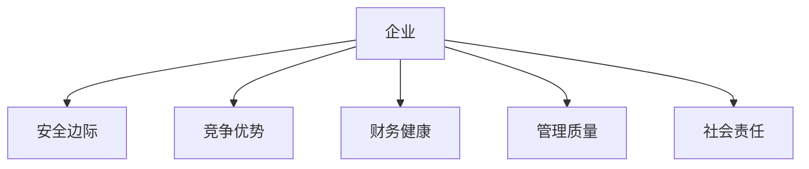
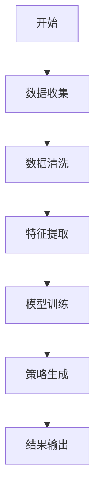
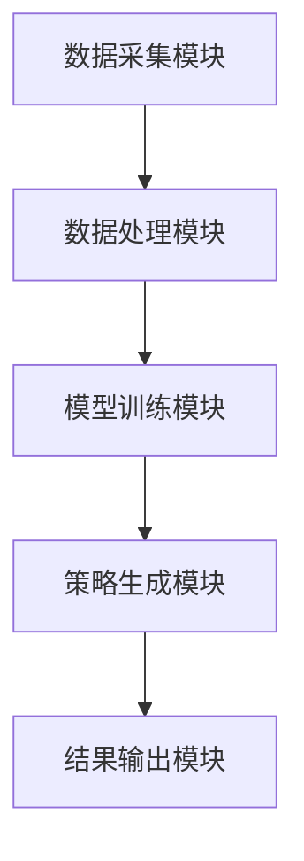
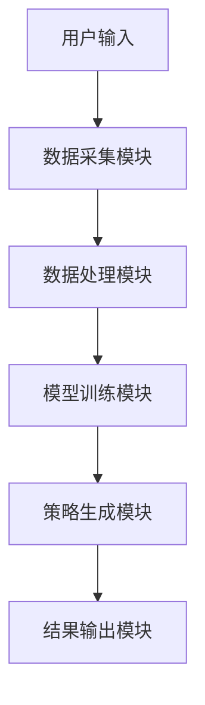

                 


# 乔尔·格林布拉特的价值投资量化方法：从理论到实战

## 关键词：价值投资、量化方法、投资策略、数据驱动、风险管理、格林布拉特、投资组合优化

## 摘要：乔尔·格林布拉特的价值投资量化方法是一种结合基本面分析和量化模型的投资策略，旨在通过数据驱动的方法发现被低估的投资机会。本文将详细探讨这一方法的核心理念、算法原理、系统架构以及实际应用，帮助读者理解如何将理论与实践相结合，构建高效的投资策略。

---

## 第一部分：价值投资与量化方法的背景介绍

### 第1章：价值投资的起源与核心理念

#### 1.1 价值投资的起源
- **投资学的基本原理**：价值投资起源于20世纪初，其核心思想是寻找市场低估的股票，通过长期持有实现收益。
- **价值投资的定义与特点**：价值投资强调基本面分析，关注企业的内在价值，而非市场的短期波动。其特点包括长期性、安全性、逆向思维和分散投资。
- **价值投资与其它投资策略的对比**：与趋势投资、技术分析等策略相比，价值投资更注重企业的基本面和内在价值。

#### 1.2 乔尔·格林布拉特的理论基础
- **价值投资的核心思想**：格林布拉特认为，市场往往低估了某些企业的价值，通过识别这些企业可以实现超额收益。
- **格林布拉特的量化模型**：他提出了基于ROE（净资产收益率）和ROIC（投资资本回报率）的量化筛选方法，结合安全边际和竞争优势，构建投资组合。
- **量化方法的演变**：格林布拉特的量化方法不断完善，从最初的ROE筛选到结合多因子模型，逐步实现投资策略的优化。

---

### 第2章：格林布拉特量化方法的核心要素

#### 2.1 核心概念与问题背景
- **核心概念**：格林布拉特的量化方法基于以下核心要素：
  - **安全边际**：买入价格低于企业内在价值。
  - **竞争优势**：企业具备强大的竞争优势，如高ROE、低资本消耗。
  - **财务健康**：企业具备健康的财务状况，如低负债率、稳定的现金流。
  - **管理质量**：管理层具备诚信和能力，能够为股东创造价值。
  - **社会责任**：企业具备良好的社会形象和可持续发展能力。

- **问题背景**：在金融市场中，传统投资方法难以应对市场的不确定性和波动性。格林布拉特的量化方法通过数据驱动的方式，帮助投资者系统化地筛选投资机会。

#### 2.2 核心概念的属性特征对比表

| 核心概念         | 属性特征                          |
|------------------|-----------------------------------|
| 安全边际         | 买入价格 < 内在价值              |
| 竞争优势         | 高ROE、低资本消耗                |
| 财务健康         | 低负债率、稳定现金流              |
| 管理质量         | 高层诚信、决策能力强            |
| 社会责任         | 良好声誉、可持续发展              |

#### 2.3 核心概念的ER实体关系图



---

## 第二部分：格林布拉特量化方法的核心原理

### 第3章：格林布拉特量化模型的算法原理

#### 3.1 算法流程图（Mermaid）



#### 3.2 算法实现代码示例

```python
def greenblatt_strategy(portfolio, market_data):
    # 数据清洗和特征提取
    cleaned_data = preprocess(market_data)
    features = extract_features(cleaned_data)
    
    # 模型训练
    model = train_model(features)
    
    # 策略生成
    recommendations = generate_recommendations(model, portfolio)
    return recommendations
```

---

### 第4章：数学模型与公式解析

#### 4.1 核心数学模型
- **ROE（净资产收益率）**：
  $$ \text{ROE} = \frac{\text{净利润}}{\text{股东权益}} $$
- **ROIC（投资资本回报率）**：
  $$ \text{ROIC} = \frac{\text{净利润}}{\text{投资资本}} $$
- **安全边际计算**：
  $$ \text{内在价值} = \text{ROE} \times \text{股东权益} $$
  $$ \text{安全边际} = \text{内在价值} \times \text{折扣率} $$

---

## 第三部分：系统分析与架构设计

### 第5章：系统功能设计与架构

#### 5.1 项目介绍
- **目标**：构建一个基于格林布拉特量化方法的投资分析系统，实现数据采集、模型训练、策略生成和结果输出。
- **功能模块**：
  - 数据采集模块：从多个数据源获取市场数据。
  - 数据处理模块：清洗和特征提取。
  - 模型训练模块：基于机器学习算法训练量化模型。
  - 策略生成模块：根据模型输出生成投资策略。

#### 5.2 系统架构设计（Mermaid）



---

### 第6章：系统交互与接口设计

#### 6.1 系统交互流程（Mermaid）



#### 6.2 接口设计
- **数据接口**：提供API接口，实现与其他数据源的对接。
- **模型接口**：提供训练好的模型接口，方便其他系统调用。

---

## 第四部分：项目实战与案例分析

### 第7章：项目实战

#### 7.1 环境安装
- **安装Python**：建议使用Python 3.8或更高版本。
- **安装依赖库**：`pandas`, `numpy`, `scikit-learn`, `matplotlib`。

#### 7.2 核心代码实现

```python
import pandas as pd
import numpy as np
from sklearn.linear_model import LinearRegression

def preprocess(data):
    # 数据清洗
    data = data.dropna()
    return data

def extract_features(data):
    # 特征提取
    features = data[['ROE', 'ROIC', '负债率']]
    return features

def train_model(features, labels):
    # 模型训练
    model = LinearRegression()
    model.fit(features, labels)
    return model

def generate_recommendations(model, portfolio):
    # 策略生成
    recommendations = []
    for stock in portfolio:
        if model.predict(stock.features) > 0.7:
            recommendations.append(stock)
    return recommendations
```

---

### 第8章：案例分析与解读

#### 8.1 案例分析
假设我们有一个包含10只股票的组合，我们使用格林布拉特的量化模型进行筛选，最终选出3只具备高ROE和低负债率的股票。

#### 8.2 代码解读与分析
- **数据清洗**：去除缺失值，确保数据完整性。
- **特征提取**：提取ROE、ROIC和负债率作为关键特征。
- **模型训练**：使用线性回归模型训练，预测股票的投资价值。
- **策略生成**：根据模型输出，筛选出符合投资标准的股票。

---

## 第五部分：最佳实践与总结

### 第9章：最佳实践

#### 9.1 小结
- 格林布拉特的量化方法结合了基本面分析和数据驱动的量化模型，为投资者提供了系统化的投资策略。
- 通过本文的介绍，读者可以理解如何将理论应用于实践，构建高效的投资系统。

#### 9.2 注意事项
- 投资者需要根据市场变化调整模型参数。
- 数据质量直接影响模型效果，需确保数据来源可靠。
- 投资需谨慎，建议结合多种策略进行分散投资。

#### 9.3 拓展阅读
- 《The Quantitative Edge》
- 《投资学基础》
- 关注行业动态和技术发展。

---

## 结语
通过本文的详细介绍，读者可以全面理解乔尔·格林布拉特的价值投资量化方法，并将其应用于实际投资中。希望本文能够为投资者提供有价值的参考，帮助他们在复杂多变的市场中实现稳健的投资回报。

