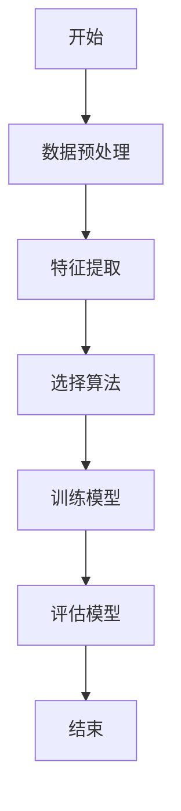

                 


# 目录大纲：《云服务在投资理财智能助手中的高效部署》

## 第一部分：背景介绍

### 第1章：云服务与投资理财智能助手的背景

#### 1.1 问题背景
- 1.1.1 传统投资理财服务的局限性
- 1.1.2 智能化投资理财的需求驱动

#### 1.2 问题描述
- 1.2.1 智能助手在投资理财中的角色
- 1.2.2 当前云服务在投资理财中的应用现状

#### 1.3 问题解决
- 1.3.1 云服务如何提升智能助手效率
- 1.3.2 技术实现路径

#### 1.4 边界与外延
- 1.4.1 云服务的边界
- 1.4.2 智能助手的外延

#### 1.5 核心概念与组成
- 1.5.1 核心概念：云服务、智能助手、投资理财
- 1.5.2 组成要素：数据、算法、用户交互

## 第二部分：核心概念与联系

### 第2章：核心概念原理

#### 2.1 云服务原理
- 2.1.1 云计算的基本概念
- 2.1.2 云服务的分类与特点

#### 2.2 投资理财智能助手原理
- 2.2.1 智能助手的功能模块
- 2.2.2 与云服务的交互机制

#### 2.3 高效部署的原理
- 2.3.1 部署策略
- 2.3.2 资源优化配置

### 第3章：核心概念对比与ER关系图

#### 3.1 核心概念对比
- 3.1.1 功能对比表
- 3.1.2 优势对比分析

#### 3.2 ER实体关系图
```mermaid
erd
    投资者----(拥有)----投资账户
    投资账户----(包含)----投资组合
    投资组合----(包含)----投资标的
    投资者----(使用)----智能助手
    智能助手----(依赖)----云服务
```

## 第三部分：算法原理讲解

### 第4章：算法原理与流程

#### 4.1 推荐系统算法
- 4.1.1 基于协同过滤的推荐算法
- 4.1.2 基于内容的推荐算法
- 4.1.3 混合推荐算法

#### 4.2 预测模型算法
- 4.2.1 线性回归模型
- 4.2.2 支持向量机模型
- 4.2.3 随机森林模型

#### 4.3 算法流程图


## 第四部分：系统分析与架构设计

### 第5章：系统分析与架构设计方案

#### 5.1 项目介绍
- 5.1.1 项目背景
- 5.1.2 项目目标

#### 5.2 系统功能设计
- 5.2.1 领域模型设计
  ```mermaid
  classDiagram
      class 投资者 {
          姓名
          账号
          资产
      }
      class 投资账户 {
          账户ID
          资产配置
          交易记录
      }
      class 投资组合 {
          组合ID
          标的资产
          比重
      }
      class 智能助手 {
          用户ID
          账户链接
          交互记录
      }
      class 云服务 {
          服务ID
          资源分配
          API接口
      }
      投资者 --> 投资账户: 拥有
      投资账户 --> 投资组合: 包含
      投资者 --> 智能助手: 使用
      智能助手 --> 云服务: 依赖
  ```

#### 5.3 系统架构设计
  ```mermaid
  architecture
      客户端 <---> API网关 <---> 云服务
      云服务 <---> 数据库
      云服务 <---> 第三方服务
  ```

#### 5.4 系统接口设计
- 5.4.1 API接口定义
- 5.4.2 接口交互流程图
  ```mermaid
  sequenceDiagram
      participant 用户
      participant 智能助手
      participant 云服务
      用户->智能助手: 请求投资建议
      智能助手->云服务: 获取数据
      云服务->智能助手: 返回数据
      智能助手->用户: 提供建议
  ```

## 第五部分：项目实战

### 第6章：项目实战

#### 6.1 环境搭建
- 6.1.1 安装云服务（如AWS、Azure）
- 6.1.2 安装Python和相关库（如Pandas、Scikit-learn）

#### 6.2 核心代码实现
- 6.2.1 数据预处理代码
  ```python
  import pandas as pd

  # 读取数据
  data = pd.read_csv('investments.csv')
  # 删除缺失值
  data.dropna(inplace=True)
  ```

- 6.2.2 训练模型代码
  ```python
  from sklearn.linear_model import LinearRegression

  model = LinearRegression()
  model.fit(X_train, y_train)
  ```

- 6.2.3 评估模型代码
  ```python
  from sklearn.metrics import mean_squared_error

  predictions = model.predict(X_test)
  mse = mean_squared_error(y_test, predictions)
  print(f'MSE: {mse}')
  ```

#### 6.3 实际案例分析
- 6.3.1 案例背景
- 6.3.2 数据分析
- 6.3.3 模型应用
- 6.3.4 结果解读

#### 6.4 项目小结
- 成功经验
- 经验教训
- 改进建议

## 第六部分：最佳实践

### 第7章：最佳实践与小结

#### 7.1 最佳实践 tips
- 部署优化
- 安全保障
- 成本控制

#### 7.2 小结
- 核心知识点总结
- 学习要点回顾
- 实际应用中的注意事项

#### 7.3 注意事项
- 数据安全
- 模型迭代
- 用户隐私保护

#### 7.4 拓展阅读
- 推荐书籍
- 在线资源
- 技术博客

## 参考文献
- 列出所有引用的书籍、论文、技术文档和在线资源。

---

通过以上目录，我们可以看到，文章从背景、核心概念、算法原理、系统设计、项目实战到最佳实践，全面覆盖了云服务在投资理财智能助手中的高效部署的各个方面，确保内容的深度和广度。

