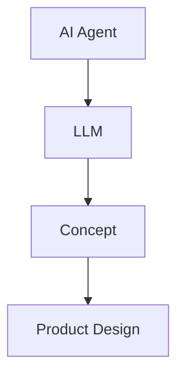
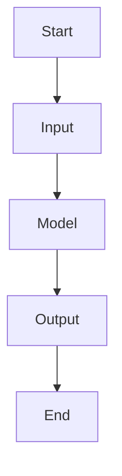
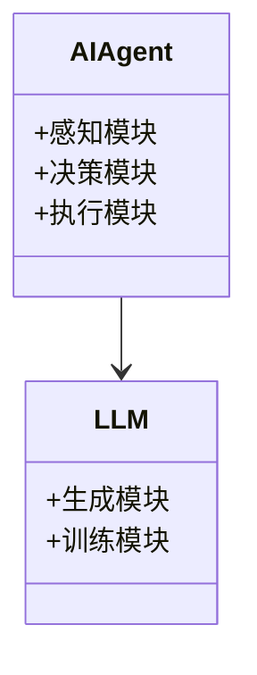
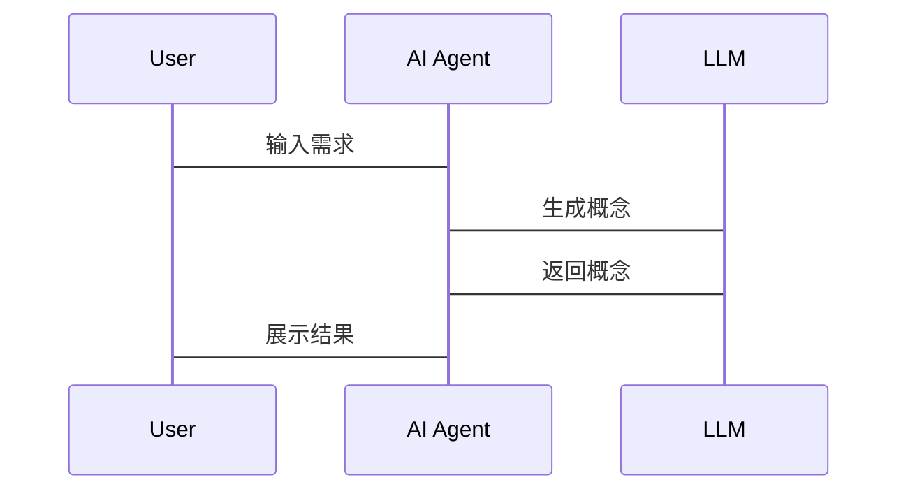

                 


# 产品设计 AI Agent：LLM 辅助创新与概念生成

> 关键词：LLM、AI Agent、产品设计、创新、概念生成、技术博客

> 摘要：本文探讨了AI Agent在产品设计中的应用，特别是如何利用大语言模型（LLM）辅助创新与概念生成。通过详细分析LLM的工作原理、系统架构、算法实现及实际案例，本文揭示了LLM在产品设计中的潜力和优势，为读者提供了一种创新的设计思路。

---

# 第一部分：产品设计与AI Agent概述

## 第1章：产品设计与AI Agent的背景介绍

### 1.1 问题背景与描述
#### 1.1.1 传统产品设计的挑战
传统的产品设计过程依赖于设计师的经验和创造力，但在面对复杂多变的市场需求时，这种方法往往效率低下，且难以突破创新瓶颈。设计师需要在有限的时间内完成从概念生成到原型设计的整个流程，这对个人能力提出了极高的要求。

#### 1.1.2 AI Agent在产品设计中的作用
AI Agent（人工智能代理）作为一种智能化工具，能够通过学习和分析大量的数据，辅助设计师完成从灵感收集到方案优化的全过程。AI Agent不仅能够提高设计效率，还能提供全新的视角，帮助设计师发现潜在的设计机会。

#### 1.1.3 LLM辅助创新的核心价值
大语言模型（LLM）作为AI Agent的重要组成部分，具备强大的文本生成和模式识别能力。通过LLM，设计师可以快速生成多种概念方案，并对这些方案进行优化和调整，从而显著提升设计效率和创新质量。

---

### 1.2 问题解决与边界
#### 1.2.1 创意生成的边界与限制
虽然LLM能够生成大量创意，但这些创意的质量和相关性仍需人工筛选和优化。此外，LLM对上下文的理解可能存在局限性，导致生成的概念可能不符合实际需求。

#### 1.2.2 LLM在概念生成中的优势
LLM能够快速生成多样化、高质量的概念方案，帮助设计师打破思维定式。此外，LLM还可以根据用户反馈动态调整生成方案，进一步提升设计的灵活性和适应性。

#### 1.2.3 产品设计流程的优化
通过整合LLM，产品设计流程可以更加高效。设计师可以在早期阶段就获得丰富的灵感，从而在后续的迭代中更快地优化设计方案。

---

### 1.3 概念结构与核心要素
#### 1.3.1 AI Agent的基本构成
AI Agent通常包括感知模块、决策模块和执行模块。感知模块负责收集和分析数据，决策模块基于数据生成解决方案，执行模块则将方案转化为实际操作。

#### 1.3.2 LLM在概念生成中的关键要素
LLM的关键要素包括训练数据的质量、模型的参数规模以及生成算法的设计。这些要素直接影响生成概念的质量和多样性。

#### 1.3.3 产品设计与AI Agent的结合模型
产品设计与AI Agent的结合模型通常包括数据输入、概念生成、方案优化和结果输出四个阶段。这种模型能够将设计师的经验与AI的优势结合起来，实现更高效的设计过程。

---

## 第2章：AI Agent与LLM的核心概念与联系

### 2.1 核心概念原理
#### 2.1.1 AI Agent的基本原理
AI Agent通过感知环境、分析数据并做出决策来完成任务。其核心在于算法的设计和数据的处理能力。

#### 2.1.2 LLM的概念生成机制
LLM通过概率模型生成文本，能够根据上下文预测最可能的后续内容。这种机制使得LLM能够生成多样化、高质量的概念方案。

#### 2.1.3 两者结合的创新模式
AI Agent与LLM的结合模式可以通过模块化设计实现。AI Agent负责整体协调，LLM则专注于概念生成，两者共同完成产品设计任务。

---

### 2.2 属性特征对比
#### 2.2.1 AI Agent的属性特征表
| 属性 | 描述 |
|------|------|
| 感知能力 | 数据收集与分析能力 |
| 决策能力 | 基于数据的决策能力 |
| 执行能力 | 执行决策的能力 |

#### 2.2.2 LLM的属性特征表
| 属性 | 描述 |
|------|------|
| 文本生成能力 | 基于上下文生成文本的能力 |
| 模型参数规模 | 模型的复杂度和能力 |
| 训练数据 | 数据的质量和多样性 |

#### 2.2.3 对比分析与总结
AI Agent与LLM各有其独特的优势和限制。AI Agent的综合能力强，但依赖于模型的设计；LLM的生成能力强，但需要大量数据支持。

---

### 2.3 ER实体关系图


---

## 2.4 本章小结
本章通过对比分析，揭示了AI Agent与LLM的核心概念及其联系。AI Agent的综合能力与LLM的生成能力的结合，为产品设计提供了新的可能性。

---

# 第三部分：算法原理

## 第3章：LLM辅助创新的算法原理

### 3.1 算法概述
#### 3.1.1 LLM的基本算法流程
LLM的基本流程包括数据预处理、模型训练和生成推理。数据预处理是关键，决定了模型的能力。

#### 3.1.2 概念生成的数学模型
LLM的生成过程基于概率模型，通常采用最大似然估计来优化模型参数。

#### 3.1.3 创新优化的算法选择
在生成概念时，可以采用贪心算法或蒙特卡洛方法，以提高生成方案的多样性和质量。

---

### 3.2 算法流程图


---

### 3.3 数学模型与公式
#### 3.3.1 概念生成的概率模型
$$ P(\text{concept} | \text{input}) = \frac{\text{count}(\text{concept} \text{ and } \text{input})}{\text{count}(\text{input})} $$

#### 3.3.2 优化模型的数学表达
$$ \theta = \arg\max_{\theta} \sum_{i=1}^{n} \log P(y_i|x_i,\theta) $$

---

## 3.4 本章小结
本章详细讲解了LLM的算法原理，包括基本流程、数学模型和优化方法。这些内容为后续的设计提供了理论基础。

---

# 第四部分：系统分析与架构设计

## 第4章：系统分析与架构设计方案

### 4.1 项目背景介绍
本项目旨在通过AI Agent辅助产品设计，利用LLM生成概念方案，优化设计流程。

### 4.2 系统功能设计
#### 4.2.1 领域模型


#### 4.2.2 系统架构
```mermaid
graph TD
    AI Agent --> LLM
    LLM --> Database
    Database --> UI
```

#### 4.2.3 接口设计
系统主要接口包括数据输入接口、生成接口和结果输出接口。

#### 4.2.4 交互流程


---

## 4.3 本章小结
本章通过系统分析和架构设计，明确了AI Agent与LLM的协作方式，为项目的实施提供了指导。

---

# 第五部分：项目实战

## 第5章：项目实战

### 5.1 环境安装与配置
#### 5.1.1 安装Python环境
使用Anaconda或虚拟环境安装Python 3.8及以上版本。

#### 5.1.2 安装必要的库
安装Hugging Face库和TensorFlow等。

### 5.2 核心功能实现
#### 5.2.1 LLM的实现
```python
from transformers import GPT2LMHeadModel, GPT2Tokenizer

tokenizer = GPT2Tokenizer.from_pretrained('gpt2')
model = GPT2LMHeadModel.from_pretrained('gpt2')
```

#### 5.2.2 生成概念的代码
```python
def generate_concept(prompt):
    inputs = tokenizer.encode(prompt, return_tensors='pt')
    outputs = model.generate(inputs, max_length=50, temperature=0.7)
    return tokenizer.decode(outputs[0])
```

### 5.3 案例分析与详细解读
通过具体案例，展示如何利用LLM生成产品设计概念，并进行优化。

---

## 5.4 项目总结
本章通过实际案例，展示了如何利用AI Agent辅助产品设计，验证了理论的可行性。

---

# 第六部分：最佳实践与小结

## 第6章：总结与展望

### 6.1 总结
本文详细探讨了AI Agent与LLM在产品设计中的应用，揭示了其潜力和优势。

### 6.2 最佳实践 tips
- 确保数据质量，优化模型性能。
- 结合人工审核，提升生成质量。
- 定期更新模型，适应市场变化。

### 6.3 注意事项
- 注意数据隐私和版权问题。
- 避免过度依赖AI，保持人类的创造力。
- 定期评估模型效果，进行优化。

### 6.4 拓展阅读
推荐相关书籍和论文，供读者深入学习。

---

# 第七部分：附录

## 7.1 参考文献
- 《Large Language Models: Fundamentals and Applications》
- 《AI in Product Design: A Comprehensive Guide》

## 7.2 工具与资源
- Hugging Face平台：https://huggingface.co/
- TensorFlow官方文档：https://tensorflow.org/

---

# 本文结束

---

通过以上结构，我们可以系统地探讨AI Agent在产品设计中的应用，详细分析其算法原理和实际案例，为读者提供全面的指导。

