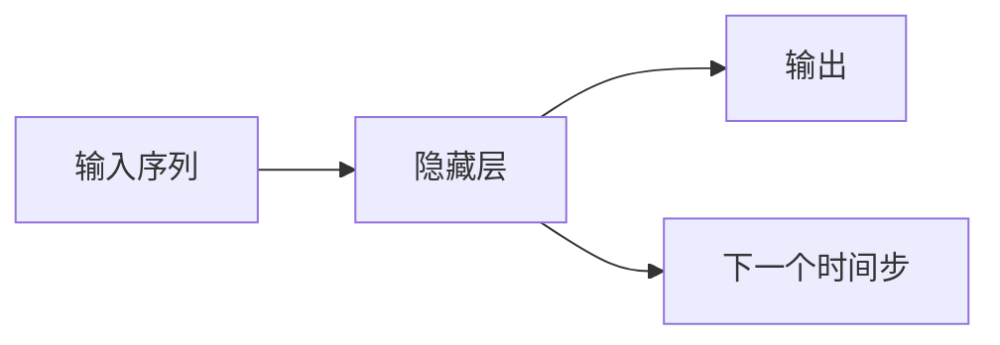
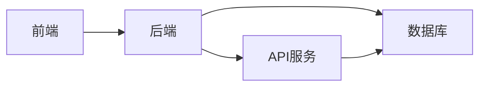

                 


# 人工智能革命：重塑产业链的投资逻辑

## 关键词：人工智能、产业链、投资逻辑、技术革命、数字化转型、经济重构

## 摘要：人工智能技术的快速发展正在重塑全球产业链的结构和价值创造方式。本文从技术、经济、投资等多维度深入分析人工智能革命对产业链的影响，揭示其背后的逻辑和投资机会。文章详细探讨了人工智能的核心算法、应用场景、系统架构，并结合实际案例分析投资逻辑，为投资者提供深度洞察。

---

## 第一部分：人工智能革命的背景与趋势

### 第1章：人工智能革命的背景与核心概念

#### 1.1 人工智能革命的背景

##### 1.1.1 从工业革命到数字革命的演进
工业革命开启了人类社会的大规模工业化进程，而数字革命则标志着信息技术对人类生活方式和生产方式的深刻改变。人工智能作为数字革命的核心技术，正在推动人类社会进入一个新的智能化阶段。

##### 1.1.2 人工智能技术的快速发展
近年来，人工智能技术取得了突破性进展，尤其是深度学习和大模型技术的突破，使得人工智能在图像识别、自然语言处理等领域达到了接近人类水平的表现。这些技术进步正在改变传统的产业链结构。

##### 1.1.3 数字化转型与产业链重塑的必要性
随着全球经济的数字化转型，传统的线性产业链正在向网状化、智能化方向演变。人工智能技术的应用使得产业链的各个环节能够实现数据共享、协同优化和智能决策，从而提高效率、降低成本。

---

#### 1.2 人工智能的核心概念与特征

##### 1.2.1 人工智能的定义与分类
人工智能（AI）是指通过模拟人类智能的某些方面，如学习、推理、感知和决策，来实现特定任务的计算机系统。根据应用层次，人工智能可以分为狭义AI（专注于特定任务，如语音识别）和广义AI（具备通用智能，能够处理多种任务）。

##### 1.2.2 机器学习与深度学习的区别与联系
- **机器学习**：通过数据训练模型，使其能够从数据中学习规律并进行预测或分类。
- **深度学习**：属于机器学习的子领域，通过多层神经网络来模拟人脑的处理方式，能够自动提取数据特征。

##### 1.2.3 人工智能技术的边界与外延
人工智能的边界在于其技术能力的限制，目前主要集中在数据处理、模式识别和决策优化等领域。外延则体现在其在各个行业的广泛应用，如智能制造、智慧医疗、金融科技等。

---

#### 1.3 人工智能对产业链的影响

##### 1.3.1 传统产业的数字化转型
人工智能技术正在推动传统产业的数字化转型。例如，制造业中的智能工厂、农业中的智能种植系统等，都在通过人工智能技术实现生产效率的提升和资源的优化配置。

##### 1.3.2 人工智能技术在产业链中的应用领域
- **上游产业**：如芯片制造、数据标注等，为人工智能技术提供基础支持。
- **中游产业**：如智能硬件、云计算平台等，是人工智能技术的载体。
- **下游产业**：如智能客服、智能营销等，是人工智能技术的应用场景。

##### 1.3.3 产业链重塑的驱动因素与挑战
驱动因素包括技术进步、数据爆炸和政策支持。挑战则包括技术瓶颈、数据隐私和伦理问题等。

---

### 第2章：人工智能革命的技术趋势与投资逻辑

#### 2.1 人工智能技术的演进路径

##### 2.1.1 从规则驱动到数据驱动的转变
传统的人工智能系统依赖于专家规则，而现代系统则通过大量数据训练模型，实现自我学习和优化。

##### 2.1.2 大模型与小模型的协同发展
大模型（如GPT）通过海量数据训练出强大的通用能力，而小模型则专注于特定领域，实现高效应用。

##### 2.1.3 多模态人工智能的未来发展
多模态人工智能能够同时处理文本、图像、语音等多种数据类型，未来的应用将更加广泛。

---

#### 2.2 人工智能技术的经济学分析

##### 2.2.1 人工智能对生产效率的提升
人工智能技术能够自动化处理大量重复性工作，显著提高生产效率。例如，制造业中的自动化生产线可以减少人工干预，降低成本。

##### 2.2.2 人工智能对价值创造模式的改变
人工智能通过数据驱动的方式重新定义了价值创造。企业不再仅仅依赖于传统的人力资源和资本投入，而是更加注重数据资产和技术创新。

##### 2.2.3 人工智能技术的边际成本递减效应
与传统技术不同，人工智能技术的边际成本随着数据量的增加而递减，这使得大规模应用成为可能。

---

#### 2.3 人工智能投资逻辑的核心要素

##### 2.3.1 技术壁垒与商业壁垒的平衡
投资者需要关注企业的技术壁垒，如算法创新、数据积累和算力资源。同时，也需要考虑商业壁垒，如市场需求、商业模式和竞争优势。

##### 2.3.2 数据、算法、算力的协同发展
人工智能技术的发展需要数据、算法和算力的协同发展。投资者需要关注企业的数据获取能力、算法研发能力和算力资源的投入。

##### 2.3.3 产业链上下游的投资机会
人工智能产业链包括芯片、算法、应用等多个环节。投资者可以根据自身的资源和能力，选择上游、中游或下游的投资方向。

---

## 第二部分：人工智能革命的核心技术与算法原理

### 第3章：人工智能的核心算法原理

#### 3.1 机器学习算法的数学模型

##### 3.1.1 线性回归模型
线性回归是一种简单但常用的机器学习算法，主要用于预测连续型变量。
$$ y = \beta_0 + \beta_1x + \epsilon $$

##### 3.1.2 支持向量机模型
支持向量机（SVM）是一种监督学习算法，主要用于分类和回归问题。
$$ \text{max} \{ \frac{1}{2}||\beta||^2 | \beta^T x_i - \beta_0 \geq 1 - y_i \} $$

##### 3.1.3 神经网络模型
神经网络是一种受生物神经元启发的计算模型，由多个层组成，能够处理复杂的非线性关系。

---

#### 3.2 深度学习算法的网络结构

##### 3.2.1 卷积神经网络（CNN）
CNN主要用于图像处理，通过卷积层提取图像特征。


##### 3.2.2 循环神经网络（RNN）
RNN用于处理序列数据，如自然语言处理。


##### 3.2.3 Transformer模型
Transformer是一种基于注意力机制的网络架构，广泛应用于自然语言处理领域。

---

#### 3.3 人工智能算法的数学公式与代码实现

##### 3.3.1 线性回归的实现
```python
import numpy as np
from sklearn.linear_model import LinearRegression

# 生成数据
X = np.array([1, 2, 3, 4, 5]).reshape(-1, 1)
y = np.array([2, 4, 5, 4, 5])

# 训练模型
model = LinearRegression()
model.fit(X, y)

# 预测
print(model.predict([[6]]))  # 输出：[[7.8]]
```

##### 3.3.2 神经网络的实现
```python
import tensorflow as tf
from tensorflow.keras import layers

# 构建模型
model = tf.keras.Sequential()
model.add(layers.Dense(64, activation='relu', input_shape=(10,)))
model.add(layers.Dense(1, activation='sigmoid'))

# 编译模型
model.compile(optimizer='adam', loss='binary_crossentropy', metrics=['accuracy'])
```

---

### 第4章：人工智能系统的架构设计

#### 4.1 人工智能系统的应用场景

##### 4.1.1 智能制造
人工智能技术在智能制造中的应用包括生产优化、质量检测和预测性维护。

##### 4.1.2 智慧医疗
人工智能技术在智慧医疗中的应用包括疾病诊断、药物研发和个性化治疗。

##### 4.1.3 金融科技
人工智能技术在金融科技中的应用包括风险评估、智能投顾和欺诈检测。

---

#### 4.2 人工智能系统的架构设计

##### 4.2.1 系统功能设计


##### 4.2.2 系统架构设计


##### 4.2.3 系统交互设计


---

### 第5章：人工智能项目的实战与分析

#### 5.1 项目环境安装

##### 5.1.1 安装必要的依赖
```bash
pip install numpy
pip install pandas
pip install scikit-learn
pip install tensorflow
```

#### 5.2 系统核心实现源代码

##### 5.2.1 线性回归实现
```python
import numpy as np
from sklearn.linear_model import LinearRegression

# 生成数据
X = np.array([1, 2, 3, 4, 5]).reshape(-1, 1)
y = np.array([2, 4, 5, 4, 5])

# 训练模型
model = LinearRegression()
model.fit(X, y)

# 预测
print(model.predict([[6]]))  # 输出：[[7.8]]
```

##### 5.2.2 神经网络实现
```python
import tensorflow as tf
from tensorflow.keras import layers

# 构建模型
model = tf.keras.Sequential()
model.add(layers.Dense(64, activation='relu', input_shape=(10,)))
model.add(layers.Dense(1, activation='sigmoid'))

# 编译模型
model.compile(optimizer='adam', loss='binary_crossentropy', metrics=['accuracy'])

# 训练模型
model.fit(x_train, y_train, epochs=10, batch_size=32)
```

#### 5.3 实际案例分析与解读

##### 5.3.1 智能供应链优化
通过人工智能技术优化供应链管理，可以实现库存预测、需求分析和路径规划。

##### 5.3.2 智能客服系统
人工智能技术可以实现自动客服、情绪识别和个性化推荐。

---

### 第6章：总结与展望

#### 6.1 总结：人工智能革命的核心要义
人工智能技术正在重塑产业链的结构和价值创造方式。通过数据分析、算法优化和系统设计，人工智能技术能够提高生产效率、降低成本，并创造新的商业机会。

#### 6.2 展望：人工智能革命的未来趋势
未来的投资机会将集中在以下几个方面：
1. **技术驱动型投资**：关注算法创新、数据积累和算力资源。
2. **行业应用型投资**：关注人工智能技术在各行业的深度应用。
3. **生态体系型投资**：关注人工智能产业链的协同发展。

#### 6.3 投资建议与注意事项
- **关注技术壁垒**：选择具有技术优势的企业。
- **注重数据隐私**：避免数据泄露和隐私问题。
- **关注政策支持**：利用政策红利推动企业发展。

---

通过以上分析，我们可以看到人工智能革命正在深刻改变产业链的结构和价值创造方式。投资者需要紧跟技术趋势，抓住投资机会，同时注意风险和挑战。未来，人工智能技术将继续推动全球经济的数字化转型，为投资者带来丰厚的回报。

