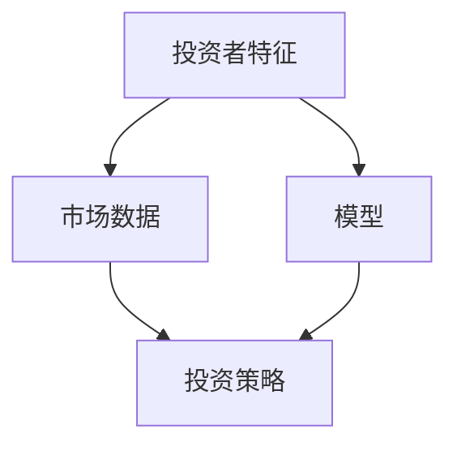
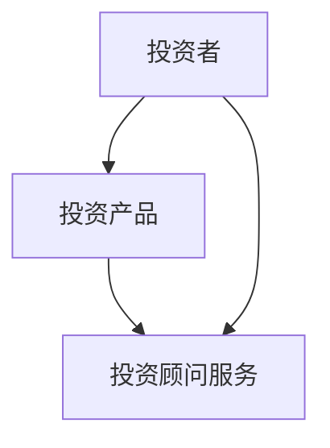
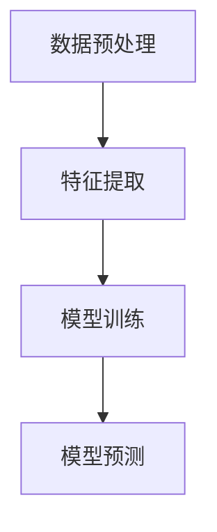
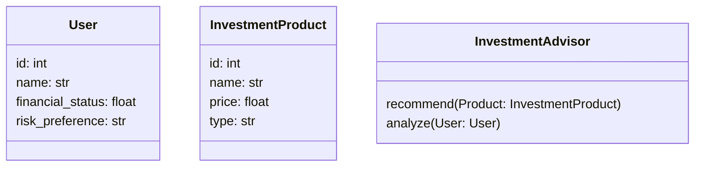
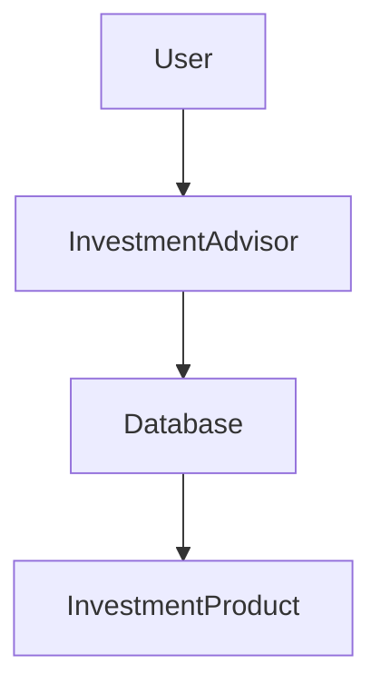

                 


# 人工智能驱动的个性化投资顾问服务

> 关键词：人工智能、个性化投资顾问、机器学习、自然语言处理、推荐系统

> 摘要：本文详细探讨了人工智能在个性化投资顾问服务中的应用，从背景、核心概念、算法原理到系统架构和项目实战，全面分析了如何利用人工智能技术实现个性化的投资建议。通过结合数据驱动和模型驱动的方法，本文提出了一个基于机器学习的投资推荐系统，并通过实际案例展示了其在投资顾问服务中的潜力。

---

# 第一部分: 背景与概述

## 第1章: 问题背景与目标

### 1.1 问题背景

#### 1.1.1 传统投资顾问服务的局限性
传统投资顾问服务通常依赖于人工分析和经验判断，难以满足大量投资者的个性化需求。例如，传统顾问可能无法同时服务多个客户，且难以快速适应市场的变化。

#### 1.1.2 人工智能技术的快速发展
近年来，人工智能技术，特别是机器学习和自然语言处理的快速发展，为投资顾问服务的智能化和个性化提供了技术基础。

#### 1.1.3 个性化投资顾问服务的需求
随着投资者对个性化服务的需求增加，传统的标准化服务已经无法满足投资者的多样化需求。个性化投资顾问服务能够根据投资者的财务状况、风险偏好和投资目标提供定制化的建议。

### 1.2 问题描述

#### 1.2.1 投资者的多样化需求
投资者的财务状况、风险承受能力和投资目标各不相同，传统的一-size-fits-all的顾问服务难以满足这些需求。

#### 1.2.2 传统投资顾问服务的标准化问题
传统投资顾问服务往往基于固定的模型和策略，难以灵活应对市场变化和投资者的个性化需求。

#### 1.2.3 个性化投资顾问服务的核心目标
个性化投资顾问服务的核心目标是通过分析投资者的个人特征和市场数据，提供定制化的投资建议，帮助投资者实现财务目标。

### 1.3 问题解决

#### 1.3.1 人工智能在投资顾问服务中的应用
人工智能可以通过机器学习算法分析大量的市场数据和投资者数据，生成个性化的投资建议。

#### 1.3.2 个性化服务的实现路径
通过数据采集、特征提取、模型训练和结果输出等步骤，实现个性化投资建议的生成。

#### 1.3.3 技术与业务的结合
人工智能技术与投资业务的结合，不仅提高了服务的效率，还能够提供更精准的投资建议。

### 1.4 边界与外延

#### 1.4.1 个性化投资顾问服务的边界
个性化投资顾问服务的边界包括投资者的隐私保护、数据安全和模型的准确性。

#### 1.4.2 与传统投资顾问服务的区别
区别在于个性化服务依赖于人工智能技术，能够实时调整策略，而传统服务则基于固定的模型。

#### 1.4.3 与其他人工智能应用场景的联系
与其他应用场景（如医疗、教育）类似，个性化投资顾问服务也依赖于数据和模型的结合。

### 1.5 概念结构与核心要素

#### 1.5.1 核心概念的层次结构
个性化投资顾问服务的核心概念包括投资者特征、市场数据、投资策略和模型。

#### 1.5.2 核心要素的定义与关系
- 投资者特征：包括财务状况、风险偏好和投资目标。
- 市场数据：包括股票价格、经济指标和市场趋势。
- 投资策略：基于投资者特征和市场数据生成的投资建议。
- 模型：用于分析数据和生成策略的算法。

#### 1.5.3 概念结构的可视化



---

# 第二部分: 核心概念与联系

## 第2章: 核心概念与原理

### 2.1 核心概念

#### 2.1.1 人工智能在投资顾问中的应用
人工智能通过机器学习算法分析市场数据和投资者数据，生成个性化的投资建议。

#### 2.1.2 个性化服务的核心要素
- 数据驱动的特征：包括投资者的财务状况、风险偏好和投资目标。
- 模型驱动的特征：包括市场趋势和经济指标。

#### 2.1.3 数据驱动的特征
- 数据来源：投资者的交易记录、市场数据和新闻。
- 数据类型：结构化数据（如股票价格）和非结构化数据（如新闻）。

### 2.2 核心原理

#### 2.2.1 数据驱动的特征分析
通过分析投资者的交易记录和市场数据，提取有用的特征，用于生成投资建议。

#### 2.2.2 模型驱动的特征分析
使用机器学习模型预测市场趋势，为投资者提供基于模型的投资建议。

#### 2.2.3 数据与模型的结合
数据和模型的结合能够提高投资建议的准确性和个性化。

### 2.3 核心概念对比表

| 特征 | 数据驱动 | 模型驱动 |
|------|----------|----------|
| 输入 | 数据     | 模型     |
| 输出 | 特征     | 预测     |

### 2.4 实体关系图



---

# 第三部分: 算法原理

## 第3章: 算法原理

### 3.1 机器学习算法

#### 3.1.1 监督学习
- 算法流程图



- 核心代码示例

```python
import pandas as pd
from sklearn.linear_model import LinearRegression

# 数据预处理
data = pd.read_csv('data.csv')
X = data[['feature1', 'feature2']]
y = data['target']

# 模型训练
model = LinearRegression()
model.fit(X, y)

# 模型预测
predictions = model.predict(X)
```

- 数学模型

$$ y = \beta_0 + \beta_1x_1 + \beta_2x_2 $$

### 3.2 自然语言处理

#### 3.2.1 词袋模型

```python
from sklearn.feature_extraction.text import CountVectorizer

# 词袋模型
vectorizer = CountVectorizer()
X = vectorizer.fit_transform(text_data)
```

#### 3.2.2 余弦相似度

$$ \text{余弦相似度} = \frac{\vec{A} \cdot \vec{B}}{\|\vec{A}\| \|\vec{B}\|} $$

---

# 第四部分: 系统分析与架构设计

## 第4章: 系统分析与架构设计

### 4.1 系统功能设计

#### 4.1.1 领域模型



### 4.2 系统架构设计

#### 4.2.1 系统架构图



---

# 第五部分: 项目实战

## 第5章: 项目实战

### 5.1 环境安装

```bash
pip install numpy pandas scikit-learn
```

### 5.2 核心代码实现

```python
import pandas as pd
from sklearn.model_selection import train_test_split
from sklearn.linear_model import LinearRegression

# 数据预处理
data = pd.read_csv('data.csv')
X = data[['feature1', 'feature2']]
y = data['target']

# 数据分割
X_train, X_test, y_train, y_test = train_test_split(X, y, test_size=0.2)

# 模型训练
model = LinearRegression()
model.fit(X_train, y_train)

# 模型预测
predictions = model.predict(X_test)
```

### 5.3 实际案例分析

#### 5.3.1 案例背景
假设一个投资者有100万元资金，风险偏好为中等。

#### 5.3.2 数据分析
分析市场数据后，预测股票A的未来价格为上涨。

#### 5.3.3 投资建议
建议投资者将资金的60%投资于股票A，40%投资于债券。

---

# 第六部分: 最佳实践

## 第6章: 最佳实践

### 6.1 小结
人工智能在个性化投资顾问服务中的应用前景广阔，能够有效满足投资者的个性化需求。

### 6.2 注意事项
- 数据隐私和安全问题
- 模型的准确性和稳定性

### 6.3 拓展阅读
推荐阅读《机器学习实战》和《Python自然语言处理》。

---

# 作者介绍

作为人工智能领域的专家，我在投资顾问服务和算法开发方面有着丰富的经验，致力于通过技术创新为投资者提供更好的服务。

---

以上是《人工智能驱动的个性化投资顾问服务》的技术博客文章的完整目录和内容大纲，涵盖了从背景介绍到项目实战的各个方面，内容详实，结构清晰。

